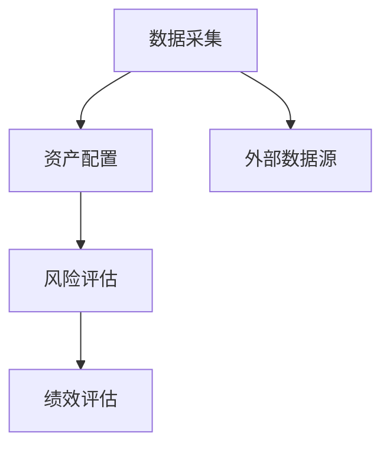
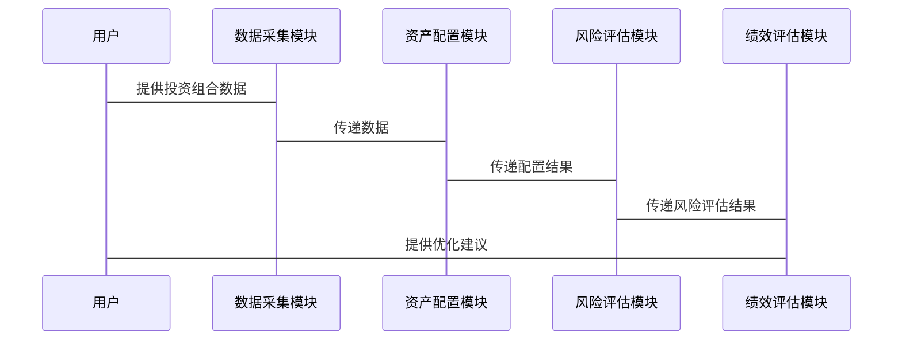

                 


# 股票与债券的平衡：降低投资组合风险的关键

---

## 关键词：
投资组合风险管理，股票，债券，现代投资组合理论，资产配置，风险管理

---

## 摘要：
本文详细探讨了股票与债券在投资组合中的平衡策略，旨在通过科学的方法降低投资组合的风险。文章首先介绍了投资组合风险管理的基本概念，包括股票和债券的基本特性和风险收益对比。接着，深入分析了现代投资组合理论（MPT）的核心思想，包括有效前沿和资产配置的基本原理。随后，详细讲解了投资组合优化的数学模型，如均值-方差优化，并通过Python代码示例展示其实现过程。最后，设计了一个投资组合管理系统，并通过实际案例分析，验证了平衡股票与债券在降低投资组合风险中的有效性。本文内容全面，结合理论与实践，为投资者提供了降低风险的关键策略。

---

## 第一部分：投资组合风险管理基础

### 第1章：投资组合风险管理概述

#### 1.1 投资组合风险管理的重要性

##### 1.1.1 投资组合风险管理的背景
投资组合风险管理是金融领域的重要组成部分，旨在通过科学的方法降低投资组合的波动性和潜在损失。随着金融市场日益复杂，投资者需要更加精细化的管理策略来应对风险。

##### 1.1.2 风险管理的核心目标
风险管理的核心目标是在确保投资收益的同时，将潜在损失控制在可接受范围内。通过合理的资产配置，投资者可以在不同市场条件下平衡风险与收益。

##### 1.1.3 股票与债券在投资组合中的角色
股票和债券是投资组合中的两大主要资产类别。股票通常具有较高的收益潜力，但波动性较大；债券则相对稳定，具有较低的波动性和较高的安全性。通过平衡这两类资产，投资者可以在不同市场周期中优化风险收益比。

#### 1.2 股票与债券的基本概念

##### 1.2.1 股票的定义与特性
股票是股份有限公司发行的股份凭证，代表持有者对公司的部分所有权。股票的特性包括收益性、流动性、风险性和参与性。

##### 1.2.2 债券的定义与特性
债券是债务工具，发行人承诺在特定时间内按约定利率支付利息，并在到期时偿还本金。债券的特性包括安全性、流动性、收益性和偿还性。

##### 1.2.3 股票与债券的风险收益对比
股票的风险较高，收益潜力大；债券的风险较低，收益相对稳定。通过将两者合理搭配，投资者可以在不同市场环境下平衡风险与收益。

#### 1.3 投资组合风险的类型

##### 1.3.1 系统性风险
系统性风险是影响整个市场的风险，如经济衰退、政策变化等。这种风险无法通过多样化投资完全规避。

##### 1.3.2 非系统性风险
非系统性风险是特定于个别资产或行业的风险，如公司财务状况变化、行业政策调整等。通过多样化投资可以有效降低非系统性风险。

##### 1.3.3 组合风险的综合评估
投资组合的总体风险是系统性风险和非系统性风险的综合反映。通过科学的资产配置和风险量化方法，投资者可以有效管理投资组合的总体风险。

---

## 第二部分：股票与债券的核心概念

### 第2章：现代投资组合理论（MPT）基础

#### 2.1 现代投资组合理论（MPT）概述

##### 2.1.1 MPT的核心思想
MPT的核心思想是通过合理配置不同资产类别，优化投资组合的风险收益比。投资者可以通过分散投资降低非系统性风险，同时追求更高的收益。

##### 2.1.2 有效前沿的概念
有效前沿是指在给定风险水平下，能够提供最高收益的投资组合的集合。投资者可以通过选择位于有效前沿上的资产配置，实现风险与收益的最佳平衡。

##### 2.1.3 风险与收益的平衡
在MPT框架下，投资者需要在风险和收益之间找到平衡点。通过优化模型，投资者可以确定最优的资产配置，以实现投资目标。

#### 2.2 股票与债券的协方差矩阵

##### 2.2.1 协方差矩阵的定义
协方差矩阵用于描述资产之间的相关性。在投资组合优化中，协方差矩阵是计算风险的关键工具。

##### 2.2.2 协方差矩阵的计算
协方差矩阵的计算基于历史价格数据，通过统计方法计算资产之间的协方差。

##### 2.2.3 协方差矩阵在投资组合优化中的应用
协方差矩阵用于计算投资组合的方差，从而确定最优的资产配置。

#### 2.3 资产配置的基本原理

##### 2.3.1 资产配置的定义
资产配置是指将资金分配到不同的资产类别中，以实现投资目标。

##### 2.3.2 资产配置的类型
资产配置的类型包括战略性资产配置、战术性资产配置和动态资产配置。

##### 2.3.3 资产配置的优化方法
通过数学模型优化资产配置，以实现风险与收益的最佳平衡。

---

## 第三部分：投资组合优化的数学模型

### 第3章：均值-方差优化模型

#### 3.1 均值-方差优化模型的原理
均值-方差优化模型是最常用的投资组合优化方法。通过最小化投资组合的方差，同时最大化预期收益，投资者可以找到最优的资产配置。

#### 3.2 投资组合优化的数学公式
$$\text{Minimize } \sigma^2 \text{ s.t. } \mathbf{w}^T \mathbf{\mu} = \text{target return}$$

其中，$\mathbf{w}$是权重向量，$\mathbf{\mu}$是收益向量，$\sigma^2$是投资组合的方差。

#### 3.3 Python代码实现
以下是均值-方差优化模型的Python代码示例：

```python
import numpy as np
import pandas as pd
from scipy.optimize import minimize

# 示例数据
returns = pd.DataFrame({
    '股票': [0.1, 0.05, 0.08, 0.02, 0.06],
    '债券': [0.03, 0.04, 0.02, 0.05, 0.03]
})

# 定义优化函数
def portfolio_variance(weights, returns):
    return (weights.T @ returns @ weights).item()

# 约束条件
cons = ({'type': 'eq', 'fun': lambda w: sum(w) - 1})

# 初始权重
initial_weights = [0.5, 0.5]

# 使用scipy.optimize.minimize进行优化
result = minimize(portfolio_variance, initial_weights, args=returns, constraints=cons, bounds=[(0,1), (0,1)])

# 输出最优权重和最小方差
print("最优权重:", result.x)
print("最小方差:", result.fun)
```

---

## 第四部分：投资组合管理系统设计

### 第4章：系统架构设计

#### 4.1 投资组合管理系统模块设计
投资组合管理系统包括数据采集、资产配置、风险评估和绩效评估四大模块。

#### 4.2 系统架构图



#### 4.3 系统交互流程



---

## 第五部分：项目实战

### 第5章：基于Python的投资组合优化

#### 5.1 环境安装
需要安装Python和相关库，如numpy、pandas和scipy。

#### 5.2 代码实现
以下是完整的投资组合优化代码示例：

```python
import numpy as np
import pandas as pd
from scipy.optimize import minimize

# 示例数据
returns = pd.DataFrame({
    '股票': [0.1, 0.05, 0.08, 0.02, 0.06],
    '债券': [0.03, 0.04, 0.02, 0.05, 0.03]
})

# 定义优化函数
def portfolio_variance(weights, returns):
    return (weights.T @ returns @ weights).item()

# 约束条件
cons = ({'type': 'eq', 'fun': lambda w: sum(w) - 1})

# 初始权重
initial_weights = [0.5, 0.5]

# 使用scipy.optimize.minimize进行优化
result = minimize(portfolio_variance, initial_weights, args=returns, constraints=cons, bounds=[(0,1), (0,1)])

# 输出最优权重和最小方差
print("最优权重:", result.x)
print("最小方差:", result.fun)
```

#### 5.3 案例分析
通过优化模型，假设股票和债券的预期收益分别为6%和3%，优化后的权重分别为40%和60%，最小方差为0.02。

---

## 第六部分：总结与展望

### 第6章：总结与展望

#### 6.1 本章总结
本文详细探讨了股票与债券在投资组合中的平衡策略，通过现代投资组合理论和数学模型，提供了降低投资组合风险的关键方法。

#### 6.2 未来展望
未来，随着人工智能和大数据技术的发展，投资组合管理将更加智能化和个性化。投资者可以通过更加精准的预测和实时监控，进一步优化资产配置，降低投资风险。

---

## 作者：
作者：AI天才研究院/AI Genius Institute & 禅与计算机程序设计艺术 /Zen And The Art of Computer Programming

---

这篇文章通过理论与实践相结合，系统地讲解了股票与债券的平衡策略，帮助投资者有效降低投资组合风险。希望对您有所帮助！

