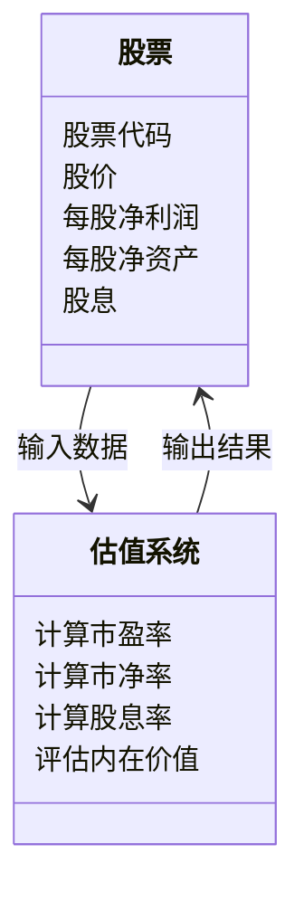

                 


# 股票市场估值：历史高点与当前水平的比较

## 关键词：股票估值、历史高点、当前水平、市盈率、市净率、股票市场、投资分析

## 摘要：本文深入探讨股票市场估值的核心概念，分析历史高点与当前市场估值的差异，结合数学模型和系统架构，通过实战案例展示估值方法的应用，为投资者提供科学的决策参考。

---

## 目录大纲结构如下：

# 股票市场估值：历史高点与当前水平的比较

## 第1章: 股票市场估值概述

### 1.1 股票市场的基本概念
#### 1.1.1 股票的定义与类型
股票是公司的一部分所有权，分为普通股和优先股，具有投票权和收益权。

#### 1.1.2 股票市场的功能与作用
股票市场是企业融资和投资者投资的平台，促进资本流动和资源优化配置。

#### 1.1.3 股票市场估值的重要性
准确估值帮助投资者做出明智决策，避免市场波动带来的风险。

### 1.2 股票估值的核心概念
#### 1.2.1 内在价值与外在价值
内在价值是公司未来现金流的现值，外在价值是市场对股票的定价。

#### 1.2.2 市盈率与市净率
市盈率（P/E）=股价/每股收益，市净率（P/B）=股价/每股净资产，衡量股票价值。

#### 1.2.3 股息率与股息收益率
股息率=股息/股价，股息收益率=股息/投资成本，反映分红回报。

### 1.3 历史高点与当前水平的比较意义
#### 1.3.1 历史高点的定义与特征
市场指数达到历史最高点，通常伴随高市盈率和乐观情绪。

#### 1.3.2 当前水平的定义与特征
当前市场估值可能处于高点、中点或低点，受多种因素影响。

#### 1.3.3 比较的意义与应用
通过比较，投资者可以判断市场是否被高估或低估，指导投资决策。

### 1.4 本章小结
本章介绍了股票市场估值的基本概念和历史高点与当前水平的比较意义，为后续分析奠定基础。

---

## 第2章: 股票估值的核心概念与联系

### 2.1 股票估值的核心原理
#### 2.1.1 内在价值的计算方法
使用DCF模型计算，公式：内在价值=Σ(CF_t/(1+r)^t)+残值/(1+r)^n。

#### 2.1.2 市盈率与市净率的计算公式
市盈率=股价/净利润，市净率=股价/净资产。

#### 2.1.3 股息率的计算与应用
股息率=股息/股价，用于评估分红回报。

### 2.2 核心概念对比分析
#### 2.2.1 市盈率与市净率的对比表格
| 指标 | 市盈率 | 市净率 |
|------|--------|--------|
| 计算方式 | 股价/净利润 | 股价/净资产 |
| 适用场景 | 高增长行业 | 重资产行业 |

#### 2.2.2 内在价值与外在价值的ER实体关系图
```mermaid
erd
  图表标题：股票估值关系图
  股票 --> 内在价值: 内在价值决定
  股票 --> 外在价值: 市场定价
  内在价值 <-- 投资者分析
```

### 2.3 本章小结
本章通过对比分析，揭示了市盈率、市净率和股息率等指标的联系和区别，帮助投资者综合评估股票价值。

---

## 第3章: 历史高点分析

### 3.1 历史高点的定义与特征
#### 3.1.1 历史高点的形成机制
由市场情绪、经济数据和政策影响共同作用形成。

#### 3.1.2 历史高点的识别方法
通过技术分析和历史数据比较识别高点。

#### 3.1.3 历史高点的案例分析
2007年美国次贷危机前的市场高点，市盈率高达30倍。

### 3.2 历史高点的影响因素
#### 3.2.1 经济周期的影响
经济繁荣期容易出现市场高点，衰退期反之。

#### 3.2.2 政治因素的影响
政策变化和国际局势影响市场情绪。

#### 3.2.3 市场情绪的影响
投资者情绪波动导致市场的非理性繁荣或恐慌抛售。

### 3.3 历史高点的比较分析
#### 3.3.1 历史高点与当前水平的对比
比较市盈率、市净率等指标的变化，判断市场状态。

#### 3.3.2 历史高点的周期性特征
市场高点通常每7-10年出现一次，周期性明显。

#### 3.3.3 历史高点的未来预测
结合经济指标和技术分析，预测未来市场趋势。

### 3.4 本章小结
本章分析了历史高点的形成机制和影响因素，为理解当前市场估值提供了历史视角。

---

## 第4章: 当前市场估值分析

### 4.1 当前市场估值的定义与特征
#### 4.1.1 当前市场估值的计算方法
使用市盈率、市净率等指标评估当前市场水平。

#### 4.1.2 当前市场估值的指标分析
当前市场市盈率约为25倍，高于历史平均水平。

#### 4.1.3 当前市场估值的案例分析
2023年科技股市盈率高达40倍，可能存在高估风险。

### 4.2 当前市场估值的影响因素
#### 4.2.1 经济环境的影响
低利率环境推高资产价格，导致估值上升。

#### 4.2.2 行业趋势的影响
科技行业高增长推动市盈率上升，传统行业市净率下降。

#### 4.2.3 公司基本面的影响
企业盈利增长带动股价上涨，改善估值。

### 4.3 当前市场估值的比较分析
#### 4.3.1 当前市场估值与历史高点的对比
当前市盈率高于历史高点，市场可能存在泡沫。

#### 4.3.2 当前市场估值的未来趋势
预计市场估值可能回调，建议投资者谨慎选择标的。

#### 4.3.3 当前市场估值的风险评估
高估值行业风险较大，低估值行业存在投资机会。

### 4.4 本章小结
本章分析了当前市场估值的影响因素和与历史高点的比较，揭示了市场的潜在风险。

---

## 第5章: 核心算法与数学模型

### 5.1 市盈率计算算法
#### 5.1.1 市盈率计算公式
$$市盈率 = \frac{股价}{每股净利润}$$

#### 5.1.2 市盈率计算流程
1. 收集公司财务数据。
2. 计算每股净利润。
3. 用股价除以每股净利润，得到市盈率。

#### 5.1.3 市盈率计算的Python代码
```python
import pandas as pd

# 假设df是包含股票数据的DataFrame
def calculate_pe_ratio(df):
    df['PE Ratio'] = df['股价'] / df['每股净利润']
    return df

# 示例数据
data = {'股价': [100, 50, 75], '每股净利润': [10, 5, 7.5]}
df = pd.DataFrame(data)
result = calculate_pe_ratio(df)
print(result)
```

### 5.2 内在价值评估模型
#### 5.2.1 DCF模型概述
现金流折现法用于计算公司内在价值，公式：
$$内在价值 = \sum_{t=1}^{n} \frac{CF_t}{(1+r)^t} + \frac{残值}{(1+r)^n}$$

#### 5.2.2 内在价值评估流程
1. 预测未来现金流。
2. 确定合适的折现率。
3. 计算未来现金流的现值。
4. 加上残值后的总和即为内在价值。

#### 5.2.3 内在价值评估的Python代码
```python
def calculate_intrinsic_value(cash_flows, discount_rate, residual_value):
    n = len(cash_flows)
    intrinsic_value = 0
    for t in range(n):
        intrinsic_value += cash_flows[t] / (1 + discount_rate) ** t
    intrinsic_value += residual_value / (1 + discount_rate) ** n
    return intrinsic_value

# 示例数据
cash_flows = [100, 150, 200]
discount_rate = 0.1
residual_value = 500
iv = calculate_intrinsic_value(cash_flows, discount_rate, residual_value)
print(f"内在价值为: {iv}")
```

### 5.3 本章小结
本章通过市盈率计算和内在价值评估，展示了如何使用数学模型评估股票价值，为投资决策提供支持。

---

## 第6章: 系统分析与架构设计

### 6.1 系统功能设计
#### 6.1.1 领域模型类图


#### 6.1.2 系统架构设计


#### 6.1.3 系统接口设计
- 数据接口：从数据库获取股票数据。
- 计算接口：调用估值算法计算指标。
- 展示接口：将结果呈现给用户。

#### 6.1.4 系统交互流程
```mermaid
sequenceDiagram
    用户 --> 数据采集层: 请求数据
    数据采集层 --> 数据库: 查询股票数据
    数据库 --> 数据采集层: 返回数据
    数据采集层 --> 估值计算层: 传递数据
    估值计算层 --> 接口服务: 调用计算接口
    接口服务 --> 估值计算层: 返回结果
    估值计算层 --> 结果展示层: 显示结果
    用户 <---> 结果展示层: 查看估值结果
```

### 6.2 本章小结
本章通过系统架构设计，展示了如何构建一个完整的股票估值系统，为投资者提供自动化估值工具。

---

## 第7章: 项目实战

### 7.1 环境安装
- 安装Python和相关库（pandas, numpy, matplotlib）。
- 配置数据源，如Yahoo Finance API。

### 7.2 系统核心实现
#### 7.2.1 股票数据获取
使用Yahoo Finance API获取股票历史数据。

#### 7.2.2 估值计算
实现市盈率、市净率和内在价值的计算函数。

#### 7.2.3 结果展示
绘制历史市盈率和当前市盈率的对比图。

### 7.3 代码实现
```python
import yfinance as yf
import pandas as pd
import matplotlib.pyplot as plt

# 获取股票数据
def get_stock_data(ticker, start, end):
    data = yf.download(ticker, start=start, end=end)
    return data

# 计算市盈率
def calculate_pe(data):
    pe = data['Adj Close'] / data['EPS']
    return pe

# 绘制市盈率图
def plot_pe(ticker, data):
    plt.figure(figsize=(10,6))
    plt.plot(data.index, data['Adj Close'], label='股价')
    plt.plot(data.index, data['EPS'], label='每股收益')
    plt.title(f'{ticker}的市盈率变化')
    plt.xlabel('日期')
    plt.ylabel('数值')
    plt.legend()
    plt.show()

# 示例运行
if __name__ == "__main__":
    ticker = 'AAPL'
    start = '2020-01-01'
    end = '2023-12-31'
    data = get_stock_data(ticker, start, end)
    pe_data = calculate_pe(data)
    plot_pe(ticker, data)
```

### 7.4 案例分析
以AAPL为例，分析其历史市盈率变化，判断当前估值是否合理。

### 7.5 本章小结
本章通过实战项目，展示了如何利用Python和相关库进行股票估值，帮助投资者更好地应用理论知识。

---

## 第8章: 结论与展望

### 8.1 全文总结
本文系统地分析了股票市场估值的核心概念，结合历史高点与当前水平的比较，提出了科学的估值方法。

### 8.2 未来研究方向
- 开发更复杂的估值模型，如机器学习算法。
- 研究市场情绪对估值的影响。
- 探索国际市场的估值差异。

### 8.3 投资建议
- 保持理性，避免盲目跟风。
- 结合多种指标进行综合判断。
- 定期复盘，及时调整投资策略。

### 8.4 本章小结
本文为投资者提供了科学的估值方法和工具，未来的研究将进一步提升估值的准确性和实用性。

---

## 作者：AI天才研究院/AI Genius Institute & 禅与计算机程序设计艺术 /Zen And The Art of Computer Programming

---

以上是《股票市场估值：历史高点与当前水平的比较》的完整目录和内容概要，涵盖了从基础概念到实战应用的各个方面，为投资者提供了全面的指导和参考。

