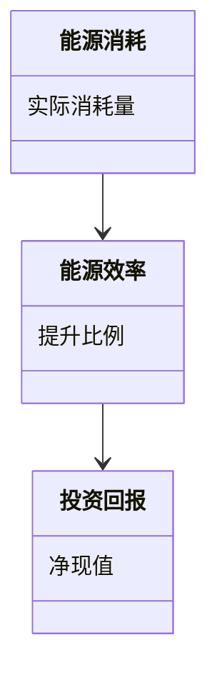

                 


# 能源效率提升技术的投资价值评估

> 关键词：能源效率、投资价值、技术评估、数学模型、系统设计、项目实战

> 摘要：本文系统地探讨了能源效率提升技术的投资价值评估，从背景概念到数学模型，再到系统设计和项目实战，全面分析了如何通过技术创新和科学评估方法，提升能源利用效率并实现投资回报最大化。文章结合实际案例，深入解读了能源效率与投资价值之间的关系，为相关领域的决策者和从业者提供了理论依据和实践指导。

---

## 第1章：能源效率提升技术概述

### 1.1 能源效率的基本概念

#### 1.1.1 能源效率的定义
能源效率是指在能源生产和使用过程中，转化为有用功的比例。简单来说，能源效率越高，单位能源产出的效益越大。

#### 1.1.2 能源效率的重要性
在全球能源需求不断增长的背景下，提升能源效率是减少能源浪费、降低碳排放、应对气候变化的关键手段。

#### 1.1.3 能源效率与可持续发展的关系
能源效率是实现可持续发展的核心要素，通过提高能源利用效率，可以减少对化石燃料的依赖，推动绿色经济的发展。

---

### 1.2 投资价值评估的基本概念

#### 1.2.1 投资价值的定义
投资价值是指某项投资在未来能够带来的收益现值总和，是评估投资项目经济可行性的重要指标。

#### 1.2.2 投资价值评估的方法
主要方法包括净现值法（NPV）、内部收益率法（IRR）和投资回收期法（Payback Period）。

#### 1.2.3 能源效率与投资价值的关系
提升能源效率能够降低运营成本，提高设备利用率，从而提升投资项目的整体价值。

---

### 1.3 能源效率提升技术的投资价值评估背景

#### 1.3.1 当前能源消耗现状
全球能源消耗持续增长，化石能源占比高，能源浪费现象严重。

#### 1.3.2 能源效率提升的经济意义
通过技术创新和管理优化，提升能源效率可以显著降低企业运营成本，增强竞争力。

#### 1.3.3 投资价值评估的必要性
科学的投资价值评估是决策者选择最优能源效率提升项目的重要依据。

---

## 第2章：能源效率提升技术的核心概念与联系

### 2.1 能源效率提升技术的核心原理

#### 2.1.1 能源转换效率的提升
通过技术创新，优化能源转换过程，减少能量损失。

#### 2.1.2 能源消耗的优化方法
采用节能设备、优化工艺流程等方法，降低能源消耗。

#### 2.1.3 技术创新对能源效率的影响
新材料、新技术的应用是提升能源效率的核心驱动力。

---

### 2.2 核心概念与联系的对比分析

#### 2.2.1 能源效率与技术类型对比表格
| 技术类型 | 能源效率提升效果 | 投资成本 | 维护成本 |
|----------|------------------|----------|----------|
| LED照明  | 显著提升          | 中等      | 低        |
| 变频空调 | 明显提升          | 较高      | 中等      |

#### 2.2.2 能源效率与投资回报的ER实体关系图
```mermaid
er
actor: 投资者
goal: 提升能源效率
technology: 能源效率技术
```

---

## 第3章：能源效率提升技术的投资价值评估方法

### 3.1 投资价值评估的算法原理

#### 3.1.1 净现值法（NPV）
净现值法是评估投资项目收益的主要方法，公式为：
$$ NPV = \sum_{t=0}^{n} \frac{C_t}{(1 + r)^t} $$
其中，$C_t$是第t年的现金流，$r$是折现率。

#### 3.1.2 内部收益率法（IRR）
内部收益率是使净现值为零的折现率，公式为：
$$ IRR = r \text{ 使得 } NPV = 0 $$

#### 3.1.3 投资回收期法（Payback Period）
投资回收期是投资回收原始投资额所需的时间，通常用于评估项目的风险。

---

### 3.2 数学模型与公式

#### 3.2.1 净现值公式
$$ NPV = \sum_{t=0}^{n} \frac{C_t}{(1 + r)^t} $$

#### 3.2.2 内部收益率公式
$$ IRR = r \text{ 使得 } NPV = 0 $$

---

### 3.3 实际案例分析与讲解

#### 3.3.1 某能源项目投资价值评估案例
假设某节能改造项目，初始投资为100万元，年节约成本20万元，折现率为10%。

计算净现值：
$$ NPV = \frac{20}{1.1} + \frac{20}{1.1^2} + \cdots + \frac{20}{1.1^5} - 100 $$

---

## 第4章：能源效率提升技术的数学模型与公式

### 4.1 能源效率提升的数学模型

#### 4.1.1 效率提升模型
假设某设备效率提升后，能源消耗减少10%，则：
$$ \text{新效率} = \text{旧效率} \times 1.1 $$

#### 4.1.2 投资回报模型
投资回报期计算公式：
$$ \text{投资回收期} = \frac{\text{初始投资}}{\text{年节约成本}} $$

---

## 第5章：能源效率提升技术的系统设计与架构

### 5.1 系统功能设计

#### 5.1.1 领域模型设计


#### 5.1.2 系统架构设计


---

## 第6章：能源效率提升技术的项目实战与最佳实践

### 6.1 项目实战

#### 6.1.1 环境配置
安装Python、Pandas、Matplotlib等工具。

#### 6.1.2 核心代码实现
```python
import pandas as pd
import matplotlib.pyplot as plt

# 计算净现值
def calculate_npv(cash_flows, discount_rate):
    return sum([cf / (1 + discount_rate)**t for t, cf in enumerate(cash_flows)])

# 示例数据
cash_flows = [100, -50, -50, 200, 200]
discount_rate = 0.1

npv = calculate_npv(cash_flows, discount_rate)
print(f"净现值为：{npv}")
```

---

## 第7章：总结与展望

### 7.1 总结
能源效率提升技术的投资价值评估是实现可持续发展的重要手段，通过科学的方法和技术创新，可以显著提升能源利用效率，创造更大的经济效益。

### 7.2 展望
未来，随着技术的进步和数据的积累，能源效率提升技术的投资价值评估将更加精准和高效，为绿色经济发展提供更有力的支持。

---

## 作者：AI天才研究院/AI Genius Institute & 禅与计算机程序设计艺术 /Zen And The Art of Computer Programming

