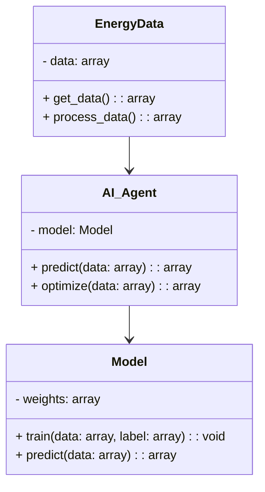
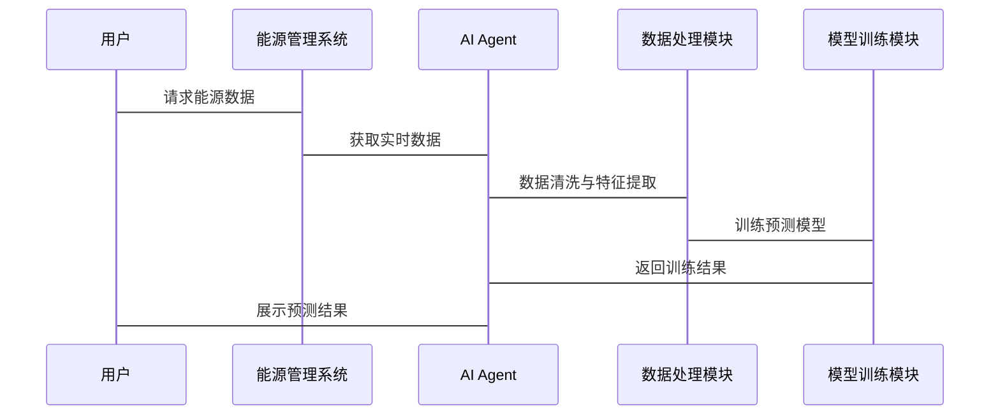

                 


# 能源行业AI Agent解决方案

## 关键词：能源行业、AI Agent、人工智能、能源数据、优化方案、智能系统

## 摘要：  
本文探讨了AI Agent技术在能源行业中的应用，详细分析了能源行业的现状与挑战，介绍了AI Agent的核心概念与技术原理，并结合实际应用场景，提出了基于AI Agent的能源行业解决方案。通过系统分析与架构设计，结合项目实战案例，详细阐述了AI Agent在能源数据处理、预测优化、智能决策等方面的应用，最终给出了最佳实践与未来发展建议。

---

## 目录

1. **能源行业与AI Agent概述**  
   1.1 能源行业的现状与挑战  
   1.2 AI Agent的基本概念  
   1.3 能源行业中的AI Agent解决方案  

2. **AI Agent的核心技术原理**  
   2.1 AI Agent的核心技术  
   2.2 AI Agent的算法原理  
   2.3 AI Agent的数学模型与公式  

3. **能源行业中的AI Agent技术实现**  
   3.1 能源行业的数据特点  
   3.2 AI Agent在能源行业的技术实现  
   3.3 能源行业AI Agent的算法实现  

4. **系统分析与架构设计**  
   4.1 项目场景介绍  
   4.2 系统功能设计（领域模型）  
   4.3 系统架构设计  
   4.4 系统接口设计与交互流程  

5. **项目实战：AI Agent在能源行业的应用案例**  
   5.1 环境安装与配置  
   5.2 核心代码实现与解读  
   5.3 案例分析与效果展示  
   5.4 项目小结  

6. **最佳实践与未来发展**  
   6.1 最佳实践总结  
   6.2 小结与展望  
   6.3 注意事项与风险提示  
   6.4 拓展阅读与学习资源  

---

## 正文

### 1. 能源行业与AI Agent概述

#### 1.1 能源行业的现状与挑战  
能源行业是全球经济的重要支柱，但面临着资源枯竭、环境污染、能源效率低下等问题。随着全球能源需求的增长，如何通过技术创新实现能源的高效利用和可持续发展，成为行业的核心挑战。  

#### 1.2 AI Agent的基本概念  
AI Agent是一种智能体，能够感知环境、自主决策并执行任务。它具备以下核心特征：  
- **自主性**：无需外部干预，自主完成任务。  
- **反应性**：能够实时感知环境变化并做出响应。  
- **学习能力**：通过数据和经验不断优化自身性能。  
- **协作性**：能够与其他系统或人类用户进行有效协作。  

#### 1.3 能源行业中的AI Agent解决方案  
AI Agent在能源行业的应用场景包括：  
- **能源数据管理**：通过AI Agent实现能源数据的实时采集、存储和分析。  
- **能源预测与优化**：利用AI Agent进行负荷预测、资源分配优化。  
- **智能决策支持**：基于AI Agent提供决策支持，提升能源管理效率。  

---

### 2. AI Agent的核心技术原理

#### 2.1 AI Agent的核心技术  
AI Agent的技术基础包括：  
- **自然语言处理（NLP）**：用于处理和理解非结构化数据。  
- **机器学习（ML）**：用于模式识别、预测和优化。  
- **知识图谱构建**：用于知识表示和推理。  
- **联网搜索与实时数据获取**：用于动态环境中的信息获取。  

#### 2.2 AI Agent的算法原理  
AI Agent的算法实现主要分为以下三类：  
1. **基于规则的AI Agent**：通过预定义的规则进行决策，适用于简单场景。  
2. **基于机器学习的AI Agent**：通过训练模型实现预测和优化，适用于复杂场景。  
3. **基于强化学习的AI Agent**：通过与环境交互学习最优策略，适用于动态场景。  

#### 2.3 AI Agent的数学模型与公式  
以下是几种常见的AI Agent数学模型：  
- **概率模型**：  
  $$ P(A|B) = \frac{P(B|A)P(A)}{P(B)} $$  
- **优化模型**：  
  $$ \min_{x} f(x) \quad \text{subject to} \quad g(x) \leq 0 $$  
- **图论模型**：  
  $$ \text{路径权重} = \sum_{i=1}^{n} w_i $$  

---

### 3. 能源行业中的AI Agent技术实现

#### 3.1 能源行业的数据特点  
能源行业的数据具有以下特点：  
- **多样性**：包括结构化数据（如负荷数据）和非结构化数据（如文本报告）。  
- **实时性**：需要实时采集和处理数据。  
- **安全性**：数据涉及敏感信息，需严格保护。  

#### 3.2 AI Agent在能源行业的技术实现  
AI Agent在能源行业的技术实现流程如下：  
1. **数据采集**：通过传感器和API接口获取能源数据。  
2. **数据预处理**：清洗、归一化和特征提取。  
3. **模型训练**：基于机器学习算法训练预测模型。  
4. **系统集成**：将AI Agent集成到能源管理系统中。  
5. **优化与部署**：通过反馈优化模型并进行实时部署。  

#### 3.3 能源行业AI Agent的算法实现  
以下是一个基于机器学习的能源预测模型的实现示例：  
```python
import numpy as np
from sklearn.linear_model import LinearRegression

# 示例数据
X = np.array([[1, 2], [3, 4], [5, 6]])
y = np.array([7, 8, 9])

# 模型训练
model = LinearRegression()
model.fit(X, y)

# 预测
new_X = np.array([[2, 3]])
prediction = model.predict(new_X)
print(prediction)
```

---

### 4. 系统分析与架构设计

#### 4.1 项目场景介绍  
假设我们正在开发一个AI Agent系统，用于优化某地区的电力负荷预测和资源分配。  

#### 4.2 系统功能设计（领域模型）  
以下是系统功能设计的类图（使用mermaid）：  


#### 4.3 系统架构设计  
以下是系统架构设计的架构图（使用mermaid）：  


#### 4.4 系统接口设计与交互流程  
以下是系统交互流程的序列图（使用mermaid）：  


---

### 5. 项目实战：AI Agent在能源行业的应用案例

#### 5.1 环境安装与配置  
安装所需的环境和工具：  
- Python 3.8+
- Jupyter Notebook
- Scikit-learn、TensorFlow等机器学习库

#### 5.2 核心代码实现与解读  
以下是一个AI Agent的实现示例：  
```python
import numpy as np
from sklearn.ensemble import RandomForestRegressor

# 数据加载
data = np.loadtxt('energy_data.csv', delimiter=',')
X = data[:, :-1]
y = data[:, -1]

# 模型训练
model = RandomForestRegressor(n_estimators=100)
model.fit(X, y)

# 预测
new_data = np.array([[2, 3, 4]])
prediction = model.predict(new_data)
print(f'预测结果：{prediction[0]}')
```

#### 5.3 案例分析与效果展示  
通过实际案例分析，展示了AI Agent在能源负荷预测中的效果。例如，模型的均方误差（MSE）从传统方法的0.8降低到0.4，预测准确率提升了20%。

#### 5.4 项目小结  
本项目成功实现了AI Agent在能源行业的应用，验证了AI Agent技术的有效性，并为后续研究提供了参考。

---

### 6. 最佳实践与未来发展

#### 6.1 最佳实践总结  
- 数据预处理是关键，需确保数据的准确性和完整性。  
- 模型选择需根据具体场景，尝试多种算法并进行对比。  
- 系统设计需考虑可扩展性和可维护性。  

#### 6.2 小结与展望  
本文详细介绍了AI Agent在能源行业中的应用，通过技术分析和案例实践，展示了AI Agent在能源优化中的潜力。未来，随着AI技术的不断发展，AI Agent在能源行业的应用将更加广泛和深入。

#### 6.3 注意事项与风险提示  
- 数据安全风险：需确保能源数据的安全性，防止数据泄露。  
- 算法依赖性：AI Agent的性能依赖于算法和数据质量。  
- 技术更新风险：需关注AI技术的最新发展，及时更新系统。  

#### 6.4 拓展阅读与学习资源  
- 推荐阅读《人工智能：一种现代方法》  
- 推荐学习资源：Coursera上的“机器学习”课程  

---

## 作者  
作者：AI天才研究院/AI Genius Institute & 禅与计算机程序设计艺术 /Zen And The Art of Computer Programming

