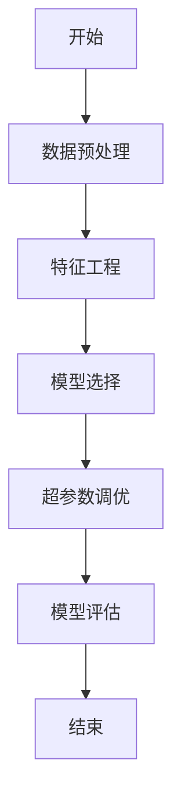
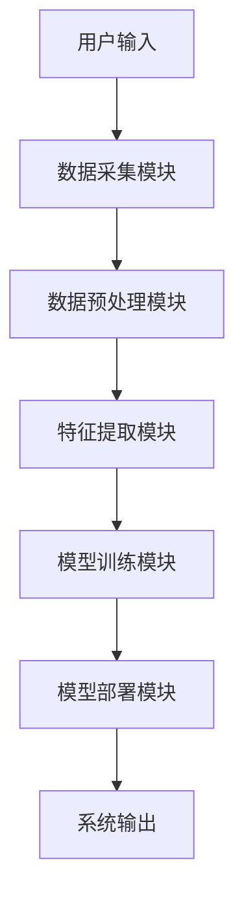
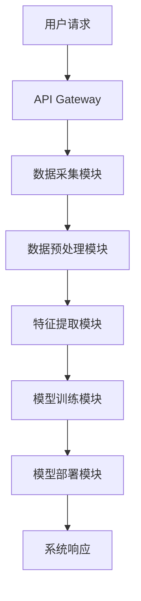

                 


# 自动机器学习（AutoML）在AI Agent开发中的应用

> 关键词：AutoML, AI Agent, 机器学习, 自动化, 系统架构

> 摘要：随着人工智能技术的快速发展，AI Agent在各个领域的应用越来越广泛。然而，传统机器学习的复杂性和门槛限制了AI Agent的开发效率。自动机器学习（AutoML）通过自动化数据预处理、特征工程、模型选择和调优等过程，显著降低了AI Agent开发的门槛，提高了开发效率。本文详细探讨了AutoML在AI Agent开发中的应用，分析了其核心概念、技术原理和系统架构设计，并通过实际案例展示了AutoML在AI Agent开发中的具体应用。

---

## 第1章: 自动机器学习（AutoML）与AI Agent的背景与概念

### 1.1 自动机器学习（AutoML）的背景与现状

传统机器学习的开发流程通常包括数据采集、数据预处理、特征工程、模型选择、超参数调优以及模型部署等多个步骤。这一过程不仅耗时，且需要深厚的专业知识。随着数据量的爆炸式增长和算法的复杂化，传统的手动机器学习开发方式已经难以满足现代应用的需求。

AutoML的出现，通过自动化这些繁琐的过程，极大地简化了机器学习的开发流程。它利用自动化工具和算法，自动完成数据预处理、特征工程、模型选择和调优等任务，使得非专业人员也能快速构建高效的机器学习模型。

目前，AutoML已经在多个领域得到了广泛应用，包括金融、医疗、零售和工业自动化等。它不仅提高了开发效率，还降低了机器学习技术的使用门槛，使得更多的行业能够受益于人工智能技术。

### 1.2 AI Agent的基本概念与特点

AI Agent（智能体）是指能够感知环境、自主决策并执行任务的智能系统。与传统的基于规则的系统不同，AI Agent具备学习和自适应能力，能够在动态环境中灵活应对各种挑战。

AI Agent的核心功能包括感知、推理、规划和执行。它能够通过传感器或API获取环境信息，利用机器学习模型进行决策，并通过执行器或API与外部环境交互。AI Agent的应用场景非常广泛，例如智能助手、自动驾驶、智能客服和工业自动化等。

AI Agent与传统AI的区别在于其自主性和适应性。传统AI系统通常依赖于固定的规则和数据，而AI Agent能够根据环境变化动态调整其行为，具备更强的灵活性和适应性。

### 1.3 AutoML在AI Agent开发中的作用

AutoML在AI Agent开发中的作用主要体现在以下几个方面：

1. **简化开发流程**：AutoML能够自动完成数据预处理、特征工程和模型选择等步骤，显著简化了AI Agent的开发流程。
2. **提高开发效率**：通过自动化超参数调优和模型部署，AutoML使得AI Agent的开发效率得到了极大的提升。
3. **降低技术门槛**：AutoML的自动化特性使得非专业人员也能够快速构建高效的AI Agent。

### 1.4 本章小结

本章主要介绍了AutoML和AI Agent的基本概念及其在开发中的作用。AutoML通过自动化机器学习的复杂过程，显著降低了AI Agent开发的门槛，为其实现高效和灵活的应用提供了强有力的支持。

---

## 第2章: AutoML的核心概念与技术原理

### 2.1 AutoML的核心概念

AutoML的核心概念包括自动数据预处理、自动特征工程、自动模型选择与调优以及自动部署与监控。

1. **自动数据预处理**：AutoML能够自动完成数据清洗、缺失值处理和数据标准化等任务。
2. **自动特征工程**：AutoML能够自动进行特征选择、特征提取和特征变换，以提高模型的性能。
3. **自动模型选择与调优**：AutoML通过自动搜索最佳模型和超参数组合，优化模型性能。
4. **自动部署与监控**：AutoML能够自动完成模型部署，并提供实时监控和维护功能。

### 2.2 AutoML的主要技术原理

AutoML的技术原理主要包括超参数优化、算法选择与集成以及模型评估与验证。

1. **超参数优化**：通过网格搜索、随机搜索或贝叶斯优化等方法，AutoML能够自动找到最佳的超参数组合。
2. **算法选择与集成**：AutoML能够自动选择最优算法，并通过集成学习进一步提高模型性能。
3. **模型评估与验证**：AutoML利用交叉验证和性能指标评估模型的性能，并进行自动化的模型验证。

### 2.3 AutoML的关键技术对比

AutoML的关键技术包括基于遗传算法的AutoML、基于强化学习的AutoML和基于元学习的AutoML。

1. **基于遗传算法的AutoML**：利用遗传算法的搜索能力，AutoML能够高效地找到最优的模型和超参数组合。
2. **基于强化学习的AutoML**：通过强化学习，AutoML能够动态调整模型和策略，以适应环境的变化。
3. **基于元学习的AutoML**：元学习通过学习不同任务之间的关系，快速适应新的任务，提高模型的泛化能力。

### 2.4 AutoML的核心算法流程图



---

## 第3章: AI Agent开发的系统架构设计

### 3.1 AI Agent开发的系统功能模块

AI Agent开发的系统功能模块包括数据采集与预处理模块、特征提取与模型训练模块以及模型部署与监控模块。

1. **数据采集与预处理模块**：负责从各种数据源采集数据，并进行清洗和标准化处理。
2. **特征提取与模型训练模块**：利用AutoML技术，自动完成特征工程和模型训练。
3. **模型部署与监控模块**：将训练好的模型部署到实际环境中，并进行实时监控和维护。

### 3.2 AI Agent开发的系统架构图



### 3.3 系统接口与交互设计

系统接口设计包括API接口和用户界面。API接口用于与其他系统或服务交互，用户界面则提供友好的操作界面。

系统交互流程图如下：



---

## 第4章: AutoML算法原理与实现

### 4.1 基于遗传算法的AutoML

遗传算法是一种基于自然选择和遗传机制的优化算法。在AutoML中，遗传算法用于搜索最优的模型和超参数组合。

遗传算法的基本流程如下：

1. 初始化种群：生成一组随机的模型和超参数组合。
2. 适应度评估：评估每个个体的性能。
3. 选择：选择适应度较高的个体作为父代。
4. 交叉：对父代进行交叉，生成新的个体。
5. 变异：对新个体进行变异操作，增加多样性。
6. 重复上述步骤，直到满足终止条件。

### 4.2 基于强化学习的AutoML

强化学习是一种通过试错机制来优化决策的算法。在AutoML中，强化学习用于动态调整模型和策略。

强化学习的基本流程如下：

1. 状态识别：识别当前环境的状态。
2. 动作选择：根据当前状态选择一个动作。
3. 状态转移：执行动作，观察新的状态。
4. 奖励评估：根据新状态和动作，评估奖励。
5. 策略更新：根据奖励更新策略。

### 4.3 基于元学习的AutoML

元学习是一种通过学习不同任务之间的关系，快速适应新任务的算法。

元学习的基本流程如下：

1. 任务样本收集：收集多个任务的数据样本。
2. 元特征提取：提取任务的元特征。
3. 元模型训练：训练元模型，学习任务之间的关系。
4. 新任务推理：利用元模型推理新任务的解决方案。

---

## 第5章: 项目实战

### 5.1 环境安装

为了实现AutoML在AI Agent中的应用，我们需要安装以下环境：

- Python 3.8及以上版本
- scikit-learn
- AutoML工具（例如AutoSklearn）
- Jupyter Notebook

### 5.2 系统核心实现源代码

以下是一个简单的AutoML在AI Agent中的实现示例：

```python
from autosklearn import AutoSklearnRegressor
from sklearn.metrics import mean_squared_error

# 数据准备
X = ...
y = ...

# 初始化AutoML模型
automl = AutoSklearnRegressor()

# 模型训练
automl.fit(X, y)

# 模型预测
y_pred = automl.predict(X)

# 模型评估
mse = mean_squared_error(y, y_pred)
print("均方误差:", mse)
```

### 5.3 代码应用解读与分析

上述代码展示了AutoML在AI Agent中的具体应用。首先，我们导入AutoML工具和评估指标。然后，我们准备数据并初始化AutoML模型。接着，我们训练模型并进行预测，最后评估模型的性能。

通过这种方式，AutoML能够自动完成数据预处理、特征工程和模型选择等过程，显著简化了AI Agent的开发流程。

### 5.4 实际案例分析

以一个简单的AI Agent开发为例，我们可以通过AutoML快速构建一个预测模型。假设我们有一个销售预测任务，AutoML能够自动选择最佳的模型和超参数，显著提高预测的准确性。

### 5.5 项目小结

通过实际案例，我们展示了AutoML在AI Agent开发中的具体应用。AutoML的自动化特性显著简化了开发流程，提高了开发效率。

---

## 第6章: 最佳实践与总结

### 6.1 最佳实践 tips

1. **选择合适的AutoML工具**：根据具体需求选择适合的AutoML工具。
2. **数据预处理的重要性**：确保数据质量，提高模型性能。
3. **模型监控与维护**：定期监控模型性能，及时进行再训练和优化。

### 6.2 小结

AutoML在AI Agent开发中的应用不仅简化了开发流程，还提高了开发效率。通过自动化数据预处理、特征工程和模型调优，AutoML使得非专业人员也能够快速构建高效的AI Agent。

### 6.3 注意事项

- AutoML虽然能够自动化许多过程，但在某些复杂场景下仍需要人工干预。
- 数据隐私和安全问题需要特别注意。
- 模型的可解释性也是一个重要的考虑因素。

### 6.4 拓展阅读

- "自动机器学习（AutoML）简介"（知乎）
- "AutoML在工业界的应用"（掘金）
- "AI Agent开发实战"（GitHub）

---

# 作者：AI天才研究院（AI Genius Institute） & 禅与计算机程序设计艺术（Zen And The Art of Computer Programming）

---

以上是《自动机器学习（AutoML）在AI Agent开发中的应用》的完整目录和内容框架。

