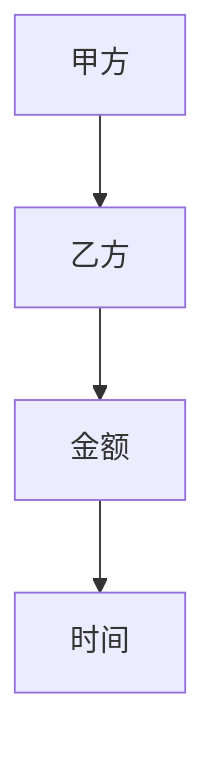
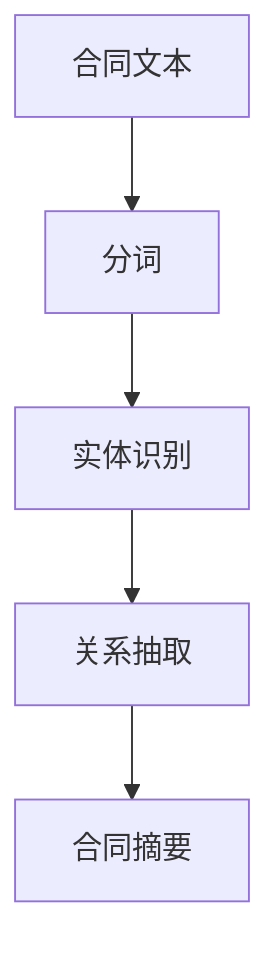
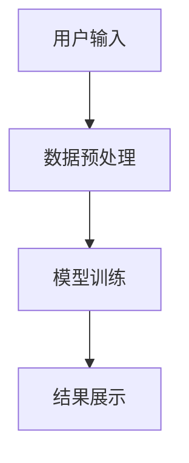

                 


# 自然语言处理在合同文件分析中的应用

> 关键词：自然语言处理，合同分析，文本挖掘，机器学习，法律文本处理

> 摘要：本文探讨自然语言处理技术在合同文件分析中的应用，涵盖NLP基础、合同分析需求、核心概念、算法原理、系统架构、项目实战及最佳实践，提供深入的技术分析与实现方案。

---

## 第1章: 自然语言处理概述

### 1.1 自然语言处理的基本概念

#### 1.1.1 自然语言处理的定义

自然语言处理（NLP）是计算机科学中的一个分支，旨在理解和处理人类语言。它结合了语言学、计算机科学和人工智能，致力于让计算机能够像人类一样理解和生成自然语言文本。

#### 1.1.2 自然语言处理的核心任务

NLP的核心任务包括：

- **文本处理**：如分词、词性标注、句法分析。
- **信息抽取**：如命名实体识别、关系抽取。
- **信息检索**：如文本相似度计算、问答系统。
- **文本生成**：如机器翻译、文本摘要。

#### 1.1.3 自然语言处理的应用领域

NLP技术广泛应用于多个领域，包括：

- **搜索引擎**：如谷歌的搜索引擎优化。
- **智能客服**：如自动回复用户查询。
- **机器翻译**：如谷歌翻译。
- **法律文本处理**：如合同分析、法律文件检索。

---

## 第2章: 合同文件分析的背景与需求

### 2.1 合同文件的特点与结构

#### 2.1.1 合同的基本要素

合同通常包含以下基本要素：

- **合同编号**：唯一标识合同。
- **合同双方**：甲方和乙方。
- **合同条款**：如付款方式、交付时间、违约责任。
- **签名与日期**：合同生效的时间点。

#### 2.1.2 合同文本的复杂性

合同文本通常具有以下特点：

- **术语丰富**：包含大量法律术语。
- **结构复杂**：条款之间逻辑性强，但文本冗长。
- **多样性**：合同类型多样，如销售合同、服务合同等。

#### 2.1.3 合同分析的难点

合同分析的难点包括：

- **术语理解**：需要准确理解法律术语的含义。
- **条款识别**：需要识别关键条款，如付款条款、违约责任。
- **关系理解**：需要理解条款之间的逻辑关系。

### 2.2 自然语言处理在合同分析中的应用前景

#### 2.2.1 合同自动化处理的必要性

随着企业合同数量的激增，手动处理合同效率低下且容易出错。NLP技术可以帮助实现合同分析的自动化。

#### 2.2.2 NLP技术如何解决合同分析问题

NLP技术可以用于：

- **自动提取关键信息**：如合同金额、合同双方。
- **自动分类合同类型**：根据合同内容分类。
- **自动识别风险点**：如是否存在违约条款。

#### 2.2.3 合同分析的典型应用场景

典型的合同分析应用场景包括：

- **企业合规性检查**：确保所有合同符合公司政策。
- **合同风险评估**：识别潜在的法律风险。
- **合同归档与管理**：自动整理和分类合同。

---

## 第3章: 自然语言处理的核心概念与联系

### 3.1 实体识别与关系抽取

#### 3.1.1 实体识别的定义与实现

实体识别（NER）是NLP中的一个关键任务，旨在识别文本中的命名实体，如人名、地名、组织名等。在合同分析中，实体识别可以帮助提取合同双方、金额等信息。

#### 3.1.2 关系抽取的原理与方法

关系抽取旨在识别文本中实体之间的关系。例如，在合同中，可以识别“甲方”与“乙方”之间的关系，如“供应商”与“客户”。

#### 3.1.3 实体与关系的Mermaid实体关系图

以下是实体与关系的Mermaid图：



---

### 3.2 合同分析中的特定实体与关系

#### 3.2.1 合同中的主要实体类型

合同中的主要实体类型包括：

- **合同编号**：文本类型。
- **合同双方**：实体类型。
- **合同条款**：文本块类型。

#### 3.2.2 实体之间的关系类型

实体之间的关系类型包括：

- **属于**：如“合同编号”属于“合同”。
- **涉及**：如“甲方”涉及“合同条款”。
- **时间关系**：如“付款时间”在“合同条款”中。

#### 3.2.3 合同分析的Mermaid流程图

以下是合同分析的Mermaid流程图：



---

## 第4章: 自然语言处理算法原理

### 4.1 基于TF-IDF的文本表示

#### 4.1.1 TF-IDF的计算公式

TF-IDF的计算公式如下：

$$
TF-IDF(t, d) = TF(t, d) \times IDF(t)
$$

其中，$TF(t, d)$是词$ t$在文档$d$中的词频，$IDF(t)$是词$t$的逆文档频率。

#### 4.1.2 TF-IDF的实现流程

TF-IDF的实现流程包括：

1. **统计词频**：计算每个词在文档中的出现次数。
2. **计算IDF**：计算每个词在所有文档中的出现次数。
3. **计算TF-IDF值**：将TF和IDF相乘。

#### 4.1.3 TF-IDF的优缺点分析

- **优点**：简单易实现，适合文本分类和关键词提取。
- **缺点**：无法捕捉词义，对长尾词效果差。

### 4.2 基于Word2Vec的词向量生成

#### 4.2.1 Word2Vec的训练过程

Word2Vec的训练过程包括：

1. **构建语料库**：将文本分词，得到单词序列。
2. **训练模型**：使用神经网络模型训练词向量。

#### 4.2.2 Skip-Gram与CBOW模型

- **Skip-Gram**：预测当前词周围的词。
- **CBOW**：根据周围的词预测当前词。

#### 4.2.3 Word2Vec的Python实现示例

以下是Word2Vec的Python实现示例：

```python
from gensim.models import Word2Vec
from gensim.utils import simple_preprocess

# 创建训练数据
text = ["The quick brown fox jumps over the lazy dog"]
data = [simple_preprocess(text[0])]

# 训练模型
model = Word2Vec(data, vector_size=10, window=2, min_count=1, workers=1)
```

---

## 第5章: 自然语言处理在合同文件分析中的系统架构

### 5.1 问题场景介绍

合同文件分析系统需要处理大量复杂的法律文本，提取关键信息，帮助用户快速理解合同内容。

### 5.2 项目介绍

合同文件分析系统的目标是自动化处理合同文本，提取关键信息并生成摘要。

### 5.3 系统功能设计

系统功能设计包括：

- **数据预处理**：文本清洗、分词。
- **模型训练**：实体识别、关系抽取。
- **结果展示**：生成合同摘要、可视化关键信息。

### 5.4 系统架构设计

以下是系统架构设计的Mermaid图：



---

## 第6章: 自然语言处理在合同文件分析中的项目实战

### 6.1 环境安装

需要安装以下Python库：

- `nltk`：自然语言处理库。
- `spaCy`：高性能NLP库。
- `gensim`：文本处理库。

### 6.2 系统核心实现源代码

以下是合同分析的核心代码示例：

```python
import spacy

# 加载模型
nlp = spacy.load("en_core_web_sm")

# 分析合同文本
text = "This contract is between甲方and乙方for the supply of goods."
doc = nlp(text)

# 提取实体
entities = [(ent.text, ent.label_) for ent in doc.ents]
print(entities)
```

### 6.3 代码应用解读与分析

上述代码使用spaCy库对合同文本进行分词和实体识别，提取出合同中的实体信息。

### 6.4 实际案例分析和详细讲解剖析

以一个简单的合同文本为例：

```text
"This contract is between 甲方 and 乙方 for the supply of goods. The payment terms are 30 days after delivery."
```

分析结果：

- 实体识别：`甲方`（ORG），`乙方`（ORG）。
- 关系抽取：`甲方`和`乙方`之间存在“合同关系”。

### 6.5 项目小结

通过上述实战，我们可以看到NLP技术在合同分析中的强大能力。实体识别和关系抽取是合同分析的关键步骤，能够帮助我们快速提取合同中的关键信息。

---

## 第7章: 自然语言处理在合同文件分析中的最佳实践

### 7.1 小结

本文详细探讨了自然语言处理技术在合同文件分析中的应用，涵盖了NLP基础、合同分析需求、核心概念、算法原理、系统架构、项目实战及最佳实践。

### 7.2 注意事项

在实际应用中，需要注意以下几点：

- **数据质量**：确保输入数据的准确性和完整性。
- **模型选择**：根据具体需求选择合适的NLP模型。
- **结果验证**：对模型的输出进行人工验证，确保准确性。

### 7.3 拓展阅读

推荐以下书籍和资源：

- 《自然语言处理实战：基于Python的中文分词、文本挖掘与信息提取》。
- [spaCy官方文档](https://spacy.io/)

---

## 作者

作者：AI天才研究院/AI Genius Institute & 禅与计算机程序设计艺术 /Zen And The Art of Computer Programming

---

以上是《自然语言处理在合同文件分析中的应用》的技术博客文章，希望对您有所帮助！

