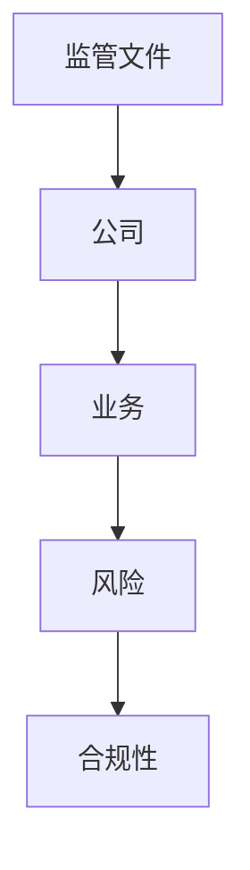
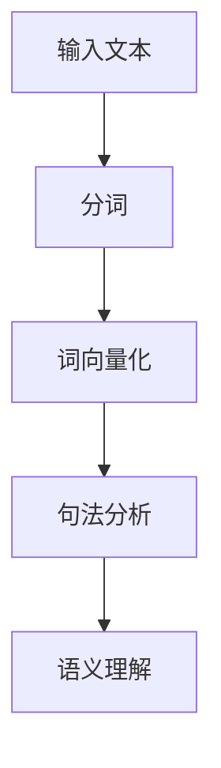
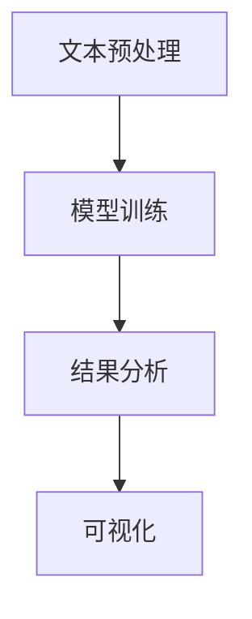

                 


# 自然语言处理在监管文件分析中的应用

> 关键词：自然语言处理, 监管文件分析, NLP算法, 实体识别, 语义理解, 知识图谱

> 摘要：本文系统地探讨了自然语言处理（NLP）技术在监管文件分析中的应用，从基本概念到算法原理，再到系统设计和项目实战，全面解析了如何利用NLP技术提升监管文件分析的效率和准确性。文章通过具体案例分析和代码实现，展示了NLP在监管文件分析中的巨大潜力，并提出了实际应用中的最佳实践建议。

---

## 第一部分：自然语言处理与监管文件分析的背景

### 第1章：监管文件分析的背景与挑战

#### 1.1 监管文件分析的背景
- **什么是监管文件**  
  监管文件是指由政府机构、企业或组织发布的具有法律约束力或指导性的文件，例如法规、政策文件、财务报告、合规手册等。

- **监管文件分析的重要性**  
  监管文件分析是确保企业合规性、风险管理和政策执行的重要环节。传统的手动分析效率低、成本高，且容易出错。

- **当前的主要挑战**  
  监管文件通常具有复杂的语言结构、专业术语和冗长的内容。人工分析效率低下，且难以处理大规模数据。此外，不同文件之间的语义联系复杂，需要高度智能化的工具来辅助分析。

#### 1.2 自然语言处理的基本概念
- **自然语言处理的定义**  
  自然语言处理（NLP）是计算机科学、人工智能和语言学的交叉领域，旨在让计算机能够理解、处理和生成人类语言。

- **NLP的核心技术与工具**  
  包括分词、词嵌入（如Word2Vec、BERT）、句法分析、语义理解（如情感分析、问答系统）和知识图谱构建等。

- **NLP在监管文件分析中的潜力**  
  NLP技术可以自动提取监管文件中的关键信息，识别实体关系，理解语义，从而提高分析效率和准确性。

#### 1.3 本章小结
本章介绍了监管文件分析的背景和挑战，以及自然语言处理技术的基本概念和其在监管文件分析中的潜力。

---

## 第二部分：监管文件分析的核心概念与联系

### 第2章：核心概念与联系

#### 2.1 监管文件分析的实体关系图
- **实体识别**  
  从监管文件中提取关键实体，如公司名称、业务类型、法规条款等。

- **实体关系**  
  分析实体之间的关系，例如“公司A违反了法规X”，可以构建实体关系图。

- **实体属性**  
  每个实体可能具有多个属性，例如公司名称、成立日期、注册地址等。

#### 2.2 核心概念对比表
以下是对传统文本分析与NLP分析的对比：

| 对比维度          | 传统文本分析                  | NLP分析                     |
|-------------------|-----------------------------|-----------------------------|
| 分析目标          | 简单文本提取                  | 深度语义理解                 |
| 技术手段          | 正则表达式、关键词匹配        | 词嵌入、句法分析、注意力机制 |
| 分析效率          | 低                           | 高                           |
| 适用场景          | 简单信息提取                  | 复杂语义分析                 |

#### 2.3 监管文件分析的ER实体关系图
以下是一个简单的ER实体关系图：



#### 2.4 本章小结
本章通过实体关系图和对比表，详细介绍了监管文件分析的核心概念及其与NLP技术的关系。

---

## 第三部分：自然语言处理算法原理

### 第3章：词嵌入技术

#### 3.1 Word2Vec模型
- **Word2Vec的基本原理**  
  Word2Vec通过将单词映射到高维向量空间，使得具有相似语义的单词向量在空间中相近。

- **训练过程**  
  Word2Vec通过_skip-gram_或_CBOW_模型训练词向量。

- **应用案例**  
  在监管文件中，可以使用Word2Vec提取关键词的向量表示，用于后续的语义分析。

#### 3.2 BERT模型
- **BERT的基本原理**  
  BERT基于Transformer架构，通过预训练任务（如Masked LM和Next Sentence Prediction）生成上下文相关的词向量。

- **优势**  
  BERT能够捕捉到词语的上下文信息，适合处理复杂的语义关系。

- **应用案例**  
  在监管文件中，BERT可以用于情感分析、实体识别和问答系统。

#### 3.3 算法流程图
以下是一个简单的NLP算法流程图：



#### 3.4 本章小结
本章详细介绍了词嵌入技术和BERT模型的原理及其在监管文件分析中的应用。

---

## 第四部分：数学模型与公式

### 第4章：数学模型与公式

#### 4.1 词向量空间模型
- **向量空间模型的定义**  
  将文本表示为向量空间中的点，通过向量运算进行文本相似度计算。

- **余弦相似度公式**  
  $$\cos\theta = \frac{\vec{A} \cdot \vec{B}}{|\vec{A}| |\vec{B}|}$$

- **应用案例**  
  在监管文件中，可以通过余弦相似度计算关键词之间的语义相似性。

#### 4.2 BERT模型的数学基础
- **Transformer的注意力机制**  
  $$\text{Attention}(Q, K, V) = \text{softmax}\left(\frac{QK^T}{\sqrt{d_k}}\right)V$$

- **优势**  
  注意力机制能够捕捉到文本中的长距离依赖关系。

#### 4.3 本章小结
本章通过数学公式详细介绍了词向量空间模型和BERT模型的数学基础。

---

## 第五部分：系统分析与架构设计

### 第5章：系统分析与架构设计方案

#### 5.1 问题场景介绍
- **监管文件分析的典型场景**  
  例如，企业合规性检查、风险评估、政策解读等。

#### 5.2 系统功能设计
- **功能模块**  
  包括文本预处理、模型训练、结果分析和可视化。

#### 5.3 系统架构图
以下是一个简单的系统架构图：



#### 5.4 本章小结
本章介绍了监管文件分析系统的功能设计和架构设计。

---

## 第六部分：项目实战

### 第6章：项目实战

#### 6.1 环境安装
- **安装Python和相关库**  
  需要安装的库包括：`transformers`, `torch`, `numpy`。

#### 6.2 系统核心实现源代码
以下是一个简单的监管文件分析系统的代码实现：

```python
from transformers import BertTokenizer, BertModel
import torch

# 加载预训练模型
tokenizer = BertTokenizer.from_pretrained('bert-base-uncased')
model = BertModel.from_pretrained('bert-base-uncased')

# 输入文本
text = "The company must comply with GDPR regulations."

# 分词
tokens = tokenizer(text, return_tensors='np')

# 前向传播
with torch.no_grad():
    outputs = model(**tokens)

# 提取词向量
embeddings = outputs.last_hidden_state[:, 0, :].numpy()

print(embeddings)
```

#### 6.3 代码应用解读与分析
- **代码解读**  
  上述代码使用BERT模型对监管文件文本进行分词和向量化。

- **应用分析**  
  提取的词向量可以用于后续的实体识别和语义分析。

#### 6.4 项目总结
本章通过具体的代码实现，展示了如何使用NLP技术进行监管文件分析。

---

## 第七部分：最佳实践与总结

### 第7章：最佳实践

#### 7.1 小结
- **总结**  
  自然语言处理技术在监管文件分析中具有巨大潜力，可以通过词嵌入、BERT模型和知识图谱构建等技术提升分析效率和准确性。

#### 7.2 注意事项
- **数据隐私**  
  监管文件分析涉及敏感数据，需注意数据隐私和合规性。

#### 7.3 拓展阅读
- **推荐书籍**  
  《Deep Learning for NLP》、《BERT: Pre-training of Deep Bidirectional Transformers for NLP》。

---

## 作者：AI天才研究院 & 禅与计算机程序设计艺术

