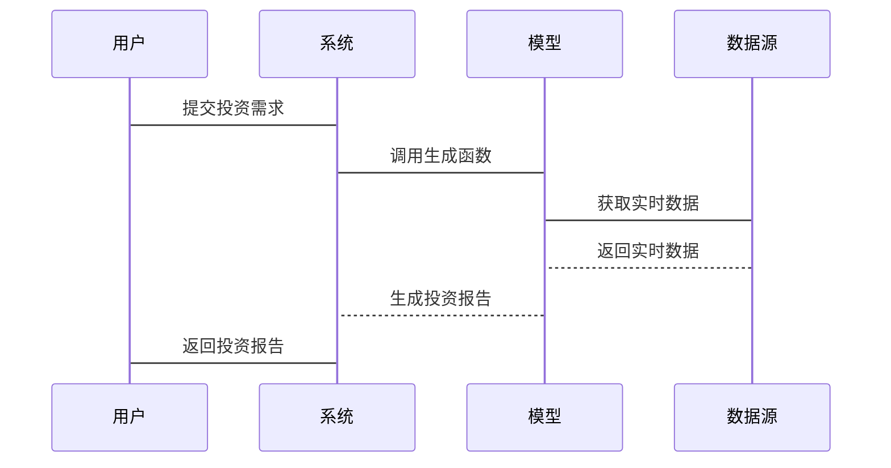

                 


# 自然语言生成在个性化投资报告中的应用

## 关键词：
自然语言生成，个性化投资，投资报告，人工智能，机器学习，金融技术

## 摘要：
本文探讨了自然语言生成（NLP）在个性化投资报告中的应用，分析了NLP技术如何帮助投资者生成定制化的金融分析报告。文章从NLP的基本原理到具体应用，结合实际案例，深入剖析了NLP在金融领域的潜力和挑战，为读者提供了全面的技术视角和实践指南。

---

# 第1章 自然语言生成与个性化投资报告的背景

## 1.1 自然语言生成的基本概念
### 1.1.1 自然语言生成的定义
自然语言生成（Natural Language Generation, NGL）是人工智能领域的一个重要分支，旨在让计算机能够自动生成符合人类语言习惯的文本。NGL的核心目标是将结构化的数据转化为自然流畅的语言表达。

### 1.1.2 自然语言生成的核心技术
- **生成模型**：基于深度学习的生成模型，如GPT、BERT等，通过训练大量文本数据，学习语言的模式和规律。
- **解码器-编码器结构**：通过编码器将输入数据转化为向量表示，解码器再根据这些向量生成目标文本。
- **注意力机制**：在生成过程中，模型会关注输入数据中重要的部分，以提高生成文本的相关性和准确性。

### 1.1.3 自然语言生成在金融领域的应用潜力
- **金融报告生成**：通过NGL技术，可以自动生成股票分析报告、市场趋势分析等文本内容。
- **风险管理**：NGL可以帮助识别潜在风险，生成风险预警报告。
- **投资建议**：基于市场数据和用户需求，生成个性化的投资建议。

## 1.2 个性化投资报告的需求与挑战
### 1.2.1 个性化投资的基本概念
个性化投资是指根据投资者的财务状况、风险偏好和投资目标，量身定制投资策略和报告。个性化投资的核心在于满足不同投资者的需求，提供精准的投资建议。

### 1.2.2 传统投资报告的局限性
- **标准化报告**：传统投资报告往往缺乏个性化，难以满足不同投资者的需求。
- **信息滞后**：报告通常基于历史数据生成，难以实时反映市场变化。
- **人工成本高**：个性化报告的生成需要大量人工干预，效率较低。

### 1.2.3 个性化投资报告的需求场景
- **定制化分析**：根据投资者的具体需求，生成个性化的市场分析和投资建议。
- **实时更新**：基于实时市场数据，动态生成投资报告。
- **多语言支持**：为全球投资者提供多种语言的投资报告。

### 1.2.4 自然语言生成在个性化投资中的优势
- **高效性**：NGL技术可以快速生成大量文本内容，显著提高投资报告的生成效率。
- **个性化**：通过用户输入的参数，NGL可以生成符合用户需求的个性化报告。
- **实时性**：NGL技术可以结合实时市场数据，生成最新的投资报告。

## 1.3 本章小结
本章从自然语言生成的基本概念出发，探讨了其在个性化投资报告中的应用潜力。通过分析传统投资报告的局限性，提出了NGL技术在个性化投资中的优势和应用场景。这为后续章节的技术实现奠定了基础。

---

# 第2章 自然语言生成的原理与模型

## 2.1 自然语言生成的原理
### 2.1.1 生成式AI的基本原理
生成式AI通过深度学习模型，从大量文本数据中学习语言的规律，并利用这些规律生成新的文本内容。生成式AI的核心是解码器结构，通过解码过程将向量表示转化为自然语言文本。

### 2.1.2 自然语言生成的模型结构
- **编码器-解码器结构**：编码器将输入数据转化为向量表示，解码器根据这些向量生成目标文本。
- **注意力机制**：通过注意力机制，模型可以关注输入数据中重要的部分，提高生成文本的相关性和准确性。

### 2.1.3 自然语言生成的训练过程
- **预训练**：通过大规模文本数据的预训练，模型学习语言的模式和规律。
- **微调**：根据具体任务需求，对模型进行微调，优化生成效果。

## 2.2 自然语言生成的主流模型
### 2.2.1 GPT系列模型
GPT（Generative Pre-trained Transformer）是目前最成功的自然语言生成模型之一。GPT模型通过多层的自注意力机制，能够生成高质量的文本内容。

### 2.2.2 BERT与GPT的区别
- **GPT**：基于解码器结构，主要用于生成任务。
- **BERT**：基于编码器结构，主要用于理解任务。
- **区别**：GPT注重生成能力，BERT注重理解能力。

### 2.2.3 其他自然语言生成模型
- **T5**：基于编码器-解码器结构，支持多种生成任务。
- **PaLM**：基于语言模型的生成式AI，具有强大的上下文理解和生成能力。

## 2.3 自然语言生成的实体关系图


## 2.4 本章小结
本章详细讲解了自然语言生成的原理和主流模型，重点介绍了GPT和BERT等模型的结构和特点。通过实体关系图，展示了NGL技术的核心流程和各部分之间的关系。

---

# 第3章 自然语言生成的算法原理

## 3.1 变压器模型的结构
### 3.1.1 编码器的结构
- **自注意力机制**：编码器通过自注意力机制，计算输入序列中每个词与其他词的相关性，生成向量表示。
- **前馈网络**：编码器通过前馈网络对向量表示进行变换，生成最终的编码结果。

### 3.1.2 解码器的结构
- **自注意力机制**：解码器通过自注意力机制，生成输出序列。
- **交叉注意力机制**：解码器通过交叉注意力机制，关注编码器生成的向量表示。

### 3.1.3 注意力机制的数学公式
$$
\text{Attention}(Q, K, V) = \text{softmax}\left(\frac{QK^T}{\sqrt{d_k}}\right)V
$$

其中，$Q$ 是查询向量，$K$ 是键向量，$V$ 是值向量，$d_k$ 是向量的维度。

## 3.2 自然语言生成的训练过程
### 3.2.1 预训练阶段
- **目标函数**：通过交叉熵损失函数，优化模型的生成能力。
- **优化算法**：使用Adam优化算法，优化模型的参数。

### 3.2.2 微调阶段
- **任务特定优化**：根据具体任务需求，对模型进行微调，优化生成效果。
- **数据增强**：通过数据增强技术，提高模型的泛化能力。

## 3.3 自然语言生成的代码实现
```python
import torch
import torch.nn as nn
import torch.nn.functional as F

class Transformer(nn.Module):
    def __init__(self, d_model, nhead, dropout=0.1):
        super(Transformer, self).__init__()
        self.encoder = nn.TransformerEncoder(
            nn.TransformerEncoderLayer(d_model=d_model, nhead=nhead, dropout=dropout),
            num_layers=3
        )
        self.decoder = nn.TransformerDecoder(
            nn.TransformerDecoderLayer(d_model=d_model, nhead=nhead, dropout=dropout),
            num_layers=3
        )
    
    def forward(self, src, tgt):
        enc_out = self.encoder(src)
        dec_out = self.decoder(tgt, enc_out)
        return dec_out
```

## 3.4 本章小结
本章详细讲解了自然语言生成的算法原理，重点介绍了变压器模型的结构和注意力机制的数学公式。通过代码示例，展示了如何实现自然语言生成模型。

---

# 第4章 自然语言生成的系统架构设计

## 4.1 系统功能模块设计
### 4.1.1 数据采集模块
- **数据来源**：从金融市场获取实时数据，包括股票价格、市场指数等。
- **数据预处理**：对数据进行清洗、归一化处理，确保数据质量。

### 4.1.2 模型训练模块
- **模型选择**：根据任务需求，选择合适的自然语言生成模型。
- **模型训练**：通过预训练和微调，优化模型的生成能力。

### 4.1.3 报告生成模块
- **输入处理**：接收投资者的需求参数，生成个性化的投资报告。
- **输出生成**：通过模型生成自然语言文本，输出投资报告。

## 4.2 系统交互流程


## 4.3 本章小结
本章详细讲解了自然语言生成系统的架构设计，重点介绍了系统的功能模块和交互流程。通过Mermaid图，展示了系统的整体架构和各部分之间的交互关系。

---

# 第5章 自然语言生成的项目实战

## 5.1 项目环境配置
### 5.1.1 环境要求
- **Python版本**：Python 3.8以上
- **框架选择**：使用PyTorch或TensorFlow框架
- **数据集**：金融市场数据集，包括股票价格、市场指数等。

### 5.1.2 安装依赖库
```bash
pip install torch transformers pandas numpy matplotlib
```

## 5.2 核心代码实现
### 5.2.1 数据预处理
```python
import pandas as pd
import numpy as np

def preprocess_data(data):
    # 数据清洗
    data = data.dropna()
    # 数据归一化
    data = (data - data.mean()) / data.std()
    return data
```

### 5.2.2 模型训练
```python
import torch
from transformers import AutoTokenizer, AutoModelForCausalLM

tokenizer = AutoTokenizer.from_pretrained('gpt2')
model = AutoModelForCausalLM.from_pretrained('gpt2')
```

### 5.2.3 报告生成
```python
def generate_report(data, model, tokenizer):
    input_ids = tokenizer.encode(data, return_tensors='pt')
    outputs = model.generate(input_ids, max_length=500)
    report = tokenizer.decode(outputs[0], skip_special_tokens=True)
    return report
```

## 5.3 项目总结
通过本章的项目实战，读者可以了解如何将自然语言生成技术应用于个性化投资报告的生成。通过代码示例，展示了如何实现从数据预处理到模型训练，再到报告生成的完整流程。

---

# 第6章 总结与展望

## 6.1 本章总结
本文详细探讨了自然语言生成在个性化投资报告中的应用，从NGL的基本原理到具体实现，全面分析了其在金融领域的潜力和挑战。通过实际案例分析，展示了NGL技术在投资报告生成中的优势。

## 6.2 未来展望
随着深度学习技术的不断发展，自然语言生成在个性化投资中的应用前景广阔。未来，可以通过以下方向进一步研究：
- **多模态生成**：结合图像、音频等多种模态信息，生成更加丰富的投资报告。
- **实时生成**：优化模型的生成速度，实现实时投资报告的生成。
- **个性化优化**：根据用户的实时反馈，动态调整生成内容，提供更加精准的投资建议。

---

# 作者

**作者**：AI天才研究院/AI Genius Institute  
**联系方式**：[联系邮箱](mailto:contact@aigeniusinstitute.com)  
**地址**：[官方网站](https://www.aigeniusinstitute.com)

