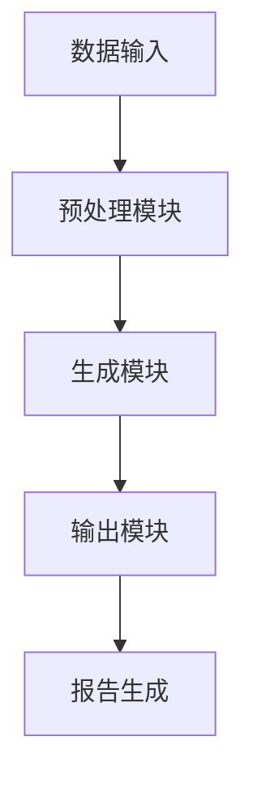

                 


# 自然语言生成技术在金融报告写作中的应用

> 关键词：自然语言生成技术、金融报告、深度学习、自然语言处理、生成模型

> 摘要：自然语言生成技术在金融报告写作中的应用，结合了先进的自然语言处理技术与深度学习算法，为金融行业的报告自动化提供了高效解决方案。本文从技术背景、核心算法、系统架构、项目实战等多角度分析，全面探讨自然语言生成技术在金融报告中的应用价值、实现方法与未来发展方向。

---

## 第一部分：背景与概述

### 第1章：自然语言生成技术的背景与应用

#### 1.1 自然语言生成技术的定义与特点
自然语言生成（Natural Language Generation, NLG）是人工智能领域的重要分支，旨在将结构化的数据转化为自然流畅的文本。其核心特点包括：
- **自动化**：能够自动处理数据并生成文本，减少人工干预。
- **灵活性**：支持多种语言和风格，适应不同的场景需求。
- **可定制化**：可以根据特定领域的要求进行调整和优化。

#### 1.2 金融报告写作的特点与挑战
金融报告通常涉及大量数据和专业术语，其写作具有以下特点：
- **数据密集**：报告内容依赖于财务数据、市场分析等。
- **专业性高**：需要遵循严格的格式和行业术语。
- **时间敏感**：报告需要在特定时间内完成，时效性要求高。

写作中的主要挑战包括：
- 如何高效处理大量数据并转化为有意义的文本。
- 如何确保生成文本的准确性和专业性。
- 如何在不同场景下灵活调整文本风格。

#### 1.3 自然语言生成技术在金融领域的应用前景
自然语言生成技术在金融领域具有广泛的应用前景，包括：
- **财务分析报告生成**：快速生成财务分析报告，帮助投资者做出决策。
- **市场趋势预测**：通过分析市场数据生成市场趋势预测报告。
- **风险管理**：自动生成风险评估报告，辅助企业进行风险管理。

---

## 第二部分：技术基础

### 第2章：自然语言生成技术的核心概念与原理

#### 2.1 自然语言生成技术的核心概念
- **生成模型**：通过数学模型生成文本，常见的生成模型包括基于规则的生成和基于深度学习的生成。
- **概率生成**：基于数据的概率分布生成文本，例如马尔可夫链模型。
- **确定性生成**：基于明确的规则生成文本，例如基于语法树的生成。

#### 2.2 自然语言生成技术的关键算法
- **基于规则的生成算法**：通过预定义的规则生成文本，适用于简单场景。
- **基于统计的生成算法**：基于数据统计生成概率分布，例如n-gram模型。
- **基于深度学习的生成算法**：使用神经网络模型生成文本，例如循环神经网络（RNN）和变换器（Transformer）。

---

## 第三部分：算法原理

### 第3章：基于规则的自然语言生成算法

#### 3.1 基于规则的生成算法原理
- **规则定义**：通过预定义的语法规则生成文本。
- **生成流程**：输入结构化数据，通过规则匹配生成文本。
- **优缺点分析**：优点是简单易懂，缺点是灵活性差，难以应对复杂场景。

### 第4章：基于深度学习的自然语言生成算法

#### 4.1 基于RNN的自然语言生成模型
- **RNN的基本原理**：通过循环结构处理序列数据。
- **生成流程**：输入数据经过RNN网络生成概率分布，选择概率最高的词生成文本。
- **优缺点分析**：优点是能够处理长序列数据，缺点是存在梯度消失问题，影响模型性能。

#### 4.2 基于Transformer的自然语言生成模型
- **Transformer的基本原理**：通过自注意力机制和前馈网络生成文本。
- **生成流程**：输入数据经过编码器生成语义表示，解码器生成目标文本。
- **优缺点分析**：优点是并行计算效率高，生成质量高，缺点是计算资源消耗较大。

---

## 第四部分：系统架构设计

### 第5章：金融报告生成系统的架构设计

#### 5.1 系统功能设计
- **数据输入模块**：接收结构化数据并进行预处理。
- **生成模块**：基于预处理数据生成自然语言文本。
- **输出模块**：将生成的文本输出为报告格式。

#### 5.2 系统架构图


#### 5.3 接口设计
- **输入接口**：接收结构化数据和生成参数。
- **输出接口**：输出生成的文本报告。

---

## 第五部分：项目实战

### 第6章：基于深度学习的金融报告生成系统实现

#### 6.1 环境安装
- 安装Python环境和相关库（如TensorFlow、Keras等）。
- 安装自然语言处理库（如NLTK、spaCy）。

#### 6.2 核心实现代码
```python
import tensorflow as tf
from tensorflow.keras import layers

# 定义生成模型
def build_model(vocab_size, embedding_dim, lstm_units):
    model = tf.keras.Sequential()
    model.add(layers.Embedding(vocab_size, embedding_dim))
    model.add(layers.LSTM(lstm_units, return_sequences=True))
    model.add(layers.Dense(vocab_size, activation='softmax'))
    return model

# 训练模型
def train_model(model, optimizer, loss_function, epochs, train_data, val_data):
    model.compile(optimizer=optimizer, loss=loss_function)
    model.fit(train_data, epochs=epochs, validation_data=val_data)
    return model

# 生成文本
def generate_text(model, tokenizer, start_word, max_length):
    for _ in range(max_length):
        next_word = model.predict([start_word])[0]
        sampled_index = np.argmax(next_word)
        sampled_word = tokenizer.index_to_word[sampled_index]
        start_word.append(sampled_word)
    return ' '.join(start_word)
```

#### 6.3 实际案例分析
通过实际案例分析，展示如何使用深度学习模型生成金融报告，包括数据预处理、模型训练和文本生成的具体步骤。

---

## 第六部分：总结与展望

### 第7章：总结与展望

#### 7.1 核心内容总结
- 自然语言生成技术在金融报告中的应用价值。
- 基于深度学习的生成模型的优势与挑战。

#### 7.2 未来发展方向
- 提高生成模型的准确性和可解释性。
- 结合领域知识优化生成效果。
- 探索多模态生成技术的应用。

---

## 作者：AI天才研究院 & 禅与计算机程序设计艺术

---

以上是关于《自然语言生成技术在金融报告写作中的应用》的技术博客文章的完整目录结构和内容概要。希望对您有所帮助！

