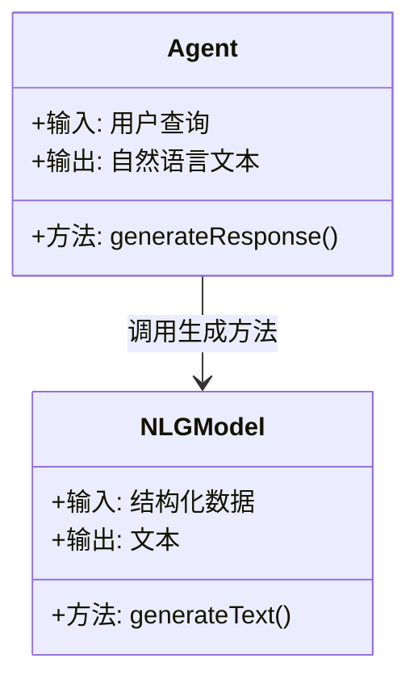
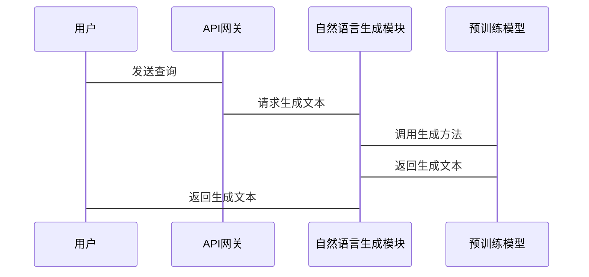
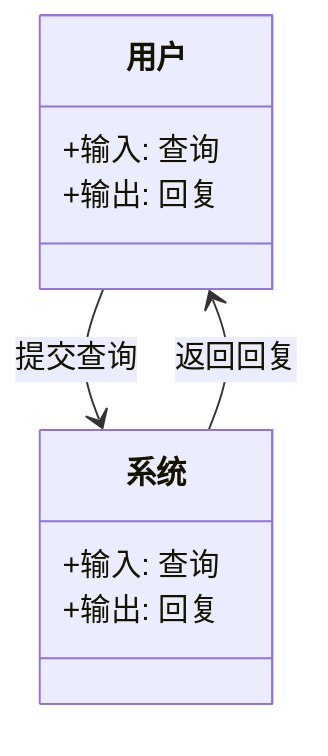

                 


# 自然语言生成：提升AI Agent的表达能力

> 关键词：自然语言生成，AI Agent，深度学习，预训练模型，文本生成，对话系统，表达能力

> 摘要：自然语言生成（Natural Language Generation, NLG）是人工智能领域的重要分支，致力于让机器能够生成自然、流畅且有意义的文本。本文从AI Agent的角度出发，系统地探讨了自然语言生成的核心技术，包括生成模型的原理、优化方法、系统架构设计以及实际应用案例。通过本文的阐述，读者将能够全面理解如何通过自然语言生成技术提升AI Agent的表达能力，使其在实际场景中更高效、更自然地与人类交互。

---

## 第一部分: 自然语言生成概述

### 第1章: 自然语言生成的基本概念

#### 1.1 自然语言生成的定义与核心要素
自然语言生成（NLG）是指将结构化的数据或信息转换为自然语言文本的过程。其核心要素包括：
1. **输入数据**：结构化的数据或信息，如数据库中的记录或知识图谱。
2. **生成目标**：输出符合语法和语义的自然语言文本。
3. **生成策略**：基于预训练模型或定制规则的生成方法。
4. **评估指标**：如BLEU、ROUGE等用于衡量生成文本的质量。

#### 1.2 AI Agent与自然语言生成的关系
AI Agent（智能代理）是指能够感知环境并执行任务的智能系统。自然语言生成在AI Agent中的作用：
1. **人机交互**：通过生成自然语言文本与用户进行对话。
2. **信息表达**：将AI Agent的决策结果以文本形式呈现。
3. **情境理解**：结合上下文生成更符合情境的回复。

#### 1.3 自然语言生成的应用领域
- **对话系统**：如智能客服、虚拟助手。
- **文本摘要**：将长文本压缩为关键信息。
- **机器翻译**：将一种语言翻译为另一种语言。
- **内容生成**：如新闻报道、产品描述。

---

### 第2章: 自然语言生成的技术背景

#### 2.1 自然语言处理的演进
- **规则驱动阶段**：基于预定义的语法规则生成文本。
- **统计学习阶段**：基于概率模型（如n-gram）生成文本。
- **深度学习阶段**：基于神经网络（如RNN、Transformer）生成文本。

#### 2.2 自然语言生成的主流技术
- **基于统计的生成模型**：如n-gram模型。
- **基于深度学习的生成模型**：如循环神经网络（RNN）、Transformer。
- **预训练模型**：如GPT、BERT等大模型。

#### 2.3 预训练模型的崛起
- **大模型的优势**：通过海量数据预训练，模型能够捕获语言的复杂规律。
- **微调与定制化**：在特定任务上进行微调，以适应不同场景的需求。

---

## 第二部分: 自然语言生成的核心算法

### 第3章: Transformer模型原理

#### 3.1 Transformer的结构
- **编码器**：将输入序列编码为高维向量。
- **解码器**：根据编码器输出生成目标序列。

#### 3.2 自注意力机制（Self-Attention）
- **查询（Query）**：表示输入序列的某个位置。
- **键（Key）**：用于计算与其他位置的相关性。
- **值（Value）**：根据相关性加权后的输出。

#### 3.3 前馈神经网络
- **输入层**：接收编码器输出的高维向量。
- **隐藏层**：通过非线性变换生成最终输出。

#### 3.4 Transformer的数学公式
- **自注意力机制**：
$$
\text{Attention}(Q, K, V) = \text{softmax}\left(\frac{QK^T}{\sqrt{d_k}}\right)V
$$
其中，$Q$、$K$、$V$分别是查询、键、值向量，$d_k$是向量维度。

### 第4章: GPT系列模型的生成机制

#### 4.1 GPT模型的生成原理
- **自回归生成**：逐词生成文本，每一步生成下一个词。
- **上下文依赖**：生成的每个词都依赖于之前的上下文。

#### 4.2 生成式对抗网络（GAN）的应用
- **生成器**：生成逼真的文本。
- **判别器**：判断文本是真实还是生成的。
- **对抗训练**：通过不断优化生成器和判别器，提升生成文本的质量。

#### 4.3 增量式生成与解码器优化
- **增量式生成**：逐步生成文本，每一步调整生成策略。
- **解码器优化**：通过beam search或top-k sampling优化生成结果。

---

## 第三部分: 自然语言生成的数学模型

### 第5章: 生成模型的数学表达

#### 5.1 生成模型的概率分布
- **条件生成分布**：
$$
P(y|x) = \text{softmax}(W_y h(x))
$$
其中，$h(x)$是编码器输出的向量，$W_y$是生成词表的权重。

#### 5.2 最大似然估计
- **目标函数**：
$$
\theta^* = \arg\max_\theta \sum_{i=1}^n \log P_\theta(y_i|x_i)
$$

#### 5.3 贝叶斯推断
- **后验概率**：
$$
P(z|x) \propto P(x|z)P(z)
$$
其中，$z$是潜在变量。

### 第6章: 变压器模型的数学公式

#### 6.1 自注意力机制的矩阵表示
- **查询与键匹配**：
$$
QK^T = \sum_{i=1}^d Q_i K_i
$$
其中，$d$是向量维度。

#### 6.2 前馈网络的权重矩阵
- **输入与输出关系**：
$$
y = W_{out} \sigma(W_{in}x + b)
$$
其中，$\sigma$是非线性激活函数。

#### 6.3 解码器的生成概率计算
- **条件概率**：
$$
P(y|x) = \prod_{i=1}^n P(y_i|x, y_{<i})
$$

---

## 第四部分: 系统架构与实现

### 第7章: 系统架构设计

#### 7.1 项目需求分析
- **目标**：构建一个基于自然语言生成的AI Agent。
- **功能**：支持多轮对话、上下文理解、个性化回复。

#### 7.2 系统功能设计（领域模型）


#### 7.3 系统架构设计


#### 7.4 系统接口设计
- **输入接口**：接收用户查询或结构化数据。
- **输出接口**：返回生成的文本或JSON格式数据。

#### 7.5 系统交互设计


---

## 第五部分: 项目实战

### 第8章: 项目实战

#### 8.1 智能客服系统的实现

##### 8.1.1 需求分析
- **目标**：构建一个能够处理常见问题的智能客服系统。
- **功能**：支持多轮对话、上下文理解、个性化回复。

##### 8.1.2 系统设计


##### 8.1.3 核心代码实现
```python
class NLGModel:
    def __init__(self, model_path):
        self.model = AutoModelForCausalLM.from_pretrained(model_path)
        self.tokenizer = AutoTokenizer.from_pretrained(model_path)

    def generate_response(self, input_text):
        inputs = self.tokenizer(input_text, return_tensors="pt")
        outputs = self.model.generate(
            inputs.input_ids,
            max_length=100,
            num_beams=5,
            temperature=0.7
        )
        response = self.tokenizer.decode(outputs[0], skip_special_tokens=True)
        return response
```

##### 8.1.4 系统测试与优化
- **测试指标**：生成文本的质量、响应时间、用户体验。
- **优化策略**：调整生成参数（如temperature、top-k sampling）。

---

## 第六部分: 高级主题与未来趋势

### 第9章: 高级主题与未来趋势

#### 9.1 自然语言生成的前沿技术
- **多模态生成**：结合视觉、听觉等多模态信息生成文本。
- **实时生成优化**：在低延迟场景下的生成优化。
- **伦理与安全**：生成文本的可解释性、真实性。

#### 9.2 自然语言生成的未来趋势
- **个性化生成**：根据用户特征生成个性化文本。
- **实时交互**：支持实时生成与用户互动。
- **跨语言生成**：支持多语言生成与翻译。

---

## 第七部分: 最佳实践与总结

### 第10章: 最佳实践与总结

#### 10.1 最佳实践
- **模型选择**：根据任务需求选择合适的模型。
- **数据质量**：确保训练数据的多样性和代表性。
- **生成控制**：通过参数调整和规则过滤控制生成内容。

#### 10.2 项目小结
- **核心收获**：理解了自然语言生成的核心技术与实现方法。
- **未来展望**：探讨了自然语言生成的前沿技术与应用潜力。

---

## 参考文献

- 本文代码示例基于Hugging Face的Transformers库实现。
- 深度学习与自然语言处理的相关论文与技术博客。

---

**作者：AI天才研究院/AI Genius Institute & 禅与计算机程序设计艺术/Zen And The Art of Computer Programming**

