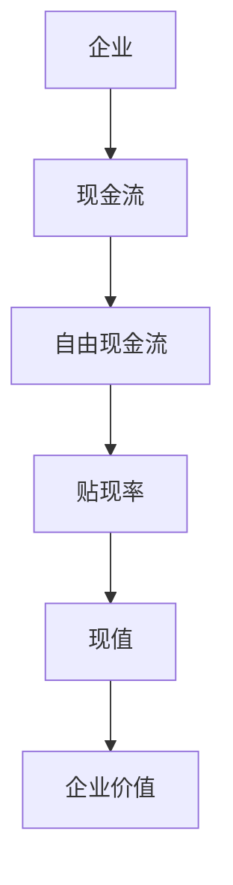
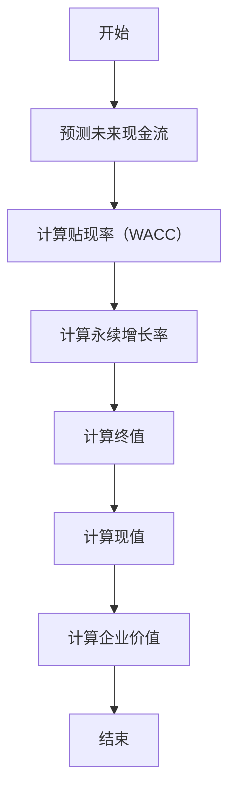
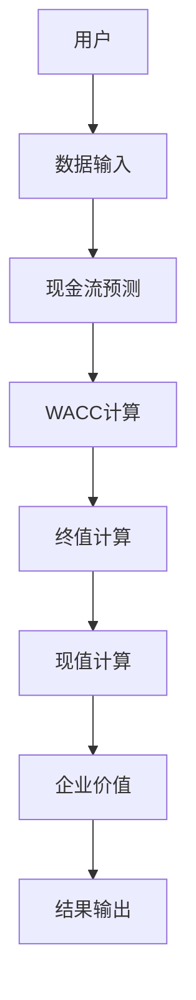

                 


# 自由现金流贴现：考虑资本支出的估值模型

## 关键词：自由现金流贴现模型、资本支出、估值模型、DCF模型、加权平均资本成本

## 摘要：本文详细阐述了自由现金流贴现模型（DCF模型）的基本原理和应用方法，重点分析了如何在模型中考虑资本支出。通过系统的理论分析和实际案例的讲解，本文旨在帮助读者理解DCF模型的核心概念、计算步骤和实际应用。同时，本文还探讨了资本支出对现金流预测的影响，并通过Python代码示例展示了如何实现DCF模型的计算过程。

---

## 第一部分：自由现金流贴现模型的背景与基础

### 第1章：自由现金流贴现模型的基本概念

#### 1.1 自由现金流的定义与计算
自由现金流（Free Cash Flow，FCF）是指企业在扣除所有必要的开支后，剩余可用于偿还债务、投资于增长机会或返还股东的资金。计算公式为：
$$ \text{FCF} = \text{EBITDA} - \text{资本支出} - \text{税盾} $$

自由现金流是DCF模型的核心，因为它反映了企业在不考虑外部融资的情况下能够产生的现金流。

#### 1.2 自由现金流贴现模型的定义
自由现金流贴现模型（DCF模型）是一种用于估计公司或项目价值的方法。该模型通过将未来自由现金流贴现到现值，来计算其当前的公允价值。DCF模型的核心假设是：企业的价值在于它能够为股东创造的自由现金流的现值。

#### 1.3 DCF模型的应用领域
DCF模型广泛应用于企业估值、项目评估和投资决策等领域。它特别适用于那些现金流稳定且可预测的公司，如制造业和服务业。

---

### 第2章：资本支出与自由现金流的关系

#### 2.1 资本支出的定义与分类
资本支出（Capital Expenditure，CapEx）是指企业用于购买或维护长期资产的支出，如设备、厂房和研发投入等。资本支出可以分为两类：增量资本支出和替换资本支出。

#### 2.2 自由现金流中的资本支出处理
在DCF模型中，资本支出通常从企业的息税前利润（EBIT）中扣除，因为它属于企业的运营成本。具体来说，资本支出影响企业的现金流，因为它需要投入资金购买资产，从而减少了当前的可分配现金流。

#### 2.3 资本支出对现金流预测的影响
资本支出的预测是DCF模型中最重要的部分之一。准确预测资本支出可以帮助企业合理规划未来的现金流，从而提高估值的准确性。

---

## 第二部分：DCF模型的核心概念与联系

### 第3章：DCF模型的核心概念

#### 3.1 自由现金流（FCF）
自由现金流是DCF模型的核心输入，它反映了企业在扣除所有必要开支后的剩余现金流。正确的现金流预测是模型准确性的关键。

#### 3.2 贴现率（Discount Rate）
贴现率是将未来现金流折算为现值的利率。在DCF模型中，通常使用加权平均资本成本（WACC）作为贴现率，因为它反映了企业整体资本的成本。

#### 3.3 永续增长率（永续增长率）
永续增长率是指企业在永续增长阶段的年增长率。在DCF模型中，假设企业的增长率在永续阶段趋于稳定。

---

### 第4章：核心概念的联系

#### 4.1 核心概念的属性特征对比
| 概念       | 属性特征                         |
|------------|----------------------------------|
| 自由现金流 | 现金流来源：企业经营活动；计算方式：EBITDA - 资本支出 - 税盾 |
| 贴现率      | 计算方式：WACC；反映企业资本成本的综合指标 |
| 永续增长率  | 假设条件：长期稳定增长；增长率通常较低 |

#### 4.2 核心概念的ER实体关系图


---

## 第三部分：DCF模型的算法原理

### 第5章：DCF模型的算法流程

#### 5.1 算法流程图


#### 5.2 Python代码实现
以下是一个简单的DCF模型实现示例：
```python
import numpy as np

# 输入参数
cash_flows = [100, 150, 200, 250]  # 未来四年的现金流
discount_rate = 0.12  # 贴现率
terminal_growth_rate = 0.05  # 永续增长率
years = len(cash_flows)

# 计算终值
terminal_value = cash_flows[-1] * (1 + terminal_growth_rate) / (discount_rate - terminal_growth_rate)
discounted_cash_flows = [cf / (1 + discount_rate) ** i for i, cf in enumerate(cash_flows)]
total_present_value = sum(discounted_cash_flows) + terminal_value / (1 + discount_rate) ** years

print("企业价值：", total_present_value)
```

#### 5.3 数学模型与公式
##### 5.3.1 现金流的计算公式
$$ \text{FCF}_t = \text{EBITDA}_t - \text{CapEx}_t - \text{税盾}_t $$

##### 5.3.2 贴现率的计算公式
$$ \text{WACC} = \left( \frac{D}{V} \times r_d \times (1 - t) \right) + \left( \frac{E}{V} \times r_e \right) $$

##### 5.3.3 终值的计算公式
$$ \text{TV} = \frac{\text{FCF}_{n+1}}{r - g} $$

---

## 第四部分：DCF模型的系统分析与架构设计

### 第6章：系统分析

#### 6.1 问题场景介绍
假设我们是一家制造企业，需要评估一个新项目的价值。我们计划在未来五年内每年投入资本支出，同时预测每年的现金流。

#### 6.2 系统功能设计
- 数据输入：用户输入未来现金流、资本支出、税率、贴现率和永续增长率。
- 模型计算：计算WACC、终值和现值。
- 结果输出：显示企业价值和分析报告。

#### 6.3 系统架构图


---

## 第五部分：项目实战

### 第7章：项目实战

#### 7.1 环境安装
需要安装Python和以下库：
```
pip install numpy
pip install pandas
```

#### 7.2 核心实现
以下是一个完整的DCF模型实现：
```python
import numpy as np

def calculate_dcf(cash_flows, discount_rate, terminal_growth_rate, years):
    # 计算终值
    terminal_value = cash_flows[-1] * (1 + terminal_growth_rate) / (discount_rate - terminal_growth_rate)
    # 计算现值
    present_values = [cf / (1 + discount_rate) ** i for i, cf in enumerate(cash_flows)]
    total_present_value = sum(present_values) + terminal_value / (1 + discount_rate) ** years
    return total_present_value

# 示例数据
cash_flows = [100, 150, 200, 250, 300]
discount_rate = 0.12
terminal_growth_rate = 0.05
years = len(cash_flows)

# 计算企业价值
enterprise_value = calculate_dcf(cash_flows, discount_rate, terminal_growth_rate, years)
print("企业价值：", enterprise_value)
```

---

## 第六部分：最佳实践与小结

### 第8章：最佳实践

#### 8.1 小结
本文详细介绍了自由现金流贴现模型的基本原理和应用方法，重点分析了如何在模型中考虑资本支出。通过系统的理论分析和实际案例的讲解，帮助读者理解DCF模型的核心概念、计算步骤和实际应用。

#### 8.2 注意事项
- 确保现金流预测的准确性。
- 合理选择贴现率和永续增长率。
- 定期更新模型参数以反映市场变化。

#### 8.3 拓展阅读
推荐阅读《投资学》（作者：彼得·林奇）和《价值投资入门》（作者：格雷厄姆）。

---

## 作者：AI天才研究院 & 禅与计算机程序设计艺术

---

通过本文的详细讲解，读者可以掌握自由现金流贴现模型的核心原理和实际应用方法，为企业的估值和投资决策提供有力支持。

