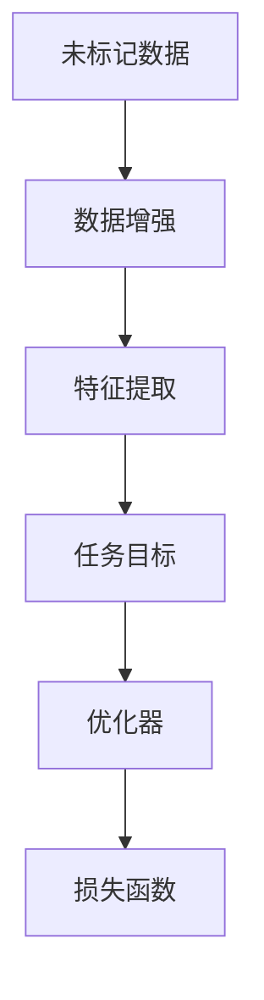
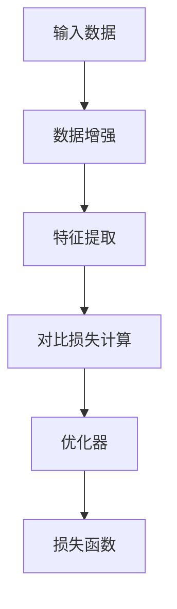
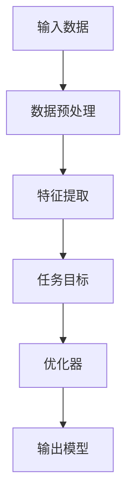

                 


# 《自监督学习：利用未标记数据提升AI Agent能力》

> **关键词**：自监督学习，未标记数据，AI Agent，半监督学习，数据增强，对比学习，知识蒸馏  
> 
> **摘要**：  
> 在AI Agent开发中，数据标注成本高昂且耗时，而未标记数据的获取却相对容易。自监督学习作为一种新兴的半监督学习技术，能够有效利用未标记数据，提升模型的泛化能力和任务性能。本文将从自监督学习的核心概念、算法原理、系统架构到实际应用，详细分析如何利用未标记数据提升AI Agent的能力。

---

## 第一部分: 自监督学习基础与背景

### 第1章: 自监督学习概述

#### 1.1 自监督学习的基本概念
自监督学习是一种半监督学习方法，旨在通过未标记数据本身提供的结构信息，生成伪标签或构建对比任务，从而学习数据的潜在特征表示。与监督学习相比，自监督学习的优势在于其对标注数据的需求极低，能够充分利用未标记数据的潜力。

#### 1.2 自监督学习的背景与应用
在AI Agent开发中，数据标注成本高昂，且标注过程耗时耗力。相比之下，未标记数据的获取相对容易，但直接利用未标记数据进行学习的难度较大。自监督学习的出现，为AI Agent提供了新的解决方案，使其能够从海量未标记数据中提取有用信息，提升模型的泛化能力和任务性能。

#### 1.3 自监督学习的核心问题与目标
自监督学习的核心问题是如何从未标记数据中提取有用的特征表示，并通过这些表示来解决具体任务。其目标是通过构建适当的对比任务或生成任务，最大化模型对未标记数据的利用效率，从而提升AI Agent的性能。

---

## 第二部分: 自监督学习的核心概念与联系

### 第2章: 自监督学习的核心概念与联系

#### 2.1 自监督学习的原理与机制
自监督学习通过构建对比任务或生成任务，利用未标记数据的结构信息进行学习。例如，在对比学习中，模型通过比较同一数据的不同增强版本，学习数据的不变性特征。

#### 2.2 自监督学习的核心概念对比
下表对比了自监督学习与其他学习方法的核心概念：

| 对比维度 | 监督学习 | 无监督学习 | 半监督学习 | 自监督学习 |
|----------|----------|------------|------------|------------|
| 数据需求 | 高标注需求 | 无标注需求 | 低标注需求 | 低标注需求 |
| 核心任务 | 分类/回归 | 聚类/降维 | 少量标注 + 未标注 | 对比/生成任务 |
| 代表算法 | SVM、随机森林 | K-means、t-SNE | 线性SVM + 标签传播 | SimCLR、BYOL、VAE |

#### 2.3 自监督学习的实体关系图
下图展示了自监督学习的核心实体关系：



---

## 第三部分: 自监督学习的算法原理与数学模型

### 第3章: 自监督学习的算法原理

#### 3.1 对比学习算法
对比学习是一种常见的自监督学习方法，其核心思想是通过最大化相同数据的不同增强版本之间的相似性，学习数据的不变性特征。

##### 3.1.1 对比学习的数学模型
对比学习的损失函数通常定义为：
$$ L(x_i, x_j) = \mathbb{E}_{i,j}[ -\log(\text{sim}(x_i, x_j))] $$
其中，$\text{sim}(x_i, x_j)$ 表示 $x_i$ 和 $x_j$ 之间的相似性得分。

##### 3.1.2 算法流程图
下图展示了对比学习的算法流程：



---

## 第四部分: 系统分析与架构设计方案

### 第4章: 自监督学习的系统架构设计

#### 4.1 项目背景与目标
本项目旨在通过自监督学习技术，提升AI Agent在未标记数据上的学习能力，降低数据标注成本，同时提升模型的泛化能力。

#### 4.2 系统功能设计
系统功能模块包括：
- 数据预处理模块：对未标记数据进行数据增强和预处理。
- 特征提取模块：利用自监督学习算法提取数据特征。
- 任务目标模块：定义对比任务或生成任务，并计算损失。
- 优化模块：通过优化器优化模型参数。

#### 4.3 系统架构设计
下图展示了系统的整体架构：



---

## 第五部分: 项目实战

### 第5章: 项目实战与案例分析

#### 5.1 环境安装与准备
需要安装以下环境：
- Python 3.8+
- PyTorch 1.9+
- Transformers库

#### 5.2 核心代码实现
以下是对比学习的Python代码实现：

```python
import torch
import torch.nn as nn
import torch.optim as optim

class ContrastiveModel(nn.Module):
    def __init__(self, embedding_dim=128):
        super(ContrastiveModel, self).__init__()
        self.embedding_dim = embedding_dim
        self.encoder = nn.Sequential(
            nn.Linear(input_dim, 512),
            nn.ReLU(),
            nn.Linear(512, embedding_dim)
        )
        self.margin = 0.5

    def forward(self, x):
        return self.encoder(x)

def contrastive_loss(x, y, margin=0.5):
    # 计算余弦相似性
    cosine = (x @ y.T) / (torch.norm(x, dim=1).unsqueeze(1) * torch.norm(y, dim=1).unsqueeze(1))
    cosine = torch.diag(cosine)
    loss = 1 - cosine + margin
    return torch.mean(loss)

# 初始化模型和优化器
model = ContrastiveModel()
optimizer = optim.Adam(model.parameters(), lr=1e-3)
```

#### 5.3 案例分析与解读
通过上述代码，我们可以看到对比学习的核心思想是通过最大化相似样本之间的相似性，同时最小化不相似样本之间的相似性，从而学习到数据的不变性特征。

---

## 第六部分: 最佳实践与总结

### 第6章: 最佳实践与总结

#### 6.1 最佳实践
1. 在数据增强方面，选择合适的增强方法（如随机裁剪、旋转等）。
2. 在损失函数设计上，结合任务需求选择合适的对比损失函数。
3. 在模型优化过程中，合理设置学习率和优化策略。

#### 6.2 小结
自监督学习通过利用未标记数据，显著降低了数据标注成本，同时提升了模型的泛化能力。在AI Agent开发中，自监督学习的应用前景广阔。

#### 6.3 注意事项
1. 数据增强方法的选择对模型性能影响较大，需谨慎设计。
2. 对比学习的相似性度量方法需要根据具体任务进行调整。
3. 模型的泛化能力依赖于数据质量和数据分布的多样性。

#### 6.4 拓展阅读
- 研究论文：SimCLR、BYOL等对比学习方法。
- 实践书籍：《Deep Learning》（Ian Goodfellow）

---

## 作者：AI天才研究院 & 禅与计算机程序设计艺术

---

以上是《自监督学习：利用未标记数据提升AI Agent能力》的技术博客文章大纲及内容。

