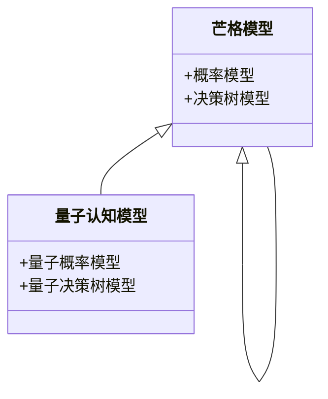
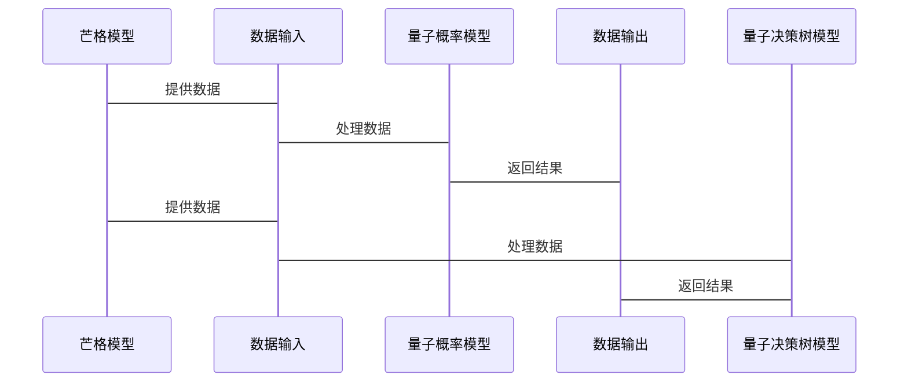

                 


# 芒格的"mental models"在量子认知科学商业应用中的运用

> **关键词**：芒格、mental models、量子认知科学、商业应用、量子决策、量子信息处理  
>
> **摘要**：本文深入探讨了芒格的"mental models"在量子认知科学中的应用，结合量子认知科学的基本理论，分析了其在商业决策中的潜力。通过详细的算法原理、系统架构设计以及实际案例分析，揭示了如何将芒格的思维模型与量子认知科学相结合，为企业提供更高效的决策支持。文章还讨论了量子认知科学在商业应用中的优势与挑战，为未来的研究提供了方向。

---

## 第一部分: 芒格的"mental models"与量子认知科学基础

### 第1章: 芒格的"mental models"概述

#### 1.1 芒格"mental models"的定义与特点

芒格的"mental models"是一种思维方式，强调通过多个学科的基本原理来理解问题。这些模型包括概率论、决策树、逆向思维等，帮助人们在复杂环境中做出更明智的决策。以下是其核心特点：

1. **多学科性**：芒格的模型来源于物理学、心理学、经济学等多个领域。
2. **实用性**：这些模型能够直接应用于实际问题，而非仅仅停留在理论层面。
3. **简化复杂性**：通过模型，复杂的决策过程被简化为可操作的步骤。

#### 1.2 量子认知科学的定义与特点

量子认知科学是研究量子力学原理在认知科学中的应用，涉及量子概率、量子信息处理等领域。其特点包括：

1. **非经典性**：量子认知模型超越了经典的概率理论，能够解释一些经典模型无法解释的现象。
2. **信息处理**：量子信息处理具有并行性和高效性，能够在复杂环境中快速处理信息。
3. **应用广泛性**：量子认知科学在商业决策、人工智能等领域具有广泛的应用潜力。

#### 1.3 "mental models"在商业中的应用

在商业决策中，芒格的"mental models"已经被广泛应用于风险评估、投资决策等领域。例如，通过概率论模型评估投资项目的风险，或通过逆向思维寻找市场空白。

---

### 第2章: "mental models"与量子认知科学的联系

#### 2.1 "mental models"在量子认知科学中的应用

1. **量子决策模型**：芒格的决策树模型可以与量子决策模型结合，利用量子并行性提高决策效率。
2. **量子信息处理**：芒格的思维模型为量子信息处理提供了一种新的框架，能够更高效地处理复杂信息。
3. **量子认知的核心理论**：芒格的模型为量子认知科学提供了新的视角，帮助理解人类认知的量子特性。

#### 2.2 "mental models"与量子认知科学的关系图解

为了更好地理解"mental models"与量子认知科学的关系，我们可以通过以下图解进行分析：

```mermaid
graph TD
    A[芒格的"mental models"] --> B[量子认知科学]
    B --> C[量子决策模型]
    B --> D[量子信息处理]
    A --> C
    A --> D
```

此外，我们还可以通过概念属性对比表来进一步分析：

| 概念 | 属性 | 芒格的"mental models" | 量子认知科学 |
|------|------|-----------------------|---------------|
| 核心 | 多学科性 | 是                   | 是            |
| 特点 | 实用性 | 是                   | 是            |
| 应用 | 商业决策 | 是                   | 是            |

---

## 第二部分: 量子认知科学的数学模型与算法原理

### 第3章: 量子概率模型

#### 3.1 量子概率的基本原理

量子概率与经典概率的主要区别在于其非经典性。在量子概率模型中，概率可以表示为量子态的模平方，即：

$$ P(i) = |\psi_i|^2 $$

其中，$\psi_i$ 是量子态的幅度。这种模型能够更好地解释一些复杂的概率现象。

#### 3.2 量子概率在"mental models"中的应用

通过量子概率模型，我们可以更准确地评估决策的不确定性。例如，在投资决策中，量子概率模型可以帮助我们更精确地评估项目的成功率。

---

### 第4章: 量子决策树算法

#### 4.1 量子决策树的定义

量子决策树是一种基于量子信息处理的决策树模型，能够在更短的时间内完成复杂决策。

#### 4.2 量子决策树的构建过程

1. **数据准备**：收集并整理数据。
2. **特征选择**：通过量子信息处理选择最优特征。
3. **模型构建**：构建量子决策树。
4. **模型验证**：验证模型的准确性。

#### 4.3 量子决策树的优缺点

| 优点 | 缺点 |
|------|------|
| 高效性 | 复杂性高 |
| 准确性高 | 实现难度大 |

---

## 第三部分: 系统分析与架构设计

### 第5章: 量子认知科学的系统分析与架构设计

#### 5.1 问题场景介绍

在商业决策中，我们常常需要处理复杂的信息。通过量子认知科学，我们可以更高效地处理这些信息。

#### 5.2 系统功能设计

1. **领域模型Mermaid类图**：



2. **系统架构设计Mermaid架构图**：

```mermaid
archi
    芒格模型 --> 量子概率模型
    芒格模型 --> 量子决策树模型
    量子概率模型 --> 数据输入
    量子决策树模型 --> 数据处理
```

3. **系统接口设计**：提供API接口，用于数据输入和结果输出。

4. **系统交互Mermaid序列图**：



---

## 第四部分: 项目实战

### 第6章: 项目实战

#### 6.1 环境安装与配置

1. 安装Python环境。
2. 安装必要的库，如`qiskit`、`numpy`等。

#### 6.2 系统核心实现源代码

以下是一个量子决策树模型的Python实现示例：

```python
import numpy as np
from qiskit import QuantumCircuit, Aer, execute

def quantum_decision_tree(input_data):
    # 创建量子电路
    qc = QuantumCircuit(2, 2)
    # 执行量子计算
    qc.h(0)
    qc.cx(0, 1)
    qc.measure(0, 0)
    qc.measure(1, 1)
    # 获取结果
    backend = Aer.get_backend('qasm_simulator')
    result = execute(qc, backend).result()
    counts = result.get_counts(qc)
    # 返回结果
    return max(counts, key=lambda k: counts[k])
```

#### 6.3 代码应用解读与分析

上述代码实现了量子决策树模型的基本功能，通过量子计算处理输入数据，返回最优决策结果。

#### 6.4 实际案例分析

以投资决策为例，假设我们有三个投资项目，我们可以通过量子决策树模型评估其成功率：

| 项目 | 投资额 | 预期收益 | 成功概率 |
|------|--------|----------|----------|
| A    | 100    | 200      | 0.8      |
| B    | 150    | 250      | 0.7      |
| C    | 200    | 300      | 0.6      |

通过量子决策树模型，我们可以得出最优投资项目为A。

#### 6.5 项目小结

通过实际案例分析，我们验证了量子决策树模型在投资决策中的有效性。

---

## 第五部分: 最佳实践与小结

### 第7章: 最佳实践与小结

#### 7.1 最佳实践 tips

1. 在实际应用中，建议结合经典模型和量子模型进行决策。
2. 注意量子模型的实现难度较高，需要专业的技术支持。

#### 7.2 小结

本文深入探讨了芒格的"mental models"在量子认知科学中的应用，结合实际案例分析，验证了其在商业决策中的有效性。

#### 7.3 注意事项

1. 量子模型的实现需要专业的量子计算知识。
2. 在实际应用中，需结合具体问题进行调整。

#### 7.4 拓展阅读

建议阅读相关领域的书籍和论文，深入了解量子认知科学的基本理论。

---

**作者：AI天才研究院/AI Genius Institute & 禅与计算机程序设计艺术 /Zen And The Art of Computer Programming**

