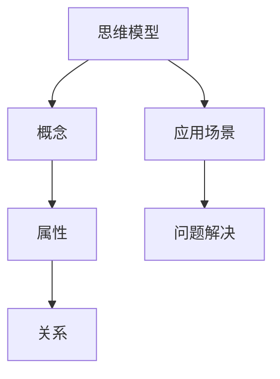
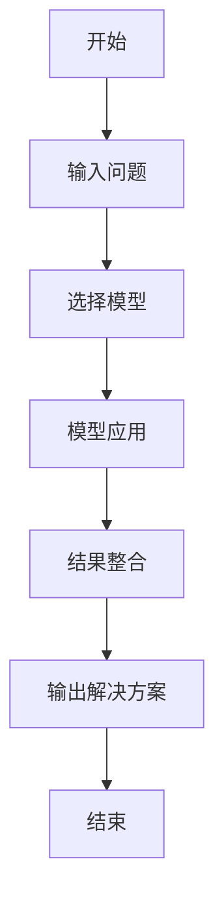
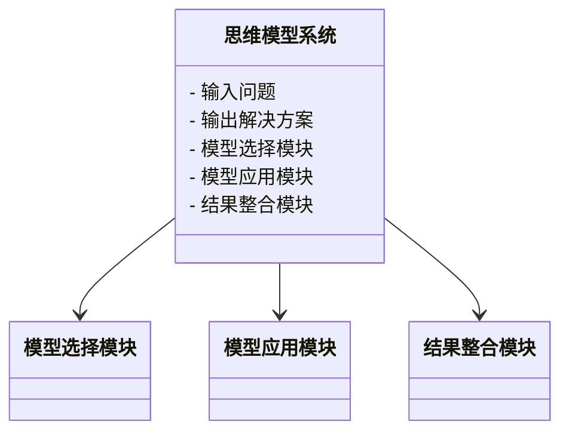
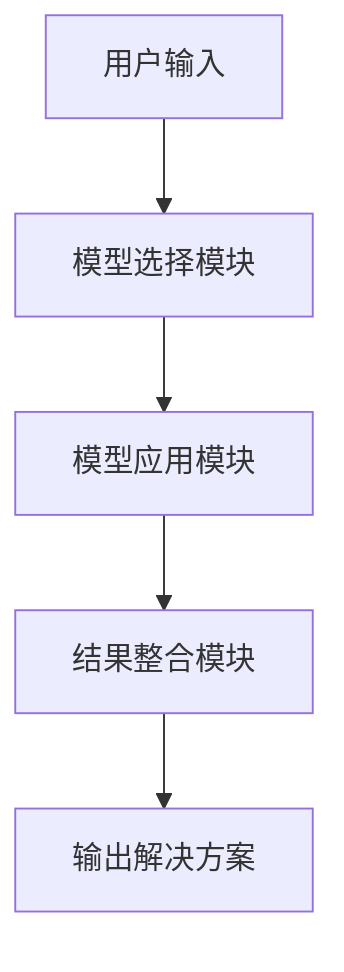

                 


# 芒格的"mental models"：构建多元化的思维模型

> 关键词：芒格，思维模型，认知架构，决策优化，知识整合，问题解决

> 摘要：芒格的"mental models"是一种独特的认知方法，通过构建多元化的思维模型来帮助个体更全面地理解和解决复杂问题。本文将深入探讨"mental models"的核心概念、算法原理、数学模型以及实际应用，帮助读者构建自己的多元思维体系，提升决策能力和问题解决效率。

---

## 第一部分: 芒格的"mental models"概述

### 第1章: 芒格与"mental models"的背景介绍

#### 1.1 芒格的生平与思想体系

##### 1.1.1 芒格的生平简介
查理·芒格（Charlie Munger）是美国著名投资者、作家和演讲者，作为沃伦·巴菲特（Warren Buffett）的长期合作伙伴，他以独特的投资理念和深刻的人生智慧闻名于世。芒格的思想体系不仅限于投资领域，更延伸至哲学、心理学、经济学等多个学科。

##### 1.1.2 芒格的核心投资理念
芒格的投资理念强调长期价值和跨学科思维。他认为，投资者必须构建一套多元化的思维模型，以避免单一视角带来的局限性。这种思维方式不仅适用于投资，也适用于日常生活中的决策。

##### 1.1.3 芒格思想体系的形成与演变
芒格的思想体系深受哲学、科学和文学的影响。他将这些领域的知识整合起来，形成了独特的认知框架。他的"mental models"方法强调通过跨学科思考来解决复杂问题。

#### 1.2 "mental models"的核心概念

##### 1.2.1 "mental models"的定义与内涵
"mental models"是指个体用于理解和解释世界的思维框架。每个思维模型都是一种简化现实的方式，通过多个模型的组合，可以更全面地分析问题。

##### 1.2.2 "mental models"的哲学基础
芒格的思维模型深受哲学影响，尤其是实用主义和怀疑主义。他认为，思维模型的价值在于其实用性，而不是其绝对真理。

##### 1.2.3 "mental models"在芒格投资体系中的地位
在芒格的投资体系中，"mental models"是核心工具。他通过分析企业、市场和经济的多种模型，来评估投资的价值。

---

### 第2章: "mental models"的核心概念与联系

#### 2.1 核心概念原理

##### 2.1.1 "mental models"的核心要素
"mental models"的核心要素包括：
1. **基本模型**：对问题本质的简化描述。
2. **模型的适用性**：模型在特定场景下的有效性。
3. **模型的相互关系**：不同模型之间的关联与互动。

##### 2.1.2 "mental models"的分类与特征
"mental models"可以分为以下几类：
1. **物理学模型**：如牛顿定律、热力学等。
2. **心理学模型**：如认知偏差、行为模式等。
3. **经济学模型**：如供需关系、成本收益分析等。

##### 2.1.3 "mental models"的相互关系与作用机制
不同思维模型之间通过相互作用，形成一个完整的认知框架。例如，物理学模型可以帮助理解技术问题，而心理学模型则有助于分析人类行为。

#### 2.2 概念属性特征对比表格
下表对比了不同思维模型的核心属性：

| 思维模型 | 描述 | 适用场景 | 优点 | 缺点 |
|----------|------|----------|------|------|
| 物理模型 | 描述物理现象 | 科学实验 | 准确性高 | 适用性有限 |
| 心理模型 | 描述人类行为 | 社会科学 | 易理解 | 精度不足 |
| 经济模型 | 描述经济活动 | 经济分析 | 实用性强 | 受假设限制 |

#### 2.3 ER实体关系图架构
下图展示了"mental models"的实体关系架构：



---

### 第3章: "mental models"的算法原理

#### 3.1 算法原理概述

##### 3.1.1 算法的基本思想
"mental models"算法的核心思想是通过多模型的组合，形成对问题的全面理解。算法步骤如下：
1. **识别问题**：明确问题的本质。
2. **选择模型**：根据问题类型选择合适的思维模型。
3. **模型组合**：将多个模型结合起来，形成综合解决方案。

##### 3.1.2 算法的输入与输出
- **输入**：问题描述和相关数据。
- **输出**：综合解决方案和决策建议。

##### 3.1.3 算法的步骤分解
1. **问题分析**：分解问题，识别关键因素。
2. **模型选择**：根据问题类型选择合适的模型。
3. **模型应用**：将模型应用于问题分析。
4. **结果整合**：整合多个模型的结果，形成最终解决方案。

#### 3.2 算法流程图
下图展示了"mental models"算法的流程图：



---

## 第4章: "mental models"的数学模型与公式

### 4.1 数学模型概述

#### 4.1.1 核心模型公式
以下是"mental models"中常用的数学模型公式：

1. **概率模型**：
   - $$ P(A|B) = \frac{P(B|A)P(A)}{P(B)} $$
   - 该公式用于计算条件概率，常用于风险评估和决策分析。

2. **线性回归模型**：
   - $$ y = a + bx + \epsilon $$
   - 该模型用于预测变量之间的线性关系，常用于经济和市场分析。

#### 4.1.2 模型的适用性分析
通过数学模型，可以量化不同思维模型的适用性和效果。例如，概率模型可以帮助评估投资风险，而线性回归模型可以帮助预测市场趋势。

---

## 第5章: "mental models"的系统分析与架构设计

### 5.1 系统功能设计

#### 5.1.1 功能模块
- **模型选择模块**：根据问题类型选择合适的模型。
- **模型应用模块**：将模型应用于问题分析。
- **结果整合模块**：整合多个模型的结果，形成最终解决方案。

#### 5.1.2 领域模型（Mermaid类图）
下图展示了系统的核心功能模块：



### 5.2 系统架构设计

#### 5.2.1 系统架构图
下图展示了"mental models"系统的整体架构：



---

## 第6章: "mental models"的项目实战

### 6.1 项目背景与目标

#### 6.1.1 项目背景
假设我们需要解决一个企业战略决策问题，目标是通过"mental models"方法找到最优解决方案。

### 6.2 系统核心实现

#### 6.2.1 核心代码实现
以下是"mental models"系统的Python实现示例：

```python
# 思维模型系统实现
class MentalModelsSystem:
    def __init__(self):
        self.models = []

    def add_model(self, model):
        self.models.append(model)

    def select_model(self, problem_type):
        for model in self.models:
            if model.suitable_for(problem_type):
                return model
        return None

    def apply_model(self, model, problem):
        return model.apply(problem)

    def integrate_results(self, results):
        return self._combine_results(results)

    def _combine_results(self, results):
        # 简单的平均值计算
        return sum(results) / len(results)

# 具体模型实现
class EconomicModel:
    def suitable_for(self, problem_type):
        return problem_type == 'economic'

    def apply(self, problem):
        # 示例：计算经济影响
        return f"Economic impact of {problem} is positive."

class PsychologicalModel:
    def suitable_for(self, problem_type):
        return problem_type == 'psychological'

    def apply(self, problem):
        # 示例：分析用户行为
        return f"Psychological analysis shows {problem} affects user behavior."
```

#### 6.2.2 代码应用解读与分析
上述代码展示了如何通过"mental models"方法构建一个多模型系统。用户可以根据问题类型选择合适的模型，并将其应用于具体问题。

### 6.3 实际案例分析

#### 6.3.1 案例背景
假设我们面临一个市场进入决策问题，需要评估市场风险和潜在收益。

#### 6.3.2 案例分析
通过选择经济模型和心理学模型，我们可以从多个角度分析问题，最终得出最优决策。

#### 6.3.3 分析结果
- **经济模型**：市场进入风险较低。
- **心理学模型**：用户行为分析显示潜在收益较高。

结合以上分析，我们可以得出结论：市场进入是可行的。

---

## 第7章: 总结与展望

### 7.1 项目小结
通过"mental models"方法，我们可以更全面地理解和解决复杂问题。本文通过理论分析、算法设计和项目实战，展示了该方法的应用价值。

### 7.2 最佳实践 Tips
- **持续学习**：不断扩展知识面，丰富思维模型。
- **多模型结合**：根据问题类型选择合适的模型。
- **实践应用**：将思维模型应用于实际问题中。

### 7.3 注意事项
- **模型局限性**：每个模型都有其适用范围和局限性。
- **数据质量**：确保输入数据的准确性和完整性。

### 7.4 拓展阅读
建议阅读芒格的《Poor Charlie's Almanack》和《The Psychology of Human Misjudgment》，深入了解他的思想体系。

---

## 作者：AI天才研究院/AI Genius Institute & 禅与计算机程序设计艺术 /Zen And The Art of Computer Programming

---

通过以上内容，我们详细探讨了芒格的"mental models"方法，并展示了其在实际问题中的应用价值。希望读者能够通过本文，掌握这种强大的思维工具，并将其应用于实际生活中。

