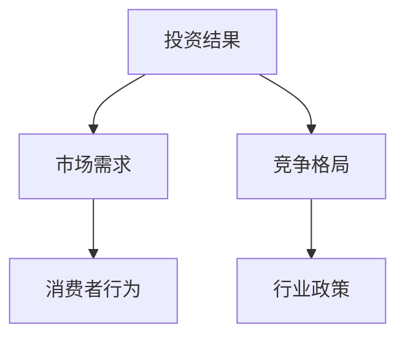
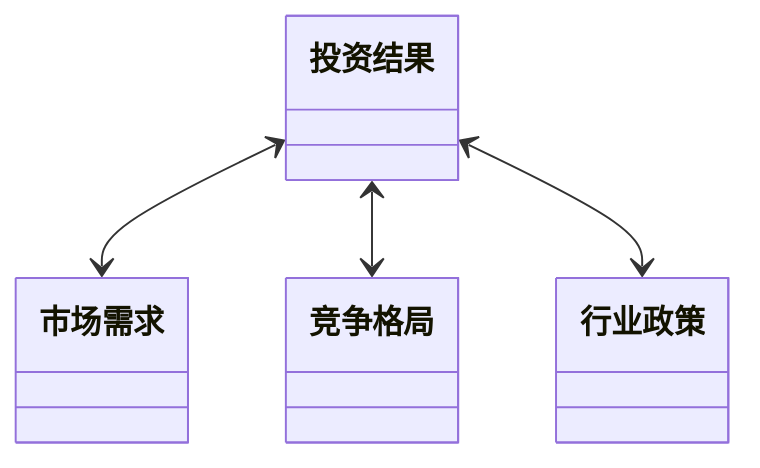
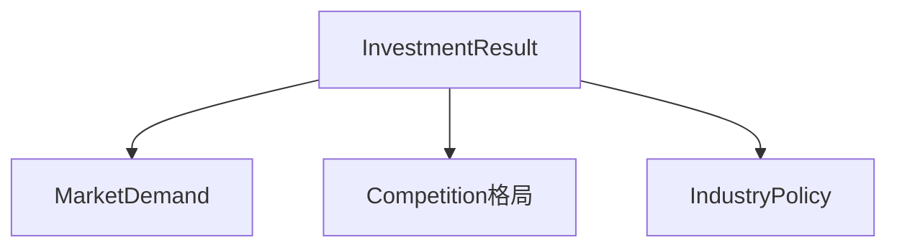

                 


# 芒格的"关键变量"识别：找出决定投资成败的核心因素

---

## 关键词：
- 芒格
- 关键变量
- 投资分析
- 层次分析法
- 系统架构
- 数学模型

---

## 摘要：
芒格的“关键变量”识别方法是一种通过分析投资中的核心因素来做出决策的策略。本文将从背景介绍、核心概念、算法原理、系统分析、项目实战和最佳实践等多个方面，详细探讨如何识别和应用关键变量。通过层次分析法（AHP）和系统架构设计，结合实际案例分析，帮助读者掌握关键变量识别的技巧，从而在投资决策中做出更明智的选择。

---

## 第一章：关键变量识别的背景与重要性

### 1.1 关键变量的定义与背景
#### 1.1.1 关键变量的定义
关键变量是指在复杂系统中对结果产生决定性影响的因素。在投资领域，关键变量识别是通过分析影响投资结果的核心因素，从而制定更有效的决策策略。

#### 1.1.2 关键变量的背景
关键变量识别起源于20世纪60年代的行为决策理论，后来在投资领域得到广泛应用。芒格的“关键变量”识别方法结合了行为心理学和经济学理论，强调通过简化问题来抓住核心因素。

#### 1.1.3 关键变量的重要性
在投资决策中，关键变量识别可以帮助投资者避免被大量信息干扰，专注于影响结果的核心因素，从而提高决策的准确性和效率。

---

### 1.2 芒格的“关键变量”识别思想
#### 1.2.1 芒格的投资哲学
芒格认为，投资不仅仅是对市场的分析，更是对人性的洞察。关键变量识别是通过简化问题，抓住核心因素，从而做出更理性的决策。

#### 1.2.2 芒格的关键变量识别方法
芒格提出，投资者应关注那些对投资结果产生最大影响的变量，例如市场需求、竞争格局、公司财务状况等。

#### 1.2.3 芒格方法的核心要素
- **核心变量识别**：找出影响投资结果的关键因素。
- **简化问题**：通过聚焦核心变量，降低决策复杂性。
- **长期视角**：关注长期趋势，而非短期波动。

---

## 第二章：关键变量识别的核心概念与应用

### 2.1 关键变量识别的核心概念
#### 2.1.1 变量分类
在关键变量识别中，变量可以分为：
- **独立变量**：影响结果的因素。
- **依赖变量**：结果本身。
- **中间变量**：连接独立变量和依赖变量的桥梁。

#### 2.1.2 关键变量的特征
- **影响力强**：对结果有显著影响。
- **可测量性**：能够量化或观察到。
- **稳定性**：在一定时间内相对稳定。

#### 2.1.3 关键变量与投资结果的关系
关键变量是投资结果的主要驱动因素，通过分析这些变量，投资者可以预测市场趋势和公司表现。

---

### 2.2 关键变量识别的理论基础
#### 2.2.1 投资决策的变量分析框架
投资决策可以分解为多个变量的综合影响，关键变量识别通过筛选这些变量，找到最具影响力的因素。

#### 2.2.2 芒格的“关键变量”识别方法
芒格的方法强调通过逻辑推理和经验判断，识别出对投资结果有决定性影响的变量。

#### 2.2.3 关键变量识别的数学模型
关键变量识别的数学模型通常基于层次分析法（AHP），通过权重分配来量化各变量的影响程度。

---

## 第三章：关键变量识别的算法原理与数学模型

### 3.1 层次分析法（AHP）的原理
#### 3.1.1 层次分析法的基本概念
层次分析法是一种用于结构化决策问题的工具，通过构建层次结构，分析各变量的权重。

#### 3.1.2 层次分析法的步骤
1. 构建层次结构。
2. 确定各变量的权重。
3. 计算一致性检验。
4. 得出最终权重。

#### 3.1.3 层次分析法的优缺点
- **优点**：结构清晰，易于理解。
- **缺点**：依赖主观判断，可能存在偏差。

#### 3.1.4 用mermaid表示层次分析法的流程


---

### 3.2 关键变量识别的数学模型
#### 3.2.1 权重计算公式
关键变量的权重计算公式如下：
$$ w_i = \frac{a_{i1} + a_{i2} + ... + a_{in}}{n} $$
其中，$w_i$ 表示第 $i$ 个变量的权重，$a_{ij}$ 表示第 $i$ 个变量在第 $j$ 个层次中的权重。

#### 3.2.2 判断矩阵的构建
关键变量识别的判断矩阵如下：
$$
\begin{matrix}
& A & B & C \\
\hline
A & 1 & 3 & 2 \\
B & 1/3 & 1 & 4 \\
C & 1/2 & 1/4 & 1 \\
\end{matrix}
$$

---

## 第四章：关键变量识别的系统分析与架构设计

### 4.1 问题场景介绍
假设我们正在分析一个行业的投资机会，需要识别出影响该行业投资结果的关键变量。

### 4.2 系统功能设计
#### 4.2.1 领域模型构建
通过mermaid绘制领域模型：


#### 4.2.2 系统架构设计
通过mermaid绘制系统架构图：


---

## 第五章：关键变量识别的项目实战

### 5.1 项目环境与工具安装
#### 5.1.1 环境要求
- 操作系统：Windows/Mac/Linux
- 工具：Python、Jupyter Notebook、Mermaid

### 5.2 核心代码实现
#### 5.2.1 关键变量识别的代码实现
```python
import numpy as np

def calculate_weights(matrix):
    n = len(matrix)
    total = np.sum(matrix, axis=1)
    weights = [total[i]/np.sum(total) for i in range(n)]
    return weights

# 示例判断矩阵
matrix = np.array([
    [1, 3, 2],
    [1/3, 1, 4],
    [1/2, 1/4, 1]
])

weights = calculate_weights(matrix)
print("变量权重为:", weights)
```

#### 5.2.2 代码解读与分析
上述代码通过计算判断矩阵的权重，实现关键变量识别。权重越高的变量对投资结果的影响越大。

---

## 第六章：关键变量识别的最佳实践

### 6.1 小结
关键变量识别是投资决策中的重要工具，通过层次分析法和系统架构设计，可以帮助投资者聚焦核心因素，做出更明智的决策。

### 6.2 注意事项
- 确保变量的准确性和完整性。
- 定期更新变量权重，以适应市场变化。
- 结合实际经验，避免过度依赖模型。

### 6.3 拓展阅读
- 《芒格的投资思想》
- 《层次分析法的实践与应用》

---

## 附录：工具与资源

### 附录A：关键变量识别工具包下载
提供Python实现的关键变量识别工具包，包括层次分析法的代码示例。

### 附录B：推荐书籍
- 《芒格的智慧：投资决策的艺术》
- 《系统思维与决策优化》

---

## 作者：AI天才研究院 & 禅与计算机程序设计艺术

---

通过以上结构，我们可以系统地了解芒格的“关键变量”识别方法，并通过实际案例和代码实现，掌握关键变量识别的核心技巧。

