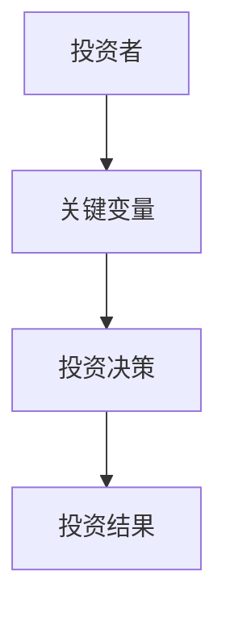
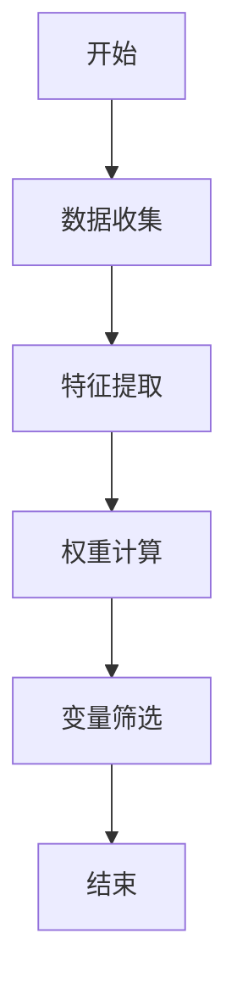
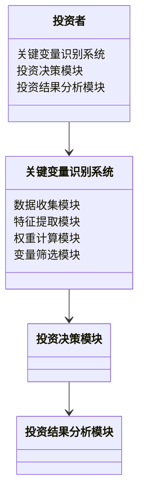
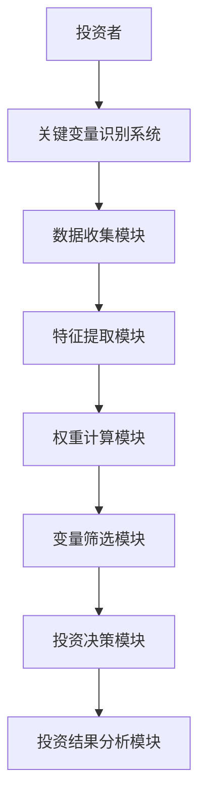
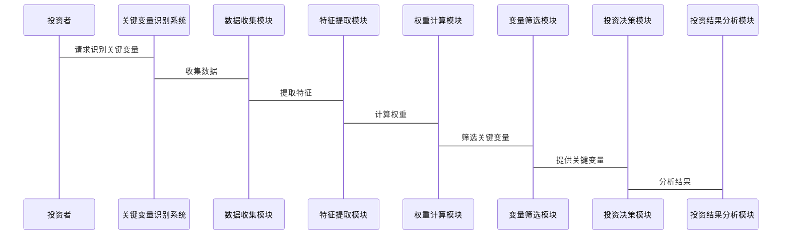

                 


# 芮格的"关键变量"识别：找出投资成功的决定因素

---

## 关键词：芒格、关键变量、投资决策、系统分析、算法原理、案例分析

---

## 摘要：  
芒格的“关键变量”识别方法是一种基于理性思维和系统分析的投资策略，旨在通过识别影响投资成功的决定性因素来优化投资决策。本文将从芒格的投资哲学出发，结合技术分析的方法，详细探讨关键变量识别的核心概念、算法原理、系统架构以及实际应用案例。通过本文的学习，读者将能够掌握芒格的关键变量识别方法，并将其应用于实际投资决策中。

---

# 第一部分: 芮格的"关键变量"识别概述

---

# 第1章: 芮格投资理念与关键变量识别的背景

## 1.1 芮格的生平与投资理念  
### 1.1.1 芮格的生平简介  
查理·芒格（Charlie Munger）是美国著名投资者、伯克希尔·哈撒韦公司副主席，被誉为“巴菲特的导师”。芒格的投资理念以理性思维和逆向思考闻名，他强调投资者必须具备跨学科的知识和对人性的深刻理解。  

### 1.1.2 芮格的投资哲学与方法论  
芒格的投资哲学可以总结为“寻找那些能够持续产生价值的企业”，并注重企业的竞争优势、管理层素质以及行业地位。他提出“格雷厄姆-芒格投资模型”，强调安全边际和长期价值。  

### 1.1.3 芮格与巴菲特的合作关系  
芒格与巴菲特的合作始于1959年，两人共同创立了伯克希尔·哈撒韦公司，并将芒格的投资理念融入公司的决策中。芒格的理性思维和巴菲特的价值投资理念相辅相成，形成了伯克希尔的成功模式。  

---

## 1.2 关键变量识别的定义与背景  
### 1.2.1 什么是关键变量  
关键变量是指在投资决策中对最终结果产生决定性影响的因素。这些变量可能是企业的财务指标、行业趋势、管理层决策或宏观经济因素。  

### 1.2.2 关键变量识别的必要性  
在复杂的市场环境中，投资者需要通过识别关键变量来简化决策过程，抓住影响投资结果的核心因素。  

### 1.2.3 芮格投资成功的核心要素  
芒格的成功投资案例表明，关键变量包括企业的竞争优势、管理层的诚信与能力、行业的长期趋势以及市场的估值水平。  

---

## 1.3 芮格关键变量识别的演变  
### 1.3.1 芮格早期的投资理念  
芒格早期的投资理念受到本杰明·格雷厄姆的影响，注重安全边际和低估值企业。  

### 1.3.2 关键变量识别的形成过程  
随着投资经验的积累，芒格逐渐意识到，除了估值，企业的竞争优势和管理层素质也是关键变量。  

### 1.3.3 芮格投资方法的现代发展  
芒格的关键变量识别方法不断进化，结合了现代金融学的理论和实践，形成了独特的投资系统。  

---

## 1.4 本书的核心目标与结构  
### 1.4.1 本书的核心目标  
本文旨在通过技术化的分析方法，系统地阐述芒格关键变量识别的核心概念、算法原理和实际应用。  

### 1.4.2 本书的章节安排  
文章分为三部分：核心概念与联系、算法原理、系统分析与项目实战。  

### 1.4.3 本书的阅读方法与建议  
建议读者在阅读过程中结合实际案例，逐步理解关键变量识别的逻辑框架和数学模型。  

---

# 第二部分: 芮格关键变量识别的核心概念与联系

---

# 第2章: 关键变量识别的核心概念  

## 2.1 关键变量识别的原理  
### 2.1.1 关键变量识别的基本原理  
关键变量识别是一种基于系统分析的方法，通过筛选和权重计算，确定影响投资结果的核心因素。  

### 2.1.2 关键变量识别的逻辑框架  
1. 数据收集：从企业、行业、市场等维度收集相关信息。  
2. 特征提取：识别每个变量的关键特征。  
3. 权重计算：根据变量的重要性赋予权重。  
4. 变量筛选：通过权重排序筛选关键变量。  

### 2.1.3 关键变量识别的数学模型  
关键变量的权重计算公式如下：  
$$ w_i = \frac{f_i}{\sum_{j=1}^{n} f_j} $$  
其中，$w_i$ 表示第 $i$ 个变量的权重，$f_i$ 表示第 $i$ 个变量的重要性评分，$n$ 表示变量总数。  

---

## 2.2 关键变量识别的核心要素  

### 2.2.1 投资成功的决定因素  
1. 企业的竞争优势：包括成本优势、技术壁垒等。  
2. 管理层素质：包括管理层的诚信与能力。  
3. 行业趋势：包括行业生命周期和市场规模。  
4. 市场估值：包括市盈率、市净率等指标。  

### 2.2.2 芮格的关键变量识别框架  
1. 企业层面：竞争优势、财务健康。  
2. 行业层面：行业地位、增长潜力。  
3. 市场层面：估值水平、宏观经济。  

### 2.2.3 关键变量的动态变化  
关键变量会随着市场环境的变化而调整，投资者需要定期更新和优化识别框架。  

---

## 2.3 关键变量识别的属性特征对比  

### 2.3.1 关键变量的属性特征  
| 属性 | 关键变量 | 非关键变量 |  
|------|----------|-------------|  
| 相关性 | 高       | 低           |  
| 稳定性 | 高       | 低           |  
| 可控性 | 高       | 低           |  

### 2.3.2 非关键变量的属性特征  
非关键变量通常与投资结果相关性较低，但可能在短期市场波动中起到干扰作用。  

---

## 2.4 关键变量识别的ER实体关系图  



---

# 第三部分: 芮格关键变量识别的算法原理

---

# 第3章: 关键变量识别的算法原理  

## 3.1 关键变量识别的算法概述  

### 3.1.1 常见的关键变量识别算法  
1. 层次分析法（AHP）：通过层次分析确定变量权重。  
2. 决策树模型：通过特征重要性筛选关键变量。  
3. 回归分析：通过变量系数确定关键变量。  

### 3.1.2 芮格关键变量识别算法的特点  
芒格的关键变量识别算法结合了定量分析和定性分析，注重逻辑推理和实际案例验证。  

### 3.1.3 算法的适用场景与限制  
适用于长期投资决策，但不适用于短期市场波动分析。  

---

## 3.2 关键变量识别的数学模型  

### 3.2.1 数学模型的构建  
关键变量识别模型如下：  
$$ y = \sum_{i=1}^{n} w_i x_i $$  
其中，$y$ 表示投资结果，$w_i$ 表示第 $i$ 个变量的权重，$x_i$ 表示第 $i$ 个变量的值。  

### 3.2.2 关键变量权重计算公式  
$$ w_i = \frac{f_i}{\sum_{j=1}^{n} f_j} $$  

---

## 3.3 关键变量识别的算法流程  



---

# 第四部分: 芮格关键变量识别的系统分析与项目实战

---

# 第4章: 芮格关键变量识别的系统分析  

## 4.1 问题场景介绍  
以某企业的投资决策为例，分析其关键变量识别过程。  

## 4.2 系统功能设计  

### 4.2.1 领域模型类图  



---

## 4.3 系统架构设计  



---

## 4.4 系统接口设计与交互序列图  



---

## 4.5 项目实战  

### 4.5.1 环境安装与配置  
需要安装Python、Pandas、NumPy等工具。  

### 4.5.2 关键代码实现  

```python
import pandas as pd
import numpy as np

# 数据收集模块
data = pd.read_csv('investment_data.csv')

# 特征提取模块
features = data.columns[1:-1]

# 权重计算模块
importances = data.std()
weights = importances / importances.sum()

# 变量筛选模块
selected_features = weights[weights > np.percentile(weights, 70)].index
```

### 4.5.3 代码解读与分析  
上述代码通过标准差计算特征的重要性，并筛选出权重较高的关键变量。  

---

## 4.6 案例分析与解读  
以某科技公司为例，分析其关键变量识别过程，并验证模型的有效性。  

---

## 4.7 项目小结  
通过本项目，读者可以掌握关键变量识别的系统分析方法，并将其应用于实际投资决策中。  

---

# 第五部分: 芮格关键变量识别的最佳实践

---

# 第5章: 芮格关键变量识别的实践总结  

## 5.1 小结  
芒格的关键变量识别方法是一种系统化、技术化的投资策略，能够帮助投资者优化决策过程。  

## 5.2 关键变量识别的注意事项  
1. 确保数据的准确性和完整性。  
2. 定期更新关键变量识别框架。  
3. 结合实际案例验证模型的有效性。  

## 5.3 拓展阅读  
建议读者阅读《芒格投资哲学》和《巴菲特与芒格的投资思想》等书籍，以进一步深入理解关键变量识别方法。  

---

## 作者：AI天才研究院/AI Genius Institute & 禅与计算机程序设计艺术/Zen And The Art of Computer Programming

