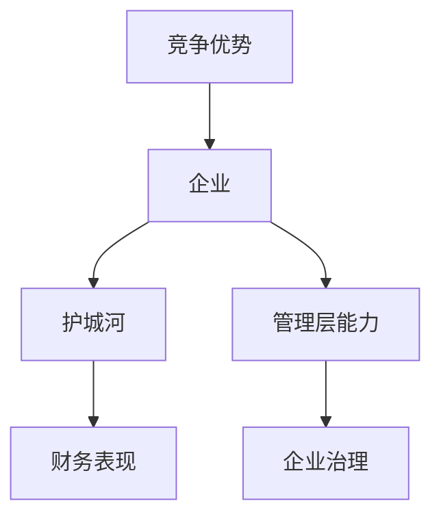
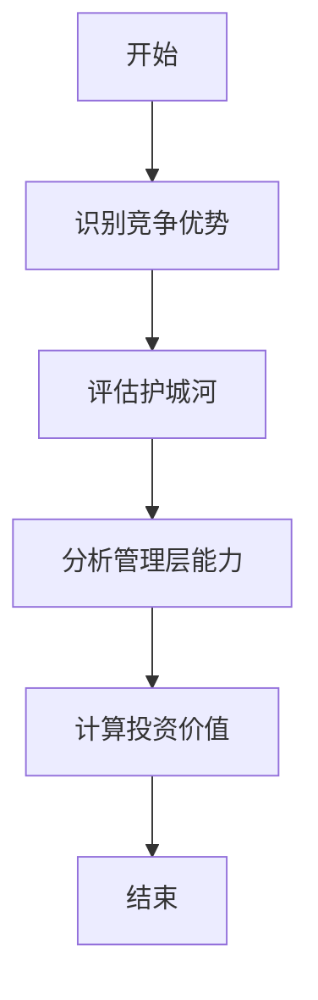
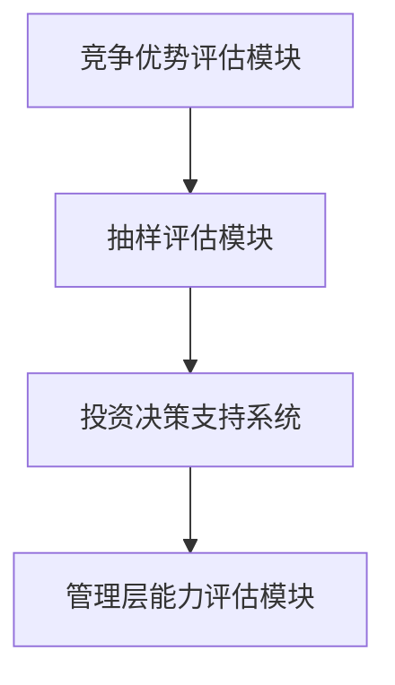

                 


# 芒格的"关键少数"原则在科技独角兽投资中的应用

---

## 关键词：
- 芒格投资原则
- 关键少数
- 科技独角兽
- 企业竞争优势
-抽样评估模型

---

## 摘要：
本文探讨了芒格的“关键少数”原则在科技独角兽投资中的应用，通过分析竞争优势、护城河、管理层能力等关键要素，构建了一个基于概率的抽样评估模型，帮助投资者识别具有长期投资价值的科技独角兽。文章结合理论与实践，提供了详细的系统设计和案例分析，为科技投资提供了新视角。

---

# 第一部分：芒格的"关键少数"原则概述

## 第1章：芒格的"关键少数"原则

### 1.1 "关键少数"原则的定义与核心理念

#### 1.1.1 "关键少数"原则的起源与发展
芒格的“关键少数”原则源于其投资哲学，强调关注那些在特定领域具有竞争优势的企业。这一原则通过“lollipops”策略，帮助投资者筛选出具有长期增长潜力的企业。本文将这一原则延伸至科技独角兽的投资领域。

#### 1.1.2 "关键少数"原则的核心要素
- **竞争优势**：企业必须在其所在领域具备独特的竞争优势，如技术壁垒、成本优势或品牌影响力。
- **护城河**：企业需要构建可持续的竞争优势，防止竞争对手侵蚀其市场份额。
- **管理层能力**：优秀的管理层能够将企业竞争优势转化为实际收益。
- **财务健康**：健康的财务状况是企业长期发展的基础。

#### 1.1.3 "关键少数"原则在投资中的应用
通过筛选具备上述要素的企业，投资者可以降低投资风险，提高投资回报率。本文将重点分析这些要素在科技独角兽投资中的具体应用。

---

## 第2章：芒格"关键少数"原则的核心概念与联系

### 2.1 核心概念原理

#### 2.1.1 企业竞争优势的数学模型
竞争优势可以通过以下公式进行量化评估：
$$
\text{竞争优势} = \sum_{i=1}^{n} w_i \cdot f_i
$$
其中，\(w_i\) 是第\(i\)个因素的权重，\(f_i\) 是第\(i\)个因素的评估值。

#### 2.1.2 护城河的构建与量化评估
护城河的深度可以通过以下步骤进行评估：
1. 识别企业的核心竞争力。
2. 分析竞争对手的模仿难度。
3. 量化护城河的经济价值。

#### 2.1.3 企业治理与管理层评估
企业治理的健康性可以通过管理层的稳定性、决策效率和股东权益保护机制来评估。

### 2.2 核心概念对比表格

| **核心概念** | **竞争优势** | **护城河** | **管理层能力** |
|--------------|---------------|------------|----------------|
| **定义**     | 企业的独特优势 | 防御竞争的屏障 | 管理层的决策能力 | 
| **评估指标** | 市场份额、利润率 | 技术壁垒、品牌影响力 | CEO过往业绩、团队稳定性 | 

### 2.3 实体关系图（ER图）



---

## 第3章：芒格"关键少数"原则的算法原理

### 3.1 算法原理概述

#### 3.1.1 竞争优势评估流程图


#### 3.1.2抽样评估模型

抽样评估模型通过以下步骤筛选企业：
1. 确定抽样范围：从科技独角兽中抽取样本企业。
2. 计算竞争优势指数：利用加权平均法计算每家企业的竞争优势指数。
3. 筛选优质企业：根据设定的阈值筛选出竞争优势指数高于阈值的企业。

---

## 第4章：科技独角兽的核心竞争力分析

### 4.1 科技独角兽的核心竞争力

#### 4.1.1 技术壁垒
企业的技术优势决定了其在行业中的地位，是护城河的重要组成部分。

#### 4.1.2 商业模式创新
独特的商业模式能够为企业带来持续的利润增长。

#### 4.1.3 用户粘性
高用户粘性的企业能够通过用户忠诚度获得长期竞争优势。

#### 4.1.4 数据优势
数据的积累和处理能力是科技企业竞争力的重要源泉。

---

## 第5章：系统设计与架构

### 5.1 系统功能设计

#### 5.1.1 竞争优势评估模块
- 输入：企业的各项指标数据。
- 输出：竞争优势指数。

#### 5.1.2抽样评估模块
- 输入：样本企业数据。
- 输出：优质企业列表。

### 5.2 系统架构设计



---

## 第6章：项目实战与案例分析

### 6.1 项目环境安装与配置

```bash
pip install numpy pandas matplotlib
```

### 6.2 核心代码实现

```python
import numpy as np
import pandas as pd

def calculate_competitive_edge(factors):
    return np.dot(factors['权重'].values, factors['评估值'].values)

# 示例数据
data = {
    '因素': ['技术壁垒', '护城河', '管理层能力'],
    '权重': [0.4, 0.3, 0.3],
    '评估值': [0.8, 0.7, 0.8]
}
df = pd.DataFrame(data)
ce = calculate_competitive_edge(df)
print(f"竞争优势指数：{ce}")
```

---

## 第7章：总结与展望

芒格的“关键少数”原则为科技独角兽的投资提供了重要的理论基础。通过构建竞争优势评估模型和抽样评估系统，投资者可以更科学地筛选出具有长期投资价值的企业。未来的研究可以进一步优化评估模型，结合更多因素进行分析，以提高评估的准确性和全面性。

---

## 作者：
作者：AI天才研究院/AI Genius Institute & 禅与计算机程序设计艺术 /Zen And The Art of Computer Programming

