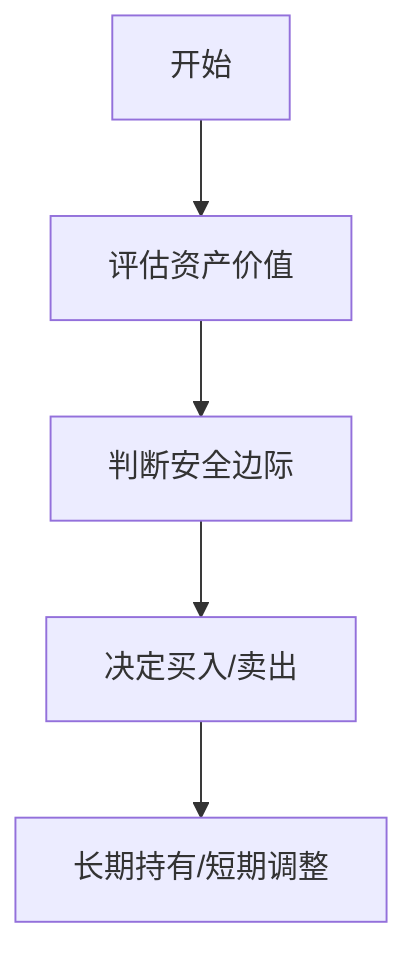
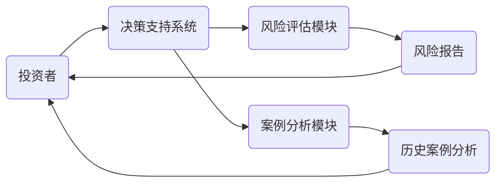

                 


# 芒格的"别觉得自己太聪明"原则：保持谦逊

---

## 关键词：芒格，投资原则，谦逊，风险管理，决策模型

---

## 摘要：  
芒格的“别觉得自己太聪明”原则是一种强调谦逊、风险管理与安全边际的投资理念。本文从芒格的生平、投资哲学入手，深入解析这一原则的核心概念、算法原理、系统架构及实际应用，帮助读者更好地理解如何在复杂决策中保持谦逊与理性。

---

## 第一部分: 芒格的"别觉得自己太聪明"原则概述

### 第1章: 芒格的生平与投资理念

#### 1.1 芒格的生平简介  
查理·芒格（Charlie Munger）是世界著名投资家、作家和演讲家，以多元思维模型和价值投资理念闻名。他早年毕业于密歇根大学法学院，后加入巴菲特的合伙公司，逐步成为伯克希尔哈撒韦公司的副主席。芒格的哲学思想深受导师霍兰·帕顿的影响，注重跨学科思考和风险管理。

#### 1.2 芒格的投资理念  
芒格的投资理念强调安全边际、长期主义和价值投资。他主张以合理的价格买入具有持续竞争优势的公司，并长期持有。芒格认为，投资的核心是找到那些具有坚固“护城河”的企业，避免过度依赖市场波动进行短期交易。

#### 1.3 "别觉得自己太聪明"原则的提出背景  
“别觉得自己太聪明”原则源于芒格对人性弱点的深刻理解。他认为，投资者容易陷入过度自信的陷阱，忽视潜在风险。这一原则提醒投资者保持谦逊，承认自身的知识局限，并在决策中引入安全边际概念，以降低风险敞口。

---

## 第二部分: "别觉得自己太聪明"原则的核心概念

### 第2章: 芒格原则的核心概念解析

#### 2.1 "别觉得自己太聪明"的定义与特点  
- **定义**：芒格原则强调在投资决策中保持谦逊，避免过度自信，注重风险管理。
- **特点**：
  - 强调安全边际：买入价格远低于内在价值的资产。
  - 长期视角：关注企业的长期竞争优势，而非短期市场波动。
  - 跨学科思维：结合心理学、经济学、数学等多学科知识进行决策。

#### 2.2 芒格原则的核心要素  
- **谦逊与开放的心态**：承认自身知识的局限性，虚心接受反馈。
- **风险意识与安全边际**：在投资中留有余地，避免过度杠杆和集中投资。
- **复杂决策中的简单化思维**：通过简化问题，降低决策复杂性，避免过度自信。

#### 2.3 芒格原则与其他投资原则的对比  
以下是芒格原则与其他投资原则的对比分析：

| 原则 | 投资哲学 | 关注点 | 决策方式 |
|------|----------|--------|----------|
| 芒格原则 | 价值投资 | 安全边际、长期竞争优势 | 谦逊、风险管理 |
| 技术分析 | 市场波动 | 技术指标、价格形态 | 短期交易、市场预测 |
| 基本分析 | 公司基本面 | 财务报表、估值指标 | 长期持有、基本面分析 |

---

## 第三部分: 芒格原则的算法原理与数学模型

### 第3章: 芒格原则的算法原理

#### 3.1 芒格原则的决策模型  
芒格原则的决策模型基于概率论和风险评估，以下是其决策树的mermaid流程图：



#### 3.2 芒格原则的数学公式  
- **概率计算公式**：
  - 投资成功的概率：$$ P(\text{成功}) = \sum_{i=1}^{n} P(\text{成功}|路径i) \times P(路径i) $$
- **风险评估公式**：
  - 风险敞口：$$ R = \sum_{i=1}^{n} L_i \times P(i) $$
  - 其中，\( L_i \) 是第 \( i \) 种情况下的损失，\( P(i) \) 是该情况发生的概率。

---

## 第四部分: 芒格原则的系统分析与架构设计

### 第4章: 芒格原则的系统架构

#### 4.1 芒格原则的系统功能设计  
- **决策支持系统**：帮助投资者评估资产价值和安全边际。
- **风险评估模块**：计算投资组合的风险敞口。
- **案例分析模块**：提供历史案例供投资者参考。

#### 4.2 芒格原则的系统架构图  
以下是系统架构的mermaid流程图：



---

## 第五部分: 芒格原则的项目实战

### 第5章: 芒格原则的实际应用案例

#### 5.1 芒格原则在投资决策中的应用  
- **股票筛选**：选择具有强大护城河的公司，如苹果、可口可乐等。
- **股票估值**：计算合理估值，避免高估或低估。
- **风险管理**：分散投资，控制单个资产的风险敞口。

#### 5.2 芒格原则的Python代码实现  
以下是一个简单的Python代码示例，用于计算投资组合的风险敞口：

```python
import numpy as np

def calculate_risk(weights, returns):
    # 计算投资组合的期望收益
    expected_return = np.dot(weights, returns)
    # 计算投资组合的风险（标准差）
    covariance_matrix = np.cov(returns.T)
    variance = np.dot(weights.T, np.dot(covariance_matrix, weights))
    risk = np.sqrt(variance)
    return expected_return, risk

# 示例数据
weights = [0.4, 0.4, 0.2]
returns = [0.1, 0.2, 0.15]

expected_return, risk = calculate_risk(weights, returns)
print(f"期望收益: {expected_return}")
print(f"风险敞口: {risk}")
```

---

## 第六部分: 芒格原则的最佳实践与小结

### 第6章: 芒格原则的最佳实践

#### 6.1 芒格原则的小结  
- 芒格原则的核心思想是保持谦逊，注重风险管理与安全边际。
- 在实际投资中，投资者应避免过度自信，注重长期竞争优势。

#### 6.2 注意事项  
- **避免集中投资**：分散投资以降低风险。
- **长期持有**：选择具有强大护城河的企业。
- **持续学习**：保持对市场和企业的深刻理解。

#### 6.3 拓展阅读  
- 《聪明的投资者》——本杰明·格雷厄姆
- 《巴菲特和芒格的智慧》——彼得·格鲁克

---

## 结语  
芒格的“别觉得自己太聪明”原则提醒我们，在投资和生活中都要保持谦逊与理性。通过本文的深入分析，我们希望读者能够更好地理解这一原则，并在实际决策中灵活运用。

---

## 作者：AI天才研究院/AI Genius Institute & 禅与计算机程序设计艺术 /Zen And The Art of Computer Programming

