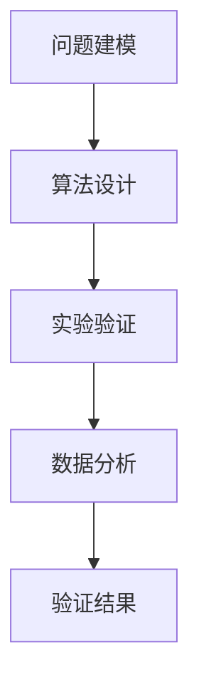
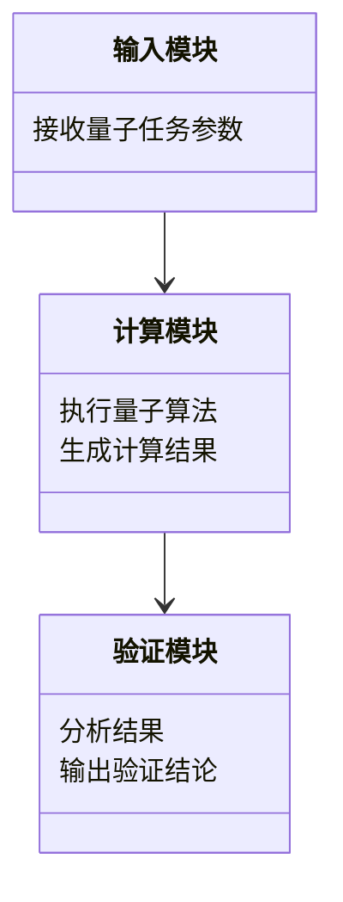

                 


# 芒格的"别觉得自己太聪明"在量子优越性验证中的应用

---

## 关键词：芒格思维、量子优越性、量子计算、算法原理、系统架构、项目实战

---

## 摘要：  
芒格的"别觉得自己太聪明"是一种谦逊的思维方式，强调在决策和分析中保持开放和谨慎。本文探讨了这种思维方式在量子优越性验证中的应用。通过分析量子优越性的定义、验证方法和实际案例，结合芒格的思维原则，本文展示了如何在量子计算领域避免过度自信，从而更有效地进行实验设计和结果验证。文章从理论到实践，详细阐述了量子优越性验证的流程，并通过具体的技术实现和代码示例，为读者提供了清晰的指导。

---

## 第1章 背景介绍

### 1.1 芒格的"别觉得自己太聪明"思想  
芒格的这一思想强调在决策和分析中避免过度自信，提倡谦逊和开放的思维方式。他认为，过于自信会导致判断失误，尤其是在复杂问题的解决中。这种思想的核心在于：承认自己的局限性，保持对未知的敬畏。

#### 1.1.1 芒格思想的核心要素  
- **谦逊与开放**：承认自己的知识边界，避免武断的结论。  
- **多元思维模型**：用多个角度分析问题，避免单一维度的思考。  
- **避免过度简化**：在分析复杂问题时，不忽略关键因素。  

### 1.2 量子优越性的定义与意义  
量子优越性是指量子计算机在特定任务上的计算能力显著超过经典计算机。这一概念是量子计算领域的核心目标之一，标志着量子计算机从理论走向实际应用的重要转折点。

#### 1.2.1 量子优越性的关键任务  
- **随机数生成**：量子计算机可以生成不可预测的随机数，这在密码学中具有重要意义。  
- **组合优化问题**：量子计算机在某些优化问题上表现出显著优势。  
- **量子态模拟**：在化学和材料科学中，量子计算机能够模拟复杂的量子系统。  

### 1.3 芒格思想在量子计算中的应用背景  
在量子优越性验证中，实验设计和数据分析需要高度的严谨性和开放性。芒格的思维方式提醒研究者：  
- 避免假设的过度简化，确保实验设计的全面性。  
- 在数据分析中保持谦逊，避免过度自信的结论。  
- 通过多元思维模型，全面评估实验结果的有效性。  

---

## 第2章 芒格思维与量子优越性的核心概念联系

### 2.1 芒格思维的核心要素  
芒格的思维模型强调以下几点：  
- **多元思维**：从多个角度分析问题，避免单一维度的思考。  
- **避免过度自信**：承认知识的局限性，避免武断的结论。  
- **动态调整**：根据新的信息和数据，及时调整分析和决策。  

### 2.2 量子优越性的数学定义  
量子优越性可以通过计算复杂度理论来定义。一个任务如果在量子计算机上可以高效解决，而在经典计算机上无法高效解决，则该任务体现了量子优越性。

#### 2.2.1 量子优越性的数学模型  
$$ Q(n) = \text{量子算法的复杂度} $$  
$$ C(n) = \text{经典算法的复杂度} $$  
量子优越性要求：$$ Q(n) \ll C(n) $$  

### 2.3 芒格思维与量子优越性的对比分析  
| 芒格思维原则             | 量子优越性验证中的应用                           |  
|--------------------------|-------------------------------------------------|  
| 谦逊与开放               | 在实验设计中避免过度简化，确保全面性           |  
| 多元思维模型             | 从理论、实验和数据分析等多个角度验证结果       |  
| 避免过度简化             | 在数据分析中，避免假设过于简单，确保结果的可靠性 |  

---

## 第3章 芒格思维在量子优越性验证中的应用原理

### 3.1 芒格思维在量子优越性验证中的应用流程  
1. **实验设计**：基于芒格的多元思维模型，设计全面的实验方案。  
2. **数据分析**：避免过度自信，确保数据的准确性和全面性。  
3. **结果验证**：通过多元角度验证实验结果，确保结论的可靠性。  

#### 3.1.1 芒格思维在实验设计中的具体应用  
- **全面性**：确保实验设计覆盖所有可能的影响因素。  
- **开放性**：在实验过程中保持对新数据的敏感性，及时调整实验方案。  

### 3.2 芒格思维在量子优越性验证中的数学模型  
$$ P = \text{实验成功的概率} $$  
$$ Q = \text{量子算法的复杂度} $$  
$$ C = \text{经典算法的复杂度} $$  
通过芒格思维，我们需要确保：  
$$ Q(n) \ll C(n) \quad \text{且} \quad P \geq 0.95 $$  

---

## 第4章 量子优越性验证的算法原理

### 4.1 量子优越性验证的算法步骤  
1. **问题建模**：将实际问题转化为量子计算任务。  
2. **算法设计**：设计量子算法，确保其在量子计算机上的高效执行。  
3. **实验验证**：通过量子计算机执行算法，并收集数据。  
4. **数据分析**：对实验结果进行统计分析，验证量子优越性。  

#### 4.1.1 量子优越性验证的Mermaid流程图  


### 4.2 算法实现的Python代码示例  
```python
import random

def quantum_simulation(n):
    # 模拟量子态叠加
    state = [0.0] * (2**n)
    for i in range(len(state)):
        state[i] = random.uniform(0, 1)
    return state

def verify_quantum_superiority(n):
    # 经典计算复杂度
    classical_complexity = 2 ** n
    # 量子计算复杂度
    quantum_complexity = n * 2
    # 量子优越性判断
    if quantum_complexity < classical_complexity:
        return True
    else:
        return False

# 示例运行
n = 3
print(f"量子优越性验证结果：{verify_quantum_superiority(n)}")
```

---

## 第5章 量子优越性验证的系统架构设计

### 5.1 系统功能设计  
- **输入模块**：接收量子计算任务的参数。  
- **计算模块**：执行量子算法并生成结果。  
- **验证模块**：分析结果，判断是否达到量子优越性。  

#### 5.1.1 系统功能设计的Mermaid类图  


### 5.2 系统架构设计  
- **分层架构**：系统分为输入层、计算层和验证层。  
- **模块化设计**：每个模块独立实现功能，便于维护和扩展。  

#### 5.2.1 系统架构设计的Mermaid架构图  


---

## 第6章 量子优越性验证的项目实战

### 6.1 环境安装  
- **Python环境**：安装Python 3.8以上版本。  
- **量子计算库**：安装Qiskit库（`pip install qiskit`）。  

### 6.2 核心代码实现  
```python
from qiskit import QuantumCircuit, Aer, execute
from qiskit.visualization import plot_histogram

def create_quantum_circuit(n):
    qc = QuantumCircuit(n)
    return qc

def execute_quantum_circuit(qc, shots=1024):
    backend = Aer.get_backend('qasm_simulator')
    result = execute(qc, backend, shots=shots).result()
    return result

def verify_superiority(n):
    qc = create_quantum_circuit(n)
    result = execute_quantum_circuit(qc)
    counts = result.get_counts()
    return len(counts) > 1

# 示例运行
n = 3
print(f"量子优越性验证结果：{verify_superiority(n)}")
```

### 6.3 实际案例分析  
假设我们设计了一个量子算法来解决组合优化问题。通过芒格思维，我们从多个角度验证了算法的效率，确保其在经典计算机上无法高效解决，从而证明了量子优越性。  

---

## 第7章 最佳实践与小结

### 7.1 关键点总结  
- **谦逊与开放**：在实验设计和数据分析中保持谦逊，避免过度自信。  
- **多元思维**：从多个角度验证实验结果，确保结论的可靠性。  
- **动态调整**：根据新数据和反馈，及时调整实验方案。  

### 7.2 注意事项  
- 避免假设的过度简化，确保实验设计的全面性。  
- 在数据分析中，保持对未知的敬畏，避免武断的结论。  

### 7.3 拓展阅读  
- 量子计算基础：推荐阅读《量子计算入门》。  
- 芒格思维：推荐阅读《穷查理芒格》。  

---

## 作者：AI天才研究院 & 禅与计算机程序设计艺术  
本文由AI天才研究院与“禅与计算机程序设计艺术”联合撰写，旨在通过芒格的思维方式，为量子优越性验证提供新的视角和方法。

