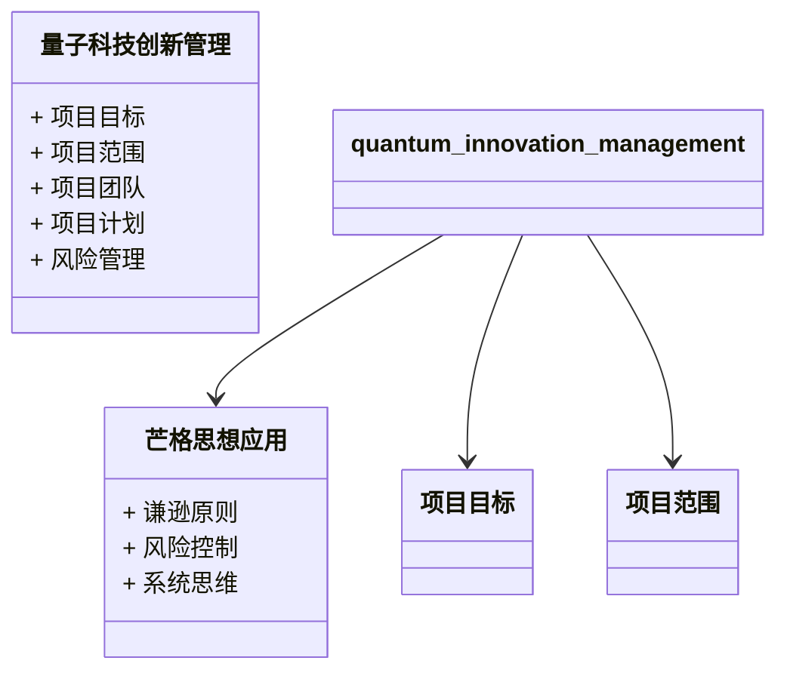
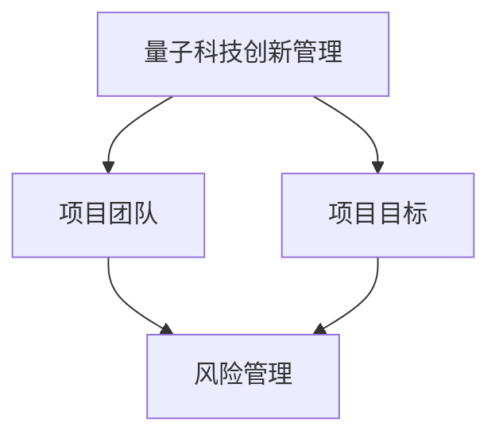
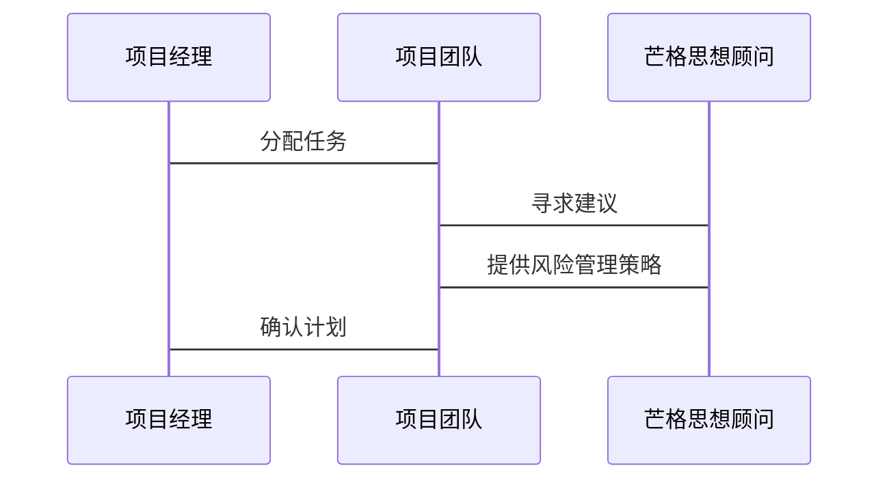

                 


```markdown
# 第一部分: 引言

# 第1章: 引言
## 1.1 书的背景与意义
### 1.1.1 量子科技的现状与发展
### 1.1.2 芒格思想的背景与重要性
### 1.1.3 本书的核心主题与目标

## 1.2 本书的结构与内容概述
### 1.2.1 目录概览
### 1.2.2 核心章节内容介绍
### 1.2.3 读者对象与学习方法

## 1.3 本章小结
### 1.3.1 核心概念回顾
### 1.3.2 本书的逻辑框架
### 1.3.3 学习本书的注意事项

# 第二部分: 芒格思想的背景与核心概念

# 第2章: 芒格的"别觉得自己太聪明"思想
## 2.1 芒格的投资哲学与智慧
### 2.1.1 芒格的投资理念
### 2.1.2 芒格的决策方法
### 2.1.3 芒格的"反脆弱"思想

## 2.2 "别觉得自己太聪明"的核心含义
### 2.2.1 过度自信的危害
### 2.2.2 谦逊与学习的重要性
### 2.2.3 知识的边界与不确定性

## 2.3 芒格思想与量子科技的联系
### 2.3.1 量子科技的特点与挑战
### 2.3.2 芒格思想在量子科技中的应用潜力
### 2.3.3 量子科技创新管理的核心问题

## 2.4 本章小结
### 2.4.1 芒格思想的核心要点
### 2.4.2 量子科技的创新管理需求
### 2.4.3 本书的创新点与价值

# 第三部分: 量子科技创新管理的理论基础

# 第3章: 量子科技的创新特点与挑战
## 3.1 量子科技的基本概念与技术特点
### 3.1.1 量子计算的基本原理
### 3.1.2 量子通信的核心技术
### 3.1.3 量子测量的特殊性

## 3.2 量子科技创新的管理难点
### 3.2.1 技术的不确定性
### 3.2.2 知识的局限性
### 3.2.3 创新过程的复杂性

## 3.3 管理量子科技创新的关键原则
### 3.3.1 知识的谦逊性
### 3.3.2 风险的可控性
### 3.3.3 创新过程的系统性

## 3.4 本章小结
### 3.4.1 量子科技的创新特点
### 3.4.2 管理量子科技的核心挑战
### 3.4.3 芒格思想的应用方向

# 第四部分: 系统分析与架构设计方案

# 第4章: 量子科技创新管理的系统分析
## 4.1 问题场景介绍
### 4.1.1 量子科技创新的复杂性
### 4.1.2 管理过程中的知识盲点
### 4.1.3 芒格思想的应用需求

## 4.2 项目介绍
### 4.2.1 项目目标
### 4.2.2 项目范围
### 4.2.3 项目团队构成

## 4.3 系统功能设计
### 4.3.1 领域模型设计


## 4.4 系统架构设计
### 4.4.1 系统架构图


## 4.5 系统接口设计
### 4.5.1 接口描述
### 4.5.2 接口交互流程

## 4.6 系统交互设计
### 4.6.1 交互流程图


## 4.7 本章小结
### 4.7.1 系统分析的核心要点
### 4.7.2 架构设计的关键要素
### 4.7.3 交互设计的重要性

# 第五部分: 项目实战

# 第5章: 项目实战
## 5.1 环境安装与配置
### 5.1.1 开发工具安装
### 5.1.2 量子计算库的安装与配置

## 5.2 系统核心实现
### 5.2.1 量子计算优化算法实现
### 5.2.2 量子通信安全协议实现

## 5.3 代码实现与解读
### 5.3.1 量子计算优化算法代码
```python
import numpy as np
from qiskit import QuantumCircuit, Aer, execute
from qiskit.visualization import plot_histogram

# 定义量子电路
qc = QuantumCircuit(2, 2)

# 应用 Hadamard 门到第一个 qubit
qc.h(0)

# 应用 CNOT 门，将第一个 qubit 的状态叠加到第二个 qubit
qc.cx(0, 1)

# 测量
qc.measure(0, 0)
qc.measure(1, 1)

# 模拟器执行
simulator = Aer.get_backend('qasm_simulator')
job = execute(qc, simulator)
result = job.result()

# 可视化结果
plot_histogram(result.get_counts())
```

## 5.4 代码分析与优化
### 5.4.1 代码功能分析
### 5.4.2 代码优化建议

## 5.5 案例分析与详细讲解
### 5.5.1 实际案例分析
### 5.5.2 详细讲解剖析

## 5.6 本章小结
### 5.6.1 项目实战的核心收获
### 5.6.2 芒格思想在项目管理中的应用效果
### 5.6.3 项目实施中的注意事项

# 第六部分: 总结与展望

# 第6章: 总结与展望
## 6.1 本书的核心内容回顾
### 6.1.1 芒格思想的核心理念
### 6.1.2 量子科技创新管理的关键点
### 6.1.3 系统分析与架构设计的重要性

## 6.2 未来的研究方向与发展趋势
### 6.2.1 量子科技的未来发展
### 6.2.2 芒格思想的进一步应用
### 6.2.3 量子科技创新管理的优化空间

## 6.3 本章小结
### 6.3.1 本书的主要收获
### 6.3.2 未来研究与实践的方向
### 6.3.3 对读者的建议与鼓励

# 附录
## 附录A: 相关术语解释
## 附录B: 参考文献
## 附录C: 代码仓库链接

# 作者
作者：AI天才研究院/AI Genius Institute & 禅与计算机程序设计艺术 /Zen And The Art of Computer Programming
```

