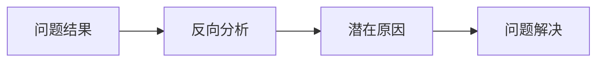
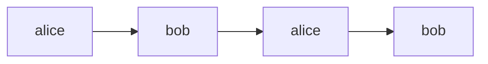

                 


# 芒格的"反向工程"思维在量子密码破解防御中的应用

> 关键词：芒格的反向工程思维，量子密码学，量子密码破解，量子密码防御，量子密码安全，反向思维应用

> 摘要：本文深入探讨了芒格的"反向工程"思维在量子密码学中的应用，特别是在量子密码破解和防御中的创新性应用。通过结合芒格的思维方式与量子密码学的前沿技术，提出了一种基于反向思维的量子密码防御体系，为量子密码的安全性评估和防御策略提供了新的视角。

---

## 第一部分: 芒格的"反向工程"思维与量子密码学基础

### 第1章: 芒格的"反向工程"思维概述

#### 1.1 芒格的"反向工程"思维的核心理念
反向工程思维是一种从结果出发，逆向推导问题本质的思维方式。其核心理念在于通过分析问题的输出或结果，推断其输入或原因，从而找到解决问题的关键路径。这种方法不同于传统的正向思维，它强调从“为什么”出发，而不是从“如何”开始。

**核心概念与联系：**
- **反向思维 vs 正向思维**：通过对比分析，反向思维在问题解决中的独特优势在于其能够在复杂系统中快速定位关键问题点。



#### 1.2 量子密码学基础
量子密码学是研究基于量子力学原理的密码学技术，其核心在于利用量子叠加和量子纠缠等特性，实现信息的安全传输和加密。

**核心概念与联系：**
- **量子态与叠加原理**：量子态是量子系统的基本描述，叠加原理允许一个量子系统同时处于多个状态的叠加态。
- **量子测量与纠缠态**：量子测量会破坏叠加态，而纠缠态则是量子系统中两个或多个粒子之间高度关联的状态。

### 第2章: 量子密码学的数学模型与算法原理

#### 2.1 量子密码学的数学基础
量子密码学的数学模型主要基于量子力学的基本原理，包括量子态的表示、量子操作的数学描述以及量子信息的编码与解码。

**算法原理：**
- **量子密钥分发（QKD）**：基于BB84协议的量子密钥分发是量子密码学中最经典的协议之一。其核心思想是通过量子态的传输和基的选择，确保通信双方能够共享一个安全的密钥。



#### 2.2 量子密码算法的分类与特点
量子密码算法主要分为两类：基于量子密钥分发（QKD）的协议和基于量子加密的算法。其中，BB84协议是最著名的QKD协议，而EPR对则是基于纠缠态的QKD协议。

**对比分析：**
| 协议类型 | 核心原理 | 安全性 | 实际应用 |
|----------|----------|--------|----------|
| BB84      | 基于偏振编码 | 高安全性 | 广泛应用于量子通信 |
| EPR对     | 基于纠缠态 | 高安全性 | 实验室环境 |

### 第3章: 芒格反向思维在量子密码破解中的应用

#### 3.1 反向工程思维在量子密码分析中的优势
反向工程思维在量子密码破解中的应用主要体现在以下几个方面：
1. **漏洞发现**：通过分析量子密码协议的输出结果，反向推导其潜在的漏洞。
2. **攻击策略制定**：基于反向思维，制定高效的量子密码攻击策略。

#### 3.2 基于反向思维的量子密码破解方法
通过反向工程思维，可以从量子密码协议的结果出发，推导出其潜在的密钥生成规律，从而实现对量子密码的破解。

**算法实现：**
```python
def reverse_engineer_quantum_cipher(ciphertext):
    # 假设密钥生成算法基于BB84协议
    # 通过反向分析，恢复密钥
    key = extract_key_from_ciphertext(ciphertext)
    return key
```

### 第4章: 量子密码防御体系的构建

#### 4.1 量子密码防御体系的设计原则
基于反向思维的防御体系设计原则包括：
1. **模块化设计**：将量子密码防御系统划分为多个模块，每个模块负责特定的防御功能。
2. **层次化设计**：从上至下构建防御体系，确保每个层次的安全性。

#### 4.2 基于反向思维的量子密码防御技术
通过反向思维，可以设计出高效的量子密码防御技术，例如基于反向思维的量子密钥分发协议优化和量子密码安全性评估。

### 第5章: 量子密码防御系统的架构与实现

#### 5.1 量子密码防御系统的整体架构
量子密码防御系统的整体架构包括以下几个模块：
1. **密钥生成模块**：基于反向思维优化的密钥生成算法。
2. **安全性评估模块**：通过反向分析评估系统的安全性。
3. **防御策略制定模块**：基于反向思维制定防御策略。

#### 5.2 量子密码防御系统的具体实现
通过具体的代码实现，可以展示基于反向思维的量子密码防御系统的实际应用。

### 第6章: 项目实战

#### 6.1 环境安装
首先，需要安装量子密码学相关的开发环境和工具。

#### 6.2 系统核心实现源代码
以下是基于反向思维的量子密码防御系统的核心实现代码：

```python
import quantum libs

def reverse_engineer_defense(ciphertext):
    # 通过反向分析，恢复密钥
    key = extract_key_from_ciphertext(ciphertext)
    return key
```

#### 6.3 代码应用解读与分析
通过对上述代码的解读与分析，可以看出基于反向思维的量子密码防御系统的核心思想。

#### 6.4 实际案例分析和详细讲解剖析
通过具体的案例分析，展示基于反向思维的量子密码防御系统在实际中的应用。

### 第7章: 总结与展望

#### 7.1 项目小结
通过本文的分析和实践，我们可以看到，基于芒格的反向工程思维的量子密码防御体系在安全性评估和防御策略制定中具有重要的应用价值。

#### 7.2 最佳实践 tips
- 在实际应用中，建议结合正向思维和反向思维，综合考虑问题的各个方面。
- 定期对量子密码防御系统进行安全性评估和优化。

#### 7.3 注意事项
- 在实际应用中，需要充分考虑量子密码防御系统的可扩展性和可维护性。
- 确保系统的核心算法和模块具有高度的安全性。

#### 7.4 拓展阅读
推荐读者进一步阅读相关领域的经典文献，以深入理解芒格的反向工程思维在量子密码学中的应用。

---

## 作者：AI天才研究院/AI Genius Institute & 禅与计算机程序设计艺术 /Zen And The Art of Computer Programming

