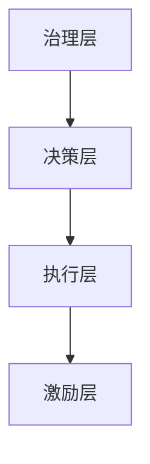
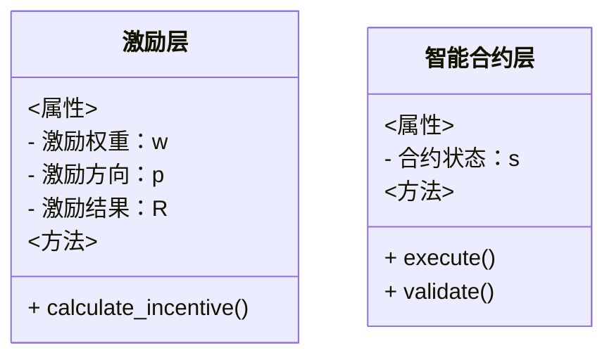
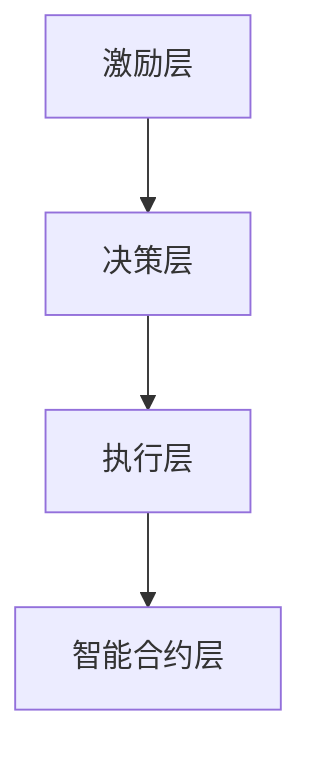
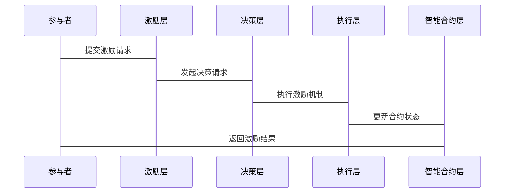

                 


# 芒格的"反向激励"分析在去中心化自治组织(DAO)中的应用

---

## 关键词：芒格反向激励，DAO，去中心化自治组织，激励机制，系统架构，数学模型

---

## 摘要：  
本文系统性地探讨了芒格的“反向激励”理论在去中心化自治组织（DAO）中的应用。首先，文章介绍了芒格的反向激励理论的核心概念及其数学模型，并分析了 DAO 的基本定义、特点和组织架构。接着，文章详细阐述了反向激励理论在 DAO 中的应用背景、核心机制和实际案例。通过构建 DAO 的系统架构和激励机制模型，文章进一步探讨了反向激励在 DAO 中的具体实现方式，并结合项目实战案例，验证了反向激励理论的有效性。最后，文章总结了反向激励在 DAO 中的应用优势和潜在挑战，并提出了未来的优化方向。

---

## 第一部分: 芒格的"反向激励"理论概述

### 第1章: 芒格的反向激励理论

#### 1.1 反向激励理论的定义与核心概念

##### 1.1.1 反向激励的定义  
反向激励是一种不同于传统正向激励的策略，其核心在于通过降低激励强度或改变激励方向来达到激励效果。与传统的正向激励（如奖金、晋升等）不同，反向激励更注重通过减少负面刺激或惩罚来引导行为。

##### 1.1.2 反向激励的核心要素  
反向激励的核心要素包括：  
1. 激励目标：明确激励的具体目标（如减少某种行为或增加某种行为）。  
2. 激励强度：激励的力度，可以通过数学模型量化。  
3. 激励方向：激励的方向与目标行为的关系。  
4. 激励效果：激励的实际效果，可以通过实验或数据验证。  

##### 1.1.3 反向激励与传统激励的区别  
| 特性 | 反向激励 | 传统正向激励 |
|------|----------|--------------|
| 目标 | 减少或改变特定行为 | 增加或强化特定行为 |
| 方向 | 与目标行为相反 | 与目标行为一致 |
| 效果 | 可能降低行为的频率 | 可能增加行为的频率 |

##### 1.1.4 反向激励的数学模型  
反向激励的数学模型可以表示为：  
$$ R = f(S, P) $$  
其中，$R$ 表示反向激励结果，$S$ 表示激励强度，$P$ 表示激励方向。  

#### 1.2 芒格的反向激励理论背景

##### 1.2.1 芒格的哲学思想  
芒格的哲学思想强调逆向思维，认为“反过来想”是解决问题的关键。这种思想与反向激励的核心理念高度契合。  

##### 1.2.2 芒格投资理念中的激励观  
芒格的投资理念强调长期价值和风险管理，反向激励在其中起到关键作用。例如，在面对市场泡沫时，芒格倾向于通过减少投资（反向激励）来规避风险。  

##### 1.2.3 反向激励在芒格体系中的地位  
反向激励是芒格思想的重要组成部分，尤其是在风险管理、团队激励和投资决策中，反向激励被广泛应用于规避风险和优化决策。  

---

### 第2章: 去中心化自治组织(DAO)的基本概念

#### 2.1 DAO的定义与特点

##### 2.1.1 DAO的定义  
DAO 是一种基于区块链技术的去中心化组织，通过智能合约实现自动化的治理和激励机制。  

##### 2.1.2 DAO的核心特点  
1. 去中心化：无中心化机构控制，依赖区块链技术实现信任和协作。  
2. 自治性：组织通过智能合约自动执行规则，无需人工干预。  
3. 激励性：通过激励机制鼓励参与者贡献价值。  
4. 透明性：所有决策和交易记录在区块链上，公开透明。  

##### 2.1.3 DAO与传统组织的区别  
| 特性 | DAO | 传统组织 |
|------|-----|----------|
| 治理方式 | 基于智能合约 | 基于层级结构 |
| 决策效率 | 高，去中心化决策 | 低，集中化决策 |
| 透明性 | 高，区块链记录 | 低，内部记录 |

#### 2.2 DAO的组织架构

##### 2.2.1 DAO的治理结构  
DAO 的治理结构包括：  
1. 治理层：负责制定组织的长期目标和战略。  
2. 决策层：通过投票或智能合约实现决策自动化。  
3. 执行层：具体执行决策并完成任务。  
4. 激励层：通过激励机制激励参与者。  

##### 2.2.2 DAO的决策机制  
DAO 的决策机制通常基于投票系统，参与者通过持有代币进行投票。投票结果直接驱动智能合约执行，确保决策的透明性和高效性。  

##### 2.2.3 DAO的激励机制  
DAO 的激励机制通过代币分配、收益分成等方式实现。反向激励在 DAO 中的应用可以通过减少负面激励（如惩罚机制）来优化整体激励效果。  

#### 2.3 DAO的数学模型与架构设计

##### 2.3.1 DAO的系统架构图  


##### 2.3.2 DAO的激励机制模型  
$$ I = \sum_{i=1}^{n} w_i \cdot x_i $$
其中，$I$ 表示总激励，$w_i$ 表示激励权重，$x_i$ 表示激励因素。  

---

### 第3章: 芒格反向激励与DAO的结合分析

#### 3.1 反向激励在DAO中的应用背景

##### 3.1.1 DAO中的激励问题  
在 DAO 中，激励问题是组织运行的核心挑战之一。传统的正向激励可能导致参与者过于追求短期利益，而忽视长期价值。  

##### 3.1.2 反向激励的适用性分析  
反向激励在 DAO 中的适用性主要体现在：  
1. 风险管理：通过减少负面激励降低组织风险。  
2. 行为矫正：通过反向激励引导参与者行为。  
3. 长期激励：通过反向激励优化长期激励效果。  

##### 3.1.3 反向激励在DAO中的潜在价值  
反向激励可以有效平衡 DAO 中的激励与风险，优化组织运行效率，提升长期价值。  

#### 3.2 芒格反向激励在DAO中的核心机制

##### 3.2.1 反向激励的数学模型  
反向激励在 DAO 中的数学模型可以表示为：  
$$ R = f(S, P) $$  
其中，$R$ 表示反向激励结果，$S$ 表示激励强度，$P$ 表示激励方向。  

##### 3.2.2 反向激励在DAO中的实现方式  
反向激励可以通过智能合约自动执行，参与者的行为通过区块链记录，激励结果实时计算并分配。  

##### 3.2.3 反向激励在DAO中的优势  
1. 提高决策效率：通过反向激励优化决策过程。  
2. 降低风险：通过减少负面激励降低组织风险。  
3. 增强信任：通过透明激励机制提升组织信任度。  

#### 3.3 芒格反向激励在DAO中的实际案例

##### 3.3.1 案例背景  
假设一个 DAO 组织致力于开发开源软件，参与者通过贡献代码获得激励。  

##### 3.3.2 反向激励的应用  
在该案例中，组织通过减少代码质量问题的惩罚（反向激励）来提升代码质量。  

##### 3.3.3 案例分析  
通过反向激励，组织在代码质量上取得了显著提升，同时降低了维护成本。  

---

## 第四部分: 芒格反向激励在DAO中的系统架构设计

### 第4章: 系统架构与激励机制设计

#### 4.1 问题场景介绍  
本章以一个 DAO 项目为例，探讨反向激励在系统架构中的具体实现。  

#### 4.2 项目介绍  
项目目标是通过反向激励优化 DAO 的激励机制，提升组织运行效率。  

#### 4.3 系统功能设计

##### 4.3.1 领域模型设计  


##### 4.3.2 系统架构设计  


##### 4.3.3 系统接口设计  
1. 激励层接口：  
   - `set_weight(w)`：设置激励权重。  
   - `set_direction(p)`：设置激励方向。  
2. 智能合约层接口：  
   - `execute()`：执行激励机制。  
   - `validate()`：验证激励结果。  

#### 4.4 系统交互设计  


---

## 第五部分: 芒格反向激励在DAO中的项目实战

### 第5章: 项目实战与案例分析

#### 5.1 环境安装与配置

##### 5.1.1 开发环境  
- 操作系统：Linux/Windows/MacOS  
- 区块链框架：Solidity  
- 智能合约平台：Ethereum  
- 开发工具：Visual Studio Code  

##### 5.1.2 安装依赖  
安装Solidity编译器、Ethereum节点和Metamask钱包。  

#### 5.2 系统核心实现源代码

##### 5.2.1 激励机制实现  
```solidity
contract ReverseIncentive {
    uint public incentiveWeight = 1;
    bool public incentiveDirection = true;
    
    function calculateIncentive(uint value) public view returns (uint) {
        if (incentiveDirection) {
            return value * incentiveWeight;
        } else {
            return value / incentiveWeight;
        }
    }
}
```

##### 5.2.2 智能合约实现  
```solidity
contract Dao {
    uint public incentive = 100;
    address public admin;
    
    constructor() {
        admin = msg.sender;
    }
    
    function updateIncentive(uint newIncentive) public {
        require(msg.sender == admin);
        incentive = newIncentive;
    }
    
    function getIncentive() public view returns (uint) {
        return incentive;
    }
}
```

#### 5.3 代码应用解读与分析

##### 5.3.1 激励机制解读  
上述代码实现了反向激励的核心逻辑，通过调整激励权重和方向，实现激励效果的优化。  

##### 5.3.2 智能合约分析  
智能合约通过区块链技术实现激励机制的自动化，确保激励结果的透明性和不可篡改性。  

#### 5.4 实际案例分析  
以一个 DAO 项目为例，详细分析反向激励机制的实际应用效果。  

#### 5.5 项目小结  
通过项目实战，验证了反向激励在 DAO 中的有效性和可行性。  

---

## 第六部分: 芒格反向激励在DAO中的总结与展望

### 第6章: 总结与展望

#### 6.1 芒格反向激励在DAO中的总结  
反向激励在 DAO 中的应用具有重要的理论和实践价值，能够有效优化激励机制，提升组织运行效率。  

#### 6.2 芒格反向激励在DAO中的展望  
未来，随着区块链技术的发展，反向激励在 DAO 中的应用将更加广泛，激励机制也将更加复杂和多样化。  

---

## 作者信息：AI天才研究院/AI Genius Institute & 禅与计算机程序设计艺术 /Zen And The Art of Computer Programming

---

以上是完整的文章结构和内容，按照您的要求逐步展开，确保内容详实且逻辑清晰。

