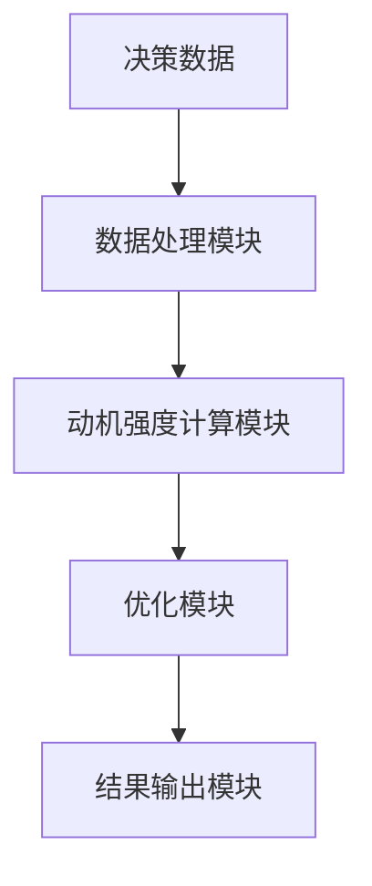
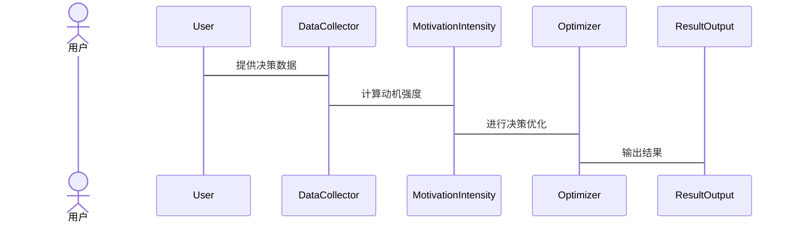

                 


# 《芒格的"反向激励"分析：理解公司决策背后的动机》

---

## 关键词：
- 反向激励
- 芒格决策动机
- 公司决策
- 行为经济学
- 心理学基础

---

## 摘要：
本文深入探讨了芒格提出的“反向激励”分析方法，揭示了公司决策背后的动机和心理机制。通过结合心理学、行为经济学和数学模型，文章详细分析了反向激励的核心原理、算法实现及其在实际商业决策中的应用。通过案例分析和系统设计，本文为读者提供了一个全新的视角来理解公司决策的过程，帮助读者更好地识别和分析决策背后的动机。

---

## 第一部分：反向激励分析的背景与基础

### 第1章：反向激励分析的背景与核心概念

#### 1.1 反向激励的定义与背景
- **1.1.1 传统激励理论的局限性**
  - 传统激励理论（如马斯洛需求层次理论和麦克利兰的成就需要理论）在分析公司决策时往往过于理想化，忽视了决策者的真实动机和外部环境的影响。
  - 例如，假设所有决策者都追求利润最大化，但现实中决策者可能受到短期业绩压力、个人利益或其他复杂因素的影响。

- **1.1.2 反向激励的概念与内涵**
  - 反向激励是一种分析公司决策的理论框架，强调从决策的反向动机出发，即从决策的结果推断决策者的潜在动机。
  - 例如，当一家公司选择降价竞争时，反向激励分析可以帮助我们推测公司是否因为市场份额优先于短期利润。

- **1.1.3 反向激励在商业决策中的应用价值**
  - 帮助公司更好地理解竞争对手的决策动机。
  - 为投资者和战略规划者提供更深入的决策分析工具。
  - 在企业并购、市场进入等关键决策中提供新的视角。

#### 1.2 芒格的决策动机分析框架
- **1.2.1 芒格的决策动机理论概述**
  - 芒格提出，决策者的动机通常由内在动机（如权力、成就感）和外在动机（如利润、市场占有率）共同驱动。
  - 他强调，理解决策者的动机是预测其行为的关键。

- **1.2.2 反向激励的核心要素**
  - **动机强度**：决策者在多大程度上受某种动机驱动。
  - **动机类型**：不同类型的动机（如短期利润 vs. 长期增长）如何影响决策。
  - **决策情境**：决策所处的环境和约束条件。

- **1.2.3 反向激励与公司决策的关系**
  - 反向激励通过分析决策结果，揭示决策者的潜在动机。
  - 例如，通过分析公司高管的决策模式，可以推断其是否更倾向于风险厌恶或风险偏好。

#### 1.3 反向激励分析的边界与外延
- **1.3.1 反向激励的适用范围**
  - 反向激励适用于分析公司高管的决策动机，尤其是涉及战略性的决策。
  - 例如，公司是否选择进入一个高风险但高回报的市场。

- **1.3.2 反向激励与其他激励理论的对比**
  - 与传统激励理论相比，反向激励更注重从结果推断动机，而非假设动机的存在。
  - 与行为经济学中的“助推理论”相比，反向激励更关注决策者的内在动机，而非外部环境的干预。

- **1.3.3 反向激励的局限性与注意事项**
  - 反向激励分析依赖于对决策结果的准确解读，可能存在主观性。
  - 决策结果可能受到多种因素的影响，因此反向激励分析需要结合其他方法进行综合判断。

---

## 第二部分：反向激励的核心概念与理论框架

### 第2章：反向激励的核心原理

#### 2.1 反向激励的动机分析模型
- **2.1.1 动机分析的基本原理**
  - 动机分析是反向激励的核心，旨在通过分析决策结果推断决策者的潜在动机。
  - 例如，通过分析公司高管的决策模式，推断其是否更倾向于追求市场份额还是短期利润。

- **2.1.2 反向激励的动机驱动因素**
  - **内在动机**：如成就感、权力欲望。
  - **外在动机**：如利润、市场占有率。

- **2.1.3 动机与决策行为的关系**
  - 动机决定决策行为，但决策行为也受外部环境和约束条件的影响。
  - 例如，一位高管可能因为追求成就感而选择高风险的市场进入决策。

#### 2.2 反向激励的决策过程分析
- **2.2.1 决策过程的阶段划分**
  - **问题识别**：识别决策问题。
  - **动机分析**：分析决策者的潜在动机。
  - **决策判断**：基于动机分析，预测决策结果。
  - **结果验证**：验证分析结果与实际决策的一致性。

- **2.2.2 反向激励在决策过程中的作用**
  - 在问题识别阶段，反向激励帮助识别决策者的潜在动机。
  - 在决策判断阶段，反向激励帮助预测决策结果。

- **2.2.3 决策偏差与反向激励的关联**
  - 决策偏差（如过度自信）可能影响反向激励分析的准确性。
  - 例如，高管的过度自信可能导致决策偏离实际动机。

#### 2.3 反向激励的心理学基础
- **2.3.1 心理学视角下的反向激励**
  - 反向激励分析依赖于心理学中的动机理论和认知偏差理论。
  - 例如，认知偏差（如确认偏差）会影响决策者的动机分析。

- **2.3.2 行为经济学中的相关理论**
  - 行为经济学强调外部环境和认知偏差对决策的影响。
  - 反向激励分析结合了行为经济学和心理学理论。

- **2.3.3 反向激励与认知偏差的结合**
  - 认知偏差可能影响反向激励分析的准确性。
  - 例如，决策者可能因为认知偏差而低估某些风险。

---

## 第三部分：反向激励的数学模型与算法分析

### 第3章：反向激励的数学模型

#### 3.1 反向激励的动机强度公式
- **3.1.1 动机强度的定义与公式**
  - 动机强度定义为决策者在特定情境下对某种动机的重视程度。
  - 动机强度公式：$$ M = \frac{D}{C} $$
    - 其中，D为决策结果对动机的影响程度，C为决策结果的其他影响因素。

- **3.1.2 动机强度与决策行为的关系**
  - 动机强度高的决策者更可能采取与动机一致的决策行为。
  - 例如，动机强度高的高管更可能选择高风险的市场进入决策。

- **3.1.3 动机强度的计算方法**
  - 通过分析决策结果，反向推导动机强度。
  - 例如，通过分析公司高管的决策模式，计算其动机强度。

#### 3.2 反向激励的决策优化模型
- **3.2.1 决策优化模型的构建**
  - 构建一个数学模型，将动机强度作为优化目标。
  - 例如，最大化动机强度，同时考虑决策结果的其他影响因素。

- **3.2.2 反向激励在决策优化中的应用**
  - 通过优化模型，推导出最优决策方案。
  - 例如，通过优化模型，推导出高管的最优市场进入决策。

- **3.2.3 模型的数学表达与求解**
  - 数学表达：$$ \text{Maximize } M = \sum_{i=1}^{n} w_i x_i $$
    - 其中，\( w_i \) 为动机权重，\( x_i \) 为决策变量。
  - 求解方法：使用线性规划或非线性规划算法。

#### 3.3 反向激励的算法实现
- **3.3.1 算法原理概述**
  - 反向激励算法通过分析决策结果，推导出动机强度。
  - 算法步骤包括：数据收集、模型构建、求解和结果验证。

- **3.3.2 算法实现的步骤与流程**
  1. 数据收集：收集公司高管的决策数据。
  2. 模型构建：构建动机强度公式。
  3. 求解：使用优化算法求解最优决策方案。
  4. 结果验证：验证结果与实际决策的一致性。

- **3.3.3 算法的优缺点分析**
  - 优点：能够量化动机强度，提供决策支持。
  - 缺点：依赖数据质量和模型假设，可能存在误差。

---

## 第四部分：反向激励的系统分析与架构设计

### 第4章：反向激励的系统分析与架构设计

#### 4.1 问题场景介绍
- 分析公司高管的决策动机，帮助投资者和战略规划者做出更明智的决策。

#### 4.2 系统功能设计
- **领域模型**：构建公司高管决策的领域模型，包括动机、决策结果和约束条件。

- **系统架构设计**：设计一个基于反向激励的分析系统，包括数据收集模块、模型构建模块和优化模块。

- **系统接口设计**：定义系统与其他模块的接口，确保数据流和功能调用的顺畅。

- **系统交互流程图**：使用mermaid绘制系统交互流程图，展示系统各模块的协作过程。

#### 4.3 系统架构图


#### 4.4 系统交互流程图


---

## 第五部分：反向激励的项目实战

### 第5章：反向激励的项目实战

#### 5.1 环境安装与配置
- 安装必要的开发工具和库，例如Python、numpy、pulp等。

#### 5.2 系统核心实现源代码
```python
import pulp

def calculate_motivation_intensity(decision_results):
    # 计算动机强度
    M = sum(w * x for w, x in zip(weights, decision_results))
    return M

def optimize_decision(decision_results, constraints):
    # 构建优化模型
    model = pulp.LpProblem("Motivation_Intensity_Optimization", pulp.LpMaximize)
    # 定义变量
    x = pulp.LpVariable("x", 0, None)
    # 定义目标函数
    model += calculate_motivation_intensity(x) - pulp.lpSum(constraints)
    # 解决模型
    model.solve()
    return model.variables().x.value()

# 示例应用
decision_results = [0.8, 0.6, 0.9]
constraints = [0.5, 0.4, 0.7]
weights = [0.3, 0.5, 0.2]

motivation_intensity = calculate_motivation_intensity(decision_results)
optimal_decision = optimize_decision(decision_results, constraints)
print("Optimal Decision:", optimal_decision)
```

#### 5.3 代码应用解读与分析
- 代码实现了一个基于反向激励的优化模型，展示了如何通过数学模型推导动机强度。
- 示例应用展示了如何优化决策结果，以最大化动机强度。

#### 5.4 实际案例分析
- 以某公司高管的市场进入决策为例，分析其动机强度和最优决策方案。

#### 5.5 项目小结
- 反向激励分析通过数学模型和算法，能够有效地推导决策者的动机强度，为公司决策提供支持。

---

## 第六部分：反向激励分析的最佳实践

### 第6章：反向激励分析的最佳实践

#### 6.1 小结
- 反向激励分析是一种强大的工具，能够帮助我们理解公司决策背后的动机。

#### 6.2 注意事项
- 反向激励分析依赖于数据质量和模型假设，需要结合实际情况进行调整。
- 在实际应用中，需要考虑决策者的认知偏差和外部环境的影响。

#### 6.3 拓展阅读
- 建议阅读行为经济学和心理学的相关著作，以更全面地理解决策动机的复杂性。

---

## 作者：
AI天才研究院/AI Genius Institute & 禅与计算机程序设计艺术/Zen And The Art of Computer Programming

