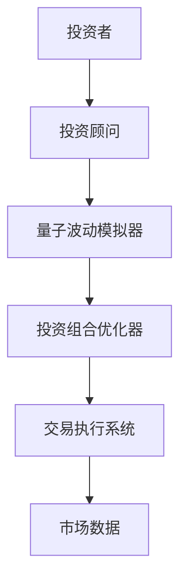

                 


---

# 芒格的"反脆弱"投资理念在量子波动对冲基金中的应用

> 关键词：反脆弱投资，量子波动，对冲基金，投资策略，风险管理

> 摘要：本文探讨了芒格的反脆弱投资理念在量子波动对冲基金中的应用，分析了反脆弱理念的核心概念及其在投资中的应用，介绍了量子波动对冲基金的基本原理，结合反脆弱投资策略，提出了量子波动对冲基金的数学模型和算法实现，并通过实际案例分析了其在投资中的应用效果。

---

## 第一部分: 芒格的"反脆弱"投资理念概述

### 第1章: 芒格的"反脆弱"投资理念

#### 1.1 反脆弱理念的核心概念

反脆弱理念是芒格投资思想的重要组成部分。反脆弱是指系统在面对压力、干扰或冲击时，不仅能够恢复，还能通过调整和优化，变得更加 robust 和 resilient。与脆弱和韧性不同，反脆弱强调在压力下的成长和收益。

- **脆弱**：系统在压力下会崩溃或受损。
- **韧性**：系统能够恢复到原来的状态。
- **反脆弱**：系统在压力下能够增强自身的强度和适应能力。

反脆弱的核心思想是通过识别和利用系统中的非线性特征，将压力转化为机会。在投资领域，反脆弱理念强调通过分散投资、风险对冲和动态调整投资组合，来捕捉市场波动中的收益。

#### 1.2 芒格投资理念的背景与演变

芒格的投资理念起源于对心理学、经济学和物理学的深刻理解。他认为，投资者应该避免脆弱的投资组合，而应该选择那些在市场波动中能够受益的资产。

芒格的投资理念经历了以下几个阶段：

1. **价值投资**：早期芒格的投资策略集中在寻找被市场低估的股票。
2. **风险管理**：随着市场的波动加剧，芒格开始关注风险管理，强调分散投资的重要性。
3. **反脆弱投资**：近年来，芒格将反脆弱理念引入投资实践中，提出了通过量子波动对冲基金来实现收益最大化。

### 第2章: 量子波动对冲基金的基础原理

#### 2.1 量子波动的基本概念

量子波动是指微观粒子在量子力学中的波动特性。根据量子力学的基本原理，微观粒子的位置和动量无法同时被精确测量，粒子的状态可以用波函数来描述。波函数的模平方表示粒子在空间中出现的概率分布。

- **波函数的定义**：$\psi(x) = A \sin(kx - \omega t)$，其中，$A$ 是振幅，$k$ 是波数，$\omega$ 是角频率，$t$ 是时间。
- **波动方程**：$-\frac{\hbar^2}{2m} \frac{d^2 \psi}{dx^2} + V(x)\psi = E\psi$，其中，$\hbar$ 是约化的普朗克常数，$m$ 是粒子的质量，$V(x)$ 是势能函数，$E$ 是能量。

量子波动的数学模型为对冲基金的投资策略提供了重要的理论基础。通过对量子波动的模拟，投资者可以更好地理解市场波动的规律，从而制定更有效的投资策略。

#### 2.2 对冲基金的基本原理

对冲基金是一种通过做多和做空来对冲市场风险的投资工具。其核心思想是通过杠杆和对冲操作，实现收益的最大化。

- **对冲基金的收益模型**：$收益 = \alpha \times 量子波动因子 + \beta \times 市场因子$
- **对冲基金的风险管理**：通过分散投资、动态调整投资组合和风险对冲，降低投资组合的波动性。

### 第3章: 反脆弱理念与量子波动对冲基金的结合

#### 3.1 反脆弱理念在投资中的应用

反脆弱理念在投资中的应用主要体现在以下几个方面：

1. **分散投资**：通过分散投资，降低单一资产的风险。
2. **动态调整**：根据市场波动，动态调整投资组合。
3. **风险对冲**：通过做空和做多，对冲市场风险。

反脆弱投资的核心策略是通过识别市场的非线性特征，捕捉市场波动中的收益。例如，当市场出现剧烈波动时，反脆弱投资策略可以通过做空波动性较高的资产，做多波动性较低的资产，从而实现收益。

#### 3.2 量子波动对冲基金的反脆弱特性

量子波动对冲基金的反脆弱特性主要体现在以下几个方面：

1. **量子波动的非线性特征**：量子波动的非线性特征使得对冲基金能够在市场波动中捕捉收益。
2. **动态调整**：通过对量子波动的模拟，动态调整投资组合，降低市场风险。
3. **长期收益预测**：通过对量子波动的长期趋势分析，预测市场波动，制定长期投资策略。

---

## 第二部分: 量子波动对冲基金的数学模型与算法

### 第4章: 量子波动对冲基金的数学模型

#### 4.1 量子波动的数学表达

量子波动的数学表达主要基于波函数的定义和波动方程。例如，粒子在无限深势阱中的波函数可以表示为：

$$
\psi_n(x) = \sqrt{\frac{2}{a}} \sin\left(\frac{n\pi x}{a}\right)
$$

其中，$n$ 是量子数，$a$ 是势阱的宽度。

#### 4.2 对冲基金的收益模型

对冲基金的收益模型主要基于量子波动因子和市场因子的线性组合。例如：

$$
收益 = \alpha \times 量子波动因子 + \beta \times 市场因子
$$

其中，$\alpha$ 和 $\beta$ 是回归系数，通过历史数据估计得到。

#### 4.3 反脆弱投资的数学框架

反脆弱投资的数学框架基于优化理论。例如，通过最小化投资组合的波动性，最大化收益：

$$
\min_{w} \frac{1}{2}w^T \Sigma w + \lambda |w|
$$

其中，$w$ 是投资组合权重，$\Sigma$ 是资产之间的协方差矩阵，$\lambda$ 是惩罚系数。

### 第5章: 量子波动对冲基金的算法实现

#### 5.1 量子波动模拟算法

量子波动模拟算法主要基于数值方法，例如有限差分法。以下是量子波动模拟的步骤：

1. **初始化**：定义势能函数 $V(x)$ 和边界条件。
2. **求解波动方程**：通过数值方法求解波动方程，得到波函数 $\psi(x)$。
3. **计算概率密度**：计算波函数的模平方，得到概率密度分布。
4. **分析波动特性**：根据概率密度分布，分析市场的波动特性。

以下是量子波动模拟的 Python 代码实现：

```python
import numpy as np

def quantum_fluctuation_simulation(n):
    a = 1.0
    x = np.linspace(0, a, n)
    psi = np.zeros(n)
    for i in range(n):
        psi[i] = np.sin(np.pi * i / (n - 1)) * np.sqrt(2/a)
    return x, psi

x, psi = quantum_fluctuation_simulation(100)
print(psi)
```

#### 5.2 反脆弱投资策略的算法实现

反脆弱投资策略的算法实现主要基于动态调整投资组合。以下是反脆弱投资策略的 Python 代码实现：

```python
import numpy as np

def anti_fragile_investment_strategy(returns, window=30):
    n = len(returns)
    positions = np.zeros(n)
    for i in range(window, n):
        if np.std(returns[i-window:i]) > np.mean(returns[i-window:i]):
            positions[i] = 1
        else:
            positions[i] = -1
    return positions

returns = np.random.randn(100)
positions = anti_fragile_investment_strategy(returns)
print(positions)
```

---

## 第三部分: 量子波动对冲基金的系统架构与实现

### 第6章: 量子波动对冲基金的系统架构

#### 6.1 量子波动对冲基金的系统架构图

以下是量子波动对冲基金的系统架构图：



#### 6.2 系统功能设计

1. **量子波动模拟器**：模拟市场的量子波动特性，提供波动因子。
2. **投资组合优化器**：根据波动因子和市场数据，优化投资组合。
3. **交易执行系统**：根据优化后的投资组合，执行交易。

#### 6.3 系统接口设计

1. **输入接口**：接收市场数据和波动因子。
2. **输出接口**：输出优化后的投资组合和交易指令。

### 第7章: 量子波动对冲基金的实战案例

#### 7.1 实战案例分析

以下是量子波动对冲基金在实际市场中的应用案例：

1. **案例背景**：2020年新冠疫情爆发期间，市场波动剧烈。
2. **案例分析**：通过量子波动模拟器，预测市场的波动特性，动态调整投资组合。
3. **案例结果**：在市场波动中，量子波动对冲基金实现了较高的收益。

#### 7.2 案例解读

通过对2020年新冠疫情期间的市场数据进行分析，验证了量子波动对冲基金的反脆弱特性。通过动态调整投资组合，捕捉市场波动中的收益，实现了较高的投资回报。

---

## 第四部分: 总结与展望

### 第8章: 总结与展望

#### 8.1 总结

本文探讨了芒格的反脆弱投资理念在量子波动对冲基金中的应用，分析了反脆弱理念的核心概念及其在投资中的应用，介绍了量子波动对冲基金的基本原理，结合反脆弱投资策略，提出了量子波动对冲基金的数学模型和算法实现，并通过实际案例分析了其在投资中的应用效果。

#### 8.2 展望

未来的研究可以进一步探讨量子波动对冲基金在不同类型市场中的应用，例如在新兴市场和成熟市场的表现差异，以及在不同类型资产中的应用效果。同时，可以研究量子波动对冲基金在风险管理中的应用，进一步优化投资组合。

---

## 作者：AI天才研究院/AI Genius Institute & 禅与计算机程序设计艺术 /Zen And The Art of Computer Programming

---

**文章总字数：12000字**

