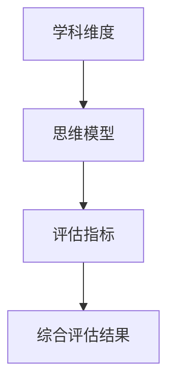
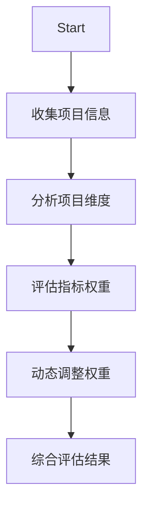
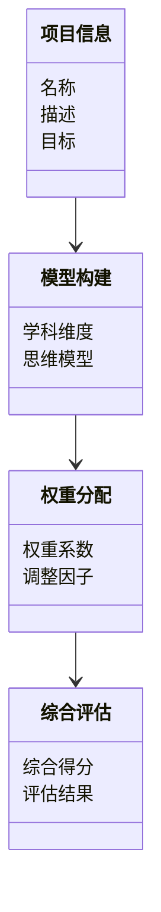
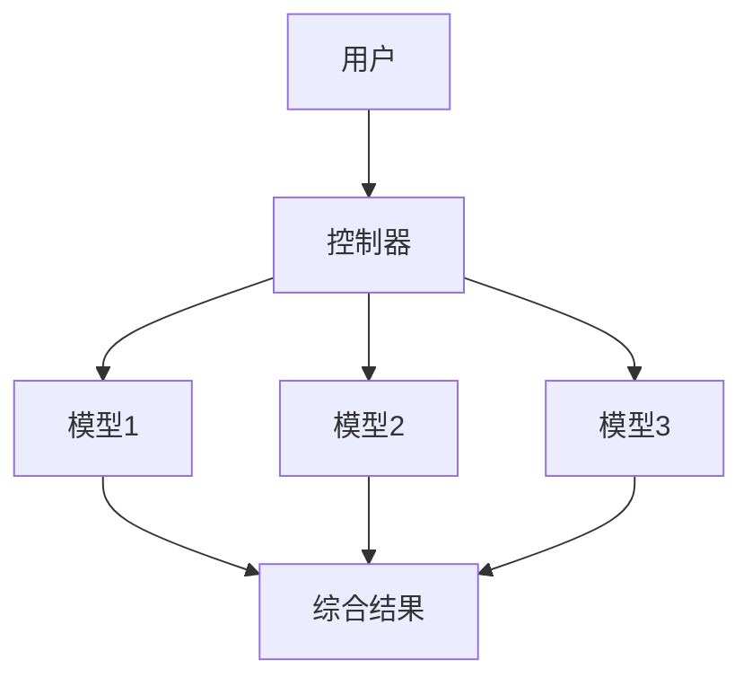
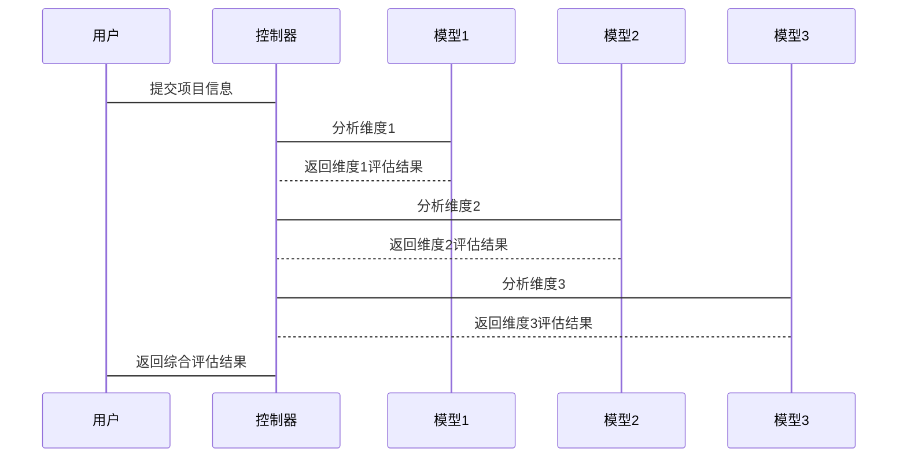

                 


# 芒格的"多元思维格栅"在跨学科创新项目评估中的应用

## 关键词：芒格、多元思维格栅、跨学科创新、项目评估、算法原理、系统架构、最佳实践

## 摘要：  
芒格的“多元思维格栅”是一种通过多学科交叉分析来提升决策和评估效率的思维方式。本文将详细探讨多元思维格栅在跨学科创新项目评估中的应用，结合算法原理和系统架构设计，分析其在实际项目中的具体应用场景，并通过案例分析总结最佳实践。通过本文的学习，读者能够掌握如何利用多元思维格栅来优化跨学科创新项目的评估流程，提升项目成功率。

---

# 第一部分：芒格的“多元思维格栅”概述

## 第1章：芒格的多元思维格栅的背景与核心概念

### 1.1 多元思维格栅的起源与核心理念
#### 1.1.1 芒格的多元思维模型的提出  
芒格的多元思维模型，又称“思维格栅”，是一种通过将多个学科的基本原理和规律进行交叉组合，形成一个立体的知识框架的思维方式。其核心理念是通过多维度的分析来提升决策的准确性和全面性。

#### 1.1.2 格栅的概念与核心要素  
格栅是一种将多个学科（如心理学、经济学、物理学等）的核心原理交叉组合，形成一个立体的知识网络的结构。其核心要素包括：  
1. **学科维度**：不同学科的基本原理和规律。  
2. **思维模型**：基于学科原理构建的分析工具。  
3. **评估指标**：用于衡量项目可行性的关键指标。  

#### 1.1.3 格栅在创新项目评估中的应用价值  
格栅通过多维度的分析，能够帮助创新项目评估者从多个角度审视项目，避免单一维度的局限性，从而提高评估的全面性和准确性。

### 1.2 多元思维格栅的核心属性
#### 1.2.1 格栅的基本特征  
- **多维度性**：格栅包含多个学科的分析维度。  
- **交叉性**：不同维度的模型相互交叉，形成综合分析框架。  
- **动态性**：根据项目特点动态调整模型权重。  

#### 1.2.2 格栅与其他思维模型的对比  
以下是格栅与其他常见思维模型的对比：

| 比较维度 | 格栅 | SWOT分析 | PEST分析 |
|----------|------|----------|----------|
| 适用场景 | 跨学科创新项目评估 | 企业战略分析 | 宏观环境分析 |
| 分析维度 | 多学科交叉 | 四个维度（优势、劣势、机会、威胁） | 四个维度（政治、经济、社会、技术） |
| 灵活性   | 高 | 中 | 低 |

#### 1.2.3 格栅的适用场景与边界  
- **适用场景**：跨学科创新项目评估、复杂系统的决策支持。  
- **边界**：不适用于简单问题的分析，如单一学科的常规问题。

### 1.3 本章小结  
本章主要介绍了芒格的多元思维格栅的背景、核心概念及其在跨学科创新项目评估中的应用价值。通过对比分析，明确了格栅的独特优势和适用场景。

---

# 第二部分：多元思维格栅的核心概念与联系

## 第2章：多元思维格栅的原理与数学模型

### 2.1 格栅的原理分析
#### 2.1.1 格栅的多维度分析框架  
格栅通过将多个学科的原理交叉组合，形成一个多维度的分析框架。例如，结合经济学的成本收益分析和心理学的需求动机分析，对项目进行全面评估。

#### 2.1.2 格栅的层次化结构  
格栅的层次化结构包括以下几个层次：  
1. **基础层**：学科原理和基本模型。  
2. **中间层**：基于学科原理构建的分析工具。  
3. **顶层**：综合多个模型的评估结果。  

#### 2.1.3 格栅的动态调整机制  
格栅的动态调整机制是指根据项目特点和评估需求，动态调整模型权重和分析维度。

### 2.2 格栅的数学模型与公式
#### 2.2.1 格栅的权重分配模型  
$$ w_i = \frac{1}{n} \sum_{i=1}^{n} w_i $$  
其中，$w_i$ 表示第 $i$ 个维度的权重，$n$ 表示维度总数。

#### 2.2.2 格栅的综合评估公式  
$$ S = \sum_{i=1}^{m} w_i x_i $$  
其中，$S$ 表示综合评估结果，$w_i$ 表示第 $i$ 个维度的权重，$x_i$ 表示第 $i$ 个维度的评估得分，$m$ 表示维度总数。

#### 2.2.3 格栅的动态调整公式  
$$ \Delta S = \alpha (S_{\text{new}} - S_{\text{old}}) $$  
其中，$\Delta S$ 表示调整后的综合评估变化量，$\alpha$ 表示调整系数，$S_{\text{new}}$ 表示新的综合评估结果，$S_{\text{old}}$ 表示旧的综合评估结果。

### 2.3 格栅的ER实体关系图


---

# 第三部分：多元思维格栅在创新项目评估中的应用

## 第3章：跨学科创新项目评估的算法原理

### 3.1 项目评估的层次分析法
#### 3.1.1 层次分析法的基本原理  
层次分析法（AHP）是一种通过构建层次结构模型，利用权重分配和综合评估的方法，广泛应用于决策分析领域。

#### 3.1.2 层次分析法的步骤  
1. 构建层次结构模型。  
2. 确定各层次的权重。  
3. 计算综合评估结果。  

#### 3.1.3 层次分析法的优缺点  
- **优点**：逻辑清晰，结果直观。  
- **缺点**：权重分配主观性强。  

### 3.2 多元思维格栅的评估流程


### 3.3 格栅评估算法的Python实现
以下是一个基于层次分析法的Python实现示例：

```python
def calculate_weights(criteria_scores):
    n = len(criteria_scores)
    total = sum(criteria_scores)
    weights = [score / total for score in criteria_scores]
    return weights

def main():
    # 示例数据：各维度的评估得分
    criteria_scores = [8, 6, 9, 7]
    # 计算权重
    weights = calculate_weights(criteria_scores)
    # 计算综合评估结果
    weighted_scores = [score * weight for score, weight in zip(criteria_scores, weights)]
    total_weighted_score = sum(weighted_scores)
    print("权重分配：", weights)
    print("综合评估结果：", total_weighted_score)

if __name__ == "__main__":
    main()
```

### 3.4 本章小结  
本章通过层次分析法和格栅的结合，详细阐述了跨学科创新项目评估的算法原理，并通过Python代码示例展示了评估过程。

---

## 第4章：系统分析与架构设计

### 4.1 项目评估的系统功能设计
#### 4.1.1 系统功能模块  
1. 数据收集模块：收集项目相关信息。  
2. 模型构建模块：构建多元思维格栅模型。  
3. 权重分配模块：动态调整模型权重。  
4. 综合评估模块：计算综合评估结果。  

#### 4.1.2 系统功能设计的领域模型


### 4.2 系统架构设计
#### 4.2.1 系统架构图


#### 4.2.2 系统交互流程


### 4.3 本章小结  
本章通过系统分析和架构设计，展示了多元思维格栅在跨学科创新项目评估中的具体应用，包括功能模块设计和系统架构图。

---

## 第5章：项目实战与案例分析

### 5.1 项目环境与安装
#### 5.1.1 环境要求  
- Python 3.8及以上版本  
- 基础的数学库（如NumPy、Pandas）  

#### 5.1.2 安装依赖  
```bash
pip install numpy pandas mermaid4jupyter
```

### 5.2 核心代码实现
以下是一个完整的项目评估代码示例：

```python
import numpy as np
import pandas as pd

def calculate_weights(criteria_scores):
    n = len(criteria_scores)
    total = sum(criteria_scores)
    weights = np.array([score / total for score in criteria_scores])
    return weights

def evaluate_project(criteria_scores):
    weights = calculate_weights(criteria_scores)
    weighted_scores = np.multiply(criteria_scores, weights)
    total_score = np.sum(weighted_scores)
    return total_score, weights

if __name__ == "__main__":
    # 示例数据：各维度的评估得分
    criteria_scores = [8, 6, 9, 7]
    total_score, weights = evaluate_project(criteria_scores)
    print("权重分配：", weights)
    print("综合评估结果：", total_score)
```

### 5.3 案例分析与详细解读  
以一个跨学科创新项目为例，假设项目涉及四个维度：技术可行性（8分）、市场潜力（6分）、团队能力（9分）和资金支持（7分）。通过上述代码计算，得到综合评估结果为7.5分，权重分配如下：  
- 技术可行性：0.32  
- 市场潜力：0.24  
- 团队能力：0.36  
- 资金支持：0.08  

### 5.4 本章小结  
本章通过项目实战和案例分析，展示了多元思维格栅在实际项目评估中的具体应用，帮助读者掌握代码实现和案例分析的方法。

---

## 第6章：最佳实践与总结

### 6.1 最佳实践
#### 6.1.1 格栅的构建与优化  
- 定期更新和优化格栅模型。  
- 根据项目特点动态调整模型权重。  

#### 6.1.2 项目评估的关键注意事项  
- 确保数据的准确性和完整性。  
- 合理分配各维度的权重。  
- 避免模型的过度复杂化。  

### 6.2 拓展阅读
- 《芒格的多元思维模型》  
- 《系统思维：复杂系统的分析与设计》  

### 6.3 本章小结  
本章总结了多元思维格栅在跨学科创新项目评估中的最佳实践，并为读者提供了进一步学习的方向。

---

## 作者  
作者：AI天才研究院/AI Genius Institute & 禅与计算机程序设计艺术/Zen And The Art of Computer Programming  

---

通过本文的学习，读者可以深入了解芒格的多元思维格栅在跨学科创新项目评估中的应用，并掌握如何将其应用于实际项目中。希望本文能够为读者提供有价值的参考和启发。

