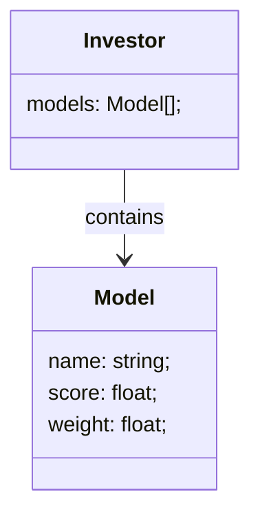
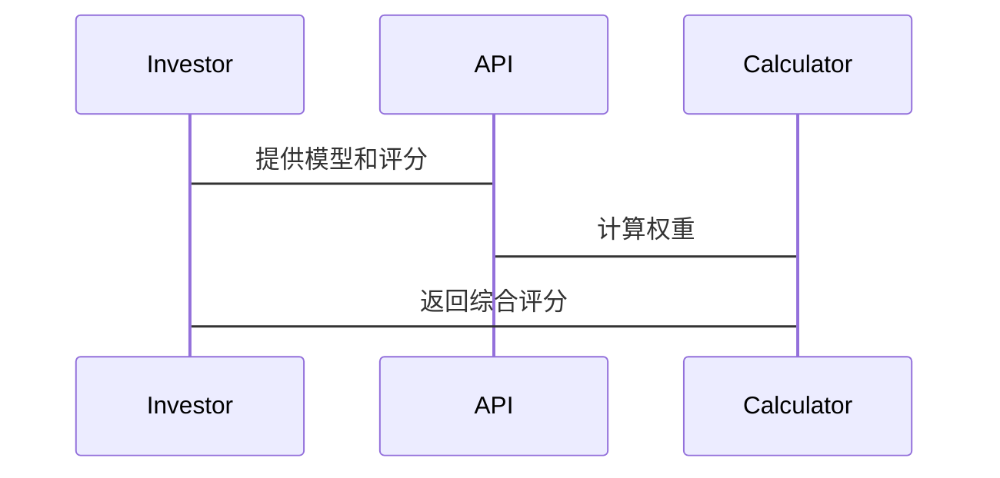

                 


```markdown
# 多元思维模型：提高投资决策的全面性

## 关键词：
- 芝诺
- 多元思维模型
- 投资决策
- 认知层次
- 系统分析
- 项目实战
- 最佳实践

## 摘要：
本文详细介绍了芒格的多元思维模型，探讨其如何通过多维度、多层次的分析来提升投资决策的准确性和全面性。结合理论与实践，从核心概念、算法原理到系统架构，逐步解析其在投资决策中的应用，最后通过项目实战和总结提供具体指导和最佳实践。

---

## 第一部分: 多元思维模型的背景与核心概念

### 第1章: 多元思维模型的概述

#### 1.1 多元思维模型的定义
##### 1.1.1 什么是多元思维模型
多元思维模型是一种通过整合多个学科和领域的思维方式，帮助投资者全面分析问题，避免单一视角的局限性。

##### 1.1.2 多元思维模型的特点
- **多维度分析**：从多个角度（如经济学、心理学、物理学）分析问题。
- **动态调整**：根据实际情况不断优化模型。
- **系统性**：强调各学科之间的相互联系。

##### 1.1.3 多元思维模型与传统投资决策的区别
传统投资决策往往依赖单一模型或经验，而多元思维模型通过结合多个模型提高决策的全面性。

#### 1.2 芝诺的生平与思想
##### 1.2.1 芝诺的生平简介
- 1924年出生，师从巴菲特，著有《穷查理宝典》。
- 以其独特的投资理念和多元思维模型闻名。

##### 1.2.2 芝诺的主要思想
- 投资是价格波动的艺术，而非科学。
- 强调安全边际和长期价值。

##### 1.2.3 芝诺思想对现代投资决策的影响
- 多元思维模型成为现代投资的重要工具。
- 提高了投资决策的可靠性和稳定性。

### 第2章: 多元思维模型的核心概念

#### 2.1 多元思维模型的原理
##### 2.1.1 认知的层次结构
- **基础层**：个体认知的基本框架。
- **中间层**：各学科模型的整合。
- **顶层**：综合分析和决策。

##### 2.1.2 多元思维模型的相互作用
- 不同模型之间的相互影响和协同作用。
- 模型的动态调整和优化。

##### 2.1.3 多元思维模型的动态调整
- 根据市场变化和个体认知的提升进行调整。

#### 2.2 多元思维模型的属性特征对比
##### 2.2.1 表格对比不同思维模型的属性
| 模型类型       | 确定性 | 适用范围 | 复杂度 |
|----------------|--------|----------|--------|
| 经济学模型     | 高     | 投资     | 中     |
| 心理学模型     | 中     | 行为     | 高     |
| 物理学模型     | 高     | 系统     | 高     |

##### 2.2.2 不同思维模型的优缺点分析
- **经济学模型**：优点是确定性高，缺点是忽视了行为因素。
- **心理学模型**：优点是解释行为，缺点是复杂性高。
- **物理学模型**：优点是系统性，缺点是复杂性高。

##### 2.2.3 多元思维模型的综合评价
- 综合多个模型的优点，弥补单一模型的不足。

#### 2.3 多元思维模型的数学模型与公式

##### 2.3.1 多元思维模型的数学表达
$$
W_i = \frac{S_i}{\sum_{j=1}^{n} S_j}
$$
其中，\( W_i \) 是第i个模型的权重，\( S_i \) 是第i个模型的评分，\( n \) 是模型总数。

##### 2.3.2 多元思维模型的权重计算
- 将每个模型的评分标准化，计算其权重。
- 权重反映了每个模型在整体分析中的重要性。

##### 2.3.3 多元思维模型的综合评价公式
$$
F = \sum_{i=1}^{n} W_i \cdot F_i
$$
其中，\( F \) 是综合评分，\( F_i \) 是第i个模型的评分，\( W_i \) 是权重。

### 第3章: 多元思维模型的数学模型与公式

#### 3.1 多元思维模型的数学表达
- 多元思维模型的数学表达式需要考虑多个变量和模型的相互作用。

#### 3.2 多元思维模型的算法实现
##### 3.2.1 多元思维模型的算法流程
1. 收集相关模型。
2. 评估每个模型的评分。
3. 计算每个模型的权重。
4. 综合评分，得出最终结论。

##### 3.2.2 多元思维模型的Python代码实现
```python
def calculate_weights(models, scores):
    total = sum(scores)
    weights = [score / total for score in scores]
    return weights

models = ['Economics', 'Psychology', 'Physics']
scores = [0.8, 0.7, 0.9]
weights = calculate_weights(models, scores)
print(weights)
```

#### 3.3 多元思维模型的数学公式
- 使用数学公式将模型评分和权重结合，计算综合评分。

---

## 第二部分: 多元思维模型的系统分析与架构设计

### 第4章: 系统分析与架构设计方案

#### 4.1 问题场景介绍
- 投资者如何利用多元思维模型进行决策。

#### 4.2 系统功能设计
- 数据输入：收集各模型的数据。
- 模型计算：计算各模型的评分和权重。
- 结果输出：输出综合评分和建议。

#### 4.3 领域模型类图


#### 4.4 系统架构设计
- 使用分层架构，将数据处理、模型计算和结果输出分开。

#### 4.5 系统接口设计
- 提供API接口，方便与其他系统集成。

#### 4.6 系统交互序列图


---

## 第三部分: 多元思维模型的项目实战

### 第5章: 项目实战

#### 5.1 环境安装
- 安装Python和相关库（如NumPy、Pandas）。

#### 5.2 系统核心实现源代码
```python
import numpy as np
import pandas as pd

def calculate_weights(models, scores):
    total = np.sum(scores)
    weights = scores / total
    return weights

models = ['Economics', 'Psychology', 'Physics']
scores = [0.8, 0.7, 0.9]
weights = calculate_weights(models, scores)
print(weights)
```

#### 5.3 代码应用解读与分析
- 解释代码的功能和实现细节。

#### 5.4 实际案例分析
- 使用具体案例分析多元思维模型的应用。

#### 5.5 项目小结
- 总结项目实施的经验和教训。

---

## 第四部分: 总结与最佳实践

### 第6章: 总结与最佳实践

#### 6.1 小结
- 多元思维模型的优势和应用场景。

#### 6.2 注意事项
- 模型选择的合理性。
- 数据的准确性和完整性。

#### 6.3 拓展阅读
- 推荐相关书籍和文章，供读者深入学习。

---

## 作者：AI天才研究院 & 禅与计算机程序设计艺术
```

