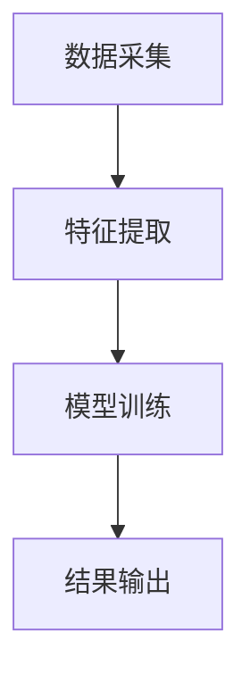

                 


# 芒格的"学习机器"理念在持续学习AI系统开发中的应用

---

## 关键词：芒格、学习机器、AI系统、持续学习、机器学习、算法、系统设计

---

## 摘要

芒格的“学习机器”理念为人工智能系统的发展提供了全新的视角。本文将深入探讨这一理念的核心思想，并结合实际案例，分析其在持续学习AI系统开发中的应用。通过系统化的分析与设计，结合数学模型和算法实现，本文旨在为AI开发者提供一套基于“学习机器”理念的实践方法论。

---

## 第一部分：芒格的“学习机器”理念概述

### 第1章：芒格“学习机器”理念的背景与核心概念

#### 1.1 芒格“学习机器”理念的背景

芒格的“学习机器”理念源于他对人类学习过程的深刻理解。他认为，人类通过不断学习和适应环境，能够在复杂问题中找到最优解决方案。这一理念被引入人工智能领域后，逐步发展为一种基于自适应和进化机制的新型学习模型。

#### 1.2 学习机器的核心概念与特点

学习机器是一种能够通过经验不断优化自身行为的AI系统。其核心特点包括：

- **自适应性**：系统能够根据输入数据自动调整参数，以适应不同场景。
- **持续性**：学习过程不是一次性完成的，而是持续进行的。
- **进化性**：系统通过不断优化，实现性能的逐步提升。

### 1.3 学习机器与传统AI模型的对比

| 特性               | 学习机器          | 传统AI模型        |
|--------------------|-------------------|-------------------|
| 学习方式           | 自监督学习        | 监督或无监督学习    |
| 系统复杂度         | 高                | 中或低            |
| 适应性             | 强                | 较弱              |
| 应用场景           | 动态环境          | 静态环境          |

---

## 第二部分：学习机器在AI系统中的应用

### 第2章：学习机器的算法原理与实现

#### 2.1 学习机器的算法流程

学习机器的算法流程可以分为以下几个步骤：

1. **数据输入与特征提取**：从环境中获取数据，并提取有用的特征。
2. **神经网络的构建与训练**：构建神经网络模型，并通过训练数据优化权重。
3. **模型优化与迭代**：通过反向传播算法更新权重，持续优化模型性能。

#### 2.2 学习机器的数学模型

学习机器的核心数学模型可以表示为：

$$ P(\text{学习}) = f(\text{输入}, \text{权重}) $$

其中，权重通过以下优化算法进行更新：

$$ w_{t+1} = w_t + \eta \cdot (y_t - \hat{y}_t) $$

其中：
- \( \eta \) 是学习率。
- \( y_t \) 是真实标签。
- \( \hat{y}_t \) 是模型预测值。

#### 2.3 学习机器的Python代码实现

以下是一个简单的学习机器实现示例：

```python
import numpy as np

def activation(x):
    return 1 / (1 + np.exp(-x))

def loss(y_true, y_pred):
    return np.mean((y_true - y_pred)**2)

# 示例模型训练
X = np.random.randn(100, 2)
y = np.random.randint(0, 2, 100)

weights = np.random.randn(2, 1)
learning_rate = 0.1

for _ in range(100):
    z = np.dot(X, weights)
    a = activation(z)
    loss_val = loss(y, a)
    dz = a - y
    weights -= learning_rate * np.dot(X.T, dz)
```

---

### 第3章：系统架构与设计

#### 3.1 系统应用场景与功能需求

学习机器可以应用于多个场景，包括：

- **动态环境预测**：在金融市场中预测股票价格。
- **自适应推荐系统**：根据用户行为动态调整推荐内容。
- **智能对话系统**：通过与用户的交互不断优化对话内容。

#### 3.2 系统架构设计

学习机器的系统架构可以分为以下几个模块：

- **数据采集模块**：从环境中获取数据。
- **特征提取模块**：对数据进行特征提取。
- **模型训练模块**：构建并训练学习机器模型。
- **结果输出模块**：输出模型预测结果。

以下是一个简化的系统架构图：



---

## 第三部分：项目实战与总结

### 第4章：项目实战

#### 4.1 环境安装与配置

安装所需的Python库：

```bash
pip install numpy matplotlib
```

#### 4.2 核心功能实现

实现一个简单的学习机器模型：

```python
import numpy as np

def activation(x):
    return 1 / (1 + np.exp(-x))

def loss(y_true, y_pred):
    return np.mean((y_true - y_pred)**2)

# 示例模型训练
X = np.random.randn(100, 2)
y = np.random.randint(0, 2, 100)

weights = np.random.randn(2, 1)
learning_rate = 0.1

for _ in range(100):
    z = np.dot(X, weights)
    a = activation(z)
    loss_val = loss(y, a)
    dz = a - y
    weights -= learning_rate * np.dot(X.T, dz)
```

#### 4.3 案例分析与结果解读

通过上述代码实现的学习机器模型，可以在训练后用于预测新的输入数据。例如：

```python
new_input = np.array([[1.0, -1.0]])
prediction = activation(np.dot(new_input, weights))
print("Prediction:", prediction)
```

---

## 第四部分：总结与展望

### 5.1 总结

芒格的“学习机器”理念为人工智能系统的发展提供了重要的理论支持和实践指导。通过持续学习和自适应优化，学习机器能够在复杂环境中不断进化，为AI系统的开发提供了全新的思路。

### 5.2 展望

未来，随着计算能力的提升和算法的不断优化，学习机器将在更多领域得到应用。特别是在动态环境和复杂问题中，学习机器的优势将更加显著。

---

## 作者

作者：AI天才研究院/AI Genius Institute & 禅与计算机程序设计艺术 /Zen And The Art of Computer Programming

---

**全文完**

