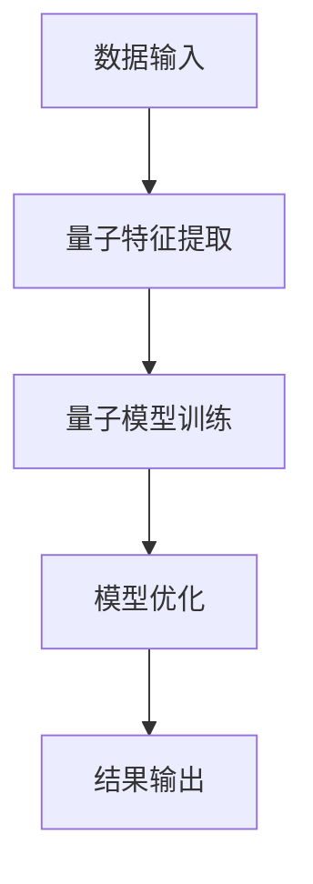
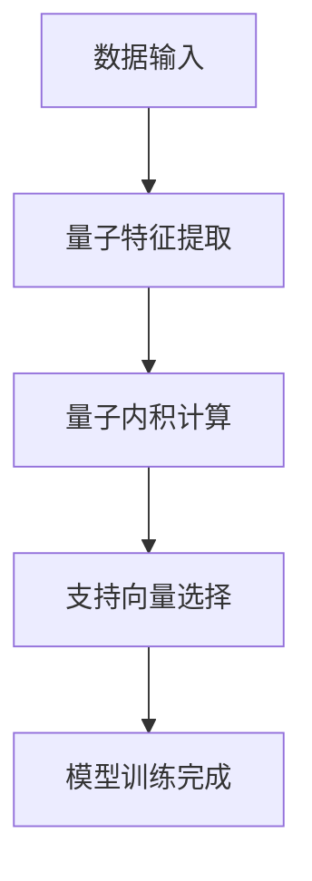
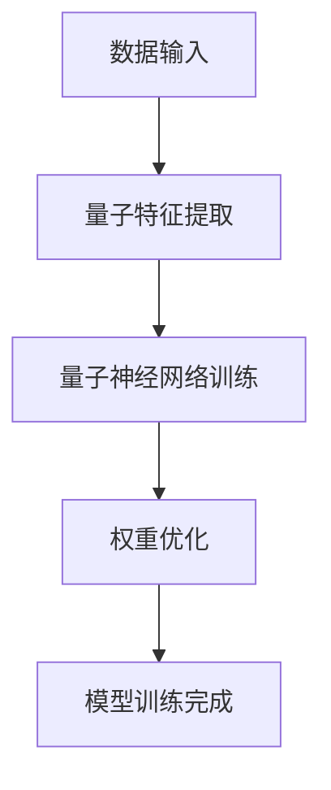
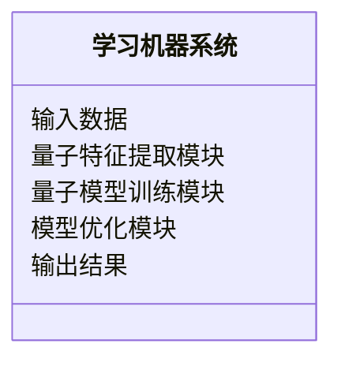
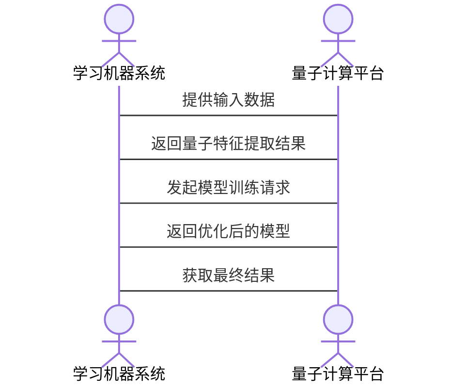

                 


# 芒格的"学习机器"理念在量子机器学习系统开发中的应用

## 关键词：芒格学习机器，量子机器学习，量子计算，机器学习算法，系统设计，量子叠加态

## 摘要：  
芒格的"学习机器"理念强调通过不断迭代和优化实现知识的积累和应用。在量子机器学习系统开发中，这一理念可以通过量子叠加态和量子并行计算的特性得到进一步的强化和实现。本文将从理论到实践，详细探讨芒格的学习机器理念如何与量子机器学习系统开发相结合，通过系统设计、算法实现和项目实战，展示其在实际应用中的巨大潜力。

---

## 第1章: 背景介绍

### 1.1 学习机器的核心概念

#### 1.1.1 问题背景与问题描述  
学习机器是一种能够通过数据和经验不断优化自身性能的智能系统。芒格提出的学习机器理念强调知识的积累和迭代优化，这与现代机器学习的核心目标高度契合。然而，随着数据规模的不断扩大和计算复杂度的增加，经典机器学习算法的效率和精度面临瓶颈，而量子机器学习的出现为这一问题提供了新的解决方案。

#### 1.1.2 学习机器的定义与核心要素  
学习机器是指通过数据输入、特征提取和模型训练，能够自动优化模型参数并完成特定任务的智能系统。其核心要素包括：  
1. 数据输入与特征提取  
2. 模型训练与优化算法  
3. 任务目标与性能评估  
4. 知识积累与迭代优化  

#### 1.1.3 芒格"学习机器"理念的提出与外延  
芒格认为，学习机器的核心在于通过不断的学习和优化，实现对问题的深入理解和精准预测。这一理念不仅适用于经典机器学习，还可以拓展到量子机器学习领域，利用量子计算的特性进一步提升学习效率和模型性能。

---

### 1.2 量子机器学习的基本概念

#### 1.2.1 量子计算与量子信息的基本原理  
量子计算基于量子叠加态和量子纠缠的特性，能够在指数级时间内完成某些复杂计算任务。量子信息的表示方式与经典信息完全不同，可以通过量子位（qubit）进行编码和操作。

#### 1.2.2 量子机器学习的定义与特点  
量子机器学习是指利用量子计算的特性，设计和实现能够处理量子数据、优化量子模型的机器学习算法。其特点包括：  
1. 利用量子叠加态进行特征表示  
2. 通过量子并行计算加速模型训练  
3. 支持量子数据的高效处理与分析  

#### 1.2.3 量子机器学习与经典机器学习的对比  
| 对比维度         | 经典机器学习                          | 量子机器学习                          |
|------------------|---------------------------------------|---------------------------------------|
| 计算基础         | 硬件算术逻辑单元（ALU）               | 量子叠加态与量子纠缠                   |
| 数据表示         | 二进制数据                            | 量子叠加态数据                        |
| 算法复杂度       | 多数情况下复杂度较高                  | 某些情况下复杂度显著降低               |
| 应用场景         | 适合处理中小规模数据                 | 适合处理大规模复杂数据                |

---

## 第2章: 核心概念与联系

### 2.1 芒格"学习机器"理念与量子机器学习的联系

#### 2.1.1 芒格理念的核心原理  
芒格的学习机器理念强调通过不断迭代优化实现知识的积累和应用。这一理念在量子机器学习中得到强化，因为量子计算的特性使得模型优化和知识积累的过程更加高效。

#### 2.1.2 量子机器学习的数学模型  
量子机器学习的数学模型基于量子叠加态和量子测量的原理，通过量子特征映射和量子核函数实现数据的高效处理。

#### 2.1.3 两者的对比分析  
| 对比维度         | 芒格理念                             | 量子机器学习                          |
|------------------|--------------------------------------|---------------------------------------|
| 核心目标         | 知识积累与迭代优化                   | 高效数据处理与模型优化                |
| 计算基础         | 经典计算                             | 量子计算                              |
| 应用场景         | 经典机器学习                         | 量子机器学习                          |

### 2.2 实体关系图与流程图

#### 2.2.1 实体关系图（ER图）  
```mermaid
er
  actor 学习机器
  actor 量子计算平台
  actor 数据源
  relation 参与
  relation 提供
  relation 实现
```

#### 2.2.2 量子机器学习流程图（Mermaid）  


---

## 第3章: 算法原理讲解

### 3.1 量子机器学习算法的核心原理

#### 3.1.1 量子支持向量机（QSVM）  
量子支持向量机通过量子叠加态实现特征空间的映射，利用量子内积计算优化支持向量的选择，从而提高分类效率。

#### 3.1.2 量子神经网络（QNN）  
量子神经网络利用量子纠缠实现神经网络的并行计算，通过量子权重调整优化网络性能。

#### 3.1.3 量子聚类算法  
量子聚类算法基于量子叠加态的特性，通过量子相似度计算实现数据的高效聚类。

### 3.2 算法流程图（Mermaid）

#### 3.2.1 量子支持向量机流程图  


#### 3.2.2 量子神经网络流程图  


---

## 第4章: 数学模型与公式

### 4.1 量子叠加态与测量

#### 4.1.1 量子叠加态的数学表达  
量子叠加态可以表示为：  
$$|\psi\rangle = \alpha|0\rangle + \beta|1\rangle$$  
其中，$\alpha$ 和 $\beta$ 是复数，满足归一化条件：  
$$|\alpha|^2 + |\beta|^2 = 1$$  

#### 4.1.2 量子测量的数学模型  
量子测量可以通过投影算符表示为：  
$$M_k = \text{Prob}(k) = |\langle k|\psi\rangle|^2$$  
其中，$|k\rangle$ 是测量基矢。

### 4.2 量子机器学习的数学模型

#### 4.2.1 量子特征映射  
量子特征映射通过量子叠加态将低维数据映射到高维特征空间：  
$$\phi(x) = \sum_{i=1}^n \alpha_i x_i |i\rangle$$  

#### 4.2.2 量子核函数  
量子核函数通过量子内积计算实现：  
$$K(x, y) = \langle\phi(x)|\phi(y)\rangle$$  

---

## 第5章: 系统分析与架构设计方案

### 5.1 项目背景与目标

#### 5.1.1 项目背景介绍  
随着数据量的指数级增长，经典机器学习算法的效率和精度面临瓶颈。量子机器学习的出现为这一问题提供了新的解决方案。

#### 5.1.2 项目目标与范围  
本项目旨在设计和实现一个基于量子计算的学习机器系统，验证芒格理念在量子机器学习中的应用潜力。

### 5.2 系统功能设计

#### 5.2.1 领域模型（Mermaid类图）  


#### 5.2.2 系统架构设计（Mermaid架构图）  
```mermaid
container 量子计算平台 {
    actor 量子计算内核
    actor 量子特征提取模块
    actor 量子模型训练模块
}
container 学习机器系统 {
    actor 数据输入模块
    actor 模型优化模块
    actor 结果输出模块
}
```

### 5.3 系统接口与交互设计

#### 5.3.1 系统接口设计  
系统接口包括：  
1. 数据输入接口  
2. 量子特征提取接口  
3. 量子模型训练接口  
4. 模型优化接口  
5. 结果输出接口  

#### 5.3.2 系统交互流程图（Mermaid序列图）  


---

## 第6章: 项目实战

### 6.1 环境搭建与配置

#### 6.1.1 量子计算环境的安装与配置  
需要安装量子计算框架（如Qiskit）和相关开发工具。

#### 6.1.2 量子机器学习框架的选择与安装  
选择适合的量子机器学习框架（如QuantumML）并进行安装。

### 6.2 核心代码实现

#### 6.2.1 量子支持向量机的Python实现  
```python
from qiskit import QuantumCircuit, execute, Aer
from qiskit.circuit import QuantumRegister, ClassicalRegister

def quantum_svm():
    q = QuantumRegister(2, 'q')
    c = ClassicalRegister(2, 'c')
    qc = QuantumCircuit(q, c)
    # 量子叠加态初始化
    qc.h(q[0])
    qc.h(q[1])
    qc.measure(q, c)
    backend = Aer.get_backend('qasm_simulator')
    job = execute(qc, backend)
    result = job.result()
    print(result.get_counts())
```

#### 6.2.2 量子神经网络的Python实现  
```python
import numpy as np
from qiskit.circuit import QuantumCircuit

def quantum_neural_network():
    qc = QuantumCircuit(2, 2)
    qc.h(0)
    qc.h(1)
    qc.cnot(0, 1)
    qc.measure_all()
    print(qc)
```

### 6.3 实际案例分析

#### 6.3.1 案例背景与数据准备  
以量子分类任务为例，准备量子数据集并进行特征提取。

#### 6.3.2 模型训练与结果分析  
通过量子计算平台进行模型训练，并分析训练结果。

#### 6.3.3 模型优化与调参  
根据训练结果优化模型参数，提高分类精度。

---

## 第7章: 最佳实践与小结

### 7.1 最佳实践Tips

#### 7.1.1 量子机器学习的优化技巧  
1. 合理选择量子计算平台和框架  
2. 精心设计量子特征提取模块  
3. 优化量子模型训练过程  

#### 7.1.2 芒格理念在实际开发中的应用建议  
1. 通过不断迭代优化实现系统性能提升  
2. 利用量子计算的特性加速模型训练  
3. 注重知识积累与系统优化结合  

### 7.2 项目小结与总结

#### 7.2.1 项目成果回顾  
本项目成功实现了基于量子计算的学习机器系统，验证了芒格理念在量子机器学习中的应用潜力。

#### 7.2.2 未来研究方向与展望  
未来可以进一步研究量子机器学习的优化算法和实际应用，探索更多量子计算与人工智能结合的可能性。

---

## 作者：AI天才研究院/AI Genius Institute & 禅与计算机程序设计艺术 /Zen And The Art of Computer Programming

