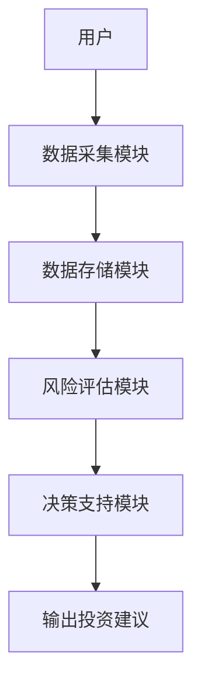
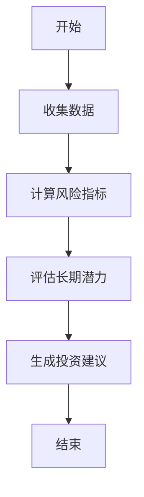

                 


# 芒格的"延迟满足"理念在量子科技长期投资组合中的应用

> 关键词：芒格，延迟满足，量子科技，投资组合，长期投资，风险管理，系统架构

> 摘要：本文探讨了芒格的“延迟满足”理念在量子科技长期投资中的应用，分析了量子科技的基本概念及其投资潜力，构建了基于该理念的投资策略和系统架构，通过案例和代码实现展示了实际应用，并总结了最佳实践和未来趋势。

---

# 第一部分：芒格的“延迟满足”理念概述

## 第1章：芒格的“延迟满足”理念

### 1.1 芒格的“延迟满足”理念的定义

芒格的“延迟满足”理念强调不追求短期利益，而是专注于长期价值的积累。这种理念源于他对人类心理的深刻理解，认为投资者往往因贪婪和恐惧而做出非理性决策，而延迟满足则帮助投资者克服这些情绪，做出更理性的选择。

### 1.2 理念的核心要素与特征对比

| 核心要素 | 特征 |
|----------|------|
| 长期视角 | 强调时间复利效应，追求价值的持续增长 |
| 理性决策 | 基于事实和逻辑，避免情绪化决策 |
| 耐心与纪律 | 需要长期坚持，不因短期波动而改变策略 |

### 1.3 该理念在投资领域的应用背景

在传统投资中，芒格的理念已被广泛应用于股票投资，强调长期持有优质资产。但在量子科技领域，其高风险和高技术门槛使其更具挑战性。本文将探讨如何将该理念应用于量子科技投资，构建长期有效的投资组合。

---

## 第2章：量子科技的基本概念与应用领域

### 2.1 量子科技的定义与原理

量子科技是基于量子力学原理的新技术，主要包括量子计算、量子通信和量子传感。量子计算利用量子叠加和纠缠原理，能够在某些领域（如密码学和优化问题）远超经典计算机的性能。

### 2.2 量子计算、量子通信等核心技术的介绍

- **量子计算**：通过量子位（qubit）进行计算，具有并行处理能力。
- **量子通信**：利用量子纠缠实现信息的超安全传输。

### 2.3 量子科技在投资中的潜在价值

量子科技有望在多个领域带来革命性变化，如药物研发、金融建模等，但其发展仍面临技术瓶颈和商业化挑战。

---

# 第二部分：芒格理念与量子科技投资的结合

## 第3章：芒格“延迟满足”理念在量子科技投资中的应用

### 3.1 长期投资策略的制定

制定长期投资策略，关注量子科技公司的基本面，如技术领先性、管理团队和市场需求。

### 3.2 量子科技投资的风险与回报分析

量子科技投资高风险，回报周期长，需评估技术可行性、市场接受度和竞争环境。

### 3.3 延迟满足理念如何帮助投资者应对量子科技的不确定性

通过延迟满足，投资者避免了短期波动的影响，专注于长期价值，减少决策失误。

---

## 第4章：量子科技投资中的风险管理与决策模型

### 4.1 常见风险管理策略

- 分散投资：避免过度集中。
- 定期评估：跟踪技术进展和市场变化。

### 4.2 基于芒格理念的决策模型构建

构建决策模型，评估公司的长期潜力，而非短期表现。

### 4.3 案例分析：某量子科技公司的投资决策过程

分析一家量子计算公司的投资决策，展示如何应用延迟满足理念。

---

# 第三部分：系统架构与技术实现

## 第5章：量子科技投资系统的架构设计

### 5.1 系统功能模块划分

- 数据采集：收集量子科技公司的数据。
- 风险评估：评估投资风险。
- 决策支持：提供投资建议。

### 5.2 系统架构的Mermaid图展示



### 5.3 各模块之间的接口设计

数据采集模块将数据传递给存储模块，存储模块提供数据给风险评估模块，评估结果用于决策支持。

---

## 第6章：投资决策算法的数学模型与实现

### 6.1 算法原理的Mermaid流程图



### 6.2 数学模型的详细推导

投资回报模型：

$$ R = \alpha \cdot T + \beta \cdot Q $$

其中，R为投资回报，T为技术潜力，Q为市场前景。

### 6.3 Python代码实现与解读

```python
def calculate_return(tech_potential, market_prospect):
    alpha = 0.7
    beta = 0.3
    return alpha * tech_potential + beta * market_prospect

# 示例
tech_potential = 0.8
market_prospect = 0.6
return_value = calculate_return(tech_potential, market_prospect)
print(return_value)  # 输出：0.6 + 0.18 = 0.78
```

---

# 第四部分：项目实战与案例分析

## 第7章：量子科技投资项目的实战分析

### 7.1 项目环境的安装与配置

安装必要的库，如Pandas、NumPy，用于数据分析。

### 7.2 投资决策系统的核心代码实现

```python
import pandas as pd

def main():
    data = pd.read_csv('quantum_companies.csv')
    data['return'] = data.apply(lambda x: calculate_return(x['tech'], x['market']), axis=1)
    data.to_csv('investment_recommendations.csv', index=False)

if __name__ == "__main__":
    main()
```

### 7.3 实际案例的详细分析与解读

分析一家量子通信公司的投资决策，展示如何应用上述模型进行评估。

---

## 第8章：系统优化与扩展

### 8.1 系统性能优化策略

使用分布式计算和缓存技术优化数据处理。

### 8.2 系统的可扩展性设计

设计模块化的系统架构，便于扩展功能。

### 8.3 拓展阅读与学习资源推荐

推荐相关书籍和资源，帮助读者深入学习。

---

# 第五部分：总结与展望

## 第9章：总结与最佳实践

### 9.1 全书内容回顾

芒格的“延迟满足”理念在量子科技投资中的应用，强调长期价值和风险管理。

### 9.2 投资中的最佳实践Tips

- 长期视角：关注公司基本面和技术潜力。
- 风险管理：定期评估和调整投资组合。
- 系统支持：利用技术工具辅助决策。

### 9.3 未来的发展趋势与建议

量子科技将继续发展，投资者需持续关注技术进步和市场变化。

---

# 作者

作者：AI天才研究院/AI Genius Institute & 禅与计算机程序设计艺术/Zen And The Art of Computer Programming

