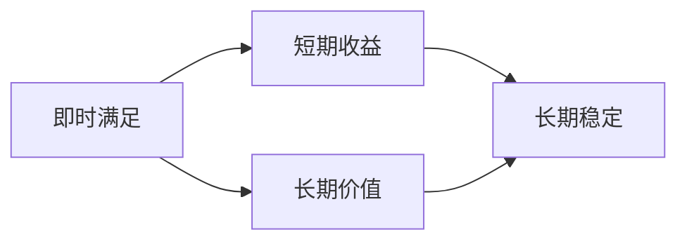
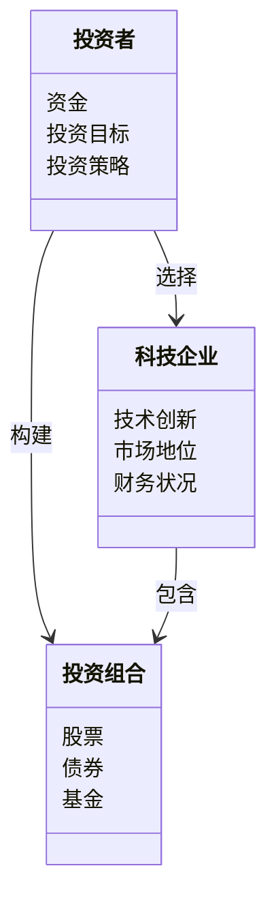

                 


# 芒格的"延迟满足"理念在长期科技投资组合中的应用

## 关键词：
芒格，延迟满足，长期投资，科技投资，投资组合，价值投资，风险管理

## 摘要：
本文深入探讨了芒格的“延迟满足”理念在长期科技投资中的应用。通过分析芒格的哲学和心理学基础，结合科技投资的特点，详细阐述了如何将“延迟满足”理念应用于投资策略的制定和实施。文章从理论到实践，通过具体案例分析和算法模型，展示了“延迟满足”在构建优质科技投资组合中的重要性，并提供了可操作的建议和最佳实践。

---

## 第一部分：芒格的“延迟满足”理念概述

### 第1章：芒格的“延迟满足”理念概述

#### 1.1 芒格的“延迟满足”理念的核心概念

##### 1.1.1 “延迟满足”的定义与内涵
“延迟满足”是一种心理和哲学概念，指的是个体在面对即时满足和长期利益之间，选择后者的能力。芒格将其应用于投资领域，强调投资者应避免短期波动的诱惑，专注于长期价值的积累。

图1.1：延迟满足的核心概念



##### 1.1.2 芒格“延迟满足”理念的哲学基础
芒格的理念深受时间价值理论的影响，认为时间是所有资产中最稀缺的资源。通过延迟满足，投资者能够更好地利用时间的复利效应，实现财富的长期增长。

##### 1.1.3 “延迟满足”在投资中的应用逻辑
- **短期波动的干扰**：市场的短期波动往往掩盖了企业的长期价值。
- **长期复利效应**：通过长期持有优质资产，投资者能够最大化复利效应。

#### 1.2 科技投资中的“延迟满足”理念

##### 1.2.1 科技投资的特点与挑战
- 科技行业的高波动性：技术革新和市场变化速度快。
- 企业的生命周期：科技企业往往需要较长时间才能体现出色的盈利能力。

##### 1.2.2 “延迟满足”在科技投资中的重要性
- **避免短期决策失误**：科技行业的高波动性容易导致投资者在短期亏损时放弃。
- **捕捉长期增长机会**：通过长期持有优质科技企业，投资者能够分享技术革新的红利。

---

## 第二部分：芒格“延迟满足”理念的理论基础

### 第2章：芒格“延迟满足”理念的哲学与心理学基础

#### 2.1 延迟满足的哲学思考

##### 2.1.1 延迟满足与时间价值理论
时间价值理论认为，资金的价值会随时间推移而变化。通过延迟满足，投资者能够更好地利用时间的复利效应。

图2.1：时间价值与复利效应


##### 2.1.2 延迟满足与机会成本的概念
机会成本是指为了选择某项投资而放弃的其他投资的潜在收益。延迟满足意味着投资者需要权衡短期收益与长期价值。

##### 2.1.3 延迟满足与投资决策的关系
- **短期诱惑与长期价值**：投资者需要在短期收益与长期价值之间做出选择。
- **心理与理性的平衡**：延迟满足需要投资者克服心理障碍，坚持理性的长期投资策略。

#### 2.2 延迟满足的心理学机制

##### 2.2.1 瞬时 gratification 的概念与影响
- **定义**：瞬时 gratification 是指追求即时的满足感，而忽视长期利益。
- **影响**：在投资中，瞬时 gratification 可能导致投资者频繁交易，从而降低长期收益。

##### 2.2.2 延迟满足与自我控制能力
- **自我控制**：延迟满足需要强大的自我控制能力，以抵制短期波动的干扰。
- **心理学实验**：著名的“糖果测试”表明，能够延迟满足的孩子在未来生活中表现更优秀。

##### 2.2.3 心理学实验对投资决策的启示
- **实验结果**：延迟满足能力与长期成功密切相关。
- **投资启示**：投资者需要培养延迟满足的能力，以实现长期财富增长。

---

## 第三部分：芒格“延迟满足”理念在投资策略中的应用

### 第3章：长期科技投资组合的构建逻辑

#### 3.1 长期科技投资的逻辑框架

##### 3.1.1 长期投资的核心要素
- **优质企业**：选择具有强大护城河和长期竞争优势的企业。
- **长期增长**：关注企业的技术革新和市场扩展能力。

##### 3.1.2 科技行业的周期性分析
- **周期性波动**：科技行业具有明显的周期性，投资者需要识别行业周期。
- **周期定位**：在行业低谷时布局，行业高峰期时收割。

##### 3.1.3 长期投资组合的构建原则
- **分散投资**：避免过度集中于单一行业或企业。
- **持续学习**：保持对科技行业的深入了解，及时调整投资组合。

#### 3.2 延迟满足理念在投资组合中的具体应用

##### 3.2.1 选择长期优质科技企业的标准
- **技术创新能力**：企业是否具备持续的技术创新能力。
- **市场定位**：企业是否占据市场领导地位。
- **财务健康**：企业是否具备稳健的财务状况。

##### 3.2.2 如何通过“延迟满足”优化投资组合
- **长期持有**：避免频繁交易，降低交易成本。
- **定投策略**：定期定额投资，分散风险。

##### 3.2.3 延迟满足与投资组合的风险管理
- **风险分散**：通过投资不同领域的科技企业降低风险。
- **风险管理**：定期评估投资组合，及时调整。

---

## 第四部分：芒格理念与科技投资的结合

### 第4章：芒格“延迟满足”理念与科技投资的结合

#### 4.1 科技投资中的“延迟满足”策略

##### 4.1.1 长期持有优质科技企业的逻辑
- **长期价值**：优质科技企业具备长期增长潜力。
- **复利效应**：通过长期持有，投资者能够最大化复利效应。

##### 4.1.2 如何通过“延迟满足”避免短期波动的干扰
- **心理调节**：克服短期亏损的心理压力。
- **策略坚持**：坚持长期投资策略，不被短期波动干扰。

##### 4.1.3 延迟满足与科技企业价值评估的关系
- **企业价值**：通过长期视角评估企业的内在价值。
- **市场波动**：忽略短期市场波动，关注长期趋势。

#### 4.2 芒格理念对科技投资决策的影响

##### 4.2.1 延迟满足与科技企业创新周期的匹配
- **创新周期**：科技企业的创新周期往往较长，需要投资者具备耐心。
- **创新评估**：通过长期视角评估企业的创新能力。

##### 4.2.2 延迟满足与科技投资的风险控制
- **风险识别**：通过长期视角识别投资风险。
- **风险控制**：通过分散投资和长期持有降低风险。

---

## 第五部分：项目实战与最佳实践

### 第5章：基于芒格理念的科技投资实战

#### 5.1 项目背景与目标
- **项目目标**：构建一个基于芒格理念的科技投资组合。
- **项目背景**：选择具有长期增长潜力的科技企业。

#### 5.2 系统功能设计

##### 5.2.1 领域模型
图5.1：科技投资领域的类图



#### 5.3 系统架构设计

##### 5.3.1 系统架构
图5.2：科技投资系统的架构图


#### 5.4 项目实战

##### 5.4.1 投资策略实现
- **代码示例**：构建投资组合的Python代码

```python
# 定义优质科技企业筛选标准
def select_high_quality_technology_companies():
    companies = [
        {'name': '亚马逊', '技术创新': 95, '市场地位': 90, '财务状况': 85},
        {'name': '苹果', '技术创新': 98, '市场地位': 95, '财务状况': 88},
        {'name': '微软', '技术创新': 92, '市场地位': 92, '财务状况': 87},
    ]
    return [c for c in companies if c['技术创新'] > 90 and c['市场地位'] > 90]

# 选择优质科技企业
selected_companies = select_high_quality_technology_companies()
print("优质科技企业：", [c['name'] for c in selected_companies])
```

##### 5.4.2 投资组合优化
- **代码示例**：计算投资组合的预期收益和风险

```python
import numpy as np

def calculate_portfolio_return(portfolio_weights, expected_returns):
    return np.dot(portfolio_weights, expected_returns)

def calculate_portfolio_risk(portfolio_weights, covariance_matrix):
    return np.sqrt(np.dot(portfolio_weights.T, np.dot(covariance_matrix, portfolio_weights)))

# 示例数据
portfolio_weights = [0.4, 0.3, 0.3]
expected_returns = [0.1, 0.12, 0.08]
covariance_matrix = np.array([[0.02, 0.01, 0.01],
                              [0.01, 0.03, 0.01],
                              [0.01, 0.01, 0.02]])

return_ = calculate_portfolio_return(portfolio_weights, expected_returns)
risk = calculate_portfolio_risk(portfolio_weights, covariance_matrix)

print(f"预期收益率：{return_}%")
print(f"投资组合风险：{risk}%")
```

##### 5.4.3 投资组合管理
- **代码示例**：定期调整投资组合的策略

```python
def rebalance_portfolio(portfolio_weights, new_weights):
    current_weights = portfolio_weights.copy()
    for i in range(len(current_weights)):
        current_weights[i] = new_weights[i]
    return current_weights

# 示例调整
new_weights = [0.35, 0.35, 0.3]
rebalanced_weights = rebalance_portfolio(portfolio_weights, new_weights)
print("调整后的投资组合权重：", rebalanced_weights)
```

#### 5.5 项目小结
- **小结**：通过芒格的“延迟满足”理念，投资者能够更好地构建和管理科技投资组合。
- **经验**：长期持有优质科技企业是实现财富增长的关键。
- **教训**：避免短期波动的干扰，坚持长期投资策略。

---

## 第六部分：最佳实践与总结

### 第6章：芒格“延迟满足”理念的应用总结

#### 6.1 投资策略中的注意事项
- **分散投资**：避免过度集中于单一企业或行业。
- **长期持有**：坚持长期投资策略，避免频繁交易。
- **风险管理**：定期评估投资组合，及时调整。

#### 6.2 小结
芒格的“延迟满足”理念为科技投资提供了重要的指导。通过坚持长期投资策略，投资者能够更好地捕捉科技行业的长期增长机会，实现财富的稳定增长。

#### 6.3 未来展望
- **科技行业的变化**：随着科技行业的快速发展，投资者需要不断更新知识和策略。
- **投资理念的演变**：芒格的“延迟满足”理念将不断适应新的投资环境。

---

## 作者：AI天才研究院/AI Genius Institute & 禅与计算机程序设计艺术 /Zen And The Art of Computer Programming

---

### 总结：
芒格的“延迟满足”理念为长期科技投资提供了重要的指导。通过坚持长期投资策略，投资者能够更好地捕捉科技行业的长期增长机会，实现财富的稳定增长。

