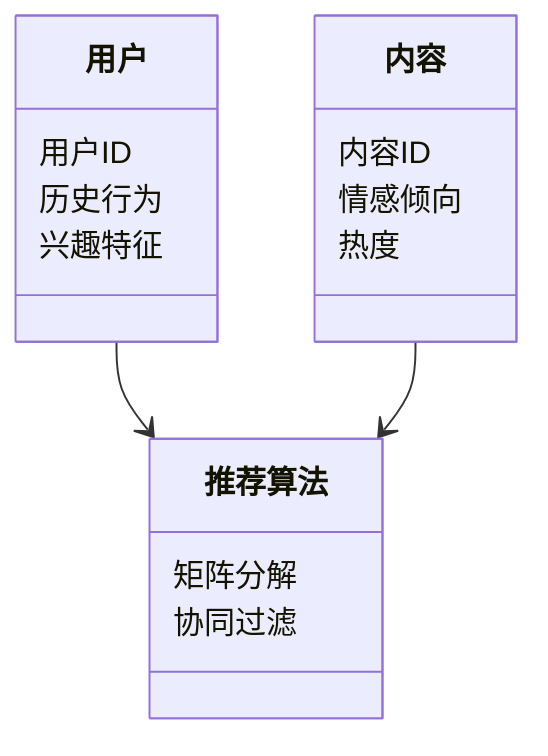

                 


# 芒格的"心理倾向"理论在社交媒体算法设计中的应用

> 关键词：芒格心理倾向理论，社交媒体算法，推荐系统，用户行为分析，信息传播

> 摘要：本文探讨了芒格提出的"心理倾向"理论在社交媒体算法设计中的应用。通过对用户行为中的心理倾向分析，结合实际的算法设计，展示了如何利用心理倾向理论优化社交媒体的内容推荐和信息传播机制，提升用户体验和平台运营效率。

---

## 第1章 心理倾向理论的背景与社交媒体算法设计

### 1.1 心理倾向理论的起源与核心概念

#### 1.1.1 心理倾向理论的提出背景
芒格的"心理倾向"理论源于他对人类决策过程的深入研究。他指出，人类在决策时会受到一系列心理倾向的影响，这些倾向包括但不限于从众心理、Confirmation Bias（确认偏差）、Negativity Bias（负面倾向）等。这些心理倾向不仅影响个人决策，还会影响群体行为。

#### 1.1.2 心理倾向的核心概念与特征
心理倾向是指个体在面对信息或选择时，由于认知偏差或情感因素导致的决策倾向。以下是几种常见的心理倾向及其特征：
- **从众心理（Social Proof）**：个体倾向于跟随大多数人的选择或行为。
- **确认偏差（Confirmation Bias）**：个体倾向于寻找或记住与自己现有观点一致的信息，忽略或遗忘相反的信息。
- **负面倾向（Negativity Bias）**：个体对负面信息更加敏感，容易受到负面信息的影响。

#### 1.1.3 心理倾向在决策中的作用
心理倾向在决策中的作用是多方面的。例如，从众心理可以影响用户在社交媒体上的内容选择，而确认偏差则可能导致用户停留在自己的信息茧房中。了解这些心理倾向，可以帮助我们更好地设计算法，引导用户行为。

---

### 1.2 社交媒体算法设计的基本原理

#### 1.2.1 社交媒体算法的基本概念
社交媒体算法是一种用于优化用户内容消费体验的数学规则。它通过分析用户行为、兴趣和网络结构，将内容排序或推荐给用户。

#### 1.2.2 算法在社交媒体中的应用领域
社交媒体算法的应用领域包括：
- 内容推荐：基于用户的兴趣和行为推荐相关内容。
- 信息流排序：根据用户偏好和内容特性排序信息流。
- 用户分组与画像：通过用户行为数据分析用户的兴趣和特征。

#### 1.2.3 算法设计的核心目标与挑战
算法设计的核心目标是提升用户体验和平台运营效率。然而，算法设计也面临以下挑战：
- 如何平衡个性化推荐和多样性。
- 如何避免算法导致的信息茧房效应。
- 如何应对用户行为的动态变化。

---

## 第2章 心理倾向理论与社交媒体的结合点

### 2.1 心理倾向在用户行为中的体现

#### 2.1.1 用户信息消费的典型心理倾向
在社交媒体中，用户的信息消费行为受到多种心理倾向的影响。例如：
- 用户倾向于点击与自己已有观点一致的内容（确认偏差）。
- 用户倾向于关注与自己相似的人（从众心理）。
- 用户对负面信息的反应更强烈（负面倾向）。

#### 2.1.2 社交媒体中的从众心理与信息传播
从众心理在社交媒体中的表现之一是“点赞”和“分享”行为。用户更倾向于点赞和分享那些大多数人点赞和分享的内容，从而形成信息传播的正反馈。

#### 2.1.3 用户决策中的Confirmation Bias与Negativity Bias
确认偏差和负面倾向在用户决策中表现得尤为明显。例如，用户更倾向于关注和传播与自己观点一致的内容，而对相反观点的内容持怀疑态度。

---

### 2.2 心理倾向对社交媒体算法设计的影响

#### 2.2.1 心理倾向如何影响内容推荐
心理倾向直接影响内容推荐的策略。例如：
- 基于从众心理，算法可以优先推荐那些被大量用户点赞或评论的内容。
- 基于确认偏差，算法可以向用户推荐与他们已有兴趣一致的内容。

#### 2.2.2 心理倾向在信息排序中的应用
在信息流排序中，心理倾向可以用来优化排序策略。例如：
- 将用户互动频繁的内容（如点赞、评论）排在前面（从众心理）。
- 优先展示用户可能感兴趣的内容（确认偏差）。

#### 2.2.3 心理倾向对用户参与度的提升作用
通过利用心理倾向，算法可以提升用户的参与度。例如：
- 通过推荐用户感兴趣的内容，增加用户的点击率。
- 通过展示用户的从众行为（如“附近的人也在看”），增加用户的参与感。

---

## 第3章 基于心理倾向的社交媒体算法设计

### 3.1 心理倾向驱动的推荐算法

#### 3.1.1 基于心理倾向的推荐模型构建
基于心理倾向的推荐模型需要考虑以下因素：
- 用户的历史行为数据（如点击、点赞、评论）。
- 用户的社交网络结构（如关注的人、粉丝数）。
- 内容的特性（如情感倾向、热度）。

#### 3.1.2 算法实现步骤与流程
以下是基于心理倾向的推荐算法的实现步骤：
1. 数据采集：收集用户的点击、点赞、评论等行为数据。
2. 数据分析：分析用户行为数据，提取用户的兴趣特征。
3. 内容分析：分析内容的情感倾向和热度。
4. 推荐策略：根据心理倾向设计推荐策略（如从众策略、确认偏差策略）。
5. 推荐结果：生成推荐内容并排序。

#### 3.1.3 推荐结果的优化策略
为了优化推荐结果，可以采取以下策略：
- 结合协同过滤（Collaborative Filtering）技术，提升推荐的个性化。
- 通过A/B测试，优化推荐策略的有效性。

---

### 3.2 心理倾向在信息流排序中的应用

#### 3.2.1 信息排序算法的基本原理
信息流排序算法的核心是根据用户的偏好和内容特性，对内容进行排序。常见的排序算法包括：
- 基于点击率（CTR）的排序。
- 基于协同过滤的排序。

#### 3.2.2 心理倾向对排序策略的影响
心理倾向对排序策略的影响主要体现在以下方面：
- 从众心理：优先排序那些被大量用户互动的内容。
- 确认偏差：优先排序与用户历史行为一致的内容。
- 负面倾向：对负面内容进行降权或过滤。

#### 3.2.3 实例
假设用户最近频繁浏览科技新闻，算法可以根据确认偏差优先推荐科技相关的深度文章，同时根据从众心理推荐其他用户也在关注的科技新闻。

---

## 第4章 心理倾向理论在社交媒体算法中的数学模型与实现

### 4.1 心理倾向驱动的推荐模型

#### 4.1.1 模型构建
基于心理倾向的推荐模型可以采用矩阵分解的方法。假设用户-内容矩阵为 \( R \)，其中 \( R_{u,i} = 1 \) 表示用户 \( u \) 对内容 \( i \) 有互动行为，否则为0。矩阵分解的目标是找到用户因子矩阵 \( P \) 和内容因子矩阵 \( Q \)，使得 \( R \approx P \times Q^T \)。

#### 4.1.2 推荐结果计算
推荐结果可以通过以下公式计算：
$$
score(u, i) = P_u \times Q_i^T
$$
其中，\( P_u \) 是用户 \( u \) 的因子向量，\( Q_i \) 是内容 \( i \) 的因子向量。

---

## 第5章 心理倾向理论在社交媒体算法中的系统架构设计

### 5.1 系统功能设计

#### 5.1.1 领域模型（Mermaid 类图）


#### 5.1.2 系统架构（Mermaid 架构图）
```mermaid
subgraph 用户端
    user
end
subgraph 服务端
    web server
    database
    recommendation engine
end
subgraph 第三方服务
    analytics
end
user --> web server
web server --> database
web server --> recommendation engine
recommendation engine --> analytics
```

---

## 第6章 项目实战：基于心理倾向的社交媒体推荐系统

### 6.1 环境安装与配置
- 安装Python和必要的库（如scikit-learn、numpy）。
- 数据库选择MySQL或MongoDB。

### 6.2 核心代码实现

#### 6.2.1 数据预处理
```python
import numpy as np
import pandas as pd

# 加载数据
data = pd.read_csv('user_behavior.csv')

# 数据预处理
from sklearn.preprocessing import StandardScaler
scaler = StandardScaler()
scaled_data = scaler.fit_transform(data[['feature1', 'feature2']])
```

#### 6.2.2 矩阵分解实现
```python
from sklearn.decomposition import NMF

# 矩阵分解
nmf = NMF(n_components=5, random_state=42)
nmf.fit(scaled_data)

# 提取用户因子和内容因子
P = nmf.components_
Q = nmf.transform(scaled_data)
```

---

## 第7章 总结与展望

### 7.1 总结
本文通过分析芒格的"心理倾向"理论，探讨了其在社交媒体算法设计中的应用。通过结合用户行为和算法设计，我们可以更好地理解用户决策过程，优化社交媒体的内容推荐和信息传播机制。

### 7.2 小结与注意事项
- 在设计算法时，需注意避免算法导致的信息茧房效应。
- 需持续关注用户行为的变化，动态调整算法策略。
- 推荐进一步研究心理倾向的多样性及其在算法中的应用。

### 7.3 拓展阅读
- "Thinking, Fast and Slow" by Daniel Kahneman
- "The Psychology of Social Media" byocial Media Research Group

---

作者：AI天才研究院/AI Genius Institute & 禅与计算机程序设计艺术 /Zen And The Art of Computer Programming

