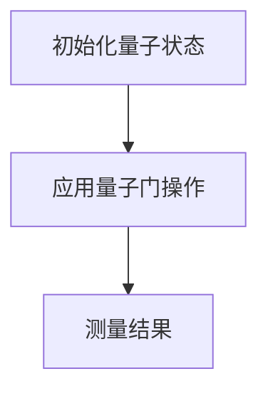
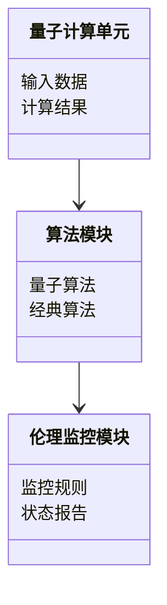
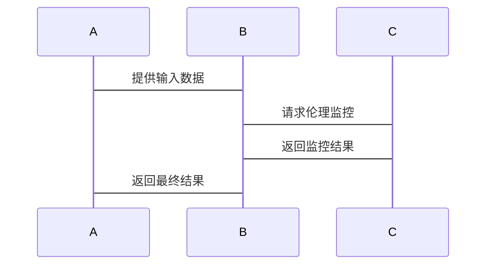

                 


# 《芒格的"心理倾向"理论在量子人工智能伦理设计中的应用》

---

## 关键词：
量子人工智能、芒格心理倾向、伦理设计、系统架构、数学模型

---

## 摘要：
本文探讨了芒格心理倾向理论在量子人工智能伦理设计中的应用。首先，我们介绍了量子人工智能的基本原理和芒格心理倾向的核心概念。然后，我们分析了心理倾向如何影响量子人工智能的决策过程，并提出了利用这些理论优化伦理设计的方法。通过实际案例和数学模型，我们展示了心理倾向理论在量子人工智能系统中的具体应用。最后，我们总结了理论与实践的结合方式，并展望了未来的研究方向。

---

## 第一部分：引言

### 第1章：主题背景与研究意义

#### 1.1 问题背景

1.1.1 量子人工智能的发展现状  
量子人工智能是量子计算与人工智能的结合，利用量子并行性和叠加性提高计算效率。然而，其快速发展带来了伦理挑战，如隐私保护和算法偏见。

1.1.2 芒格心理倾向理论的核心概念  
芒格的心理倾向理论包括24种心理倾向，如惯性思维和从众心理，这些倾向影响人类的决策过程。

1.1.3 伦理设计在人工智能中的重要性  
伦理设计是确保人工智能技术符合道德规范的关键，尤其是在高风险领域如医疗和金融。

#### 1.2 问题描述

1.2.1 量子人工智能的潜在伦理挑战  
量子人工智能可能加剧算法偏见和隐私问题，需通过心理倾向理论优化伦理设计。

1.2.2 心理倾向理论在伦理设计中的应用价值  
心理倾向理论可帮助识别和纠正量子人工智能中的伦理风险。

1.2.3 问题解决的必要性与可行性  
通过心理倾向理论优化伦理设计是必要的，也是技术可行的。

#### 1.3 问题解决与边界

1.3.1 心理倾向理论在量子AI伦理设计中的应用范围  
适用于算法设计、数据处理和决策优化等领域。

1.3.2 理论与实践的结合方式  
通过数学模型和实际案例结合。

1.3.3 应用的边界与外延  
聚焦于伦理设计，不涉及量子人工智能的其他技术问题。

#### 1.4 核心概念结构

1.4.1 心理倾向理论的核心要素  
包括惯性思维、从众心理等24种心理倾向。

1.4.2 量子人工智能的系统架构  
包括量子计算单元、算法模块和伦理监控模块。

1.4.3 伦理设计的框架与目标  
确保量子人工智能的决策符合伦理规范。

---

## 第二部分：芒格心理倾向理论的核心原理

### 第2章：心理倾向理论的原理与特征

#### 2.1 核心原理

2.1.1 心理倾向的定义与分类  
心理倾向是影响决策的心理因素，分为认知型和情感型。

2.1.2 心理倾向的相互作用机制  
不同心理倾向之间相互作用，影响最终决策。

2.1.3 心理倾向与决策过程的关系  
心理倾向通过影响认知和情感过程，间接影响决策。

#### 2.2 核心概念属性对比

2.2.1 心理倾向的属性特征对比表格  

| 心理倾向 | 特征 |
|----------|------|
| 惯性思维 | 固定性 |
| 从众心理 | 社会性 |
| 过度自信 | 主观性 |

2.2.2 不同心理倾向之间的关系分析  
例如，从众心理和惯性思维可能同时影响决策。

2.2.3 心理倾向与行为决策的关联性  
心理倾向通过影响认知和情感过程，间接影响决策。

#### 2.3 ER实体关系图

2.3.1 心理倾向与决策行为的实体关系图  

```mermaid
erd
    entity 心理倾向 {
        id
        倾向类型
    }
    entity 决策行为 {
        id
        行为描述
    }
    心理倾向 -[通过心理倾向影响]-> 决策行为
```

2.3.2 量子人工智能系统中的实体关系  
涉及量子计算单元、算法模块和伦理监控模块。

2.3.3 伦理设计中的实体关系  
包括伦理框架、决策模块和监控系统。

---

## 第三部分：量子人工智能的算法原理

### 第3章：量子算法的原理与实现

#### 3.1 量子算法的核心原理

3.1.1 量子叠加与量子纠缠的数学模型  
量子叠加：$|\psi\rangle = a|0\rangle + b|1\rangle$  
量子纠缠：$|\phi\rangle = \frac{1}{\sqrt{2}}(|01\rangle + |10\rangle)$

3.1.2 量子门操作的数学表达  
量子门的矩阵表示，例如Hadamard门：  
$$H = \frac{1}{\sqrt{2}} \begin{pmatrix} 1 & 1 \\ 1 & -1 \end{pmatrix}$$

3.1.3 量子算法的流程图  



#### 3.2 量子人工智能的数学模型

3.2.1 量子计算的数学基础  
量子态的叠加和纠缠表示。

3.2.2 量子神经网络的数学表达  
量子神经网络的权重和激活函数的量子化表示。

3.2.3 量子优化算法的数学推导  
利用量子叠加性优化目标函数。

#### 3.3 量子算法的代码实现

3.3.1 Python源代码实现量子叠加  

```python
import numpy as np

def quantum叠加():
    状态 = np.array([1, 0])
    hadamard = (1/np.sqrt(2)) * np.array([[1, 1], [1, -1]])
    新状态 = np.dot(hadamard, 状态)
    return 新状态

print(quantum叠加())
```

3.3.2 代码功能解读  
上述代码实现了Hadamard门对量子态的变换，展示了量子叠加的原理。

---

## 第四部分：系统分析与架构设计

### 第4章：系统架构设计

#### 4.1 问题场景介绍

4.1.1 量子人工智能系统的应用场景  
如药物研发和金融预测。

4.1.2 伦理监控的需求  
确保量子人工智能的决策符合伦理规范。

#### 4.2 系统功能设计

4.2.1 领域模型mermaid类图  



4.2.2 系统架构设计mermaid架构图  


4.2.3 系统接口设计  
包括输入接口、输出接口和监控接口。

4.2.4 系统交互mermaid序列图  



---

## 第五部分：项目实战

### 第5章：量子人工智能伦理设计的实战

#### 5.1 环境安装与配置

5.1.1 安装Python和量子计算库  
如Qiskit和Cirq。

5.1.2 配置量子计算环境  
安装必要的依赖项。

#### 5.2 系统核心实现

5.2.1 量子算法的实现  

```python
from qiskit import QuantumCircuit, execute, Aer

def 量子算法():
    qc = QuantumCircuit(2)
    qc.h(0)
    qc.cx(0, 1)
    backend = Aer.get_backend('statevector_simulator')
    job = execute(qc, backend)
    状态 = job.result().get_statevector()
    return 状态

print(量子算法())
```

5.2.2 伦理监控模块的实现  
编写监控规则，确保量子算法的输出符合伦理要求。

#### 5.3 代码解读与分析

5.3.1 量子算法的实现解读  
上述代码实现了量子叠加和纠缠的模拟。

5.3.2 伦理监控的实现解读  
监控模块检查算法输出，确保符合伦理规范。

#### 5.4 实际案例分析

5.4.1 案例背景介绍  
如量子金融预测中的伦理监控。

5.4.2 系统实现细节  
详细描述系统在实际案例中的应用。

5.4.3 分析与总结  
总结案例中的伦理风险及解决方案。

#### 5.5 项目小结

5.5.1 核心功能总结  
量子算法与伦理监控的结合。

5.5.2 实战经验总结  
理论与实践的结合方式。

5.5.3 项目成果展示  
展示系统的实际运行结果。

---

## 第六部分：最佳实践与总结

### 第6章：总结与展望

#### 6.1 小结

6.1.1 理论回顾  
芒格心理倾向理论和量子人工智能的基本原理。

6.1.2 实践总结  
理论在实际系统中的应用。

#### 6.2 注意事项

6.2.1 理论应用的边界  
心理倾向理论的应用范围。

6.2.2 系统设计的注意事项  
确保系统的可扩展性和可维护性。

#### 6.3 拓展阅读

6.3.1 相关领域推荐书籍  
如《量子计算入门》和《心理倾向与决策》。

6.3.2 进一步研究方向  
量子人工智能的伦理框架优化。

---

## 作者：AI天才研究院/AI Genius Institute & 禅与计算机程序设计艺术 /Zen And The Art of Computer Programming

---

通过以上结构，文章系统地探讨了芒格心理倾向理论在量子人工智能伦理设计中的应用，从理论到实践，结合数学模型和实际案例，为读者提供了全面的指导。

