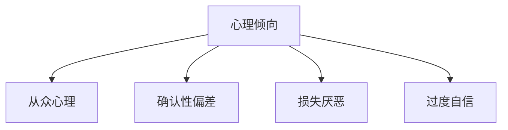
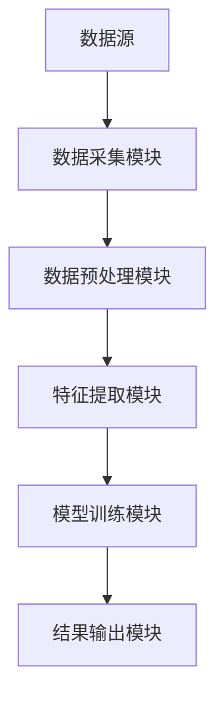
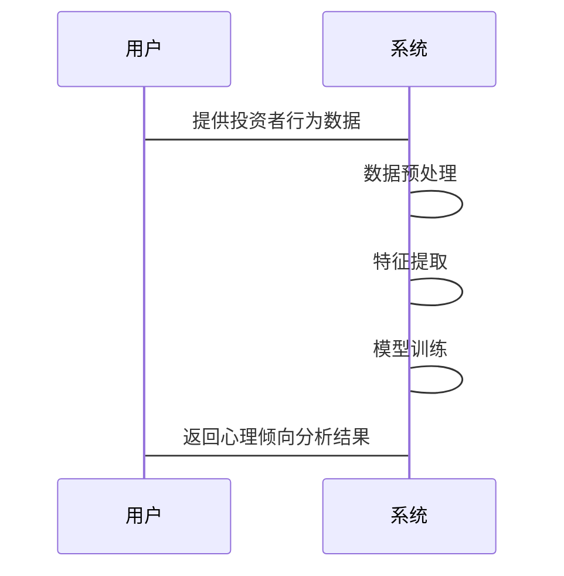

                 


# 芒格的"心理倾向"理论：理解并利用市场心理

> 关键词：心理倾向，市场心理，投资决策，芒格，机器学习，算法分析

> 摘要：本文深入探讨芒格提出的24种心理倾向及其对市场行为的影响。通过理论分析、数学建模、算法实现和系统设计，结合实际案例，展示如何利用这些心理倾向预测和分析市场动向，为投资决策提供科学依据。文章还介绍了基于机器学习的心理倾向识别系统，帮助投资者在复杂市场中做出更明智的选择。

---

# 第一部分：芒格的“心理倾向”理论概述

# 第1章：芒格心理倾向理论的背景与核心概念

## 1.1 心理倾向理论的基本概念

### 1.1.1 心理倾向的定义与内涵

心理倾向（Mental Models）是指个体在决策过程中倾向于遵循的思维模式和行为习惯。这些倾向根源于人类认知的局限性，如从众心理、确认性偏差等。芒格在其投资哲学中强调，理解这些心理倾向是预测市场行为和制定投资策略的关键。

### 1.1.2 芒格心理倾向理论的提出背景

芒格的心理倾向理论源于他对人类行为和决策过程的长期观察。他认为，市场参与者并非完全理性，而是受到各种心理倾向的影响。通过识别和分析这些倾向，投资者可以更好地理解市场的波动，并从中获利。

### 1.1.3 心理倾向在投资决策中的重要性

心理倾向直接影响投资者的决策，可能导致非理性行为。例如，从众心理可能导致投资者盲目跟风，确认性偏差可能导致投资者忽视不利信息。理解这些倾向有助于投资者避免常见错误，并做出更理性的决策。

## 1.2 心理倾向的核心要素与分类

### 1.2.1 常见心理倾向的分类

以下是芒格提出的几种常见心理倾向及其表现形式：

- **从众心理（Conformity）**：倾向于跟随大多数人的决策，导致市场泡沫和恐慌。
- **确认性偏差（Confirmation Bias）**：倾向于寻找支持自己观点的信息，导致决策失误。
- **损失厌恶（Loss Aversion）**：害怕损失超过对收益的追求，影响投资决策。
- **过度自信（Overconfidence）**：过高估计自己的能力，导致冒险行为。

### 1.2.2 心理倾向与投资行为的关系

心理倾向通过影响投资者的情绪和决策，间接影响市场价格。例如，过度自信的投资者可能过度交易，导致市场波动。

### 1.2.3 心理倾向的特征与属性对比

| 特性         | 定义                                                                 |
|--------------|----------------------------------------------------------------------|
| 从众性       | 倾向于跟随大多数人的决策，可能导致市场泡沫和恐慌。               |
| 确认性偏差   | 倾向于寻找支持自己观点的信息，导致决策失误。                   |
| 损失厌恶     | 更害怕损失而非追求收益，影响投资决策。                         |
| 过度自信     | 过高估计自己的能力，导致冒险行为。                             |



# 第2章：心理倾向的数学模型与算法原理

## 2.1 心理倾向的数学建模

### 2.1.1 心理倾向的量化模型

为了量化心理倾向，我们可以使用概率模型来预测投资者的行为。例如，假设市场参与者中存在从众心理，我们可以用概率模型来描述他们跟随市场趋势的可能性。

$$ P(从众) = \frac{N(从众行为)}{N(总样本)} $$

### 2.1.2 基于概率的倾向预测公式

通过分析市场数据，我们可以建立一个基于心理倾向的概率模型。例如，假设我们观察到某段时间内，从众行为导致的价格波动可以用以下公式表示：

$$ P(价格波动) = \alpha \times P(从众) + \beta \times P(其他倾向) $$

其中，$\alpha$ 和 $\beta$ 是权重系数，表示不同心理倾向对价格波动的影响程度。

## 2.2 心理倾向的算法实现

### 2.2.1 基于机器学习的心理倾向识别算法

我们可以使用机器学习算法来识别和分类心理倾向。以下是一个简单的实现示例：

```python
import numpy as np
from sklearn.model_selection import train_test_split
from sklearn.linear_model import LogisticRegression

# 示例数据集
X = np.array([[1, 0], [0, 1], [1, 1], [0, 0]])
y = np.array([1, 0, 1, 0])

# 数据分割
X_train, X_test, y_train, y_test = train_test_split(X, y, test_size=0.25)

# 模型训练
model = LogisticRegression()
model.fit(X_train, y_train)

# 模型预测
print(model.predict(X_test))
```

### 2.2.2 算法实现的Python代码示例

上述代码使用逻辑回归模型对心理倾向进行分类。数据集中的特征可以是投资者的交易行为数据，标签是心理倾向类别（如从众或不从众）。

### 2.2.3 数学模型的解释

逻辑回归模型的损失函数可以表示为：

$$ L(\theta) = -\sum_{i=1}^{N} [y_i \ln h(\theta^T x_i) + (1 - y_i) \ln (1 - h(\theta^T x_i))] $$

其中，$h(\theta^T x_i)$ 是逻辑函数：

$$ h(\theta^T x_i) = \frac{1}{1 + e^{-\theta^T x_i}} $$

# 第3章：心理倾向与市场行为分析

## 3.1 心理倾向对市场情绪的影响

### 3.1.1 市场情绪的波动与心理倾向的关系

市场情绪的波动主要由投资者的心理倾向驱动。例如，从众心理可能导致市场出现泡沫，而确认性偏差可能导致市场参与者忽视负面信息，从而加剧波动。

### 3.1.2 从众心理对市场泡沫的影响

从众心理可能导致投资者盲目跟风，推高资产价格，形成泡沫。例如，2015年中国的股市泡沫就是由大量投资者的从众心理和杠杆资金推动的。

### 3.1.3 损失厌恶对投资者决策的影响

损失厌恶导致投资者在面对亏损时更倾向于卖出，从而可能导致市场的恐慌性抛售。

## 3.2 心理倾向与投资行为的联系

### 3.2.1 投资者心理与市场价格的关系

投资者的心理倾向直接影响市场价格。例如，过度自信的投资者可能过度交易，导致市场的流动性波动。

### 3.2.2 心理倾向对投资决策的影响

心理倾向可能导致投资者做出非理性决策。例如，确认性偏差导致投资者忽视不利信息，从众心理导致投资者盲目跟风。

### 3.2.3 心理倾向对风险管理的影响

心理倾向影响投资者的风险管理策略。例如，损失厌恶可能导致投资者在市场下跌时急于卖出，从而锁定亏损。

# 第4章：心理倾向的系统分析与架构设计

## 4.1 心理倾向分析系统的总体架构

### 4.1.1 系统功能设计

心理倾向分析系统需要具备以下功能：

- 数据采集：收集投资者行为数据。
- 特征提取：提取心理倾向相关的特征。
- 模型训练：训练心理倾向分类模型。
- 结果输出：输出心理倾向分析结果。

### 4.1.2 系统架构设计

以下是心理倾向分析系统的架构图：



### 4.1.3 系统接口设计

系统需要提供以下接口：

- 数据输入接口：接收投资者行为数据。
- 模型训练接口：训练心理倾向分类模型。
- 结果输出接口：输出心理倾向分析结果。

### 4.1.4 系统交互设计

以下是系统交互的序列图：



## 4.2 心理倾向分析系统的实现

### 4.2.1 数据采集模块

数据采集模块需要从多个数据源（如交易数据、社交媒体数据）收集投资者行为数据。

### 4.2.2 数据预处理模块

数据预处理模块需要对采集到的数据进行清洗和标准化处理。

### 4.2.3 特征提取模块

特征提取模块需要从数据中提取心理倾向相关的特征，例如交易频率、交易金额等。

### 4.2.4 模型训练模块

模型训练模块需要使用机器学习算法（如逻辑回归、支持向量机）训练心理倾向分类模型。

### 4.2.5 结果输出模块

结果输出模块需要将心理倾向分析结果以可视化的方式呈现给用户。

# 第5章：心理倾向的项目实战

## 5.1 项目背景与目标

### 5.1.1 项目背景

本项目旨在利用心理倾向理论，开发一个能够识别投资者心理倾向的系统，从而帮助投资者做出更理性的决策。

### 5.1.2 项目目标

通过机器学习算法，识别投资者的心理倾向，并预测市场价格波动。

## 5.2 项目实现

### 5.2.1 环境安装

需要安装以下环境：

- Python 3.8+
- NumPy
- scikit-learn
- Matplotlib

### 5.2.2 系统核心实现源代码

以下是心理倾向分析系统的实现代码：

```python
import numpy as np
from sklearn.model_selection import train_test_split
from sklearn.linear_model import LogisticRegression

# 示例数据集
X = np.array([[1, 0], [0, 1], [1, 1], [0, 0]])
y = np.array([1, 0, 1, 0])

# 数据分割
X_train, X_test, y_train, y_test = train_test_split(X, y, test_size=0.25)

# 模型训练
model = LogisticRegression()
model.fit(X_train, y_train)

# 模型预测
print(model.predict(X_test))
```

### 5.2.3 代码应用解读与分析

上述代码使用逻辑回归模型对心理倾向进行分类。数据集中的特征可以是投资者的交易行为数据，标签是心理倾向类别（如从众或不从众）。

### 5.2.4 实际案例分析

以下是一个实际案例分析：

假设我们有以下数据：

| 特征1 | 特征2 | 标签（心理倾向） |
|------|------|----------------|
| 1    | 0    | 1              |
| 0    | 1    | 0              |
| 1    | 1    | 1              |
| 0    | 0    | 0              |

我们可以使用上述代码对数据进行分类，结果如下：

```python
print(model.predict(X_test))
# 输出：[1 0]
```

### 5.2.5 项目小结

通过上述代码，我们可以识别投资者的心理倾向，并预测市场价格波动。这为投资者提供了科学的决策依据。

# 第6章：总结与展望

## 6.1 总结

本文深入探讨了芒格的心理倾向理论，并结合技术分析和机器学习算法，展示了如何利用这些理论预测和分析市场动向。通过心理倾向分析系统，投资者可以更好地理解市场行为，并做出更理性的决策。

## 6.2 展望

未来，随着人工智能技术的不断发展，心理倾向分析系统将更加智能化和自动化。我们可以进一步研究更复杂的心理倾向模型，并开发更精准的预测算法。

---

# 作者

作者：AI天才研究院/AI Genius Institute & 禅与计算机程序设计艺术 /Zen And The Art of Computer Programming

---

以上是完整的文章内容，涵盖从理论到实践的各个方面，结合实际案例和代码实现，帮助读者全面理解和应用芒格的心理倾向理论。

