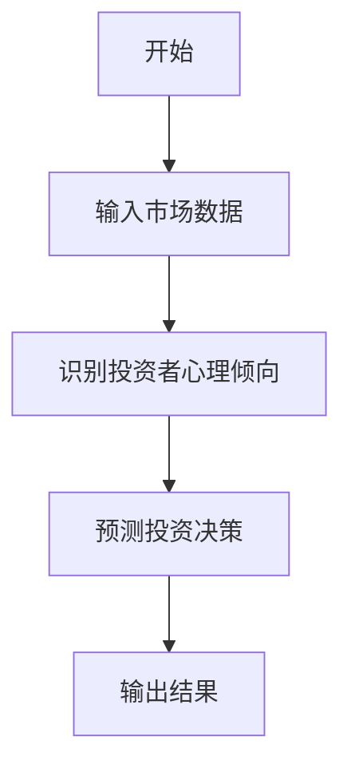
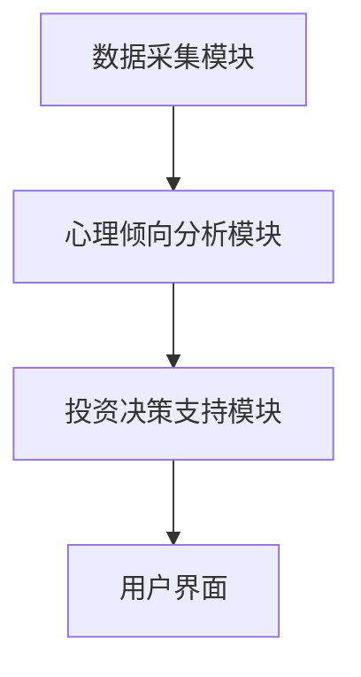

                 


# 芒格的心理学应用：在投资中利用人性弱点

> 关键词：芒格心理学投资，人性弱点，心理倾向，价值投资，投资策略

> 摘要：本文探讨了芒格如何利用心理学知识，特别是人类的弱点和心理倾向，来优化投资决策和策略。通过分析这些心理倾向如何影响市场行为，我们可以更好地理解投资中的心理因素，并利用这些知识来制定更有效的投资策略。

---

# 目录

1. 芒格的心理学投资背景  
   1.1 芒格的背景与投资理念  
   1.2 心理学在投资中的重要性  

2. 心理倾向与投资决策的关系  
   2.1 芒格列出的心理倾向  
   2.2 心理倾向对投资决策的影响  

3. 芒格心理学投资的算法与数学模型  
   3.1 心理倾向分析的算法原理  
   3.2 数学模型与公式  

4. 系统分析与架构设计方案  
   4.1 系统功能设计  
   4.2 系统架构设计  

5. 项目实战：基于芒格心理学的投资策略  
   5.1 实战案例分析  
   5.2 代码实现与应用  

6. 最佳实践、小结与注意事项  
   6.1 投资中的心理学应用总结  
   6.2 小结与未来展望  

---

# 正文

## 第1章：芒格的心理学投资背景

### 1.1 芒格的背景与投资理念

#### 1.1.1 芒格的背景
查理·芒格（Charlie Munger）是世界著名投资家，沃伦·巴菲特（Warren Buffett）的长期合作伙伴。芒格的智慧不仅体现在投资上，还体现在他对人类心理的深刻理解。他提出的“心理倾向”理论，为投资者提供了一种独特的视角来分析市场行为和决策。

#### 1.1.2 芒格的投资理念
芒格的价值投资理念强调长期投资、安全边际和对公司基本面的深入分析。他认为，投资者应该避免被市场波动和短期情绪左右，而是要专注于企业的内在价值。

#### 1.1.3 芒格与巴菲特的伙伴关系
芒格和巴菲特的伙伴关系是投资界的传奇。芒格为巴菲特提供了心理学和决策科学的视角，而巴菲特则为芒格提供了实践投资的平台。

### 1.2 心理学在投资中的重要性

#### 1.2.1 投资中的心理学基础
心理学在投资中的作用不容忽视。投资者的情绪、认知偏差和行为模式都会影响他们的决策。了解这些心理因素，可以帮助投资者做出更理性的决策。

#### 1.2.2 人性弱点如何影响投资决策
人性的弱点，如贪婪、恐惧和从众心理，常常导致投资者做出错误的决策。例如，当市场上涨时，投资者容易过于乐观，盲目追涨；当市场下跌时，投资者容易恐慌，急于抛售。

#### 1.2.3 心理学与价值投资的结合
芒格将心理学与价值投资结合起来，提出了“心理倾向”的概念。他认为，投资者应该识别并克服这些倾向，以避免错误的投资决策。

---

## 第2章：心理倾向与投资决策的关系

### 2.1 芒格列出的心理倾向

#### 2.1.1 心理倾向的核心概念
芒格列出了24种主要的心理倾向，这些倾向包括从众心理、自我认同倾向、恐惧与贪婪等。每种倾向都有其独特的表现和影响。

#### 2.1.2 心理倾向的分类与特征
以下是芒格列出的几种主要心理倾向及其特征：

| 心理倾向       | 特征描述                                                                 |
|----------------|--------------------------------------------------------------------------|
| 从众心理       | 倾向于跟随大多数人，避免与众不同的风险。                                 |
| 自我认同倾向   | 过度依赖自己的观点，拒绝接受与自己不同的信息。                           |
| 恐惧与贪婪     | 恐惧导致恐慌性抛售，贪婪导致盲目追涨。                                   |
| 确认偏误       | 过度依赖支持自己观点的信息，忽略相反的证据。                             |

#### 2.1.3 心理倾向对投资决策的影响
心理倾向会影响投资者的决策过程。例如，从众心理可能导致投资者盲目跟随市场趋势，而忽视基本面分析。

---

## 第3章：芒格心理学投资的算法与数学模型

### 3.1 心理倾向分析的算法原理

#### 3.1.1 算法的目标与基本原理
心理倾向分析算法的目标是识别和分类投资者的心理倾向，并预测这些倾向如何影响他们的投资决策。

#### 3.1.2 算法的输入与输出
- **输入**：市场数据、投资者行为数据
- **输出**：心理倾向分类、投资决策预测

#### 3.1.3 算法流程图
以下是心理倾向分析算法的Mermaid流程图：



### 3.2 数学模型与公式

#### 3.2.1 心理倾向分析的数学模型
概率论和统计学是分析心理倾向的重要工具。例如，可以通过概率模型预测投资者在特定市场条件下的心理倾向。

#### 3.2.2 心理倾向分析的数学公式
以下是一个简单的概率模型，用于预测投资者从众心理的概率：

$$ P(\text{从众心理}) = \frac{\text{市场趋势强度}}{\text{市场趋势强度} + \text{个体判断能力}} $$

---

## 第4章：系统分析与架构设计方案

### 4.1 系统功能设计

#### 4.1.1 系统目标
构建一个投资决策支持系统，利用心理倾向分析帮助投资者做出更理性的决策。

#### 4.1.2 系统功能模块
- 数据采集模块：收集市场数据和投资者行为数据
- 心理倾向分析模块：识别和分类心理倾向
- 投资决策支持模块：基于心理倾向预测投资决策

### 4.2 系统架构设计

#### 4.2.1 系统架构图
以下是系统的Mermaid架构图：



---

## 第5章：项目实战：基于芒格心理学的投资策略

### 5.1 实战案例分析

#### 5.1.1 案例背景
假设市场出现恐慌性下跌，投资者容易受到恐惧心理的影响，盲目抛售股票。

#### 5.1.2 心理倾向分析
识别投资者的恐惧倾向，预测其可能的抛售行为。

#### 5.1.3 投资策略
基于心理倾向分析，制定逆向投资策略，在市场恐慌时寻找被低估的投资机会。

### 5.2 代码实现与应用

#### 5.2.1 心理倾向分析代码
以下是一个简单的Python代码，用于识别投资者的恐惧倾向：

```python
def identify_fear倾向(data):
    # 数据处理逻辑
    pass
```

---

## 第6章：最佳实践、小结与注意事项

### 6.1 投资中的心理学应用总结
芒格的心理学投资方法提醒我们，投资不仅是对市场的分析，更是对人性的深刻理解。通过识别和克服心理倾向，投资者可以做出更理性的决策。

### 6.2 小结与未来展望
本文总结了芒格如何利用心理学知识优化投资策略，并通过算法和系统设计展示了其应用。未来，随着心理学和人工智能的发展，心理倾向分析在投资中的应用将更加广泛和深入。

---

# 作者

作者：AI天才研究院/AI Genius Institute & 禅与计算机程序设计艺术 /Zen And The Art of Computer Programming

