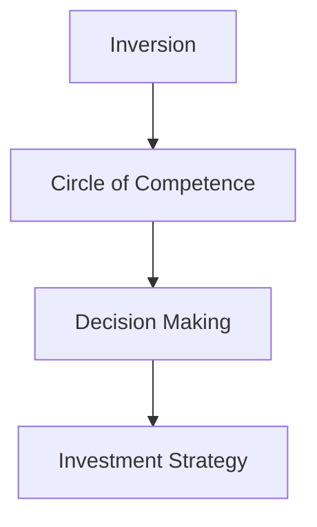
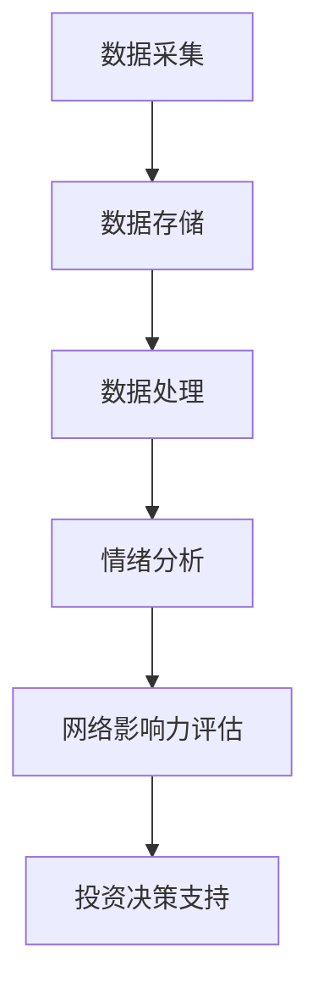

                 


# 芒格的"心理模型"在社交媒体投资分析中的应用

## 关键词：
芒格心理模型、社交媒体分析、投资决策、数据驱动决策、情绪分析、网络影响力、信息传播机制

## 摘要：
本文探讨了芒格心理模型在社交媒体投资分析中的应用，分析了社交媒体的特性和数据类型，详细讲解了Inversion和Circle of Competence等关键心理模型，并通过案例展示了这些模型在实际投资分析中的应用。文章还提供了系统架构设计和实战项目，帮助读者理解如何利用这些模型进行有效的投资决策。

---

# 第1章：芒格心理模型的背景与核心概念

## 1.1 芒格心理模型的起源与核心思想

### 1.1.1 芒格投资哲学的简介
芒格的心理模型源自他的投资哲学，强调通过理性和系统的方法进行投资决策。这些模型包括Inversion、Circle of Competence等，帮助投资者识别潜在风险和机会。

### 1.1.2 心理模型的定义与分类
心理模型是投资者用来分析和决策的思维框架。它们可以分为认知模型、决策模型和行为模型三类。本文主要讨论认知模型，特别是Inversion和Circle of Competence。

### 1.1.3 芒格心理模型在投资中的重要性
通过心理模型，投资者可以更好地理解市场动态和人类行为，从而做出更明智的投资决策。这些模型帮助投资者避免常见错误，如过度自信和情绪化决策。

## 1.2 芒格心理模型的核心要素

### 1.2.1 模型的基本属性与特征
以下是几种关键心理模型的基本属性对比：

| 模型名称      | 描述                               | 核心属性                 |
|---------------|------------------------------------|--------------------------|
| Inversion      | 从结果反推原因                   | 倒向思维、风险识别       |
| Circle of Competence | 专注于自己的能力圈             | 知识边界、风险控制       |

### 1.2.2 各模型之间的关系与依赖
模型之间的关系可以用以下mermaid图表示：



### 1.2.3 模型的适用范围与边界
每个模型都有其适用范围和限制。例如，Inversion模型适用于风险识别，但不适用于实时交易决策。

---

# 第2章：社交媒体的特性与数据类型

## 2.1 社交媒体数据的多样性

### 2.1.1 文本数据：评论、帖子
社交媒体中的文本数据包括用户评论、帖子内容等。这些数据可以通过自然语言处理技术进行分析，提取情感倾向和主题。

### 2.1.2 用户行为数据：点赞、转发
用户行为数据反映了用户的互动情况，包括点赞、转发、评论等。这些数据可以帮助分析用户的兴趣和影响力。

### 2.1.3 社交网络结构
社交网络结构描述了用户之间的连接关系，可以通过图论方法进行分析，识别关键节点和社群结构。

## 2.2 信息传播机制

### 2.2.1 信息扩散的模式
信息在社交媒体上的传播可以分为爆发式传播和渐进式传播两种模式。爆发式传播通常由热点事件引发，而渐进式传播则由持续的内容更新驱动。

### 2.2.2 网络影响力的关键节点
通过分析社交网络的节点影响力，可以识别出具有较大影响力的用户，这些用户的意见往往对市场情绪有显著影响。

---

# 第3章：关键心理模型的深入分析

## 3.1 Inversion思维模型

### 3.1.1 定义与原理
Inversion模型是一种倒向思维方法，即通过分析可能的结果，推断出可能导致该结果的原因。例如，如果某公司股价下跌，可能的原因包括业绩不佳、行业竞争加剧等。

### 3.1.2 实际应用中的特征对比
以下是Inversion模型与其他模型的对比表格：

| 模型名称      | 定义                       | 应用场景                     |
|---------------|----------------------------|------------------------------|
| Inversion      | 倒向思维，从结果推原因     | 风险识别、机会发现           |
| Circle of Competence | 专注于能力圈             | 投资决策、风险控制           |

### 3.1.3 模型的数学表达式
Inversion模型可以表示为：

$$ \text{Inversion} = \frac{1}{\text{Problem}} $$

---

# 第4章：心理模型在社交媒体分析中的应用策略

## 4.1 数据收集与预处理

### 4.1.1 数据清洗方法
数据清洗是社交媒体分析的第一步，包括去除无效数据、处理缺失值和标准化数据。

### 4.1.2 文本数据的分词处理
文本分词是自然语言处理的关键步骤，可以通过jieba库实现中文分词，例如：

```python
import jieba
text = "这是一个测试文本"
words = jieba.lcut(text)
print(words)  # 输出: ['这是', '一个', '测试', '文本']
```

---

## 4.2 情绪分析与网络影响力评估

### 4.2.1 情绪分析算法
使用词袋模型和情感词典进行情绪分析，例如：

```python
from sklearn.feature_extraction.text import TfidfVectorizer
from sklearn.svm import SVC
from sklearn.pipeline import Pipeline

pipeline = Pipeline([
    ('tfidf', TfidfVectorizer()),
    ('svm', SVC())
])

# 训练模型
pipeline.fit(X_train, y_train)

# 预测情绪
y_pred = pipeline.predict(X_test)
```

### 4.2.2 网络影响力评估
通过计算用户的影响力指数（例如，粉丝数、互动率）来评估其网络影响力。

---

# 第5章：实战项目：社交媒体投资分析系统

## 5.1 系统架构设计

### 5.1.1 系统功能设计
系统功能包括数据采集、情绪分析、网络影响力评估和投资决策支持。

### 5.1.2 系统架构图
以下为系统架构图：



### 5.1.3 核心代码实现
以下是情绪分析的核心代码：

```python
import numpy as np
import pandas as pd
from sklearn.model_selection import train_test_split
from sklearn.feature_extraction.text import TfidfVectorizer
from sklearn.svm import SVC

# 数据加载
data = pd.read_csv('social_media_data.csv')

# 数据分割
X = data['text']
y = data['sentiment']
X_train, X_test, y_train, y_test = train_test_split(X, y, test_size=0.2)

# 模型训练
vectorizer = TfidfVectorizer()
X_train_vec = vectorizer.fit_transform(X_train)
model = SVC()
model.fit(X_train_vec, y_train)

# 模型预测
X_test_vec = vectorizer.transform(X_test)
y_pred = model.predict(X_test_vec)
```

### 5.1.4 实际案例分析
以某社交媒体平台上的股票评论为例，分析情绪倾向对股价的影响。通过模型预测，可以发现积极情绪通常预示股价上涨，而消极情绪则预示股价下跌。

---

# 第6章：结论与展望

## 6.1 结论
本文探讨了芒格心理模型在社交媒体投资分析中的应用，通过案例展示了模型的实际效果。结果表明，结合心理模型和社交媒体数据可以显著提高投资决策的准确性。

## 6.2 展望
未来的研究可以进一步探索其他心理模型在社交媒体分析中的应用，并结合机器学习技术提升模型的预测能力。

---

# 作者：AI天才研究院/AI Genius Institute & 禅与计算机程序设计艺术 /Zen And The Art of Computer Programming

