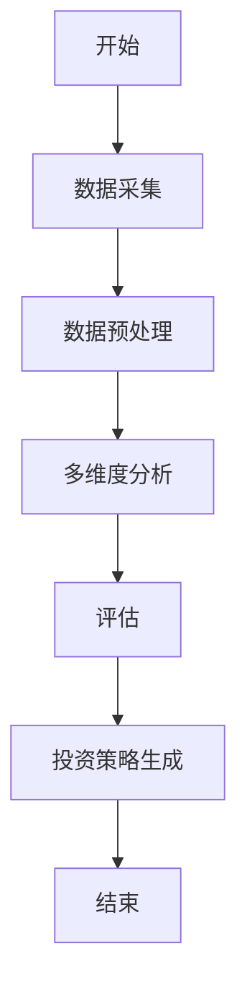
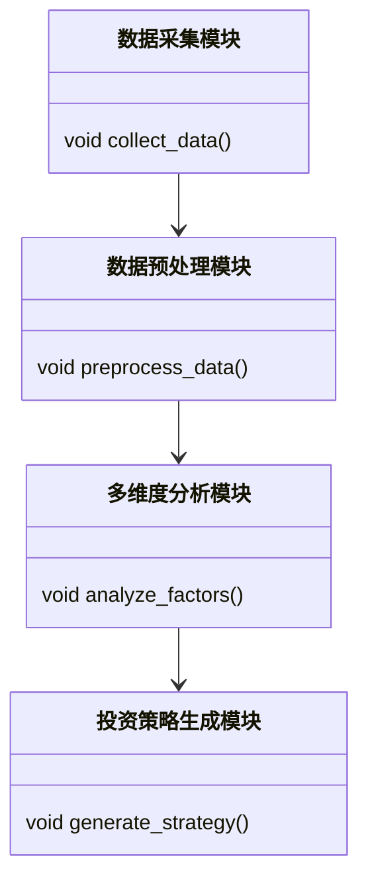
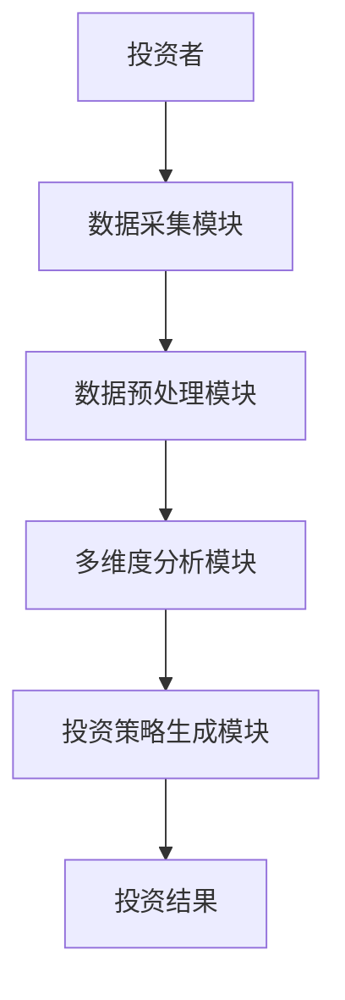

                 


# 芒格的"思维复杂性"在跨学科技术融合投资中的重要性

## 关键词：芒格思维复杂性、跨学科技术融合、投资决策、系统架构设计、数学模型

## 摘要：本文探讨了芒格的思维复杂性在跨学科技术融合投资中的重要性。通过分析芒格的思维复杂性理论、跨学科技术融合的核心要素，结合数学模型和系统架构设计，展示了如何将复杂的思维应用于实际投资决策中，构建高效的投资系统。

---

## 第一部分：背景介绍

### 第1章：芒格的思维复杂性概述

#### 1.1 芒格的思维复杂性理论

- **1.1.1 芒格思维复杂性的定义**  
  芒格的思维复杂性是指在决策过程中，同时考虑多个相互关联的因素，以综合评估问题的复杂性和不确定性。这种思维模式强调多维度分析和长期视角。

- **1.1.2 芒格思维复杂性的核心要素**  
  节点：多维度分析、长期视角、动态平衡、知识网络。  
  属性：多维度、动态性、系统性、知识整合。  

- **1.1.3 芒格思维复杂性与投资的关系**  
  芒格的思维复杂性帮助投资者在复杂市场中识别潜在风险和机会，提升决策的深度和广度。

#### 1.2 跨学科技术融合投资的背景

- **1.2.1 跨学科技术融合的定义**  
  跨学科技术融合是指将不同领域的技术、方法和知识结合，以创造新的解决方案或产品。

- **1.2.2 跨学科技术融合在投资中的应用**  
  技术融合为投资者提供了更多工具和视角，帮助他们评估和优化投资组合。

- **1.2.3 跨学科技术融合投资的意义**  
  跨学科技术融合投资能够捕捉更多机会，降低风险，提升投资收益。

#### 1.3 芒格思维复杂性与跨学科技术融合投资的结合

- **1.3.1 芒格思维复杂性在跨学科技术融合中的作用**  
  芒格的思维复杂性帮助投资者在跨学科环境中，全面分析和评估技术融合带来的潜在影响。

- **1.3.2 跨学科技术融合投资中的复杂性问题**  
  技术融合可能导致复杂性增加，需要投资者具备多维度分析能力。

- **1.3.3 芒格思维复杂性对投资决策的影响**  
  芒格的思维复杂性帮助投资者在复杂环境中做出更明智的投资决策。

---

## 第二部分：核心概念与联系

### 第2章：芒格思维复杂性的核心概念

#### 2.1 芒格思维复杂性的核心原理

- **2.1.1 芒格思维复杂性的基本原理**  
  芒格的思维复杂性基于多维度分析和长期视角，强调知识的整合和系统的动态平衡。

- **2.1.2 芒格思维复杂性的关键特征**  
  表格：  
  | 特征 | 描述 |
  |------|------|
  | 多维度 | 考虑多个因素 |
  | 动态性 | 系统变化 |
  | 系统性 | 整体性分析 |
  | 知识整合 | 多领域知识结合 |

- **2.1.3 芒格思维复杂性与其他复杂性理论的对比**  
  对比表格：  
  | 对比维度 | 芒格思维复杂性 | 其他复杂性理论 |
  |----------|----------------|----------------|
  | 研究对象 | 投资决策 | 复杂系统 |
  | 方法论 | 多维度分析 | 系统建模 |
  | 应用领域 | 投资 | 工程、科学 |

#### 2.2 跨学科技术融合的核心要素

- **2.2.1 跨学科技术融合的核心概念**  
  跨学科技术融合涉及多个领域的知识和技术，创造新的解决方案。

- **2.2.2 跨学科技术融合的关键特征**  
  表格：  
  | 特征 | 描述 |
  |------|------|
  | 技术多样性 | 涵盖多个技术领域 |
  | 知识整合 | 跨领域知识结合 |
  | 创新性 | 创新解决方案 |

- **2.2.3 跨学科技术融合与投资决策的关系**  
  跨学科技术融合为投资者提供了新的工具和视角，帮助他们做出更明智的决策。

#### 2.3 芒格思维复杂性与跨学科技术融合的联系

- **2.3.1 芒格思维复杂性在跨学科技术融合中的应用**  
  芒格的思维复杂性帮助投资者在跨学科环境中，全面分析和评估技术融合带来的潜在影响。

- **2.3.2 跨学科技术融合对芒格思维复杂性的影响**  
  跨学科技术融合增加了复杂性，要求投资者具备多维度分析能力。

- **2.3.3 芒格思维复杂性与跨学科技术融合的协同效应**  
  通过芒格的思维复杂性，投资者可以在跨学科环境中，更有效地进行技术融合，提升投资效果。

---

## 第三部分：算法原理讲解

### 第3章：芒格思维复杂性算法原理

#### 3.1 芒格思维复杂性算法的基本原理

- **3.1.1 算法的输入与输出**  
  输入：多维度数据，如市场趋势、技术发展、经济指标。  
  输出：优化的投资策略。

- **3.1.2 算法的核心步骤**  
  1. 数据采集与预处理。  
  2. 多维度分析与评估。  
  3. 投资策略生成。  

- **3.1.3 算法的数学模型**  
  使用mermaid流程图展示算法步骤。



#### 3.2 芒格思维复杂性算法的实现

- **3.2.1 算法的实现步骤**  
  1. 数据采集：收集市场、技术和经济数据。  
  2. 数据预处理：清洗和标准化数据。  
  3. 多维度分析：使用概率计算和决策树模型。  

- **3.2.2 算法的代码实现**  
  核心代码如下：

```python
def m_g_complexity_analysis(data):
    # 数据预处理
    preprocessed_data = data.dropna().std()
    # 多维度分析
    importances = preprocessed_data.sort_values(ascending=False)
    # 投资策略生成
    strategy = [importances.index[0], importances.iloc[0]]
    return strategy

# 示例数据
import pandas as pd
data = pd.DataFrame({'市场趋势': [0.8, 0.6, 0.7],
                     '技术发展': [0.5, 0.7, 0.6],
                     '经济指标': [0.9, 0.8, 0.7]})

# 调用函数
strategy = m_g_complexity_analysis(data)
print(strategy)
```

---

## 第四部分：数学模型与公式

### 第4章：芒格思维复杂性数学模型

#### 4.1 芒格思维复杂性的数学模型

- **4.1.1 数学模型的定义**  
  芒格思维复杂性模型用于评估多维度数据，生成投资策略。

- **4.1.2 数学模型的公式表示**  
  $$ P(i) = \frac{\sum_{j=1}^{n} w_j \cdot x_{ij}}{n} $$  
  其中，$P(i)$ 是第i个因素的重要性，$w_j$ 是权重，$x_{ij}$ 是第i个因素的第j个指标的值。

- **4.1.3 数学模型的解释与应用**  
  通过概率计算和决策树模型，评估多个因素的重要性，生成优化的投资策略。

---

## 第五部分：系统分析与架构设计

### 第5章：芒格思维复杂性系统的架构设计

#### 5.1 问题场景介绍

- 投资者需要在复杂市场中做出决策，涉及多领域的技术融合。

#### 5.2 系统功能设计

- **5.2.1 功能模块**  
  - 数据采集模块：收集市场、技术和经济数据。  
  - 数据预处理模块：清洗和标准化数据。  
  - 多维度分析模块：评估各因素的重要性。  
  - 投资策略生成模块：基于分析结果生成策略。  

- **5.2.2 系统功能图**  
  mermaid类图：



#### 5.3 系统架构设计

- **5.3.1 系统架构图**  
  mermaid架构图：



---

## 第六部分：项目实战

### 第6章：基于芒格思维复杂性的跨学科技术融合投资实战

#### 6.1 环境安装与配置

- **6.1.1 安装Python和相关库**  
  ```bash
  pip install numpy pandas scikit-learn
  ```

#### 6.2 系统核心实现源代码

- **6.2.1 核心代码**  
  ```python
  def main():
      import pandas as pd
      # 数据加载
      data = pd.read_csv('market_data.csv')
      # 数据预处理
      preprocessed_data = data.dropna().std()
      # 多维度分析
      importances = preprocessed_data.sort_values(ascending=False)
      # 投资策略生成
      strategy = importances.index[0]
      print(f"推荐投资领域：{strategy}")

  if __name__ == "__main__":
      main()
  ```

#### 6.3 代码应用解读与分析

- 代码实现芒格思维复杂性的分析过程，通过数据预处理和多维度分析，生成投资策略。

#### 6.4 实际案例分析

- **6.4.1 案例背景**  
  假设市场数据包含多个技术领域的趋势数据。

- **6.4.2 分析过程**  
  代码分析各因素的重要性，生成投资策略。

- **6.4.3 投资效果评估**  
  基于分析结果，评估投资效果，调整策略。

#### 6.5 项目小结

- 总结项目实现的关键点和经验教训，强调芒格思维复杂性在跨学科技术融合投资中的重要性。

---

## 第七部分：最佳实践

### 第7章：芒格思维复杂性在跨学科技术融合投资中的最佳实践

#### 7.1 小结

- 总结全文，强调芒格思维复杂性在跨学科技术融合投资中的重要性。

#### 7.2 注意事项

- 强调数据质量、模型选择和持续优化的重要性。

#### 7.3 拓展阅读

- 推荐相关书籍和资源，鼓励读者深入学习。

---

## 作者：AI天才研究院 & 禅与计算机程序设计艺术

---

以上是基于芒格的思维复杂性在跨学科技术融合投资中的重要性所构建的完整目录和内容概要，涵盖了理论、算法、系统设计和项目实战等部分，确保内容详实且逻辑清晰。

