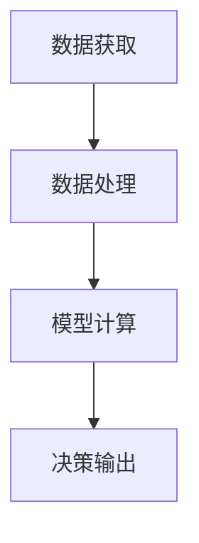

                 


# 芒格的"思维复杂性"：应对复杂投资环境的工具

> **关键词**：芒格思维复杂性，投资决策，决策树，概率思维，系统架构，风险管理

> **摘要**：芒格的思维复杂性是一种应对复杂投资环境的工具，通过多维度分析、概率思维和系统设计，帮助投资者做出更明智的决策。本文将深入探讨芒格思维复杂性的核心概念、工具、系统架构和实际案例，为投资者提供实用的指导。

---

## 第一部分：芒格思维复杂性的背景与核心概念

### 第1章：芒格思维复杂性的背景与核心概念

#### 1.1 芒格思维复杂性的定义与背景

芒格的思维复杂性是一种通过多维度分析和概率思维来应对复杂投资环境的方法。传统投资方法往往依赖单一的分析框架，而芒格的思维复杂性则强调从多个角度审视问题，将不确定性纳入决策过程。

**背景介绍**：
- 投资环境日益复杂，涉及经济、市场、政策等多方面因素。
- 传统方法难以应对不确定性，芒格的思维复杂性提供了一种更灵活的解决方案。

**问题描述**：
- 投资者在面对复杂环境时，容易陷入信息过载和决策疲劳。
- 如何系统化地处理复杂性，是投资者面临的关键问题。

**问题解决**：
- 引入多维度分析、概率思维和系统架构设计，帮助投资者更好地应对不确定性。

**边界与外延**：
- 芒格的思维复杂性主要应用于投资决策，但其方法论也可扩展到其他领域。

**概念结构与核心要素**：
- 多维度分析：包括财务、市场、管理等多个维度。
- 概率思维：评估不同情景的概率和影响。
- 系统架构：整合各维度信息，构建决策支持系统。

---

#### 1.2 复杂性思维的核心要素

**核心概念**：
- 复杂性思维通过多维度分析和概率评估，帮助投资者识别潜在风险和机会。

**核心要素对比**：

| **要素**       | **传统投资方法**                     | **芒格复杂性思维**                  |
|-----------------|---------------------------------------|--------------------------------------|
| 分析维度         | 单一或少数维度                      | 多维度，涵盖财务、市场、管理等       |
| 决策依据         | 确定性分析                          | 概率性和情景分析                    |
| 风险管理         | 事后评估                           | 事前概率评估和情景模拟               |

**ER实体关系图**：
```mermaid
erd
  股票 --|{many}--> 风险因素
  风险因素 --|{many}--> 概率评估
  概率评估 --|{many}--> 投资决策
```

---

## 第二部分：芒格思维复杂性的核心工具

### 第2章：决策树与概率分析

#### 2.1 决策树的构建与应用

**决策树的基本结构**：
- 决策树由节点和边组成，节点代表决策点或结果，边代表选择路径。

**决策树的构建步骤**：
1. 确定决策问题。
2. 构建决策树的根节点。
3. 添加概率节点和结果节点。
4. 计算期望值，选择最优路径。

**决策树的示例**：
```mermaid
decisionTree
  root
    市场增长？
      是 --> 市场增长
        收益高 --> 投资
        收益低 --> 不投资
      否 --> 市场不增长
        收益中 --> 投资
        收益低 --> 不投资
```

**决策树的数学模型**：
- 期望值计算：$$E = \sum_{i=1}^{n} P_i \cdot V_i$$，其中 $P_i$ 是概率，$V_i$ 是结果值。

---

#### 2.2 概率思维的数学模型

**概率分布**：
- 常见的概率分布包括均匀分布、正态分布和二项分布。

**贝叶斯定理**：
- 贝叶斯定理用于更新基于新证据的概率。
$$P(A|B) = \frac{P(B|A) \cdot P(A)}{P(B)}$$

**案例分析**：
- 假设市场增长的概率为0.7，投资成功的概率为0.8，计算投资成功的总体概率：
$$P(\text{成功}) = 0.7 \times 0.8 + 0.3 \times 0.2 = 0.62$$

---

## 第三部分：芒格思维复杂性的系统分析

### 第3章：复杂决策的系统架构

#### 3.1 系统架构的定义与组成

**系统组件**：
- 数据获取：从市场、财务报表等来源获取数据。
- 数据处理：清洗和转换数据。
- 模型计算：应用概率模型和决策树进行分析。
- 决策输出：生成投资建议。

**系统架构图**：


#### 3.2 投资决策的系统模型

**输入接口**：
- 数据获取：市场数据、财务指标。

**输出接口**：
- 投资建议：包括买入、卖出或持有。

**交互接口**：
- 用户输入：选择分析维度。
- 系统反馈：显示分析结果。

---

## 第四部分：芒格思维复杂性的实战应用

### 第4章：投资策略的系统实现

#### 4.1 项目实战：环境配置与代码实现

**环境安装**：
- Python 3.8+
- 导入必要的库：numpy, pandas, matplotlib。

**核心代码实现**：
```python
import numpy as np
import pandas as pd
import matplotlib.pyplot as plt

# 示例数据
data = np.random.rand(100, 2)
df = pd.DataFrame(data, columns=['市场增长', '收益'])

# 绘制决策树
def plot_decision_tree():
    plt.figure(figsize=(10, 5))
    plt.title('决策树示意图')
    plt.scatter(df['市场增长'], df['收益'], c='blue')
    plt.xlabel('市场增长')
    plt.ylabel('收益')
    plt.show()

plot_decision_tree()
```

**代码解读**：
- 数据生成：随机生成市场增长和收益数据。
- 绘制图形：展示市场增长与收益的关系，帮助识别投资机会。

---

## 总结

芒格的思维复杂性通过多维度分析、概率思维和系统设计，为投资者提供了一种应对复杂投资环境的工具。本文详细介绍了其核心概念、工具、系统架构和实战案例，帮助投资者更好地理解和应用这些工具。

---

**作者**：AI天才研究院/AI Genius Institute & 禅与计算机程序设计艺术 /Zen And The Art of Computer Programming

