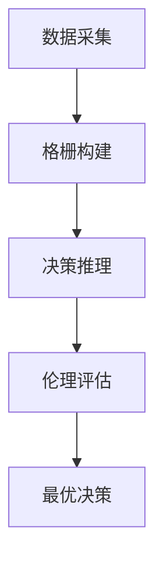

                 


# 芒格的"思维格栅"在人工智能伦理决策中的应用

> 关键词：芒格思维格栅、人工智能伦理决策、决策模型、算法原理、系统架构、项目实战

> 摘要：本文探讨了芒格的"思维格栅"理论在人工智能伦理决策中的应用。通过分析思维格栅的核心概念、算法原理、系统架构和项目实战，本文展示了如何利用这一理论来解决人工智能决策中的伦理问题。结合数学模型、代码实现和实际案例，文章详细讲解了思维格栅在人工智能伦理决策中的具体应用方法和实际效果。

---

# 第一部分: 芒格的"思维格栅"与人工智能伦理决策概述

## 第1章: 芒格思维格栅的定义与特点

### 1.1 思维格栅的定义
芒格的"思维格栅"是一种多维度的决策框架，通过将问题分解为多个维度的格栅结构，帮助决策者全面分析问题并做出更可靠的决策。这种思维方式强调在决策过程中考虑多个因素之间的相互作用。

### 1.2 人工智能伦理决策的背景
随着人工智能技术的快速发展，AI系统在决策过程中面临的伦理问题日益凸显。例如，自动驾驶汽车在紧急情况下如何做出道德选择，AI医疗系统如何在有限资源下分配医疗资源等。这些问题的解决需要一种系统化的决策框架。

### 1.3 思维格栅与人工智能伦理决策的关联
思维格栅通过将问题分解为多个维度，帮助AI系统在决策过程中考虑更多的伦理因素。这种思维方式可以有效避免单一维度决策可能导致的伦理问题，为人工智能伦理决策提供了一个可靠的框架。

---

## 第2章: 芒格思维格栅的核心概念

### 2.1 格栅的构成要素
- **维度选择**：选择与问题相关的多个维度，例如道德、法律、社会影响等。
- **格栅结构**：将问题分解为多个格子，每个格子代表一个维度的特定情况。
- **动态调整**：根据实际情况动态调整格栅的维度和权重。

### 2.2 格栅的层级与相互关系
- **基础层**：定义问题的基本维度和参数。
- **中间层**：分析各维度之间的相互作用。
- **顶层**：综合分析，得出最终决策。

### 2.3 格栅在决策中的作用
- **全面性**：通过多维度分析，确保决策的全面性。
- **系统性**：帮助决策者从系统角度考虑问题。
- **灵活性**：能够根据实际情况动态调整。

---

# 第二部分: 芒格思维格栅的算法原理

## 第3章: 决策树算法与思维格栅

### 3.1 决策树的基本原理
决策树是一种常见的机器学习算法，通过构建树状结构来模拟决策过程。每个节点代表一个决策点，每个分支代表一个可能的决策路径。

#### 决策树构建步骤
1. **选择根节点**：根据特征重要性选择最顶层的决策特征。
2. **划分数据集**：根据根节点的特征将数据集划分为不同的子集。
3. **递归构建子树**：对每个子集重复上述步骤，直到叶子节点无法再划分。
4. **剪枝优化**：去除决策树中可能导致过拟合的分支。

### 3.2 思维格栅与决策树的结合
通过将思维格栅的多维度分析与决策树的结构化决策相结合，可以构建一种更加可靠的决策模型。

---

## 第4章: 数学模型与公式

### 4.1 决策树的数学模型
决策树的构建可以通过信息增益或基尼指数等指标来衡量特征的重要性。公式如下：

$$
\text{信息增益}(D, A) = H(D) - H(D|A)
$$

其中，$H(D)$ 是数据集$D$的熵，$H(D|A)$ 是在特征$A$下的条件熵。

### 4.2 思维格栅的数学表达
思维格栅可以通过矩阵形式表示，其中每个格子代表一个维度的权重和影响。公式如下：

$$
W = \begin{bmatrix}
w_{11} & w_{12} & \cdots & w_{1n} \\
w_{21} & w_{22} & \cdots & w_{2n} \\
\vdots  & \vdots  & \ddots & \vdots  \\
w_{m1} & w_{m2} & \cdots & w_{mn}
\end{bmatrix}
$$

其中，$W$ 表示格栅的权重矩阵，$w_{ij}$ 表示第$i$个维度在第$j$个格子中的权重。

---

# 第三部分: 系统分析与架构设计

## 第5章: 系统分析与架构设计方案

### 5.1 问题场景介绍
以自动驾驶汽车的伦理决策为例，系统需要在紧急情况下做出道德选择，例如在事故不可避免时，如何权衡乘客和行人的安全。

### 5.2 系统功能设计
- **数据采集**：收集与决策相关的多维度数据，例如传感器数据、环境数据等。
- **格栅构建**：根据数据构建思维格栅，分析各维度的权重和影响。
- **决策推理**：基于格栅分析，生成多个可能的决策方案。
- **伦理评估**：对每个决策方案进行伦理评估，选择最优方案。

### 5.3 系统架构设计


### 5.4 系统接口设计
- **输入接口**：接收传感器数据、环境数据等。
- **输出接口**：输出决策结果和伦理评估报告。
- **交互接口**：供用户查看和调整决策方案。

---

## 第6章: 项目实战与应用

### 6.1 环境安装与配置
- 安装Python和必要的机器学习库（如scikit-learn）。
- 安装Mermaid和相关工具。

### 6.2 核心算法实现
```python
def build_decision_tree(data, features):
    # 构建决策树
    pass

def calculate_information_gain(data, feature):
    # 计算信息增益
    pass

def decision-making_grid(data, features):
    # 构建思维格栅
    pass
```

### 6.3 代码应用与解读
通过具体的Python代码实现决策树和思维格栅的构建，展示如何将理论应用于实际问题。

### 6.4 实际案例分析
以自动驾驶汽车的伦理决策为例，详细分析如何利用思维格栅模型进行决策推理和伦理评估。

---

# 第四部分: 总结与展望

## 第7章: 总结与展望

### 7.1 实践中的注意事项
- 确保数据的全面性和准确性。
- 动态调整格栅的维度和权重，适应实际情况。
- 定期评估和优化决策模型。

### 7.2 未来展望
随着人工智能技术的不断发展，思维格栅在伦理决策中的应用将更加广泛。未来的研究可以集中在以下几个方面：
- 更复杂的多维度决策模型。
- 更高效的算法优化方法。
- 更人性化的伦理评估标准。

---

作者：AI天才研究院/AI Genius Institute & 禅与计算机程序设计艺术 /Zen And The Art of Computer Programming

