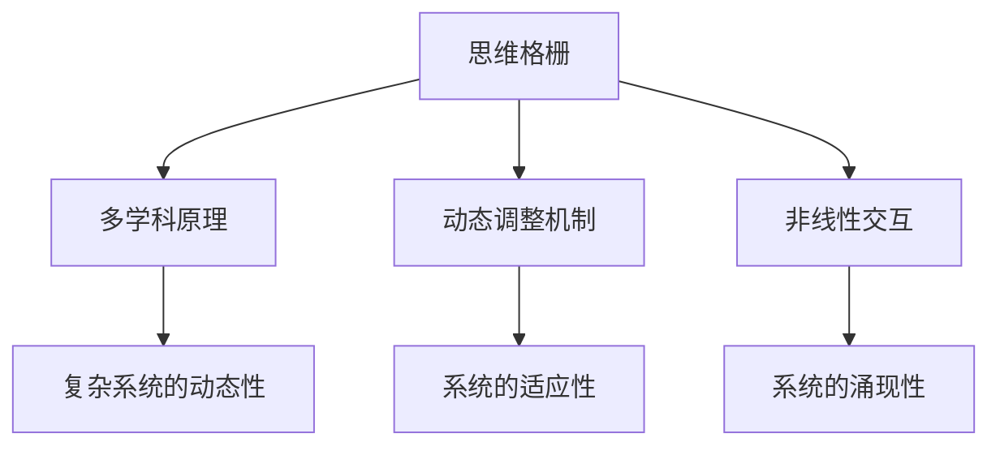
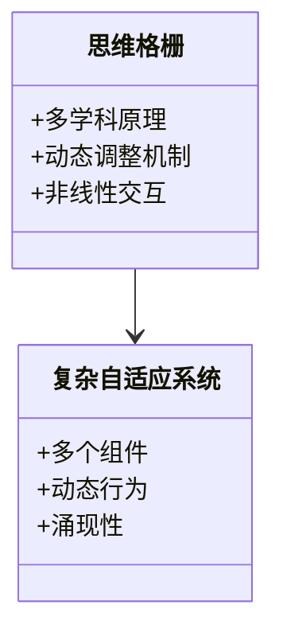
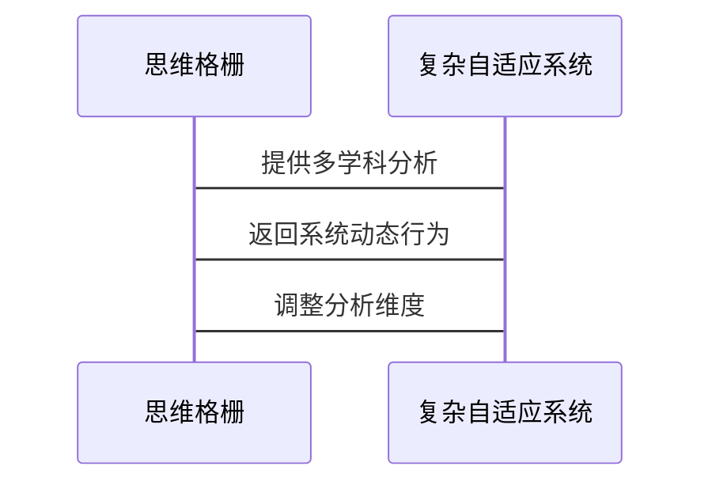

                 

# 芒格的"思维格栅"在复杂自适应系统分析中的运用

> 关键词：芒格思维格栅，复杂自适应系统（CAS），多学科思维模型，系统分析，动态适应性

> 摘要：本文探讨了芒格的思维格栅在复杂自适应系统（CAS）分析中的应用，通过背景介绍、核心概念、算法原理、系统架构和项目实战等部分，详细分析了思维格栅与CAS之间的关联，展示了如何利用多维度思维模型来理解和优化复杂系统的动态适应性。

---

## 第一部分：背景介绍

### 第1章：芒格的思维格栅与复杂自适应系统概述

#### 1.1 芒格的思维格栅
- **1.1.1 芒格思维格栅的核心概念**  
芒格的思维格栅是一种多维度的分析框架，结合了心理学、经济学、物理学等多个学科的核心原理，用于帮助决策者更全面地理解问题的本质。其核心在于通过多维度的交叉验证，避免单一视角的局限性。

- **1.1.2 思维格栅的多学科视角**  
思维格栅的特点在于它不仅仅关注单一领域的知识，而是将多个学科的原理整合到一个框架中，形成一个动态调整的分析系统。

- **1.1.3 思维格栅在决策中的应用**  
芒格强调，决策者应该通过思维格栅来理解问题的多个维度，从而做出更明智的选择。

#### 1.2 复杂自适应系统（CAS）概述
- **1.2.1 复杂系统的定义与特征**  
复杂系统是指由许多相互作用的个体或组件组成的系统，这些个体之间的相互作用会导致系统的整体行为呈现出非线性特征，难以通过简单的方法预测。

- **1.2.2 自适应系统的动态特性**  
自适应系统能够根据环境的变化调整自身的行为，以维持系统的稳定或达到特定目标。

- **1.2.3 CAS与传统系统的主要区别**  
与传统系统相比，CAS具有更强的动态性和涌现性，系统的整体行为往往无法通过单独分析部分来预测。

#### 1.3 芒格思维格栅与CAS的结合
- **1.3.1 思维格栅在CAS分析中的作用**  
思维格栅为复杂系统的分析提供了一个多维度的视角，能够帮助我们更好地理解系统的动态性和适应性。

- **1.3.2 CAS的动态性与思维格栅的多维度性**  
CAS的动态适应性与思维格栅的多维度分析能力相辅相成，前者需要后者来提供一个全面的分析框架。

- **1.3.3 本章小结**  
本章介绍了芒格思维格栅和复杂自适应系统的概念，并初步探讨了它们之间的关联。

---

## 第二部分：核心概念与联系

### 第2章：思维格栅的核心原理与数学模型

#### 2.1 思维格栅的原理
- **2.1.1 多维度分析框架**  
思维格栅通过整合多个学科的核心原理，形成一个立体的分析框架，能够从多个角度观察和理解问题。

- **2.1.2 格栅的动态调整机制**  
根据问题的变化，思维格栅可以动态调整其分析维度和权重，以适应新的情况。

- **2.1.3 格栅的非线性交互特性**  
思维格栅中的各个维度之间存在非线性交互，这种交互会导致系统行为的涌现性。

#### 2.2 复杂自适应系统的数学模型
- **2.2.1 系统的涌现性与数学表达**  
CAS的涌现性可以通过非线性动力学方程来描述，例如：

  $$ x_{n+1} = f(x_n, y_n) $$
  $$ y_{n+1} = g(x_n, y_n) $$

  其中，$f$ 和 $g$ 是非线性函数，描述了系统中各个组件之间的相互作用。

- **2.2.2 CAS的动态平衡模型**  
动态平衡模型通过引入稳定性和适应性参数，描述系统在复杂环境中的调整过程。

- **2.2.3 格栅与CAS的关联模型**  
通过构建格栅与CAS的关联模型，可以将多学科的原理映射到复杂系统的具体行为中。

#### 2.3 核心概念对比表格
- 表2-1：思维格栅与CAS的核心属性对比

| 属性 | 思维格栅 | 复杂自适应系统（CAS） |
|------|----------|-----------------------|
| 多维性 | 是       | 是                   |
| 动态性 | 是       | 是                   |
| 涵盖范围 | 多学科   | 多组件、多层次       |
| 可调整性 | 是       | 是                   |

#### 2.4 ER实体关系图
- 图2-1：思维格栅与CAS的实体关系图（Mermaid）

---

## 第三部分：算法原理与数学模型

### 第3章：CAS的系统分析与架构设计

#### 3.1 问题场景介绍
- **3.1.1 CAS的典型应用场景**  
例如，社会网络中的信息传播、生态系统中的物种竞争等。

- **3.1.2 芒格思维格栅在CAS中的问题定位**  
通过思维格栅分析CAS的动态行为，识别关键影响因素。

#### 3.2 系统功能设计
- **3.2.1 领域模型（Mermaid类图）**

- **3.2.2 核心功能模块划分**  
包括多维度分析、动态调整、非线性交互等模块。

#### 3.3 系统架构设计
- **3.3.1 架构图（Mermaid架构图）**

- **3.3.2 关键模块的交互设计**  
通过交互图（Mermaid序列图）展示思维格栅与CAS之间的交互过程。

#### 3.4 系统接口与交互
- **3.4.1 系统接口设计**  
定义思维格栅与CAS之间的接口，例如数据输入、参数调整等。

- **3.4.2 交互流程（Mermaid序列图）**

---

## 第四部分：项目实战与案例分析

### 第4章：芒格思维格栅在CAS中的应用实战

#### 4.1 环境安装与配置
- **4.1.1 开发环境搭建**  
安装Python、Mermaid工具、LaTeX等开发工具。

- **4.1.2 必要工具安装**  
安装必要的库和插件，例如`networkx`用于复杂网络分析。

#### 4.2 核

---

## 第五部分：最佳实践与小结

### 第5章：总结与展望

#### 5.1 最佳实践
- 在分析复杂自适应系统时，建议结合芒格的思维格栅，从多个维度进行分析。

#### 5.2 小结
- 本文通过详细分析芒格的思维格栅与复杂自适应系统的结合，展示了如何利用多学科思维模型来优化复杂系统的分析。

#### 5.3 注意事项
- 在实际应用中，需要注意思维格栅的动态调整和非线性交互特性，避免单一视角的局限性。

#### 5.4 拓展阅读
- 推荐阅读《Fooled by Randomness》和《The Lean Startup》，以进一步理解多维度分析和系统优化的方法。

---

## 参考文献

1.芒格，查理.《芒格的 Mental Models》
2. Buchanan, M.《The Smartest Thinkers in the World》
3. Holland, J. H.《Complex Adaptive Systems》
4. Gell-Mann, M.《The Quark and the Jaguar》
5. Kauffman, S.《The Origin of Order》
6. Mitchell, M.《Complexity: A Guided Tour》
7. Epstein, J. M.《Generative Social Science》
8. Buchanan, M.《The Social Atom》
9. Lang, T.《The Adapted Mind》
10. Simon, H. A.《The Sciences of the Artificial》

---

**作者：AI天才研究院/AI Genius Institute & 禅与计算机程序设计艺术 /Zen And The Art of Computer Programming**

