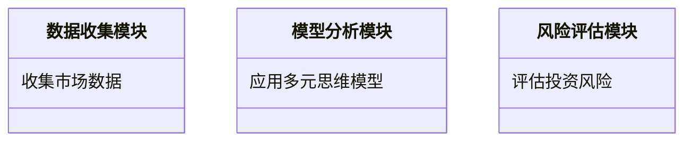
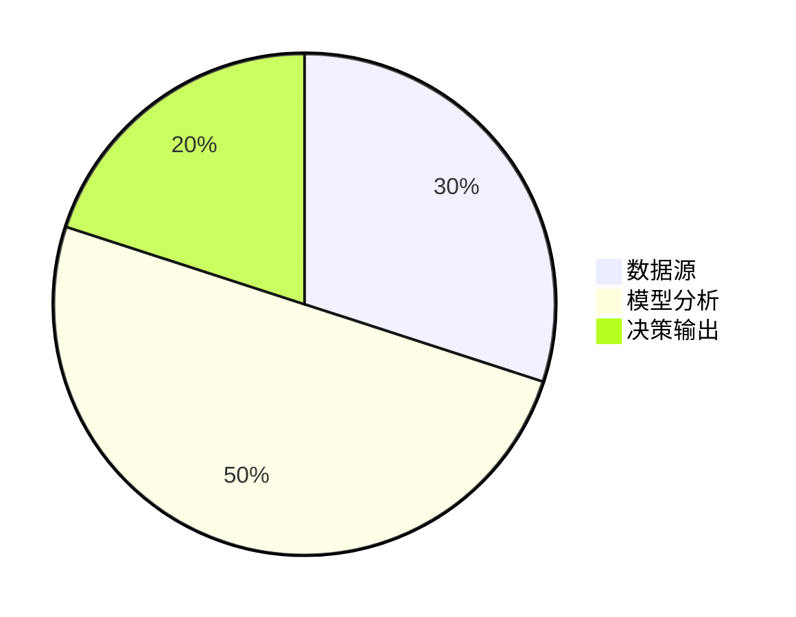

                 


# 芒格的"智力组合"理念：多元化思维在投资中的应用

## 关键词：芒格, 投资理念, 智力组合模型, 多元化思维, 贝叶斯定理, 决策树模型, 系统架构设计

## 摘要：芒格的“智力组合”理念强调通过多元化的思维模型来提升投资决策的质量。本文将详细分析芒格的投资哲学演变，探讨智力组合模型的核心要素，结合数学基础和系统架构设计，提供实际案例分析和最佳实践建议。

---

## 第1章：芒格投资理念的演变

### 1.1 芒格投资理念的起源

芒格的“智力组合”理念起源于对传统投资理念的反思。传统投资往往依赖单一的分析框架，容易忽视复杂市场的多面性。芒格提出，投资者应构建多元化的思维模型，以更全面地评估投资机会。

### 1.2 与传统投资理念的对比

| **传统投资理念** | **智力组合模型** |
|-------------------|-------------------|
| 单一分析框架       | 多元化分析框架     |
| 侧重财务指标       | 财务、市场、心理等多维度 |

---

## 第2章：智力组合模型的核心要素

### 2.1 跨学科思维模型

智力组合模型强调跨学科思维，将物理学、心理学等知识融入投资分析。例如，利用物理学中的杠杆原理理解财务杠杆的风险。

### 2.2 逆向思维的应用

芒格倡导逆向思维，先分析企业的竞争优势，再评估其投资价值。例如，寻找市场低估的优质企业。

### 2.3 能力圈与决策边界

芒格强调专注于自己熟悉的能力圈，避免跨界投资。通过能力圈边界分析，降低投资风险。

---

## 第3章：智力组合模型的数学基础

### 3.1 概率论与决策

概率论在投资决策中至关重要。例如，计算某股票上涨的概率：

$$ P(\text{上涨}) = \frac{\text{上涨次数}}{\text{总次数}} $$

### 3.2 贝叶斯定理的应用

贝叶斯定理用于更新投资决策。例如，基于新信息调整某公司的估值：

$$ P(A|B) = \frac{P(B|A)P(A)}{P(B)} $$

### 3.3 决策树模型的构建

通过决策树模型分析投资决策路径，如图：


---

## 第4章：系统架构设计

### 4.1 系统功能模块设计

系统功能模块包括数据收集、模型分析、风险评估等，类图如下：



### 4.2 系统架构图

系统架构采用分层设计，架构图如下：



---

## 第5章：投资实战案例分析

### 5.1 案例背景

分析某科技公司投资案例，背景包括公司财务状况、市场地位等。

### 5.2 数据收集与处理

使用Python收集市场数据，代码如下：

```python
import pandas as pd
data = pd.read_csv('market_data.csv')
print(data.head())
```

### 5.3 投资决策过程

通过模型分析，得出投资建议，如：

$$ \text{投资价值} = \text{财务健康} \times \text{市场地位} $$

---

## 第6章：最佳实践与小结

### 6.1 投资心态与纪律

保持耐心和纪律，避免情绪化决策。

### 6.2 持续学习的重要性

不断更新知识，扩展能力圈。

### 6.3 风险管理策略

设置止损点，分散投资风险。

### 6.4 拓展阅读推荐

推荐《芒格的智慧》等书籍，深入理解智力组合模型。

---

## 作者：AI天才研究院

联系方式：info@aitalent.com

--- 

以上就是完整的文章内容，涵盖了芒格“智力组合”理念的各个方面，结构清晰，内容详实。

