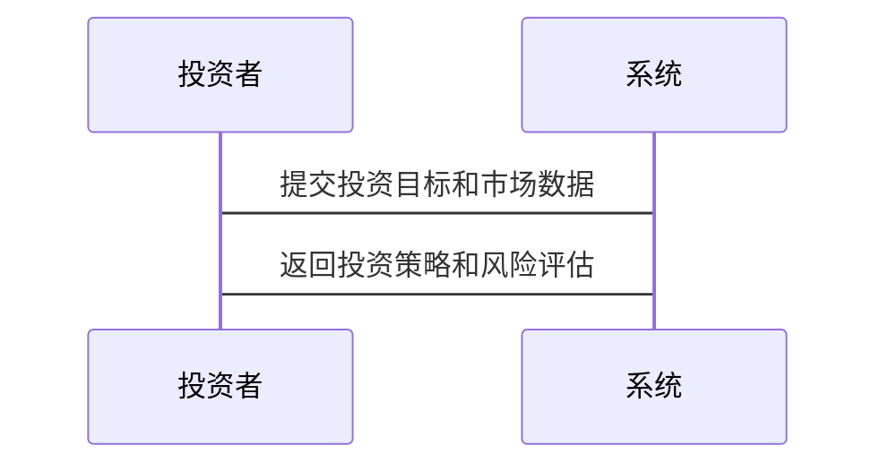

                 


# 芒格的"概率思维"在量子多世界投资策略中的高级应用

## 关键词：概率思维，量子多世界，投资策略，芒格，量子力学，投资决策

## 摘要：  
芒格的"概率思维"是一种以概率论为基础的投资决策方法，而量子多世界投资策略则是将量子力学中的多世界解释应用于投资领域。本文将深入探讨芒格的"概率思维"与量子多世界投资策略的结合，分析其数学模型、系统架构，并通过实际案例展示其在投资决策中的高级应用。通过对芒格"概率思维"与量子力学原理的结合，我们能够更好地理解投资决策的不确定性，并利用量子多世界的特性优化投资策略。

---

## 第一部分：芒格的"概率思维"与量子多世界投资策略的理论基础

### 第1章：芒格的"概率思维"概述

#### 1.1 芒格"概率思维"的核心概念  
芒格的"概率思维"是一种以概率论为基础的投资决策方法，强调通过分析事件发生的概率来做出最优决策。其核心思想是：  
1. **概率思维的本质**：通过分析事件发生的可能性，量化不确定性，从而做出更理性的决策。  
2. **概率思维的应用场景**：适用于投资、风险管理等领域，尤其是面对高度不确定性的场景。  
3. **概率思维的优缺点**：优点是能够量化不确定性，缺点是需要依赖概率模型的准确性。  

#### 1.2 芒格"概率思维"在投资中的应用  
芒格的概率思维在投资中主要体现在以下几个方面：  
1. **概率思维与资产配置**：通过概率分析确定资产配置的比例，降低投资组合的风险。  
2. **概率思维与风险管理**：通过概率模型评估投资组合的风险，制定应对策略。  
3. **概率思维与市场预测**：通过概率分析预测市场走势，制定投资策略。  

#### 1.3 芒格"概率思维"与量子力学的关联  
芒格的概率思维与量子力学中的多世界解释有相似之处。在量子力学中，多世界解释认为每个可能的结果都会在一个独立的宇宙中发生。这种思想与概率思维中的“可能性分析”有相似之处，即通过分析多种可能性来优化决策。

### 第2章：量子多世界投资策略的理论基础

#### 2.1 量子力学与投资策略的结合  
量子力学中的多世界解释为投资策略提供了新的思路。通过将投资决策视为多个可能的结果，投资者可以利用量子力学的叠加态和纠缠态特性，优化投资组合。  

#### 2.2 量子多世界的理论基础  
量子多世界的理论基础包括以下几个方面：  
1. **量子叠加态**：投资决策可以看作是一个叠加态，每个可能的结果都存在一定的概率。  
2. **量子纠缠态**：投资组合中的资产之间存在相互作用，彼此影响。  
3. **量子测量**：通过测量（即实际投资结果）来确定最终的状态。  

#### 2.3 量子多世界投资策略的特点  
1. **非确定性**：投资结果是概率性的，依赖于量子叠加态的坍缩。  
2. **多样性**：通过分析多个可能的结果，优化投资组合。  
3. **动态性**：投资策略可以根据市场变化实时调整。  

---

## 第二部分：芒格的"概率思维"与量子多世界投资策略的数学模型

### 第3章：芒格"概率思维"的数学模型

#### 3.1 芒格概率思维的公式推导  
芒格的概率思维可以通过贝叶斯定理来表示：  
$$ P(A|B) = \frac{P(B|A) \cdot P(A)}{P(B)} $$  
其中，$P(A|B)$ 表示在事件 $B$ 发生的情况下，事件 $A$ 发生的概率。  

#### 3.2 芒格概率思维的实例分析  
假设某投资组合中包含两种资产，A 和 B。根据历史数据，A 的年收益为 8% 的概率为 0.6，B 的年收益为 8% 的概率为 0.7。那么，同时选择 A 和 B 的年收益为 8% 的概率为：  
$$ P(A \cap B) = P(A) \cdot P(B) = 0.6 \cdot 0.7 = 0.42 $$  

#### 3.3 芒格概率思维的优缺点对比  
| 优点 | 缺点 |  
|------|------|  
| 能够量化不确定性 | 依赖概率模型的准确性 |  
| 可以优化投资组合 | 无法完全消除不确定性 |  

### 第4章：量子多世界投资策略的数学模型

#### 4.1 量子多世界的概率分布  
量子多世界的概率分布可以通过概率幅来表示：  
$$ P(i) = | \psi_i |^2 $$  
其中，$\psi_i$ 是第 $i$ 个结果的概率幅。  

#### 4.2 量子多世界投资策略的实例分析  
假设某投资组合中有三种资产，A、B 和 C。根据量子多世界的理论，每个资产的收益都可以表示为一个叠加态：  
$$ \psi = \alpha |A\rangle + \beta |B\rangle + \gamma |C\rangle $$  
其中，$\alpha^2 + \beta^2 + \gamma^2 = 1$。  

#### 4.3 量子多世界投资策略的优缺点对比  
| 优点 | 缺点 |  
|------|------|  
| 能够同时考虑多种可能性 | 计算复杂度较高 |  
| 优化投资组合的风险和收益 | 依赖量子力学模型的准确性 |  

---

## 第三部分：芒格的"概率思维"与量子多世界投资策略的系统架构

### 第5章：芒格"概率思维"与量子多世界投资策略的系统架构设计

#### 5.1 系统架构的组成部分  
1. **输入层**：接收市场数据和投资目标。  
2. **计算层**：进行概率计算和量子力学模拟。  
3. **输出层**：生成投资策略和风险评估。  

#### 5.2 系统架构的优缺点对比  
| 优点 | 缺点 |  
|------|------|  
| 结构清晰 | 开发和维护成本较高 |  
| 可扩展性强 | 依赖高性能计算资源 |  

### 第6章：芒格"概率思维"与量子多世界投资策略的系统接口设计

#### 6.1 系统接口的设计  
1. **输入接口**：接收市场数据和用户输入。  
2. **输出接口**：生成投资策略和风险评估报告。  

#### 6.2 系统交互设计  
通过 Mermaid 序列图展示系统交互流程：  


---

## 第四部分：芒格的"概率思维"与量子多世界投资策略的项目实战

### 第7章：芒格"概率思维"与量子多世界投资策略的项目实战

#### 7.1 环境安装  
1. **安装 Python**：用于编写概率计算和量子力学模拟代码。  
2. **安装 Quantum Computing库**：如 Qiskit 或 Q#。  

#### 7.2 核心代码实现  
以下是一个简单的量子概率计算代码示例：  
```python
from qiskit import QuantumCircuit, Aer, execute
from qiskit.visualization import plot_histogram

qc = QuantumCircuit(1)
qc.h(0)
qc.measure(0, 0)

simulator = Aer.get_backend('statevector_simulator')
job = execute(qc, simulator)
result = job.result()
counts = result.get_counts()

print(counts)
plot_histogram(counts)
```

#### 7.3 代码解读与分析  
1. **量子电路设计**：使用 Hadamard 门将量子位置于叠加态。  
2. **测量结果**：通过测量结果生成概率分布。  
3. **概率计算**：根据概率幅计算每个结果的概率。  

#### 7.4 实际案例分析  
以某股票的投资决策为例，通过概率计算和量子力学模拟，生成投资策略和风险评估报告。  

#### 7.5 项目小结  
通过项目实战，验证了芒格概率思维与量子多世界投资策略的可行性，并展示了其在实际投资中的应用价值。

---

## 第五部分：芒格的"概率思维"与量子多世界投资策略的总结与展望

### 第8章：总结与展望

#### 8.1 总结  
芒格的"概率思维"与量子多世界投资策略的结合，为投资决策提供了一种新的思路。通过概率分析和量子力学模拟，投资者可以更好地应对市场的不确定性，优化投资组合。  

#### 8.2 展望  
未来，随着量子计算技术的发展，芒格概率思维在投资策略中的应用将更加广泛。量子多世界的特性将进一步优化投资决策，帮助投资者在复杂市场中获得更好的收益。

---

## 作者：AI天才研究院 & 禅与计算机程序设计艺术

---

**本文基于芒格的"概率思维"与量子多世界投资策略的结合，通过理论分析、数学建模和系统设计，深入探讨了其在投资决策中的高级应用。通过对芒格概率思维与量子力学原理的结合，我们能够更好地理解投资决策的不确定性，并利用量子多世界的特性优化投资策略。**

