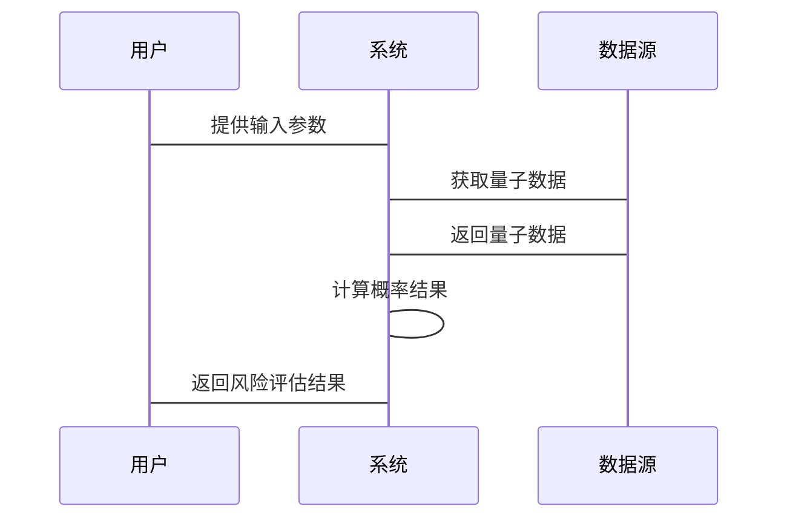

                 


# 芒格的"概率思维"在量子风险管理中的高级应用

**关键词**：芒格概率思维、量子风险管理、风险管理、概率计算、量子计算

**摘要**：  
芒格的“概率思维”是一种强大的决策工具，它不仅适用于传统金融投资，还可以在量子风险管理中发挥重要作用。本文深入探讨了概率思维在量子风险管理中的高级应用，结合概率模型、量子概率计算和系统架构设计，分析了其在不确定性量化、风险评估和风险控制中的独特优势。通过实际案例和算法实现，本文展示了如何利用概率思维优化量子风险管理过程，为相关领域的研究和实践提供了新的思路。

---

## 第一部分: 芒格的“概率思维”与量子风险管理基础

### 第1章: 芒格的“概率思维”概述

#### 1.1 概率思维的核心概念

##### 1.1.1 概率思维的定义
概率思维是一种基于概率论的思维方式，强调通过分析事件发生的概率来做出更科学的决策。芒格在其投资哲学中，将概率思维作为核心工具，用于评估投资风险和潜在回报。

##### 1.1.2 概率思维的基本原理
概率思维的基本原理包括：
1. **全概率公式**：考虑所有可能事件的概率之和等于1。
2. **贝叶斯定理**：通过条件概率更新初始假设。
3. **独立事件与相关事件**：区分事件之间的独立性或相关性，影响概率计算的方式。

##### 1.1.3 概率思维与决策的关系
概率思维通过量化不确定性，帮助决策者在复杂环境中做出最优选择。它不仅关注事件的可能性，还关注事件的潜在影响和权重。

#### 1.2 芒格概率思维的特点

##### 1.2.1 芒格概率思维的哲学基础
芒格的概率思维深受费马、帕斯卡等概率论创始人影响，强调概率的主观性和决策的权责统一。

##### 1.2.2 芒格概率思维的决策模型
芒格将概率思维与“决策树”结合，通过分析每个决策节点的概率和结果，选择最优路径。

##### 1.2.3 芒格概率思维的实践应用
芒格的投资哲学中，概率思维用于评估企业的竞争优势、财务健康和市场前景。

#### 1.3 量子风险管理的基本概念

##### 1.3.1 量子风险的定义
量子风险是指在量子计算、量子通信等新兴技术中，由于量子系统固有的不确定性导致的风险。

##### 1.3.2 量子风险的分类
1. **技术风险**：量子技术尚未成熟导致的不确定性。
2. **计算风险**：量子计算对现有加密算法的威胁。
3. **市场风险**：量子技术发展对市场的影响。

##### 1.3.3 量子风险的评估方法
包括量子概率计算、蒙特卡洛模拟和量子模型分析等。

#### 1.4 芒格概率思维与量子风险管理的结合

##### 1.4.1 概率思维在量子风险管理中的作用
概率思维帮助量化量子风险的不确定性和潜在影响。

##### 1.4.2 量子风险管理的核心问题
1. 量子技术的不确定性。
2. 量子系统的复杂性。
3. 量子风险的跨领域影响。

##### 1.4.3 概率思维在量子风险管理中的应用前景
通过概率模型优化量子风险评估，提高决策的科学性和准确性。

---

## 第二部分: 概率思维与量子风险管理的算法与系统架构

### 第2章: 概率思维与量子风险管理的核心概念

#### 2.1 概率模型与量子概率计算

##### 2.1.1 概率模型的定义
概率模型是描述随机事件发生概率的数学模型，用于量化不确定性。

##### 2.1.2 量子概率计算的基本原理
量子概率计算基于量子叠加和量子测量的原理，能够处理复杂的概率问题。

##### 2.1.3 概率模型与量子概率计算的对比
- 概率模型基于经典概率论。
- 量子概率计算利用量子态的叠加性和纠缠性，提供更强的计算能力。

#### 2.2 概率思维与量子风险管理的联系

##### 2.2.1 概率思维在量子风险管理中的核心作用
通过概率模型量化风险，优化决策。

##### 2.2.2 量子风险管理中的概率模型
包括贝叶斯网络、马尔可夫链等模型。

##### 2.2.3 概率思维与量子风险管理的协同效应
结合概率思维和量子计算的优势，提升风险评估的精度和效率。

#### 2.3 概率模型与量子概率计算的数学基础

##### 2.3.1 概率论的基本公式
- 概率加法公式：$P(A \cup B) = P(A) + P(B) - P(A \cap B)$。
- 条件概率公式：$P(A|B) = \frac{P(A \cap B)}{P(B)}$。
- 贝叶斯定理：$P(B|A) = \frac{P(A|B)P(B)}{P(A)}$。

##### 2.3.2 量子概率的基本公式
- 量子态的叠加性：$|\psi\rangle = a|0\rangle + b|1\rangle$，其中$a^2 + b^2 = 1$。
- 量子概率：$P(a) = |a|^2$，$P(b) = |b|^2$。

##### 2.3.3 概率模型与量子概率计算的数学对比
- 经典概率模型基于独立性假设。
- 量子概率计算考虑量子系统的相关性。

---

### 第3章: 概率思维在量子风险管理中的算法原理

#### 3.1 概率思维的算法基础

##### 3.1.1 概率算法的定义
概率算法是一种基于概率分布的算法，用于解决不确定性的优化问题。

##### 3.1.2 概率算法的基本类型
1. **蒙特卡洛方法**：通过随机采样估计概率分布。
2. **贝叶斯推理**：基于先验概率更新后验概率。
3. **马尔可夫链蒙特卡洛**：用于复杂概率模型的采样。

##### 3.1.3 概率算法的应用场景
包括金融风险管理、量子计算模拟等领域。

#### 3.2 量子概率计算的算法原理

##### 3.2.1 量子概率计算的基本原理
利用量子叠加和量子测量的特性，计算复杂概率分布。

##### 3.2.2 量子概率计算的核心算法
1. **量子傅里叶变换**：用于处理周期性问题。
2. **量子计数算法**：用于计算特定结果的数量。

##### 3.2.3 量子概率计算的数学模型
量子态的叠加性和测量概率的计算。

#### 3.3 概率思维与量子风险管理的算法结合

##### 3.3.1 概率算法在量子风险管理中的应用
将概率算法用于量子风险的评估和预测。

##### 3.3.2 量子概率计算在风险管理中的应用
利用量子计算的优势，提高概率模型的计算效率。

##### 3.3.3 概率思维与量子风险管理算法的协同优化
结合概率算法和量子计算的优势，优化风险评估过程。

---

## 第三部分: 概率思维与量子风险管理的系统架构与项目实战

### 第4章: 概率思维与量子风险管理的系统架构设计

#### 4.1 系统架构设计的基本原则

##### 4.1.1 系统架构设计的目标
确保系统的高效性、可靠性和可扩展性。

##### 4.1.2 系统架构设计的核心要素
包括功能模块划分、数据流设计、系统交互设计。

##### 4.1.3 系统架构设计的常见方法
包括分层设计、模块化设计、面向服务设计。

#### 4.2 概率思维与量子风险管理的系统架构

##### 4.2.1 系统功能模块划分
1. 数据采集模块：收集量子系统的运行数据。
2. 概率计算模块：基于概率模型计算风险概率。
3. 风险评估模块：输出风险评估结果。
4. 决策支持模块：提供优化决策建议。

##### 4.2.2 系统功能模块之间的关系
通过数据流和功能调用连接，形成完整的系统架构。

##### 4.2.3 系统架构的优化策略
结合概率思维和量子计算的优势，优化系统性能。

#### 4.3 概率思维与量子风险管理的系统接口设计

##### 4.3.1 系统接口设计的原则
确保接口的标准化、模块化和可扩展性。

##### 4.3.2 系统接口的具体实现
包括API接口的设计、数据格式的规范、错误处理机制。

#### 4.4 系统交互的mermaid序列图



---

### 第5章: 概率思维与量子风险管理的项目实战

#### 5.1 项目背景与目标

##### 5.1.1 项目背景
开发一个基于概率思维的量子风险评估系统。

##### 5.1.2 项目目标
实现量子风险的量化评估和优化决策。

#### 5.2 项目环境与工具安装

##### 5.2.1 环境要求
- 操作系统：Linux/Windows/MacOS
- 开发工具：Python、Jupyter Notebook
- 量子计算库：Qiskit、Cirq

##### 5.2.2 工具安装
```bash
pip install numpy
pip install qiskit
pip install qulacs
```

#### 5.3 项目核心实现

##### 5.3.1 核心代码实现
```python
from qiskit import QuantumCircuit, Aer, execute
from qiskit.visualization import plot_histogram

def quantum_risk_assessment(n=10):
    qc = QuantumCircuit(n)
    # 添加量子门操作
    qc.h(range(n))
    qc.measure(range(n), range(n))
    backend = Aer.get_backend('qasm_simulator')
    job = execute(qc, backend, shots=1024)
    result = job.result()
    counts = result.get_counts(qc)
    return counts

# 执行量子风险评估
counts = quantum_risk_assessment()
plot_histogram(counts)
```

##### 5.3.2 代码解读与分析
1. **量子电路设计**：使用H门对量子比特进行初始化。
2. **量子测量**：测量量子比特的状态。
3. **结果分析**：统计测量结果，生成概率分布图。

#### 5.4 实际案例分析

##### 5.4.1 案例背景
评估量子计算对现有加密算法的影响。

##### 5.4.2 案例分析
通过概率模型和量子计算，评估不同加密算法的量子风险。

#### 5.5 项目小结
通过实际项目，验证概率思维在量子风险管理中的有效性。

---

## 第四部分: 概率思维与量子风险管理的高级应用与最佳实践

### 第6章: 概率思维与量子风险管理的高级应用

#### 6.1 量子风险管理的最新研究进展

##### 6.1.1 概率思维与量子计算的结合
新的概率模型和量子算法的开发。

##### 6.1.2 量子风险管理的跨学科应用
在金融、能源、通信等领域的应用。

#### 6.2 概率思维与量子风险管理的未来发展方向

##### 6.2.1 理论研究
开发更高效的量子概率计算模型。

##### 6.2.2 实际应用
推广量子风险管理技术的应用范围。

### 第7章: 概率思维与量子风险管理的最佳实践

#### 7.1 最佳实践 tips

##### 7.1.1 模型选择
选择适合的量子概率模型，确保模型的有效性。

##### 7.1.2 数据处理
确保数据的准确性和完整性，优化计算结果。

##### 7.1.3 结果解释
清晰解释量子概率计算的结果，便于决策者理解。

#### 7.2 小结
概率思维与量子风险管理的结合，为风险评估提供了新的思路。

#### 7.3 注意事项
注意量子计算的局限性和概率模型的假设条件，避免误用。

#### 7.4 拓展阅读
推荐相关书籍和论文，供读者深入学习。

---

## 作者：AI天才研究院/AI Genius Institute & 禅与计算机程序设计艺术 /Zen And The Art of Computer Programming

---

通过以上结构，我们系统地阐述了芒格的“概率思维”在量子风险管理中的高级应用，从理论到实践，从算法到系统架构，为相关领域的研究和实践提供了全面的指导。

