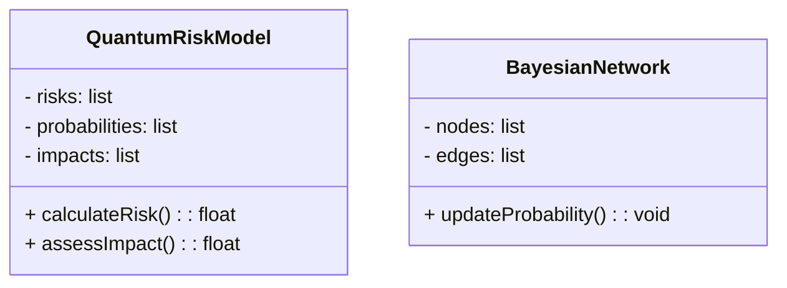
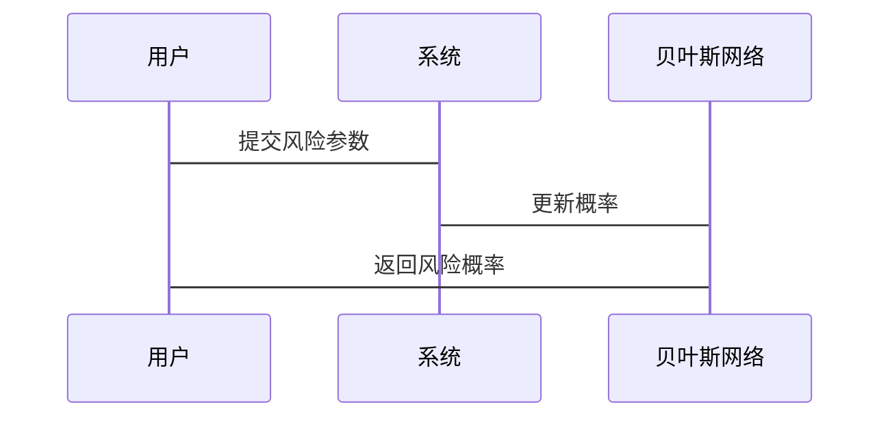

                 


# 芒格的"概率思维"在量子风险管理模型中的高级应用

**关键词**: 概率思维, 量子风险, 风险管理模型, 芒格, 贝叶斯定理, 量子力学, 决策分析

**摘要**: 本文深入探讨了芒格的"概率思维"在量子风险管理模型中的高级应用。通过结合概率思维的核心原理与量子力学的基本概念，提出了一种创新的量子风险管理模型。文章从概率思维的起源、量子风险的基本概念出发，详细分析了芒格概率思维的核心原理及其在量子风险管理中的数学表达。通过具体的算法实现、系统架构设计和项目实战案例，展示了概率思维在量子风险管理中的实际应用价值。最后，本文总结了芒格概率思维在量子风险管理中的优势与挑战，并提出了未来研究的方向。

---

# 正文

## 第一章: 芒格的"概率思维"概述

### 1.1 概率思维的起源与核心概念

#### 1.1.1 概率思维的定义
概率思维是一种基于概率论的思维方式，强调通过分析事件发生的可能性来做出更合理的决策。它不同于传统的确定性思维，更注重对不确定性事件的分析和预测。

#### 1.1.2 芒格对概率思维的贡献
芒格是概率思维领域的杰出代表，他提出的"反事实推理"和"第二层思维"等概念，为概率思维在实际问题中的应用提供了新的视角。

#### 1.1.3 概率思维与传统决策方式的对比
- **传统决策方式**: 基于确定性假设，忽视不确定性。
- **概率思维**: 强调对不确定性事件的分析和量化，帮助决策者在模糊性和不完全信息下做出更合理的决策。

### 1.2 量子风险管理模型的基本概念

#### 1.2.1 量子风险的定义
量子风险是指由于量子计算、量子通信等技术的快速发展，可能引发的新型安全风险，包括数据泄露、算法漏洞等。

#### 1.2.2 量子风险管理模型的核心要素
- **风险识别**: 识别潜在的量子风险。
- **风险评估**: 量化风险的可能性和影响程度。
- **风险应对**: 制定应对策略，降低风险影响。

#### 1.2.3 量子风险管理模型与传统风险管理的对比
- **传统风险管理**: 基于确定性分析，忽视量子技术的不确定性。
- **量子风险管理模型**: 结合量子力学的不确定性原理，更准确地评估和应对风险。

### 1.3 芒格概率思维在量子风险管理中的应用前景

#### 1.3.1 量子风险管理的复杂性
量子风险管理涉及多个不确定性因素，传统的风险管理方法难以应对。

#### 1.3.2 芒格概率思维的优势
- **反事实推理**: 能够分析多种可能的假设情景，帮助制定更全面的风险应对策略。
- **第二层思维**: 通过分析对手的决策，预测潜在风险。

#### 1.3.3 应用的潜在价值与挑战
- **价值**: 提高风险管理的准确性和全面性。
- **挑战**: 量子力学的复杂性增加了概率分析的难度。

---

## 第二章: 芒格概率思维的核心原理

### 2.1 概率思维的基本原理

#### 2.1.1 概率的基本公式
概率的基本公式包括：
- **条件概率**: $P(A|B) = \frac{P(B|A)P(A)}{P(B)}$
- **联合概率**: $P(A \cap B) = P(A)P(B|A)$

#### 2.1.2 贝叶斯定理的解释
贝叶斯定理是一种用于更新概率的工具，其公式为：
$$ P(A|B) = \frac{P(B|A)P(A)}{P(B)} $$

#### 2.1.3 概率思维在决策中的应用
概率思维可以帮助决策者在不确定情况下做出更合理的决策，例如在风险管理中预测潜在风险的可能性。

### 2.2 芒格概率思维的独特性

#### 2.2.1 芒格的概率思维框架
芒格的概率思维框架包括以下几个步骤：
1. **明确问题**: 明确需要解决的风险问题。
2. **分析假设**: 分析问题的假设条件。
3. **反事实推理**: 分析假设情景的可能性。
4. **量化概率**: 量化每个假设情景的概率。
5. **制定策略**: 根据概率分析结果制定应对策略。

#### 2.2.2 芒格思维中的"反事实推理"
反事实推理是一种通过分析假设情景来预测结果的方法，例如分析"如果采取某种策略，风险发生的概率是多少？"

#### 2.2.3 芒格思维中的"第二层思维"
第二层思维是指分析对手的决策过程，预测可能的风险。

### 2.3 芒格概率思维与量子力学的联系

#### 2.3.1 量子力学的基本原理
量子力学是一种描述微观粒子行为的物理理论，其核心概念包括量子态、叠加态和纠缠态。

#### 2.3.2 概率思维与量子力学的相似性
- **不确定性**: 概率思维和量子力学都涉及不确定性。
- **概率计算**: 两者都依赖概率计算来描述事件的可能性。

#### 2.3.3 量子概率与经典概率的对比
- **经典概率**: 基于确定性假设，概率值在0到1之间。
- **量子概率**: 基于量子叠加态，概率值可以超过1，但整体概率仍为1。

---

## 第三章: 量子风险管理模型的数学基础

### 3.1 量子力学的基本数学模型

#### 3.1.1 量子态的表示
量子态可以用向量表示，例如：
$$ |\psi\rangle = a|0\rangle + b|1\rangle $$

#### 3.1.2 量子叠加与测量
量子叠加是指量子态可以同时处于多个状态的叠加，测量会将量子态投影到某个特定状态。

#### 3.1.3 量子概率的计算公式
量子概率的计算公式为：
$$ P(i) = |a_i|^2 $$

### 3.2 概率思维在量子风险管理中的数学表达

#### 3.2.1 概率分布的构建
概率分布是量子风险管理模型的核心，可以使用贝叶斯网络构建概率分布。

#### 3.2.2 贝叶斯网络的应用
贝叶斯网络是一种用于表示概率关系的图形模型，可以用于量子风险的分析。

#### 3.2.3 量子风险评估的数学模型
量子风险评估的数学模型可以表示为：
$$ R = \sum_{i} P(i) \times I(i) $$
其中，$P(i)$ 是风险 $i$ 的概率，$I(i)$ 是风险 $i$ 的影响。

### 3.3 数学公式与案例分析

#### 3.3.1 量子概率公式
$$ P(A|B) = \frac{P(B|A)P(A)}{P(B)} $$

#### 3.3.2 案例分析：量子风险的贝叶斯评估
假设我们需要评估量子计算技术引发的安全风险，可以通过贝叶斯定理计算风险的概率。

---

## 第四章: 芒格概率思维在量子风险管理中的算法实现

### 4.1 概率思维算法的基本原理

#### 4.1.1 贝叶斯网络的构建
贝叶斯网络是一种基于概率的图形模型，可以用于量子风险的分析。

#### 4.1.2 贝叶斯网络的推理算法
贝叶斯网络的推理算法包括概率传播和马尔可夫链蒙特卡洛方法。

#### 4.1.3 贝叶斯网络的实现步骤
1. **定义变量**: 明确需要分析的变量。
2. **构建网络**: 构建贝叶斯网络的结构。
3. **训练模型**: 使用数据训练网络参数。
4. **进行推理**: 使用推理算法计算概率。

### 4.2 贝叶斯网络的实现

#### 4.2.1 贝叶斯网络的Python实现
```python
import numpy as np
from sklearn.naive_bayes import GaussianNB

# 示例数据
X = np.array([[-1, -1], [-1, 1], [1, -1], [1, 1]])
y = np.array([0, 0, 1, 1])

# 构建贝叶斯网络
model = GaussianNB()
model.fit(X, y)

# 预测
new_data = np.array([[0, 0]])
print(model.predict(new_data))
```

#### 4.2.2 贝叶斯网络的数学模型
贝叶斯网络的数学模型包括变量之间的条件概率分布，例如：
$$ P(A|B,C) = \frac{P(A,B|C)}{P(B|C)} $$

---

## 第五章: 系统分析与架构设计方案

### 5.1 问题场景介绍
量子风险管理系统的应用场景包括量子计算安全、量子通信安全等。

### 5.2 系统功能设计

#### 5.2.1 领域模型设计
领域模型可以使用Mermaid类图表示，例如：


#### 5.2.2 系统架构设计
系统架构可以使用Mermaid架构图表示，例如：


#### 5.2.3 系统接口设计
系统接口包括：
- **输入接口**: 接收用户输入的风险参数。
- **输出接口**: 输出风险评估结果。

#### 5.2.4 系统交互设计
系统交互可以使用Mermaid序列图表示，例如：


---

## 第六章: 项目实战

### 6.1 环境安装

#### 6.1.1 Python环境安装
安装Python和必要的库：
```bash
pip install numpy scikit-learn mermaid
```

### 6.2 系统核心实现

#### 6.2.1 贝叶斯网络的实现
```python
from sklearn.naive_bayes import GaussianNB
import numpy as np

# 示例数据
X = np.array([[-1, -1], [-1, 1], [1, -1], [1, 1]])
y = np.array([0, 0, 1, 1])

# 构建贝叶斯网络
model = GaussianNB()
model.fit(X, y)

# 预测
new_data = np.array([[0, 0]])
print(model.predict(new_data))
```

#### 6.2.2 案例分析
分析量子计算技术引发的安全风险，使用贝叶斯网络计算风险的概率。

### 6.3 项目小结
通过项目实战，展示了概率思维在量子风险管理中的实际应用价值。

---

## 第七章: 总结与展望

### 7.1 总结
本文深入探讨了芒格概率思维在量子风险管理中的应用，提出了创新的量子风险管理模型，并通过具体案例展示了其实际应用价值。

### 7.2 注意事项
- **数据质量**: 数据的准确性和完整性对风险评估结果影响重大。
- **模型复杂性**: 量子风险管理模型的复杂性可能增加实现难度。

### 7.3 拓展阅读
- **推荐书籍**: 《概率论： Bayesian 统计学入门》
- **推荐论文**: "贝叶斯网络在风险管理中的应用"

---

## 作者信息

作者：AI天才研究院/AI Genius Institute & 禅与计算机程序设计艺术 /Zen And The Art of Computer Programming

