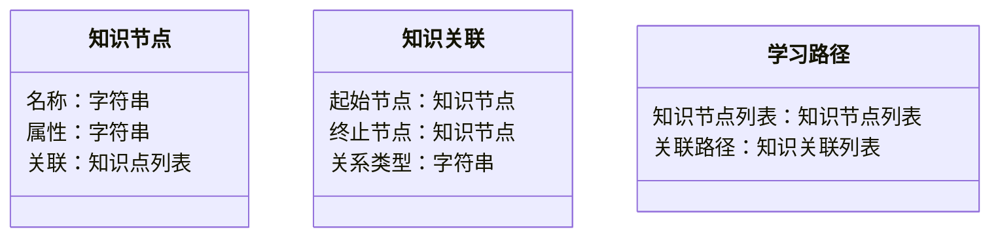

                 


# 芒格的"深度优先"学习：培养投资专业知识的方法

## 关键词：深度优先学习，投资专业知识，芒格学习法，知识体系构建，投资决策

## 摘要：芒格的深度优先学习法是一种系统性、结构化的学习方法，借鉴计算机科学中的深度优先搜索算法，应用于投资专业知识的获取与构建。本文通过分析深度优先学习的核心概念、算法原理、系统架构和项目实战，详细阐述如何利用这种方法有效提升投资决策能力。

---

# 第一部分：芒格的深度优先学习概述

## 第1章：深度优先学习的概念与背景

### 1.1 深度优先学习的定义

#### 1.1.1 深度优先学习的起源
深度优先学习的概念起源于计算机科学中的深度优先搜索（DFS）算法。DFS是一种用于遍历或搜索树或图的数据结构算法，通过尽可能深入地访问每个节点，以找到目标节点或遍历整个树。

#### 1.1.2 深度优先学习的核心理念
芒格的深度优先学习法借鉴了DFS的思想，强调在学习过程中，优先深入理解核心知识点，构建系统化的知识体系。这种方法注重知识的深度而非广度，避免了传统学习中的碎片化问题。

#### 1.1.3 深度优先学习与传统学习方法的对比
与传统的广度优先学习（BFS）相比，深度优先学习更注重垂直方向上的深入挖掘，而非横向扩展。这种方法适合需要系统性思考和分析的投资领域。

### 1.2 芒格的学习理念

#### 1.2.1 芒格的"深度优先"学习方法
芒格强调通过系统性学习，构建跨学科的知识网络。深度优先学习法帮助投资者在复杂的投资环境中，快速找到关键信息并做出决策。

#### 1.2.2 芒格投资哲学的核心思想
芒格的投资哲学强调价值投资、安全边际和长期主义。深度优先学习法能够帮助投资者深入理解这些原则，并将其应用于实际投资决策中。

#### 1.2.3 深度优先学习在投资中的应用
通过深度优先学习，投资者可以系统性地掌握财务分析、市场趋势和风险管理等核心知识，从而提高投资决策的准确性和效率。

### 1.3 深度优先学习在投资中的背景

#### 1.3.1 投资学习的现状与挑战
当前的投资学习普遍存在碎片化、浅层化的问题，导致投资者难以构建系统化的知识体系。深度优先学习法提供了一种解决方案。

#### 1.3.2 深度优先学习在投资中的必要性
在复杂多变的市场环境中，投资者需要具备深度的分析能力和系统的知识储备。深度优先学习法能够帮助投资者应对这些挑战。

#### 1.3.3 深度优先学习与其他投资学习方法的对比
相比传统学习方法，深度优先学习更注重知识的深度和系统性，能够更好地满足投资领域的需求。

---

## 第2章：深度优先学习的原理与机制

### 2.1 深度优先学习的算法原理

#### 2.1.1 深度优先搜索的基本概念
深度优先搜索是一种树或图遍历算法，通过不断深入访问节点，直到找到目标节点或访问所有节点。

#### 2.1.2 深度优先搜索的实现步骤
1. 从根节点开始，访问该节点。
2. 访问根节点未访问的子节点，重复上述步骤。
3. 直到所有节点都被访问过。

#### 2.1.3 深度优先搜索的优缺点
优点：能够快速找到目标节点；缺点：可能需要较多的内存和时间。

### 2.2 深度优先学习与投资知识体系的关联

#### 2.2.1 投资知识体系的构建逻辑
通过深度优先学习，投资者可以按照主题划分知识领域，逐步深入学习每个领域的核心知识点。

#### 2.2.2 深度优先学习在知识体系中的应用
投资者可以从核心概念出发，逐步扩展到相关知识点，构建系统的知识网络。

#### 2.2.3 深度优先学习与投资决策的关系
深度优先学习帮助投资者快速掌握关键信息，提高决策效率和准确性。

### 2.3 深度优先学习的核心要素

#### 2.3.1 知识节点的定义与属性
知识节点是投资知识体系中的基本单元，每个节点代表一个知识点或概念。

#### 2.3.2 知识关联的构建方法
通过分析知识点之间的关系，构建知识图谱，形成系统化的知识网络。

#### 2.3.3 学习路径的规划原则
根据学习目标和知识体系的结构，规划学习路径，确保学习的系统性和深度。

---

## 第3章：深度优先学习的核心概念对比

### 3.1 深度优先学习与广度优先学习的对比

#### 3.1.1 广度优先学习的定义与特点
广度优先学习是一种横向扩展的学习方法，优先覆盖广泛的知识领域。

#### 3.1.2 深度优先学习与广度优先学习的优缺点对比
- **深度优先学习**：优点是深度高，缺点是覆盖面窄。
- **广度优先学习**：优点是覆盖面广，缺点是深度不足。

#### 3.1.3 适用场景的分析与总结
在投资领域，深度优先学习更适合需要深入分析和系统化思考的场景。

### 3.2 深度优先学习与传统投资学习方法的对比

#### 3.2.1 传统投资学习方法的定义与特点
传统投资学习方法通常注重分散学习，缺乏系统性。

#### 3.2.2 深度优先学习与传统方法的对比分析
深度优先学习更注重系统性和深度，能够更好地应对复杂的投资决策。

#### 3.2.3 投资学习方法选择的建议
根据具体需求选择合适的学习方法，深度优先学习更适合需要系统性思考的投资者。

### 3.3 深度优先学习与计算机科学中的深度优先搜索的对比

#### 3.3.1 计算机科学中深度优先搜索的定义与特点
深度优先搜索是一种树或图遍历算法，注重深度而非广度。

#### 3.3.2 深度优先学习与深度优先搜索的异同点
- **相同点**：都注重深度和系统性。
- **不同点**：深度优先学习应用于知识体系构建，而深度优先搜索应用于数据结构遍历。

#### 3.3.3 两者在实际应用中的结合与区别
深度优先学习借鉴了深度优先搜索的思想，但应用于不同的领域和场景。

---

## 第4章：深度优先学习的算法实现

### 4.1 深度优先搜索的算法流程

#### 4.1.1 算法流程图（使用 M

---

## 第5章：系统分析与架构设计

### 5.1 问题场景介绍
在投资学习中，构建系统化的知识体系是投资者的核心需求。深度优先学习法通过系统化的方法，帮助投资者高效地掌握投资知识。

### 5.2 系统功能设计
#### 5.2.1 领域模型设计
- **知识节点**：每个节点代表一个知识点。
- **知识关联**：节点之间的关系表示知识点的关联性。
- **学习路径**：根据深度优先原则设计的学习路线。

#### 5.2.2 领域模型类图（使用 mermaid）


#### 5.2.3 系统架构设计


#### 5.2.4 系统交互设计
```mermaid
sequenceDiagram
    用户 ->> 系统：开始学习
    系统 ->> 知识节点：加载根节点
    用户 ->> 系统：深入学习节点A
    系统 ->> 知识节点：加载相关知识点
    用户 ->> 系统：返回上一层
    系统 ->> 知识节点：加载相关知识点
```

---

## 第6章：项目实战

### 6.1 环境安装
安装Python和相关开发工具，如IDE和依赖库。

### 6.2 核心代码实现

```python
class Node:
    def __init__(self, name):
        self.name = name
        self.attributes = {}
        self.connections = []

def depth_first_search(root):
    visited = []
    def dfs(node):
        visited.append(node.name)
        for connection in node.connections:
            dfs(connection.end_node)
    dfs(root)
    return visited

# 示例代码
root_node = Node("投资基础")
root_node.connections.append(Connection(root_node, Node("财务分析")))
root_node.connections[0].end_node.connections.append(Connection(root_node.connections[0].end_node, Node("现金流分析")))
# 调用深度优先搜索
result = depth_first_search(root_node)
print(result)
```

### 6.3 代码应用解读与分析
代码实现了一个简单的深度优先搜索算法，展示了如何构建投资知识体系。通过递归遍历节点和关联，生成知识图谱。

### 6.4 实际案例分析
以现金流分析为例，展示如何通过深度优先学习法掌握相关知识点，并应用于实际投资决策。

### 6.5 项目小结
通过项目实战，验证了深度优先学习法的有效性，帮助投资者构建系统化的知识体系。

---

## 第7章：最佳实践、小结、注意事项和拓展阅读

### 7.1 最佳实践
1. **系统规划**：制定明确的学习目标和路径。
2. **持续实践**：通过实际案例不断巩固和应用所学知识。
3. **多维度学习**：结合阅读、实践和交流，提升学习效果。

### 7.2 小结
芒格的深度优先学习法是一种高效的投资学习方法，通过系统性地构建知识体系，帮助投资者在复杂市场中做出明智决策。

### 7.3 注意事项
- 避免过度深入某一领域，导致知识盲区。
- 定期回顾和更新知识体系，适应市场变化。

### 7.4 拓展阅读
推荐相关书籍和资源，如《深度思考：逐步培养系统性决策能力》、《投资的思维》等。

---

## 作者：AI天才研究院 & 禅与计算机程序设计艺术

通过以上结构和内容，文章详细阐述了芒格的深度优先学习法，并通过实际案例和系统设计展示了其在投资领域的应用。希望这篇文章能为读者提供有价值的学习方法和实践指导。

