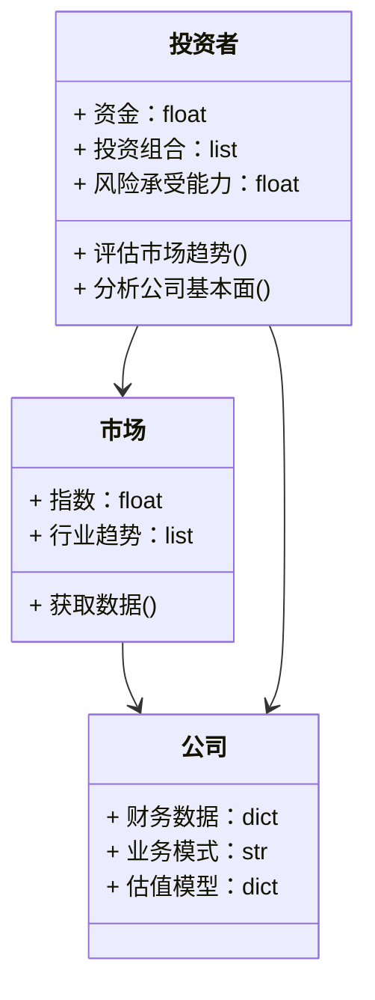
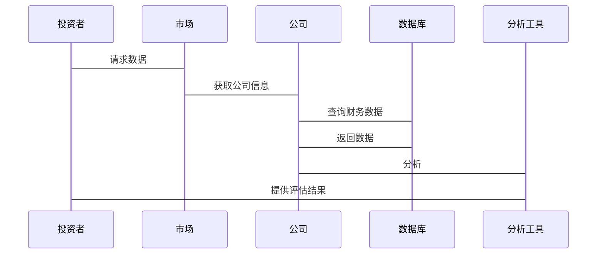

                 


# 芒格的"清晰思考"方法在复杂系统投资中的应用

## 关键词：
-芒格的清晰思考，复杂系统投资，决策框架，系统分析，数学模型

## 摘要：
芒格的“清晰思考”方法是一种独特的投资决策框架，强调通过系统性的逻辑推理和跨学科思维来分析复杂问题。本文将深入探讨这一方法的核心原理、数学模型及其在复杂系统投资中的实际应用，通过具体案例展示如何利用这些方法进行有效的投资决策。

---

## 第一部分：芒格的“清晰思考”方法概述

### 第1章：芒格的生平与投资理念

#### 1.1 芒格的生平与背景
- **1.1.1 芝加格俱乐部与芒格的早期思想**
 芒格最初在芝加格俱乐部接触到了格雷厄姆的价值投资理念，这为他后来的“清晰思考”方法奠定了基础。

- **1.1.2 芒格的“格雷厄姆式”投资理念**
 芒格继承了格雷厄姆的估值方法，但进一步发展出自己的投资框架，注重长期价值和安全边际。

- **1.1.3 芒格的“第二性思维”与决策框架**
 “第二性思维”强调逆向思考，寻找市场中的非共识机会，这成为“清晰思考”的核心要素。

#### 1.2 “清晰思考”的核心概念
- **1.2.1 清晰思考的定义与特征**
 清晰思考是一种系统性、跨学科的思维方式，注重逻辑推理和风险评估。

- **1.2.2 清晰思考与传统投资方法的对比**
 传统投资方法可能依赖市场趋势或技术分析，而清晰思考更注重基本面分析和长期逻辑。

- **1.2.3 清晰思考在复杂系统中的应用**
 在复杂系统中，清晰思考帮助投资者识别关键变量及其相互作用，从而做出更稳健的决策。

### 第2章：芒格“清晰思考”方法的核心要素

#### 2.1 核心概念与联系
- **2.1.1 核心概念原理**
 芒格的方法强调理解事物的本质，而非表面现象，这在复杂系统中尤为重要。

- **2.1.2 核心概念属性特征对比表格**
 下表展示了清晰思考与其他投资方法在关键属性上的对比：

| 属性         | 清晰思考          | 传统技术分析  | 基本面分析  |
|--------------|-------------------|---------------|--------------|
| 重点         | 逻辑推理与系统性 | 市场趋势       | 财务指标     |
| 工具         | 决策框架         | 技术指标       | 财务模型     |
| 适用场景     | 复杂系统投资      | 短期交易       | 长期估值     |

- **2.1.3 实体关系图（ER图）的Mermaid流程图**
 ```mermaid
graph LR
    A[投资者] --> B[市场]
    B --> C[公司]
    C --> D[财务数据]
    D --> E[风险评估]
    E --> F[投资决策]
```

---

## 第二部分：芒格“清晰思考”方法的算法原理

### 第3章：算法原理讲解

#### 3.1 算法的Mermaid流程图


#### 3.2 算法的Python源代码实现
```python
def munges_clear_thinking_analysis(variables):
    key_factors = []
    for var in variables:
        if var['importance'] > 0.7:
            key_factors.append(var)
    model = create_mathematical_model(key_factors)
    risk_assessment = assess_risk(model)
    return make_decision(risk_assessment)

def create_mathematical_model(key_factors):
    # 创建数学模型，例如线性回归或决策树
    pass

def assess_risk(model):
    # 评估模型中的风险因素
    pass

def make_decision(risk_assessment):
    # 根据风险评估做出投资决策
    pass
```

#### 3.3 数学模型与公式
- **风险评估公式**：
 $$ \text{风险} = \sum_{i=1}^{n} w_i \times r_i $$
 其中，$w_i$ 是风险因子的权重，$r_i$ 是风险值。

---

## 第三部分：复杂系统投资中的系统分析与架构设计

### 第4章：系统分析与架构设计方案

#### 4.1 问题场景介绍
在复杂系统投资中，投资者需要处理多个变量，如市场波动、公司财务状况、行业趋势等。芒格的方法提供了一个框架，帮助处理这些复杂关系。

#### 4.2 系统功能设计（领域模型Mermaid类图）


#### 4.3 系统架构设计（Mermaid架构图）


#### 4.4 系统交互（Mermaid序列图）


---

## 第四部分：项目实战与应用

### 第5章：项目实战

#### 5.1 环境安装与工具准备
- 需要安装的工具：Python、Pandas、Matplotlib、Jupyter Notebook。

#### 5.2 核心实现源代码
```python
import pandas as pd
import matplotlib.pyplot as plt

def analyze_financials(finance_data):
    # 示例分析代码
    df = pd.DataFrame(finance_data)
    df['增长率'] = df['收入'].pct_change()
    plt.plot(df['增长率'])
    plt.show()

# 示例数据
data = {
    '收入': [100, 120, 130, 150],
    '利润': [20, 25, 30, 35]
}
analyze_financials(data)
```

#### 5.3 案例分析与解读
以某公司为例，分析其财务数据，应用芒格的方法评估其投资价值，并展示分析过程和结果。

---

## 第五部分：最佳实践与总结

### 第6章：最佳实践

#### 6.1 小结
芒格的“清晰思考”方法为复杂系统投资提供了系统化的分析框架，强调逻辑推理和跨学科思维。

#### 6.2 注意事项
- 需要持续学习和更新知识，以应对不断变化的市场环境。
- 在实际操作中，注意结合具体情况，灵活调整分析框架。

#### 6.3 拓展阅读
推荐阅读芒格的《穷查理宝典》以及相关投资心理学书籍。

---

## 作者信息

作者：AI天才研究院/AI Genius Institute & 禅与计算机程序设计艺术 /Zen And The Art of Computer Programming

---

这篇文章系统地介绍了芒格的“清晰思考”方法，并通过数学模型、系统架构和实际案例展示了其在复杂系统投资中的应用，旨在为投资者提供一个可靠的决策框架。

