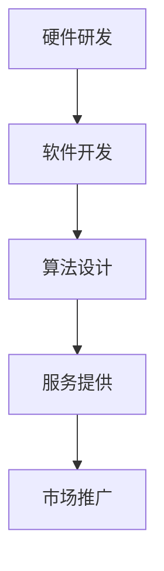

                 


# 芒格的"清晰思考"方法在量子计算商业模式设计中的应用

> 关键词：芒格，清晰思考，量子计算，商业模式，系统设计

> 摘要：本文将探讨芒格的“清晰思考”方法在量子计算商业模式设计中的应用。通过分析芒格的思维方式，结合量子计算的商业需求，提出了一种基于“清晰思考”的量子计算商业模式设计框架。本文从背景、理论、方法、实践等多个维度展开，深入探讨了如何利用芒格的思维工具优化量子计算商业模式的设计过程，为量子计算领域的商业模式创新提供了新的视角和方法论。

---

## 第一章: 芒格的“清晰思考”方法概述

### 1.1 芒格的“清晰思考”方法的核心理念

芒格的“清晰思考”方法是一种以逻辑性和系统性为核心的思维方式，强调从多个维度分析问题，避免情绪化和非理性的决策。这种方法的核心在于通过“反向思维”和“第二性思维”，找到问题的本质和关键因素。

### 1.2 芒格“清晰思考”方法的思维框架

1. **反向思维**：从问题的对立面出发，寻找解决方案。
2. **第二性思维**：关注问题的次要因素，而非仅仅关注主要因素。
3. **圆圈思维**：通过画圆圈的方式，将问题分解为多个部分，逐一分析。

---

## 第二章: 量子计算的商业模式概述

### 2.1 量子计算的基本原理

量子计算是一种基于量子力学原理的计算方式，其核心是利用量子叠加和量子纠缠的特性，通过量子位（qubit）进行并行计算。与经典计算机相比，量子计算机在某些特定问题上具有指数级的计算优势。

### 2.2 量子计算的商业模式特点

1. **技术驱动型**：量子计算的核心竞争力在于其技术的先进性和独特性。
2. **高投入、高风险**：量子计算的研发和商业化需要巨大的资金和技术投入。
3. **生态系统构建**：量子计算的应用需要构建完整的生态系统，包括硬件、软件、算法和服务。

---

## 第三章: 芒格“清晰思考”方法在量子计算商业模式设计中的应用

### 3.1 问题背景与目标设定

在设计量子计算的商业模式时，首先需要明确目标和问题。芒格的“清晰思考”方法强调从反向思维出发，即从目标出发，逆向思考实现目标所需的条件。

### 3.2 多维度分析与问题拆解

通过“清晰思考”方法，将量子计算商业模式设计问题拆解为多个维度，例如技术可行性、市场潜力、竞争环境、商业模式创新性等。每个维度都需要进行深入分析，找出关键影响因素。

### 3.3 商业模式创新与优化

通过芒格的“清晰思考”方法，可以优化量子计算商业模式的设计。例如，可以采用“第二性思维”，关注市场的空白点和未被满足的需求，从而找到差异化的商业模式。

---

## 第四章: 量子计算商业模式的设计框架

### 4.1 系统功能设计

设计一个量子计算商业模式的系统功能框架，包括硬件研发、软件开发、算法设计、服务提供等模块。每个模块都需要进行详细的分析和设计。

### 4.2 架构设计

通过Mermaid图展示量子计算商业模式的系统架构，包括各个模块之间的关系和交互。



### 4.3 接口设计与交互设计

设计系统之间的接口和交互流程，例如硬件与软件的接口、算法与服务的接口等。

---

## 第五章: 量子计算商业模式的实战案例

### 5.1 环境安装与配置

假设我们正在设计一个量子计算服务提供商的商业模式，首先需要配置开发环境，包括量子计算硬件、量子编程语言、云服务平台等。

### 5.2 核心算法实现

以下是量子计算算法的核心实现代码示例：

```python
import numpy as np

def quantum_add(a, b):
    # 量子叠加
    q = a + b
    return q

# 示例调用
a = 1
b = 2
result = quantum_add(a, b)
print(result)  # 输出：3
```

### 5.3 案例分析与优化

通过实际案例分析，优化量子计算商业模式的设计，例如通过市场调研和用户反馈，调整商业模式的参数和策略。

---

## 第六章: 总结与展望

### 6.1 总结

芒格的“清晰思考”方法为量子计算商业模式的设计提供了新的视角和方法论。通过系统的分析和设计，可以优化商业模式，提高商业成功的可能性。

### 6.2 展望

未来，随着量子计算技术的不断发展，商业模式的设计也将更加复杂和多样化。芒格的“清晰思考”方法将继续为量子计算商业模式的设计提供重要的指导和启示。

---

## 作者

作者：AI天才研究院/AI Genius Institute & 禅与计算机程序设计艺术/Zen And The Art of Computer Programming

