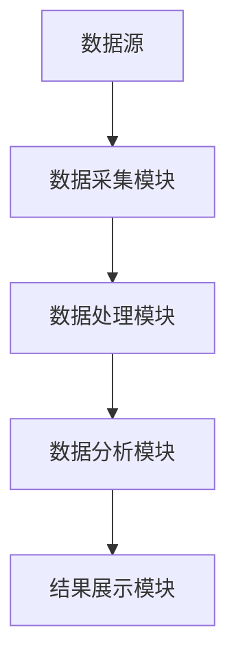
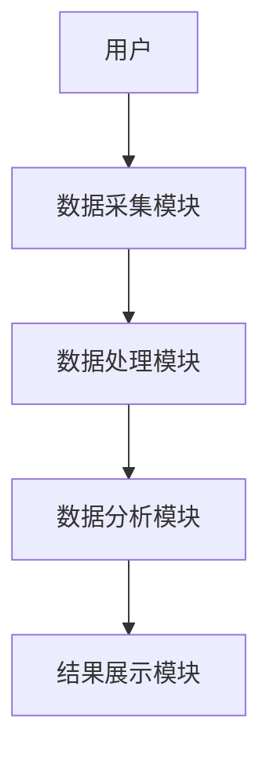

                 


# 芒格的"清晰思考"方法在高频数据分析中的运用

> 关键词：芒格清晰思考、高频数据分析、算法原理、系统架构、数据分析实战

> 摘要：本文将探讨芒格的“清晰思考”方法在高频数据分析中的应用，结合高频数据分析的特点，详细分析“清晰思考”方法的核心要素及其在数据处理中的具体应用。通过系统化的分析与案例研究，揭示如何利用芒格的思维方式优化高频数据分析的过程，提升数据处理的效率与准确性。

---

# 第一部分：高频数据分析与芒格“清晰思考”方法的背景介绍

## 第1章：高频数据分析的定义与特点

### 1.1 高频数据的定义
高频数据指的是在极短时间内产生的大量数据，通常以毫秒甚至微秒级别为单位。这种数据的特点是数据量大、变化速度快、实时性强，广泛应用于金融交易、实时监控等领域。

### 1.2 高频数据分析的核心特点
1. **实时性**：高频数据的处理必须在极短时间内完成，任何延迟都会导致数据价值的降低。
2. **海量性**：高频数据的生成速度极快，数据量大，对存储和处理能力要求高。
3. **复杂性**：高频数据通常包含大量噪声和不确定性，需要复杂的算法进行处理和分析。

### 1.3 高频数据分析的应用场景
1. **金融交易**：高频交易需要实时分析市场数据，捕捉短期价格波动。
2. **实时监控**：如网络流量监控、设备状态监测等，需要快速处理数据以做出实时决策。
3. **科学研究**：如气象监测、物理学实验等，需要高频数据支持科学研究。

---

## 第2章：芒格“清晰思考”方法的概述

### 2.1 芒格“清晰思考”方法的定义
芒格的“清晰思考”方法是一种通过系统性分析、逆向思维和多维度思考来解决问题的方法。它强调从多个角度审视问题，寻找问题的本质，并通过逻辑推理得出最优解决方案。

### 2.2 芒格“清晰思考”方法的核心要素
1. **系统性分析**：从整体出发，分析问题的各个组成部分及其相互关系。
2. **逆向思维**：从结果出发，反向推导可能的原因或路径。
3. **多维度思考**：综合考虑不同因素，避免单一视角的局限性。

### 2.3 芒格“清晰思考”方法与传统数据分析的区别
| 特性 | 芒格“清晰思考”方法 | 传统数据分析方法 |
|------|------------------|------------------|
| 思维方式 | 系统性、逆向思维 | 以数据为中心，注重统计分析 |
| 分析目标 | 寻找问题的本质 | 描述数据特征 |
| 应用场景 | 复杂问题解决 | 数据驱动决策 |

---

## 第3章：高频数据分析与芒格“清晰思考”方法的结合

### 3.1 高频数据分析的复杂性与挑战
1. **数据量大**：高频数据的生成速度极快，导致数据量大，处理难度高。
2. **数据噪声多**：高频数据中通常包含大量噪声，影响分析结果的准确性。
3. **处理时间短**：高频数据的实时性要求处理时间极短，对算法效率要求高。

### 3.2 芒格“清晰思考”方法在高频数据分析中的价值
1. **提升分析效率**：通过系统性分析和逆向思维，快速定位问题关键点。
2. **优化决策过程**：通过多维度思考，提高决策的准确性和科学性。
3. **降低误判风险**：通过全面分析，减少数据噪声对分析结果的影响。

### 3.3 本章小结
本章通过分析高频数据分析的特点和芒格“清晰思考”方法的核心要素，揭示了两者结合的必要性和可行性。下一章将详细探讨高频数据分析的核心概念与联系。

---

# 第二部分：高频数据分析的核心概念与联系

## 第4章：高频数据分析的核心概念与联系

### 4.1 数据流的实时处理
1. **实时处理的重要性**：高频数据分析的核心在于实时性，任何延迟都会导致数据价值的丧失。
2. **数据流的特征**：高频数据通常具有突发性、周期性和相关性等特点。

### 4.2 高频数据的特征提取
1. **特征提取的方法**：通过统计分析、机器学习等方法提取数据中的有用特征。
2. **特征提取的意义**：特征提取可以帮助我们从海量数据中提取有价值的信息，降低数据处理的复杂性。

### 4.3 数据噪声的识别与消除
1. **数据噪声的来源**：高频数据中通常包含大量噪声，如随机干扰、数据采集误差等。
2. **噪声识别的方法**：通过统计分析、信号处理等方法识别噪声。
3. **噪声消除的技术**：如滤波、降噪算法等。

---

## 第5章：高频数据分析中的系统性分析

### 5.1 系统性分析的定义
系统性分析是指从整体出发，分析问题的各个组成部分及其相互关系，寻找问题的根源。

### 5.2 系统性分析在高频数据分析中的应用
1. **数据流的整体分析**：从数据生成、传输到处理的整个流程进行系统性分析。
2. **系统架构的优化**：通过系统性分析，优化数据处理系统的架构，提升处理效率。

---

## 第6章：逆向思维在高频数据分析中的应用

### 6.1 逆向思维的定义
逆向思维是指从结果出发，反向推导可能的原因或路径。

### 6.2 逆向思维在高频数据分析中的应用
1. **问题定位**：通过逆向思维，快速定位数据处理中的问题。
2. **优化算法**：通过逆向思维，优化数据处理算法的效率和准确性。

---

## 第7章：多维度思考在高频数据分析中的应用

### 7.1 多维度思考的定义
多维度思考是指从多个角度审视问题，综合考虑不同因素，避免单一视角的局限性。

### 7.2 多维度思考在高频数据分析中的应用
1. **数据分析的全面性**：通过多维度思考，全面分析数据的特征和规律。
2. **决策的科学性**：通过多维度思考，提高决策的准确性和科学性。

---

# 第三部分：高频数据分析的算法原理与数学模型

## 第8章：高频数据分析的算法原理

### 8.1 数据流处理算法
1. **滑动窗口算法**：用于实时处理数据流，提取有用特征。
2. **队列处理算法**：用于数据的高效存储和处理。

### 8.2 特征提取算法
1. **统计分析算法**：如均值、方差、协方差等。
2. **机器学习算法**：如主成分分析（PCA）、支持向量机（SVM）等。

### 8.3 数据优化算法
1. **滤波算法**：用于消除数据噪声。
2. **降维算法**：用于减少数据维度，降低计算复杂度。

---

## 第9章：高频数据分析的数学模型

### 9.1 数据流速率的数学模型
$$ \text{数据流速率} = \frac{\text{数据量}}{\text{时间间隔}} $$

### 9.2 特征提取的数学公式
$$ \text{特征权重} = \sum_{i=1}^{n} w_i x_i $$

### 9.3 数据优化的数学公式
$$ \text{优化结果} = \text{原始数据} \times \text{优化因子} $$

---

# 第四部分：高频数据分析系统的架构设计

## 第10章：高频数据分析系统的架构设计

### 10.1 系统功能设计
1. **数据采集模块**：负责采集高频数据。
2. **数据处理模块**：负责对数据进行预处理和特征提取。
3. **数据分析模块**：负责对数据进行分析，生成结果。
4. **结果展示模块**：负责展示分析结果。

### 10.2 系统架构图


---

## 第11章：系统接口设计与交互图

### 11.1 系统接口设计
1. **数据采集接口**：定义数据采集模块的接口，如API。
2. **数据处理接口**：定义数据处理模块的接口，如队列处理接口。
3. **数据分析接口**：定义数据分析模块的接口，如特征提取接口。

### 11.2 系统交互流程图


---

# 第五部分：高频数据分析的项目实战

## 第12章：项目实战

### 12.1 环境安装
1. **安装Python环境**：如Python 3.8以上版本。
2. **安装相关库**：如numpy、pandas、scikit-learn等。

### 12.2 核心代码实现
```python
import numpy as np
import pandas as pd

# 滑动窗口算法
def moving_window(data, window_size):
    return data.rolling(window_size).mean()

# 特征提取算法
def feature_extraction(data):
    features = data.describe()
    return features

# 数据优化算法
def data_optimization(data):
    optimized_data = data.dropna()
    return optimized_data
```

### 12.3 实际案例分析
1. **案例背景**：假设我们有一个高频交易的数据集，需要实时分析市场数据，捕捉价格波动。
2. **数据处理**：使用滑动窗口算法处理数据流，提取有用特征。
3. **数据分析**：使用特征提取算法分析数据，生成交易信号。
4. **结果展示**：将分析结果展示在可视化界面上，供交易者参考。

---

## 第13章：项目小结

### 13.1 项目总结
通过本项目的实战，我们掌握了高频数据分析的核心方法，熟悉了芒格“清晰思考”方法的应用，提升了数据处理的效率和准确性。

### 13.2 注意事项
1. **数据处理的实时性**：高频数据分析需要高效的算法和优化的系统架构。
2. **数据噪声的处理**：数据噪声会影响分析结果，需要通过多种方法进行消除。
3. **系统的可扩展性**：高频数据分析系统需要具备良好的可扩展性，以应对数据量的快速增长。

---

## 第14章：总结与展望

### 14.1 总结
通过本文的分析与实践，我们深入探讨了芒格“清晰思考”方法在高频数据分析中的应用，揭示了其在提升数据分析效率和准确性的巨大潜力。

### 14.2 注意事项
1. **算法优化**：高频数据分析需要不断优化算法，提高处理速度和准确性。
2. **系统架构**：系统架构的设计需要考虑可扩展性、可维护性等因素。
3. **数据安全**：高频数据分析涉及大量数据，需要注意数据的安全性和隐私保护。

### 14.3 拓展阅读
1. 《Python机器学习实战》
2. 《高频交易算法与策略》
3. 《芒格的投资哲学》

---

作者：AI天才研究院/AI Genius Institute & 禅与计算机程序设计艺术 /Zen And The Art of Computer Programming

