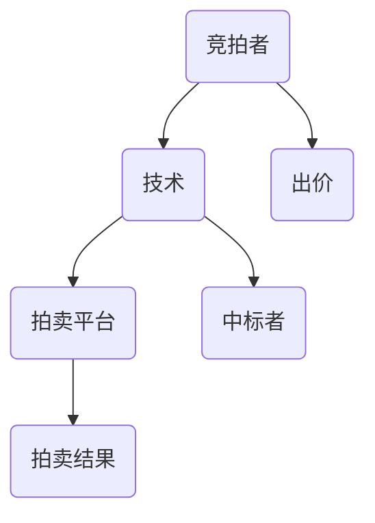
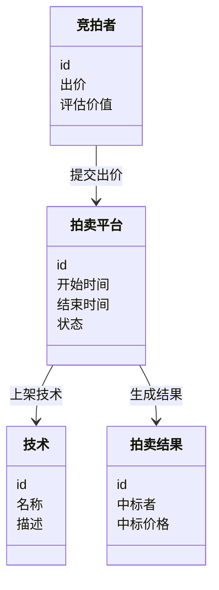
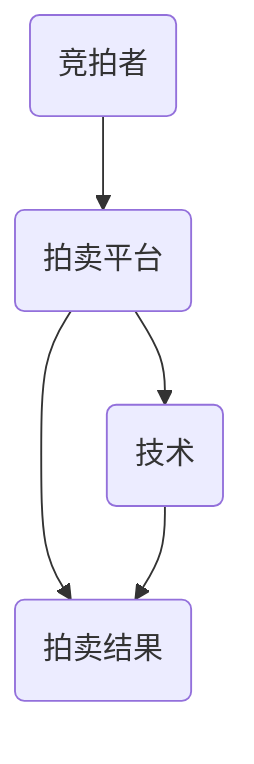

                 


# 芒格的"赢家的诅咒"提醒在前沿科技拍卖中的应用

> 关键词：赢家的诅咒，前沿科技，拍卖，芒格，技术估值，投资策略

> 摘要：本文深入探讨了芒格提出的“赢家的诅咒”在前沿科技拍卖中的应用，分析了该现象在科技领域的具体表现，结合数学模型和系统架构，提出了规避该诅咒的策略和建议。

---

## 第一部分: 芒格的"赢家的诅咒"与前沿科技拍卖的背景

### 第1章: "赢家的诅咒"概念解析

#### 1.1 "赢家的诅咒"的定义与核心思想
"赢家的诅咒"是指在拍卖中，中标者往往会支付比市场价更高的价格，因为竞拍者都过于乐观，认为自己能够以更低的价格获得拍品。这种现象在前沿科技领域尤为明显，因为科技产品或技术的未来价值难以准确评估，容易引发过度竞争和价格泡沫。

#### 1.2 "赢家的诅咒"在投资与商业中的表现
在投资和商业领域，"赢家的诅咒"表现为：投资者为了争夺稀缺资源（如新技术、专利）而不断提高出价，最终导致中标价格远高于其实际价值。这种现象不仅影响了投资者的财务健康，还可能导致资源的浪费和市场的不稳定。

#### 1.3 "赢家的诅咒"与前沿科技领域的关联
前沿科技领域的拍卖通常涉及高风险、高回报的技术。竞拍者基于其未来可能的应用和高收益，纷纷提高出价，最终导致中标价格远超其实际价值。这种现象就是“赢家的诅咒”在科技拍卖中的具体体现。

---

### 第2章: 前沿科技拍卖的现状与挑战

#### 2.1 前沿科技领域的拍卖机制
前沿科技拍卖通常涉及高风险、高回报的技术。竞拍者基于其未来可能的应用和高收益，纷纷提高出价，最终导致中标价格远超其实际价值。这种现象就是“赢家的诅咒”在科技拍卖中的具体体现。

#### 2.2 前沿科技拍卖中的"赢家的诅咒"现象
前沿科技拍卖中的“赢家的诅咒”表现为：竞拍者过于乐观，导致 bidding war，最终中标价格远高于实际价值。这种情况不仅影响了中标者的财务健康，还可能导致资源的浪费和市场的不稳定。

---

## 第二部分: "赢家的诅咒"在前沿科技拍卖中的核心概念与联系

### 第3章: "赢家的诅咒"的核心概念与原理

#### 3.1 "赢家的诅咒"的数学模型与公式
“赢家的诅咒”可以通过概率论和统计学方法进行建模。以下是几个关键的数学公式：

1. **中标概率计算**：
   $$ P(\text{中标}) = \frac{1}{n} $$
   其中，\( n \) 是竞拍者的数量。

2. **期望收益计算**：
   $$ E(\text{收益}) = \sum_{i=1}^{n} P_i \times V_i $$
   其中，\( P_i \) 是第 \( i \) 个竞拍者中标概率，\( V_i \) 是其出价。

3. **价格泡沫预测**：
   $$ P(\text{泡沫}) = 1 - \frac{V_{\text{实际}}}{V_{\text{中标}}} $$

---

#### 3.2 前沿科技拍卖中的"赢家的诅咒"的实体关系图

以下是前沿科技拍卖中“赢家的诅咒”的实体关系图：



---

### 第4章: "赢家的诅咒"与前沿科技拍卖的联系

#### 4.1 "赢家的诅咒"在前沿科技拍卖中的表现
1. **价格预测**：竞拍者倾向于低估技术的未来价值，导致中标价格远高于实际价值。
2. **收益评估**：由于价格泡沫，中标者的实际收益可能低于预期。
3. **风险分析**：技术的不确定性增加了“赢家的诅咒”的风险。

#### 4.2 "赢家的诅咒"对前沿科技拍卖的影响
1. **拍卖效率**：过度竞争降低了拍卖效率，增加了交易成本。
2. **拍卖公平性**：价格泡沫使得技术资源分配不公平，影响市场健康发展。
3. **决策影响**：竞拍者因过度乐观而做出不理性的决策，影响整体市场。

---

## 第三部分: 前沿科技拍卖中的"赢家的诅咒"的算法原理

### 第5章: "赢家的诅咒"的算法模型与实现

#### 5.1 "赢家的诅咒"的算法模型
1. **概率分布模型**：
   $$ P(\text{出价}) = \frac{1}{1 + e^{-x}} $$
   其中，\( x \) 是竞拍者对技术价值的评估。

2. **拍卖定价模型**：
   $$ P(\text{定价}) = V_{\text{实际}} + \alpha \times (V_{\text{预期}} - V_{\text{实际}}) $$
   其中，\( \alpha \) 是价格泡沫系数。

3. **收益最大化模型**：
   $$ \max_{p} \text{收益} = p \times Q(p) - C(p) $$
   其中，\( Q(p) \) 是需求函数，\( C(p) \) 是成本函数。

#### 5.2 "赢家的诅咒"的算法实现

以下是实现“赢家的诅咒”模型的Python代码示例：

```python
import numpy as np
import matplotlib.pyplot as plt

def calculate_bidding Curse(n):
    # 假设每个竞拍者的出价服从均匀分布
    bids = np.random.uniform(0, 1, n)
    # 计算中标者
    winner = np.argmax(bids)
    # 计算中标价格
    winner_price = bids[winner]
    return winner_price

# 模拟1000次拍卖
n = 1000
prices = []
for _ in range(n):
    prices.append(calculate_bidding Curse(10))

plt.hist(prices, bins=50)
plt.xlabel('Price')
plt.ylabel('Frequency')
plt.title('Distribution of Winner Prices')
plt.show()
```

---

### 第6章: "赢家的诅咒"的系统架构设计

#### 6.1 问题场景介绍
前沿科技拍卖系统需要解决“赢家的诅咒”问题，通过合理设计系统功能，帮助竞拍者理性参与拍卖。

#### 6.2 系统功能设计

以下是系统功能设计的领域模型：



#### 6.3 系统架构设计
以下是系统架构设计图：



---

## 第四部分: 项目实战与最佳实践

### 第7章: 项目实战

#### 7.1 环境安装
需要安装以下工具：
- Python 3.x
- NumPy
- Matplotlib
- Mermaid

#### 7.2 核心代码实现
以下是核心代码实现：

```python
import numpy as np
import matplotlib.pyplot as plt

def calculate_winner Curse(n):
    bids = np.random.uniform(0, 1, n)
    winner_price = np.max(bids)
    return winner_price

# 模拟1000次拍卖
n_simulations = 1000
prices = []
for _ in range(n_simulations):
    prices.append(calculate_winner Curse(10))

plt.hist(prices, bins=50)
plt.xlabel('Price')
plt.ylabel('Frequency')
plt.title('Distribution of Winner Prices')
plt.show()
```

#### 7.3 案例分析与详细解读
通过上述代码模拟1000次拍卖，可以观察到中标价格的分布情况。这有助于竞拍者更好地理解“赢家的诅咒”现象，并做出更理性的决策。

---

### 第8章: 最佳实践与总结

#### 8.1 小结
“赢家的诅咒”在前沿科技拍卖中的应用提醒我们，理性评估和技术分析是避免过度竞争的关键。

#### 8.2 注意事项
1. 竞拍者应合理评估技术的市场价值，避免盲目跟风。
2. 拍卖平台应设计合理的拍卖机制，减少价格泡沫。

#### 8.3 未来展望
随着科技的发展，拍卖机制将更加智能化，通过大数据和人工智能技术优化拍卖流程，减少“赢家的诅咒”带来的负面影响。

---

## 结语

芒格的“赢家的诅咒”提醒我们在前沿科技拍卖中要保持理性，避免过度竞争和价格泡沫。通过数学模型、系统设计和项目实战，我们可以更好地理解和应对这一挑战，实现更高效的科技资源分配。

---

作者：AI天才研究院/AI Genius Institute & 禅与计算机程序设计艺术 /Zen And The Art of Computer Programming

