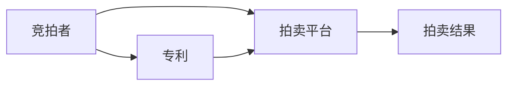
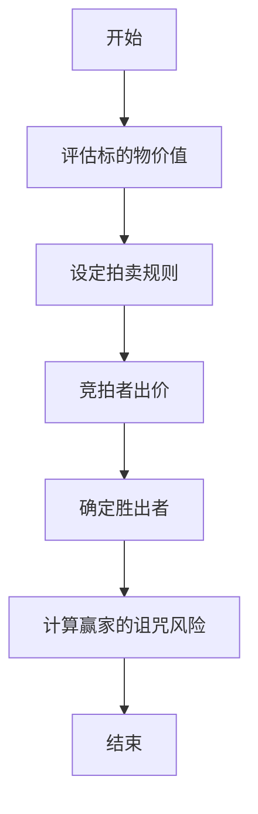
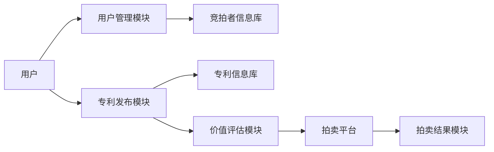

                 


# 芒格的"赢家的诅咒"提醒在量子专利拍卖中的应用

> 关键词：芒格, 赢家的诅咒, 量子专利, 拍卖, 技术经济, 专利价值评估

> 摘要：本文从芒格的"赢家的诅咒"这一经济学概念出发，结合量子专利拍卖的特殊性，深入分析这一理论在实际应用场景中的表现和影响。通过构建数学模型和算法，提出预防赢家的诅咒在量子专利拍卖中发生的具体方法。同时，本文还从系统架构设计和项目实践的角度，详细阐述了量子专利拍卖系统的实现方案，并给出了最佳实践建议。

---

## 第1章: 背景介绍

### 1.1 芒格的"赢家的诅咒"概述
#### 1.1.1 赢家的诅咒的定义与核心概念
- 赢家的诅咒是一种经济学现象，指在拍卖中胜出的竞拍者往往可能为标的物支付了过高的价格。
- 核心概念包括：信息不对称、竞拍者心理、价格泡沫。

#### 1.1.2 赢家的诅咒的背景与问题描述
- 拍卖市场的基本原理与类型。
- 赢家的诅咒在传统拍卖中的具体表现与案例。

### 1.2 量子专利拍卖的定义与特点
#### 1.2.1 量子专利的基本概念
- 量子专利的定义与分类。
- 量子专利的特殊性：技术复杂性、价值波动性。

#### 1.2.2 量子专利拍卖的定义与特点
- 拍卖的基本流程与规则。
- 量子专利拍卖的独特挑战：技术门槛高、评估难度大。

### 1.3 赢家的诅咒与量子专利拍卖的关联
#### 1.3.1 赢家的诅咒在量子专利拍卖中的表现
- 量子专利拍卖中的价格泡沫现象。
- 信息不对称对拍卖结果的影响。

#### 1.3.2 赢家的诅咒对量子专利拍卖的影响
- 赢家的诅咒对拍卖市场的长期影响。
- 赢家的诅咒对量子专利价值的潜在威胁。

---

## 第2章: 赢家的诅咒的核心概念与原理

### 2.1 赢家的诅咒的核心概念
- 赢家的诅咒的形成机制：竞拍者心理、信息不对称。
- 赢家的诅咒的数学模型：概率论与博弈论的结合。

### 2.2 赢家的诅咒的属性特征
- 对比传统拍卖与量子专利拍卖中的赢家的诅咒表现。

### 2.3 赢家的诅咒的ER实体关系图


---

## 第3章: 赢家的诅咒的算法原理

### 3.1 赢家的诅咒的算法模型
- Vickrey拍卖机制：$$ P = \max(bid_i) $$，其中 $bid_i$ 是每个竞拍者的出价。
- 赢家的诅咒的风险评估算法：$$ R = \frac{\max(bid_i) - v}{v} \times 100\% $$，其中 $v$ 是标的物的实际价值。

### 3.2 赢家的诅咒的预防算法
- 算法流程图：


### 3.3 赢家的诅咒的Python实现
```python
def vickrey_auction(bids):
    max_bid = max(bids)
    winner Curse risk = ((max_bid - calculate_true_value(bids)) / calculate_true_value(bids)) * 100
    return winner Curse risk

def calculate_true_value(bids):
    # 假设true_value是通过专家评估确定的
    return true_value
```

---

## 第4章: 量子专利拍卖系统的架构设计

### 4.1 量子专利拍卖系统的功能需求
- 用户管理模块：竞拍者注册、登录。
- 专利发布模块：专利信息展示、价值评估。
- 拍卖流程模块：竞拍者出价、拍卖结果生成。

### 4.2 量子专利拍卖系统的架构设计


### 4.3 量子专利拍卖系统的接口设计
- 用户接口：竞拍者出价、查看拍卖结果。
- 系统接口：专利信息查询、拍卖结果通知。

---

## 第5章: 量子专利拍卖的项目实战

### 5.1 项目环境搭建
- 安装必要的库：Flask、MongoDB、Python 3。

### 5.2 量子专利拍卖系统的核心实现
```python
from flask import Flask
from pymongo import MongoClient

app = Flask(__name__)
client = MongoClient('mongodb://localhost:27017/')

@app.route('/bid', methods=['POST'])
def bid():
    data = request.get_json()
    bids.append(data['bid'])
    return jsonify({'status': 'success'})

if __name__ == '__main__':
    app.run(debug=True)
```

### 5.3 量子专利拍卖系统的实际案例分析
- 某量子专利拍卖案例的分析与解读。

---

## 第6章: 最佳实践与小结

### 6.1 量子专利拍卖中的最佳实践
- 信息透明化：公开专利评估信息。
- 机制优化：引入 Vickrey 拍卖机制。

### 6.2 项目小结
- 赢家的诅咒在量子专利拍卖中的具体表现。
- 通过算法优化和系统设计，降低赢家的诅咒风险。

### 6.3 注意事项
- 风险管理：定期评估专利价值。
- 系统维护：及时更新拍卖规则。

### 6.4 拓展阅读
- 建议阅读相关经济学文献和量子专利研究论文。

---

## 作者：AI天才研究院 & 禅与计算机程序设计艺术

