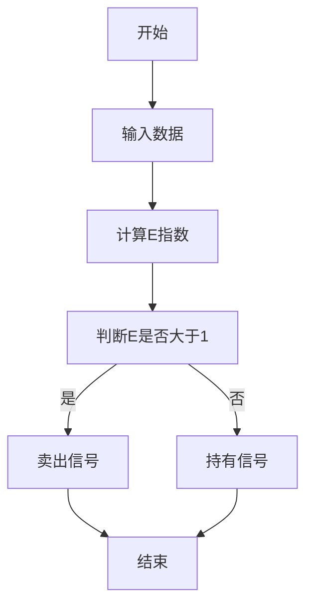
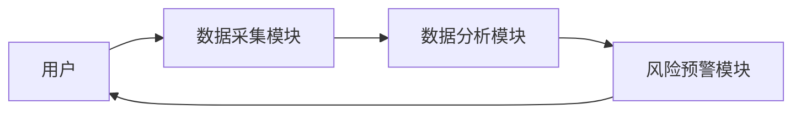
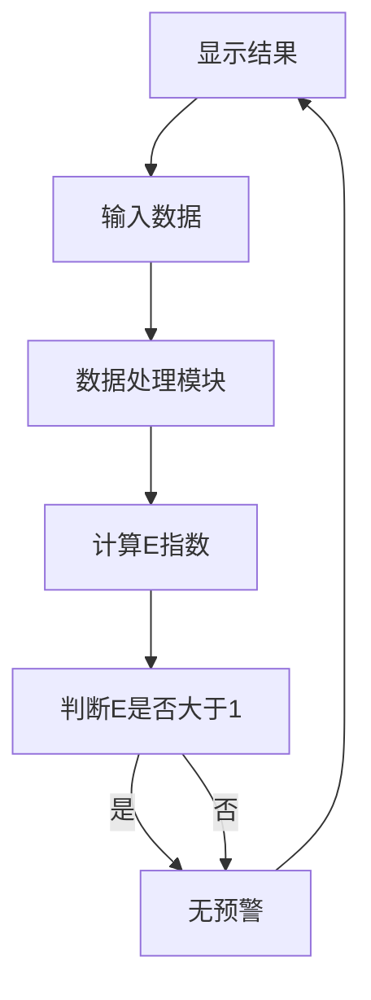

                 


```markdown
# 芒格的"赢家的诅咒"提醒在高估值市场中的应用

> 关键词：芒格，赢家的诅咒，高估值市场，投资风险管理，系统分析

> 摘要：本文深入探讨了芒格提出的“赢家的诅咒”概念，并分析其在高估值市场中的应用。通过系统分析和实际案例，本文揭示了在高估值市场中如何识别和应对赢家的诅咒，帮助投资者做出更明智的决策。

---

## 第一部分：芒格的“赢家的诅咒”概述

### 第1章：芒格投资理念与“赢家的诅咒”背景

#### 1.1 芒格投资理念概述
##### 1.1.1 芒格的“理性决策”思想
芒格强调理性决策，认为市场参与者常常受情绪驱动，理性分析是投资的关键。他提倡避免从众心理，独立思考。

##### 1.1.2 芒格的价值投资原则
芒格的价值投资原则强调购买低于内在价值的资产，关注长期价值而非短期波动。

##### 1.1.3 芒格对市场的独特见解
芒格认为市场波动性和周期性会影响资产定价，投资者应识别市场泡沫，避免高估值陷阱。

#### 1.2 “赢家的诅咒”概念的提出
##### 1.2.1 赢家的诅咒的定义
赢家的诅咒指市场参与者在高估值环境下，过度追求高增长，导致投资回报低于预期的现象。

##### 1.2.2 赢家的诅咒的特征
- 高价买入：资产价格远高于其内在价值。
- 市场情绪化：投资者受乐观情绪驱动，忽视风险。
- 结构性缺陷：市场结构导致价格泡沫。

##### 1.2.3 赢家的诅咒与市场周期的关系
赢家的诅咒在市场周期的高点出现，通常伴随资产价格泡沫破裂。

#### 1.3 高估值市场的背景与挑战
##### 1.3.1 高估值市场的定义与特征
高估值市场指资产价格远高于其内在价值，市场参与者预期未来收益过高。

##### 1.3.2 高估值市场中的投资风险
- 资产价格波动风险：价格波动加剧，投资者可能面临重大损失。
- 估值过高风险：高价买入可能导致长期亏损。

##### 1.3.3 赢家的诅咒在高估值市场的表现
赢家的诅咒在高估值市场中表现为投资者盲目追求高增长，忽视基本面，导致投资失败。

### 第2章：赢家的诅咒的核心概念与联系

#### 2.1 核心概念原理
##### 2.1.1 赢家的诅咒的内在逻辑
赢家的诅咒源于市场参与者过度乐观，导致资产价格泡沫，最终破裂。

##### 2.1.2 赢家的诅咒与市场情绪的关系
市场情绪化是赢家的诅咒的重要驱动因素，乐观情绪导致高价买入，悲观情绪引发抛售。

##### 2.1.3 赢家的诅咒的数学模型
$$ E = \frac{P}{V} $$
其中，E为赢家的诅咒指数，P为资产价格，V为内在价值。

#### 2.2 核心概念对比表
##### 2.2.1 赢家的诅咒与非赢家的对比
| 特征     | 赢家的诅咒         | 非赢家         |
|----------|--------------------|----------------|
| 价格     | 远高于内在价值     | 接近内在价值     |
| 风险     | 高                 | 低             |
| 投资者情绪| 过度乐观           | 理性           |

##### 2.2.2 高估值市场与低估值市场的对比
| 特征     | 高估值市场         | 低估值市场       |
|----------|--------------------|------------------|
| 价格     | 远高于基本面       | 接近基本面       |
| 投资者情绪| 乐观               | 綈澹            |
| 投资风险 | 高                 | 低             |

##### 2.2.3 赢家的诅咒与周期性市场的对比
| 特征     | 赢家的诅咒         | 周期性市场       |
|----------|--------------------|------------------|
| 表现     | 资产价格泡沫       | 波动性较大       |
| 周期性    | 非周期性           | 周期性           |

#### 2.3 ER实体关系图


### 第3章：赢家的诅咒的数学模型与算法原理

#### 3.1 数学模型
##### 3.1.1 赢家的诅咒的数学表达式
$$ E = \frac{P}{V} $$
其中，E为赢家的诅咒指数，P为资产价格，V为内在价值。

##### 3.1.2 赢家的诅咒的预测模型
$$ P_{未来} = P_{当前} \times (1 - \alpha) $$
其中，α为市场调整系数。

#### 3.2 算法流程图


## 第二部分：高估值市场的系统分析与应对策略

### 第4章：高估值市场的系统分析

#### 4.1 问题场景介绍
高估值市场中，资产价格远高于其内在价值，投资者面临赢家的诅咒风险。

#### 4.2 系统分析
##### 4.2.1 系统功能设计
- 资产价格监测
- 赢家的诅咒指数计算
- 风险预警系统

##### 4.2.2 系统架构设计


#### 4.3 系统接口设计
##### 4.3.1 输入接口
- 资产价格数据
- 内在价值数据

##### 4.3.2 输出接口
- 赢家的诅咒指数
- 风险预警信号

#### 4.4 系统交互流程


### 第5章：应对赢家的诅咒的策略与实践

#### 5.1 应对策略
##### 5.1.1 分散投资
通过多样化投资降低风险。

##### 5.1.2 动态调整
根据市场变化及时调整投资组合。

##### 5.1.3 风险管理
设置止损点，控制仓位。

#### 5.2 投资风险管理
##### 5.2.1 风险评估
使用数学模型评估潜在风险。

##### 5.2.2 风险控制
通过分散投资和动态调整降低风险。

#### 5.3 实际案例分析
##### 5.3.1 案例背景
- 高估值市场的选择
- 投资者情绪分析

##### 5.3.2 案例分析
分析某高估值市场的赢家的诅咒指数，评估投资风险。

#### 5.4 项目实战
##### 5.4.1 环境配置
安装必要的数据分析工具。

##### 5.4.2 核心代码实现
```python
def calculate_E(P, V):
    return P / V

P_current = 100
V_intrinsic = 80
E = calculate_E(P_current, V_intrinsic)
print(f"赢家的诅咒指数: {E}")
```

##### 5.4.3 代码应用解读
解释代码的功能和应用，展示如何计算赢家的诅咒指数。

### 第6章：总结与展望

#### 6.1 总结
总结全文内容，强调赢家的诅咒在高估值市场中的重要性。

#### 6.2 投资建议
建议投资者在高估值市场中保持理性，避免赢家的诅咒陷阱。

#### 6.3 注意事项
提醒投资者注意市场波动和情绪影响，合理配置资产。

#### 6.4 拓展阅读
推荐相关书籍和资源，供读者深入学习。

---

## 作者：AI天才研究院/AI Genius Institute & 禅与计算机程序设计艺术 /Zen And The Art of Computer Programming
```

